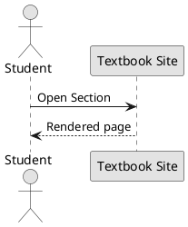

# AI Contributor Guide

This guide captures conventions and the active plan so any assistant can contribute safely and consistently to this MkDocs textbook.

Before running python code, ensure to run `.venv\Scripts\activate`

I am using `uv`

Ensure that links are added to different parts of the textbook so that you don't repeat yourself.

## Additional contributor suggestions

- Keep pages short. Aim for 3–5 minute reads with one learning goal each.
- Prefer progressive examples. Start with REPL-sized code; grow to small scripts; avoid frameworks.
- Use consistent writing style: second person, plain language, Australian spelling.
- Accessibility: add alt text for images/diagrams; don’t rely on colour alone; keep contrast high.
- Cross-link aggressively: every new term should link to its first introduction or glossary.
- Quizzes: place them as `quiz.md` beside each section; 6–10 questions; include an answer key.
- Diagrams: include the PlantUML source fence above the generated SVG. Keep one concept per diagram.
- File hygiene: don’t commit build artefacts (`site/`, `__pycache__/`, `.obsidian/`, `.vscode/`).
- Navigation: `.nav.yml` is the single source of truth; avoid adding `nav:` to `mkdocs.yml`.
- Local dev: use `uv` or editable installs. Typical flow:
  1) `.venv\\Scripts\\activate`
  2) `uv pip install -e .` (or `pip install -e .`)
  3) `mkdocs serve`
- Linting: keep Markdown headings sequential; use short lines (~100 chars); run `scripts/simple_md_lint.py` before commits.
- Names: zero‑pad chapter/section numbers (e.g., `Chapter-03`, `Section-07-...`). Titles use “1.2 …” in H1.
- Content updates: if you add a concept, add at least one tiny runnable Python snippet and a 2–3 line “Why it matters”.

## Project purpose

Create a NSW HSC Software Engineering textbook for Years 11–12. Audience is beginners; code is Python only. Content hierarchy: Year → Module → Chapter → Section. Each Section has a co-located quiz.

## Authoring principles

- Beginner-first. Introduce one idea at a time; use tiny runnable examples.

- Python only. Avoid external packages unless essential and introduced gently.

- Mechatronics: defer device-specific coding until a platform is chosen; prefer simulations and diagrams first.

- Diagrams: use PlantUML for all new diagrams. Keep Mermaid only for legacy content until migrated. Keep diagrams simple and not crazy complicated to ensure that the concepts are easily understood.

- Titles: short and numbered (e.g., 2.3). Display names avoid dashes and never use “Part” prefixes.

## Repository structure (example)

```text
docs/
  Year11/
    ProgrammingFundamentals/
      ModulePlan.md
      Chapter-01-Software-Development/
        Section-01-Software-Development-Steps/
          index.md
          quiz.md
        Section-02-Tools-and-Collaboration/
          index.md
          quiz.md
        Section-03-Documentation-and-Code-Style/
          index.md
          quiz.md
        Section-04-Project-Management-Models/
          index.md
          quiz.md
      Chapter-02-Designing-Algorithms/
      Chapter-03-Data-for-Software-Engineering/
      Chapter-04-Developing-Solutions-with-Code/
```

Conventions:

- Chapters: `Chapter-XX-Name` (zero-padded).

- Sections: `Section-YY-Short-Slug` (zero-padded) under a Chapter.

- Each Section includes `index.md` and `quiz.md`. Place images/code alongside or in `assets/`.

## Diagrams (PlantUML)

- Prefer fenced PlantUML blocks. If rendering isn’t enabled yet, include a static SVG and keep the source fence for later.

Example:



## Section template (index.md)

- Title (H1): succinct, action-oriented.

- Outcomes covered: e.g., SE-11-02.

- Why it matters (2–3 sentences).

- Concepts (progressive mini-sections).

- Guided example (short Python).

- Try it (1–3 tiny tasks).

- Diagram(s) (PlantUML or SVG fallback).

- Recap and glossary (if needed).

Quiz (`quiz.md`): 6–10 questions (mix of multiple-choice and short-answer); include an answer key at the bottom.

## Navigation (mkdocs.yml)

- Add Chapter/Section pages once they exist. Keep labels human‑readable; paths use hyphenated slugs.

## Notes on syllabus coverage

- Programming Fundamentals Chapter 2 must explicitly include: I/O and purpose; desk and peer checking; connections to subroutines/functions; identifying procedures/functions; and a brief paradigms overview.

- Programming Fundamentals Chapter 4 must explicitly include: arrays (1-D/2-D), lists, trees, stacks, hash tables; debugging tools (breakpoints, stepping, watches, function interfaces, debug prints, IDE tools); test data (boundary, path coverage, faulty/abnormal); and typical errors (syntax, logic, runtime).
