# The Object-Oriented Paradigm

## Understanding OOP

### Introduction

Object-oriented programming (OOP) marks a significant evolution from procedural programming by organizing code around real-world entities called objects, rather than just sequences of instructions. This paradigm shift enables developers to build scalable and maintainable codebases by encapsulating data and behavior within reusable components. OOP’s principles—such as encapsulation, inheritance, and polymorphism—help manage complexity, foster code reuse, and make it easier to adapt software as requirements change. By modeling systems as interacting objects, programmers can create flexible architectures that are robust and easier to extend, making OOP essential for modern software engineering.

### Key OOP Features

### Key OOP Features in Detail

Understanding each OOP feature with comprehensive examples helps students apply these concepts effectively in their own programs.

!!! example "Think Like a Gamer! 🎮"
    **Object-Oriented Programming is everywhere around you:**

    - **Minecraft:** Every block, tool, and mob is an object with properties and behaviors
    - **Fortnite:** Your character, weapons, and vehicles are all objects
    - **Discord:** Messages, servers, and users are objects with specific attributes and actions
    - **Spotify:** Songs, playlists, and artists are objects that interact with each other

#### **Objects**
Objects are instances of classes that combine data (attributes) and behavior (methods). Each object maintains its own state and exposes methods to interact with that state.

**Modern Example: Social Media Post**
```python
class InstagramPost:
    def __init__(self, username, content, image_url=None):
        # Instance attributes (data each post stores)
        self.username = username
        self.content = content
        self.image_url = image_url
        self.likes = 0
        self.comments = []
        self.timestamp = datetime.now()
        self.is_public = True
    
    # Instance methods (actions posts can perform)
    def add_like(self):
        """Someone liked this post"""
        self.likes += 1
        print(f"❤️ Post by {self.username} now has {self.likes} likes!")
    
    def add_comment(self, commenter, comment_text):
        """Add a comment to this post"""
        comment = {
            "user": commenter,
            "text": comment_text,
            "time": datetime.now()
        }
        self.comments.append(comment)
        print(f"💬 {commenter} commented: '{comment_text}'")
    
    def toggle_privacy(self):
        """Make post private or public"""
        self.is_public = not self.is_public
        status = "public" if self.is_public else "private"
        print(f"🔒 Post is now {status}")

# Creating and using objects (each post is independent!)
post1 = InstagramPost("alice_codes", "Just finished my first Python program! 🐍", "code_screenshot.jpg")
post2 = InstagramPost("bob_games", "New high score in Minecraft! 🎮")

# Each object has its own data and can perform actions
post1.add_like()
post1.add_comment("bob_games", "Nice work!")
post2.add_like()
post2.toggle_privacy()

print(f"Alice's post has {post1.likes} likes and {len(post1.comments)} comments")
print(f"Bob's post has {post2.likes} likes and is {'public' if post2.is_public else 'private'}")
```

**Why Objects Are Powerful:**

- ✅ **Real-world modeling:** Objects represent things we understand (posts, users, games)
- ✅ **Data safety:** Each object controls its own data 
- ✅ **Reusability:** Create multiple posts without rewriting code
- ✅ **Independence:** Changes to one post don't affect others

**Traditional Example: Smart Home Device**
```python
class SmartLight:
    def __init__(self, room, max_brightness=100):
        # Instance attributes (data)
        self.room = room
        self.is_on = False
        self.brightness = 0
        self.max_brightness = max_brightness
        self.color = "white"
        self.usage_hours = 0
    
    # Instance methods (behavior)
    def turn_on(self):
        """Turn on the light"""
        self.is_on = True
        self.brightness = 50  # Default brightness
        print(f"{self.room} light is now ON (brightness: {self.brightness}%)")
    
    def turn_off(self):
        """Turn off the light"""
        self.is_on = False
        self.brightness = 0
        print(f"{self.room} light is now OFF")
    
    def set_brightness(self, level):
        """Set brightness level (0-100)"""
        if self.is_on and 0 <= level <= self.max_brightness:
            self.brightness = level
            print(f"{self.room} light brightness set to {level}%")
        else:
            print("Light must be on and brightness must be valid")
    
    def change_color(self, new_color):
        """Change light color"""
        if self.is_on:
            self.color = new_color
            print(f"{self.room} light color changed to {new_color}")
    
    def get_status(self):
        """Return current light status"""
        status = "ON" if self.is_on else "OFF"
        return {
            "room": self.room,
            "status": status,
            "brightness": self.brightness,
            "color": self.color,
            "usage_hours": self.usage_hours
        }

# Creating and using objects
living_room_light = SmartLight("Living Room")
bedroom_light = SmartLight("Bedroom", max_brightness=80)

# Each object has its own state
living_room_light.turn_on()
living_room_light.set_brightness(75)
living_room_light.change_color("blue")
```

---

## 🛠️ **Hands-On Coding Challenge: Build Your Own Objects!**

### Challenge 1: Create a Smartphone Class

**Your Mission:** Design a `Smartphone` class that models a real phone!

**Requirements:**

- Store: brand, model, battery_percentage, storage_used, apps_installed (list)
- Methods: install_app(), uninstall_app(), charge_battery(), use_phone(), get_status()

**Starter Code:**
```python
class Smartphone:
    def __init__(self, brand, model, storage_gb=128):
        self.brand = brand
        self.model = model
        self.battery_percentage = 100
        self.storage_gb = storage_gb
        self.storage_used = 0
        self.apps_installed = ["Phone", "Messages", "Settings"]  # pre-installed apps
    
    def install_app(self, app_name, app_size_gb):
        """Install a new app if there's enough storage"""
        # TODO: Check if there's enough storage
        # TODO: Add app to apps_installed list
        # TODO: Update storage_used
        # TODO: Print success/failure message
        pass
    
    def charge_battery(self, amount):
        """Charge the battery (max 100%)"""
        # TODO: Add amount to battery_percentage
        # TODO: Make sure it doesn't go over 100%
        pass
    
    def use_phone(self, minutes):
        """Use phone for specified minutes (drains battery)"""
        # TODO: Reduce battery by minutes used
        # TODO: Make sure battery doesn't go below 0%
        pass

# Test your code:
my_phone = Smartphone("Apple", "iPhone 15", 256)
my_phone.install_app("Instagram", 0.5)
my_phone.use_phone(30)
print(my_phone.get_status())
```

### Challenge 2: Gaming Character

**Create a `GameCharacter` class for an RPG game:**

```python
class GameCharacter:
    def __init__(self, name, character_class="Warrior"):
        # TODO: Add attributes like health, level, experience, inventory
        pass
    
    def attack(self, target):
        # TODO: Deal damage to target
        pass
    
    def level_up(self):
        # TODO: Increase level, health, and reset experience
        pass
    
    def collect_item(self, item):
        # TODO: Add item to inventory
        pass

# Create characters and make them interact!
hero = GameCharacter("Link", "Hero")
enemy = GameCharacter("Goblin", "Monster")
```

### Challenge 3: Real-World Application

**Choose Your Own Adventure:**
Pick something you use daily and create a class for it:

- 🎵 **Music Player** (Spotify-like)
- 📱 **Social Media Account** (Instagram/TikTok-like)  
- 🎮 **Video Game** (Minecraft/Fortnite-like)
- 🏫 **School Subject** (track assignments, grades)
- 🍕 **Food Delivery Order** (DoorDash-like)

**Reflection Questions:**
1. What attributes (data) does your object need to store?
2. What methods (actions) should your object be able to perform?
3. How does creating objects make your code more organized?

??? success "Sample Solutions"
    **Smartphone Solution:**
    ```python
    def install_app(self, app_name, app_size_gb):
        if self.storage_used + app_size_gb <= self.storage_gb:
            self.apps_installed.append(app_name)
            self.storage_used += app_size_gb
            print(f"✅ Installed {app_name} ({app_size_gb}GB)")
        else:
            print(f"❌ Not enough storage for {app_name}")
    
    def charge_battery(self, amount):
        self.battery_percentage = min(100, self.battery_percentage + amount)
        print(f"🔋 Battery charged to {self.battery_percentage}%")
    ```

---
### Procedural vs. OOP: A Comprehensive Comparison

Understanding the fundamental differences between procedural and object-oriented programming paradigms helps students make informed design decisions and appreciate why OOP became dominant in modern software development.

#### **Procedural Programming Characteristics**

**Structure and Organization:**

- **Sequential Execution**: Code follows a linear, top-down approach
- **Function-Based**: Program logic divided into separate functions
- **Global State**: Data shared through global variables or parameter passing
- **Data and Functions Separate**: Data structures and functions that operate on them are independent

**Example: Library Management System (Procedural)**
```python
# Global data structures
books = []
members = []
borrowed_books = []

# Separate functions for different operations
def add_book(title, author, isbn):
    """Add a new book to the library"""
    book = {
        "title": title,
        "author": author,
        "isbn": isbn,
        "available": True
    }
    books.append(book)
    print(f"Added book: {title}")

def register_member(name, member_id):
    """Register a new library member"""
    member = {
        "name": name,
        "id": member_id,
        "books_borrowed": []
    }
    members.append(member)
    print(f"Registered member: {name}")

def borrow_book(member_id, isbn):
    """Process book borrowing"""
    # Find member
    member = None
    for m in members:
        if m["id"] == member_id:
            member = m
            break
    
    if not member:
        print("Member not found")
        return False
    
    # Find book
    book = None
    for b in books:
        if b["isbn"] == isbn and b["available"]:
            book = b
            break
    
    if not book:
        print("Book not available")
        return False
    
    # Process borrowing
    book["available"] = False
    member["books_borrowed"].append(isbn)
    borrowed_books.append({
        "member_id": member_id,
        "isbn": isbn,
        "date_borrowed": "2024-01-15"
    })
    print(f"Book borrowed successfully")
    return True

def generate_report():
    """Generate library report"""
    print(f"Total books: {len(books)}")
    print(f"Total members: {len(members)}")
    print(f"Books currently borrowed: {len(borrowed_books)}")

# Using the procedural system
add_book("1984", "George Orwell", "978-0-452-28423-4")
add_book("Python Programming", "John Smith", "978-1-234-56789-0")
register_member("Alice Johnson", "M001")
borrow_book("M001", "978-0-452-28423-4")
generate_report()
```

#### **Object-Oriented Programming Characteristics**

**Structure and Organization:**

-**Object-Centric**: Program organized around objects representing real-world entities
- **Encapsulation**: Data and methods bundled together within classes
- **Inheritance**: Code reuse through class hierarchies
- **Polymorphism**: Same interface, different implementations

**Example: Library Management System (OOP)**
```python
from datetime import datetime

class Book:
    """Represents a book in the library"""
    
    def __init__(self, title, author, isbn):
        self.title = title
        self.author = author
        self.isbn = isbn
        self.available = True
        self.date_added = datetime.now()
    
    def checkout(self):
        """Mark book as checked out"""
        if self.available:
            self.available = False
            return True
        return False
    
    def return_book(self):
        """Mark book as returned"""
        self.available = True
    
    def get_info(self):
        """Get book information"""
        return {
            "title": self.title,
            "author": self.author,
            "isbn": self.isbn,
            "available": self.available
        }
    
    def __str__(self):
        status = "Available" if self.available else "Checked Out"
        return f"{self.title} by {self.author} - {status}"

class Member:
    """Represents a library member"""
    
    def __init__(self, name, member_id):
        self.name = name
        self.id = member_id
        self.books_borrowed = []
        self.registration_date = datetime.now()
    
    def borrow_book(self, book):
        """Borrow a book"""
        if book.checkout():
            self.books_borrowed.append(book.isbn)
            print(f"{self.name} borrowed '{book.title}'")
            return True
        else:
            print(f"'{book.title}' is not available")
            return False
    
    def return_book(self, book):
        """Return a borrowed book"""
        if book.isbn in self.books_borrowed:
            book.return_book()
            self.books_borrowed.remove(book.isbn)
            print(f"{self.name} returned '{book.title}'")
            return True
        else:
            print(f"{self.name} hasn't borrowed '{book.title}'")
            return False
    
    def get_borrowed_books_count(self):
        """Get number of books currently borrowed"""
        return len(self.books_borrowed)
    
    def __str__(self):
        return f"Member: {self.name} (ID: {self.id}) - {self.get_borrowed_books_count()} books borrowed"

class Library:
    """Represents the library system"""
    
    def __init__(self, name):
        self.name = name
        self.books = []
        self.members = []
        self.transaction_history = []
    
    def add_book(self, book):
        """Add a book to the library"""
        self.books.append(book)
        print(f"Added '{book.title}' to {self.name}")
    
    def register_member(self, member):
        """Register a new member"""
        self.members.append(member)
        print(f"Registered {member.name} at {self.name}")
    
    def find_book_by_isbn(self, isbn):
        """Find a book by ISBN"""
        for book in self.books:
            if book.isbn == isbn:
                return book
        return None
    
    def find_member_by_id(self, member_id):
        """Find a member by ID"""
        for member in self.members:
            if member.id == member_id:
                return member
        return None
    
    def process_borrowing(self, member_id, isbn):
        """Process a book borrowing transaction"""
        member = self.find_member_by_id(member_id)
        book = self.find_book_by_isbn(isbn)
        
        if member and book:
            success = member.borrow_book(book)
            if success:
                self.transaction_history.append({
                    "type": "borrow",
                    "member": member_id,
                    "book": isbn,
                    "date": datetime.now()
                })
            return success
        return False
    
    def generate_report(self):
        """Generate comprehensive library report"""
        available_books = sum(1 for book in self.books if book.available)
        borrowed_books = len(self.books) - available_books
        
        print(f"
=== {self.name} Report ===")
        print(f"Total books: {len(self.books)}")
        print(f"Available books: {available_books}")
        print(f"Borrowed books: {borrowed_books}")
        print(f"Total members: {len(self.members)}")
        print(f"Total transactions: {len(self.transaction_history)}")
        
        print("
Member Summary:")
        for member in self.members:
            print(f"  {member}")
    
    def __str__(self):
        return f"{self.name} Library - {len(self.books)} books, {len(self.members)} members"

# Using the OOP system
library = Library("Trinity Grammar School Library")

# Create and add books
book1 = Book("1984", "George Orwell", "978-0-452-28423-4")
book2 = Book("Python Programming", "John Smith", "978-1-234-56789-0")
library.add_book(book1)
library.add_book(book2)

# Register members
member1 = Member("Alice Johnson", "M001")
library.register_member(member1)

# Process transactions
library.process_borrowing("M001", "978-0-452-28423-4")

# Generate report
library.generate_report()
```

#### **Key Differences Comparison**

| Aspect | Procedural Programming | Object-Oriented Programming |
|--------|----------------------|---------------------------|
| **Code Organization** | Functions and global data | Classes with encapsulated data and methods |
| **Data Security** | Global variables accessible everywhere | Private/protected data with controlled access |
| **Code Reuse** | Function calls and modules | Inheritance and polymorphism |
| **Maintainability** | Difficult in large systems | Modular, easier to maintain |
| **Real-world Modeling** | Abstract function-based approach | Natural object-based modeling |
| **Scalability** | Becomes complex with size | Scales well with proper design |
| **Debugging** | Track data flow through functions | Isolate issues within specific objects |
| **Team Development** | Difficult to divide work | Easy to assign classes to different developers |

#### **When to Use Each Paradigm**

**Procedural Programming is Better For:**

-Simple, small programs with clear linear logic
- Mathematical computations and algorithms
- System-level programming and embedded systems
- Scripts and automation tasks
- When performance is critical and overhead must be minimal

**Object-Oriented Programming is Better For:**

-Large, complex applications
- GUI applications and user interfaces
- Web applications and services
- Games and simulations
- When modeling real-world entities
- Team-based development projects
- Applications requiring frequent updates and maintenance

!!! tip "Best Practice"
    **Hybrid Approach:** Modern applications often combine both paradigms. Use OOP for overall architecture and system design, while employing procedural techniques for specific algorithms or performance-critical sections. Python itself demonstrates this - it's object-oriented but allows procedural programming when appropriate.

```python
# Example of hybrid approach
print("Living Room Status:", living_room_light.get_status())
print("Bedroom Status:", bedroom_light.get_status())
```

#### **Classes**
Classes define the blueprint for objects, specifying their attributes and behaviors. They enable code organization and reuse.

**Advanced Example: Student Management System**
```python
from datetime import datetime

class Student:
    # Class attributes (shared by all instances)
    school_name = "Trinity Grammar School"
    total_students = 0
    
    def __init__(self, student_id, first_name, last_name, year_level):
        # Instance attributes (unique to each object)
        self.student_id = student_id
        self.first_name = first_name
        self.last_name = last_name
        self.year_level = year_level
        self.subjects = []
        self.grades = {}
        self.enrollment_date = datetime.now()
        
        # Update class attribute
        Student.total_students += 1
    
    # Instance methods
    def get_full_name(self):
        """Return student's full name"""
        return f"{self.first_name} {self.last_name}"
    
    def enroll_subject(self, subject):
        """Enroll student in a subject"""
        if subject not in self.subjects:
            self.subjects.append(subject)
            self.grades[subject] = None
            print(f"{self.get_full_name()} enrolled in {subject}")
    
    def record_grade(self, subject, grade):
        """Record a grade for a subject"""
        if subject in self.subjects and 0 <= grade <= 100:
            self.grades[subject] = grade
            print(f"Grade recorded: {subject} - {grade}%")
        else:
            print("Subject not enrolled or invalid grade")
    
    def calculate_average(self):
        """Calculate average grade across all subjects"""
        completed_grades = [grade for grade in self.grades.values() if grade is not None]
        if completed_grades:
            return sum(completed_grades) / len(completed_grades)
        return 0
    
    def get_transcript(self):
        """Generate student transcript"""
        transcript = {
            "student_id": self.student_id,
            "name": self.get_full_name(),
            "year_level": self.year_level,
            "subjects": self.subjects,
            "grades": self.grades,
            "average": round(self.calculate_average(), 2),
            "enrollment_date": self.enrollment_date.strftime("%Y-%m-%d")
        }
        return transcript
    
    # Class method
    @classmethod
    def get_total_students(cls):
        """Return total number of students"""
        return cls.total_students
    
    # Static method
    @staticmethod
    def grade_to_letter(grade):
        """Convert numeric grade to letter grade"""
        if grade >= 90:
            return "A"
        elif grade >= 80:
            return "B"
        elif grade >= 70:
            return "C"
        elif grade >= 60:
            return "D"
        else:
            return "F"
    
    def __str__(self):
        """String representation of student"""
        return f"Student: {self.get_full_name()} (ID: {self.student_id})"

# Using the class
student1 = Student("S001", "Alice", "Johnson", 11)
student2 = Student("S002", "Bob", "Smith", 12)

student1.enroll_subject("Mathematics")
student1.enroll_subject("Physics")
student1.record_grade("Mathematics", 85)
student1.record_grade("Physics", 92)

print(student1)
print(f"Average: {student1.calculate_average()}%")
print(f"Total students: {Student.get_total_students()}")
print(f"Grade letter: {Student.grade_to_letter(85)}")
```

### System Modeling: From Analysis to Design

System modeling is a crucial step in software development that helps developers understand, communicate, and design complex systems before implementation. Different modeling techniques serve different purposes in the development process.

#### **Data Flow Diagrams (DFD)**

Data Flow Diagrams show how data moves through a system, focusing on the transformation processes rather than control flow.

**Example: Online Learning Management System**

**Understanding Data Flow Diagrams:**

A Data Flow Diagram (DFD) shows how information moves through a system and what happens to it at each step. Think of it like a map showing the journey of data from start to finish.

**Key DFD Components:**

-🧑 **External Entities** (rectangles): People or systems that send or receive data
- ⚙️ **Processes** (circles): Actions that transform or handle data
- 💾 **Data Stores** (open rectangles): Places where data is kept
- ➡️ **Data Flows** (arrows): Show how data moves between components

```mermaid
%%{init: {"theme": "base", "themeVariables": {"background": "transparent", "primaryColor": "#4f46e5", "primaryTextColor": "#1e293b", "primaryBorderColor": "#e2e8f0", "lineColor": "#64748b"}} }%%
flowchart TD
    Student["👨‍🎓 Student"] --> |Login Credentials| Auth["🔐 Authentication System"]
    Student --> |Assignment Submission| Submit["📝 Submission Handler"]
    Student --> |View Progress Request| Progress["📊 Progress Tracker"]
    
    Teacher["👩‍🏫 Teacher"] --> |Login Credentials| Auth
    Teacher --> |Grade Assignment| Grade["✅ Grading System"]
    Teacher --> |Create Content| Content["📚 Content Manager"]
    
    Auth --> |Verified User| Database[("💾 User Database")]
    Submit --> |Store Assignment| Database
    Grade --> |Update Grades| Database
    Content --> |Store Materials| Database
    Progress --> |Retrieve Data| Database
    
    Database --> |User Data| Auth
    Database --> |Assignment Data| Submit
    Database --> |Grade Data| Progress
    Database --> |Content Data| Student
    
    Progress --> |Progress Report| Student
    Grade --> |Grade Notification| Student
    Content --> |Learning Materials| Student
```

<div class="diagram-container">
<button class="diagram-expand-btn">🔍 View Larger</button>
<div class="diagram-content">

</div>
</div>

**How to Read This Diagram:**

Let's trace through a student submitting an assignment:

1. **👨‍🎓 Student** provides **Login Credentials** to the **🔐 Authentication System**
2. **🔐 Authentication System** checks the **💾 User Database** and sends back **User Data**
3. Once verified, the **👨‍🎓 Student** can send their **Assignment Submission** to the **📝 Submission Handler**
4. **📝 Submission Handler** stores the **Assignment Data** in the **💾 User Database**
5. Later, **👩‍🏫 Teacher** can access stored assignments and use the **✅ Grading System**
6. **✅ Grading System** updates grades in the **💾 User Database**
7. **👨‍🎓 Student** can request progress updates from **📊 Progress Tracker**
8. **📊 Progress Tracker** retrieves **Grade Data** from the database and sends a **Progress Report** back to the student

!!! example "Real-World Connection"
    **Canvas Learning Management System** - This DFD resembles how Canvas works! When you submit an assignment, it goes through similar data flows: authentication, submission handling, storage, grading, and progress tracking.

**DFD Components Explained:**

- **External Entities** (Student, Teacher): Sources or destinations of data
- **Processes** (Authentication, Grading): Transform or manipulate data
- **Data Stores** (Database): Hold data at rest
- **Data Flows** (arrows): Show data movement between components

#### **Structure Charts**

Structure charts show the hierarchical breakdown of system components and their relationships, focusing on the control structure.

**Example: E-commerce System Structure**

```mermaid
%%{init: {"themeVariables": {"primaryColor": "#2e7d32", "background": "#ffffff", "primaryTextColor": "#000000", "lineColor": "#333333", "primaryBorderColor": "#2e7d32"}} }%%
flowchart TD
    Main["🏪 E-commerce Main System"] --> Auth["🔐 User Authentication"]
    Main --> Catalog["📦 Product Catalog"]
    Main --> Cart["🛒 Shopping Cart"]
    Main --> Payment["💳 Payment Processing"]
    Main --> Admin["👨‍💼 Admin Panel"]
    
    Auth --> Login["Login Validation"]
    Auth --> Register["User Registration"]
    Auth --> Password["Password Recovery"]
    
    Catalog --> Browse["Browse Products"]
    Catalog --> Search["Search Products"]
    Catalog --> Filter["Filter & Sort"]
    
    Cart --> Add["Add Items"]
    Cart --> Remove["Remove Items"]
    Cart --> Calculate["Calculate Totals"]
    
    Payment --> Validate["Validate Payment"]
    Payment --> Process["Process Transaction"]
    Payment --> Confirm["Send Confirmation"]
    
    Admin --> Inventory["Manage Inventory"]
    Admin --> Orders["Process Orders"]
    Admin --> Reports["Generate Reports"]
    
    Browse --> Database[("💾 Product DB")]
    Search --> Database
    Inventory --> Database
    Orders --> Database2[("💾 Order DB")]
    Process --> Database2
```

<div class="diagram-container">
<button class="diagram-expand-btn" onclick="openDiagramModal('structure-diagram')">🔍 View Larger</button>
<div id="structure-diagram" class="diagram-content">

</div>
</div>

**Understanding Structure Charts:**

Structure charts work like an organizational chart for your software! They show how different parts of a system are organized and how they work together.

**Reading the E-commerce Structure Chart:**

**Top Level (Main System):**

-🏪 **E-commerce Main System** is the "boss" - it controls everything

**Second Level (Major Modules):**

-🔐 **User Authentication** - handles all login-related tasks
- 📦 **Product Catalog** - manages all product-related features  
- 🛒 **Shopping Cart** - handles cart operations
- 💳 **Payment Processing** - manages all payment tasks
- 👨‍💼 **Admin Panel** - provides management tools

**Third Level (Specific Functions):**
Each major module breaks down into specific tasks:

- **Authentication Module** includes:
  - Login Validation (check username/password)
  - User Registration (create new accounts)  
  - Password Recovery (reset forgotten passwords)

- **Cart Module** includes:
  - Add Items (put products in cart)
  - Remove Items (take products out)
  - Calculate Totals (add up prices + tax)

!!! tip "Development Team Benefits"
    **Team Assignment Made Easy:** With this structure chart, you could assign:
    - **Team A:** Work on User Authentication module
    - **Team B:** Build the Product Catalog  
    - **Team C:** Handle Shopping Cart functionality
    
    Each team knows exactly what they need to build and how it connects to other parts!

**Structure Chart Benefits:**

-**Hierarchical Decomposition**: Break complex systems into manageable modules
- **Clear Dependencies**: Show which modules depend on others
- **Team Organization**: Help assign development tasks to different team members

#### **Class Diagrams**

Class diagrams are the cornerstone of OOP system modeling, showing classes, their attributes, methods, and relationships.

**Advanced Example: School Management System**

```mermaid
%%{init: {"themeVariables": {"primaryColor": "#7b1fa2", "background": "#ffffff", "primaryTextColor": "#000000", "lineColor": "#333333", "primaryBorderColor": "#7b1fa2"}} }%%
classDiagram
    class Person {
        -String firstName
        -String lastName
        -String email
        -Date birthDate
        -String phone
        +String getFullName()
        +int getAge()
        +void updateContact(email, phone)
    }
    
    class Student {
        -String studentId
        -int yearLevel
        -List~Subject~ enrolledSubjects
        -Map~Subject, Grade~ grades
        -Date enrollmentDate
        +void enrollInSubject(Subject subject)
        +void recordGrade(Subject subject, Grade grade)
        +double calculateGPA()
        +List~Subject~ getSubjects()
    }
    
    class Teacher {
        -String employeeId
        -String department
        -List~Subject~ teachingSubjects
        -Date hireDate
        -String qualification
        +void assignToSubject(Subject subject)
        +void gradeStudent(Student student, Subject subject, Grade grade)
        +List~Student~ getStudents()
    }
    
    class Subject {
        -String subjectCode
        -String subjectName
        -int creditHours
        -String description
        -int maxStudents
        -Teacher assignedTeacher
        +void setTeacher(Teacher teacher)
        +void addStudent(Student student)
        +List~Student~ getEnrolledStudents()
        +boolean isFull()
    }
    
    class Grade {
        -double score
        -String letterGrade
        -Date dateRecorded
        -String comments
        +void calculateLetterGrade()
        +boolean isPassing()
    }
    
    class School {
        -String schoolName
        -String address
        -List~Student~ students
        -List~Teacher~ teachers
        -List~Subject~ subjects
        +void enrollStudent(Student student)
        +void hireTeacher(Teacher teacher)
        +void addSubject(Subject subject)
        +void generateReport()
    }
    
    Person <|-- Student : inherits
    Person <|-- Teacher : inherits
    
    Student "many" --> "many" Subject : enrolls in
    Teacher "1" --> "many" Subject : teaches
    Student "1" --> "many" Grade : receives
    Subject "1" --> "many" Grade : has grades
    
    School "1" --> "many" Student : contains
    School "1" --> "many" Teacher : employs
    School "1" --> "many" Subject : offers
```

<div class="diagram-container">
<button class="diagram-expand-btn" onclick="openDiagramModal('class-diagram')">🔍 View Larger</button>
<div id="class-diagram" class="diagram-content">

</div>
</div>

**Understanding Class Diagrams:**

Class diagrams are like blueprints for your objects! They show what data each class stores and what actions it can perform.

**Reading the School Management Class Diagram:**

**Class Structure:**
Each box represents a class and contains three sections:
1. **Class Name** (top): What the class is called
2. **Attributes** (middle): Data it stores (marked with - for private, + for public)
3. **Methods** (bottom): Actions it can perform

**Example - Student Class:**
```
Student
-studentId: String          (private data - student's ID number)
-yearLevel: int            (private data - what year they're in)
+enrollInSubject(): void   (public method - can sign up for classes)
+calculateGPA(): double    (public method - works out grade average)
```

**Relationship Types Explained:**

🔼 **Inheritance (Triangle Arrow):**

-`Person <|-- Student` means "Student IS-A Person"
- Student inherits all attributes from Person (firstName, lastName, email, etc.)
- Like saying "A student is a type of person"

↔️ **Association (Simple Line):**

-Shows classes that work together
- `Student "many" --> "many" Subject` means students can take multiple subjects, and subjects can have multiple students

**Multiplicity Numbers:**

-**"1"** = exactly one
- **"many"** = zero or more  
- **"1..3"** = between 1 and 3

!!! example "Real-World Example"
    **Your School Right Now:** 
    - You (Student) inherit basic person info like name and email
    - You're enrolled in many subjects (Math, English, Science)
    - Each subject has many students
    - Teachers can teach multiple subjects
    - The school contains all students, teachers, and subjects

**Class Diagram Relationships:**

-**Inheritance** (arrow with triangle): "is-a" relationship
- **Association** (simple line): Objects are related
- **Composition** (filled diamond): "part-of" relationship, strong ownership
- **Aggregation** (empty diamond): "has-a" relationship, weak ownership
- **Multiplicity** (numbers): How many instances can be related

#### **Sequence Diagrams**

Sequence diagrams show how objects interact over time, displaying the sequence of method calls.

**Example: Online Purchase Process**

<div class="diagram-container">
<button class="diagram-expand-btn" onclick="openDiagramModal('sequence-diagram')">🔍 View Larger</button>
<div id="sequence-diagram" class="diagram-content">

</div>
</div>

#### **Use Case Diagrams**

Use case diagrams show the functional requirements of a system from the user's perspective.

**Example: Library Management System**

```mermaid
%%{init: {"themeVariables": {"primaryColor": "#388e3c", "background": "#ffffff", "primaryTextColor": "#000000", "lineColor": "#333333", "primaryBorderColor": "#388e3c"}} }%%
graph TB
    subgraph "Library Management System"
        UC1["Search Books"]
        UC2["Borrow Book"]
        UC3["Return Book"]
        UC4["Renew Book"]
        UC5["View Account"]
        UC6["Add New Book"]
        UC7["Remove Book"]
        UC8["Manage Members"]
        UC9["Generate Reports"]
        UC10["Send Notifications"]
    end
    
    Student["👨‍🎓 Student"] --> UC1
    Student --> UC2
    Student --> UC3
    Student --> UC4
    Student --> UC5
    
    Member["👤 Library Member"] --> UC1
    Member --> UC2
    Member --> UC3
    Member --> UC4
    Member --> UC5
    
    Librarian["👩‍💼 Librarian"] --> UC1
    Librarian --> UC2
    Librarian --> UC3
    Librarian --> UC6
    Librarian --> UC7
    Librarian --> UC8
    Librarian --> UC9
    Librarian --> UC10
    
    System["📧 Email System"] --> UC10
```

<div class="diagram-container">
<button class="diagram-expand-btn" onclick="openDiagramModal('usecase-diagram')">🔍 View Larger</button>
<div id="usecase-diagram" class="diagram-content">

</div>
</div>

#### **Choosing the Right Modeling Technique**

| Diagram Type | Best Used For | Key Benefits |
|--------------|---------------|--------------|
| **Data Flow Diagram** | Understanding data transformation and flow | Shows what the system does with data |
| **Structure Chart** | System decomposition and module organization | Hierarchical view of system components |
| **Class Diagram** | OOP design and static structure | Shows classes, attributes, methods, relationships |
| **Sequence Diagram** | Dynamic behavior and object interactions | Time-based view of method calls |
| **Use Case Diagram** | Requirements gathering and user interactions | User-centered view of system functionality |

!!! note "Modeling Best Practices"
    **Start Simple, Then Elaborate:**
    
    1. Begin with high-level use cases to understand requirements
    2. Create class diagrams to identify main entities
    3. Use sequence diagrams for complex interactions
    4. Add structure charts for implementation planning
    5. Iterate and refine models as understanding grows
    
    **Remember:** Models are communication tools - they should clarify, not complicate understanding.

---

## 🎯 Interactive Learning Activity: System Modeling Challenge

**Scenario:** You're designing a **School Canteen Ordering System** where students can order food online and pick it up.

### Activity 1: Create a Data Flow Diagram 

**Your Task:** Draw a DFD showing how data flows when a student orders lunch.

**Think About:**

- Who are the external entities? (Students, Kitchen Staff, Cashier)
- What processes happen? (Order Taking, Food Preparation, Payment)
- What data is stored? (Menu Items, Orders, Student Accounts)

**Starter Elements:**

- 👨‍🎓 Student → Order Request → 📝 Order Processing System
- 👩‍🍳 Kitchen Staff → Prepared Food Status → ???
- 💰 Payment System → Transaction Record → ???

??? success "Sample Solution"
    Your DFD should include:
    - **External Entities:** Student, Kitchen Staff, Cashier
    - **Processes:** Order Processing, Payment Processing, Food Preparation Tracking
    - **Data Stores:** Menu Database, Order Database, Student Account Database
    - **Data Flows:** Order details, payment info, preparation status, pickup notifications

### Activity 2: Design Class Relationships

**Your Challenge:** Create a simple class diagram for the canteen system.

**Classes to Include:**

- Student
- MenuItem  
- Order
- Payment

**Questions to Consider:**

1. What attributes does each class need?
2. How are they related? (One-to-many? Many-to-many?)
3. What methods does each class need?

**Start Here:**
```
Student
- studentId: String
- name: String
- balance: double
+ placeOrder(): Order
+ checkBalance(): double

MenuItem
- itemId: String  
- name: String
- price: double
- available: boolean
+ ???
```

??? success "Sample Solution"
    ```
    Student "1" --> "many" Order : places
    Order "1" --> "many" MenuItem : contains  
    Order "1" --> "1" Payment : has
    ```

### Activity 3: Real-World Application

**Discussion Questions:**

1. **Netflix vs. Spotify:** Both use recommendation systems. How might their class diagrams differ?

2. **Instagram vs. TikTok:** Both handle media uploads. What different processes might their DFDs show?

3. **Your School's System:** Think about your school's online learning platform. What modeling techniques would help design a new feature?

**Group Challenge:** Pick a popular app you use daily. In teams of 3-4:

- Create a use case diagram showing all the things users can do
- Design a class diagram for the main features  
- Present your models to the class and explain your design choices

!!! tip "Assessment Tip"
    When creating diagrams for assessments:

    ✅ **Do:** Use clear labels and consistent symbols  
    ✅ **Do:** Start simple, then add detail  
    ✅ **Do:** Explain your design choices  
    ❌ **Don't:** Make diagrams overly complex  
    ❌ **Don't:** Forget to show relationships between components  

---

### OOP Design Process: From Concept to Code

Effective object-oriented design follows a systematic process that transforms requirements into well-structured, maintainable code. This process involves multiple techniques and principles working together.

#### **1. Task Definition and Requirements Analysis**

Before writing any code, clearly define what the system needs to accomplish.

**Example: Digital Pet Game Requirements**
```
User Story: "As a player, I want to take care of a virtual pet so that I can experience the responsibility of pet ownership without real-world commitment."

Functional Requirements:
- Players can create and name their pet
- Pets have basic needs: hunger, happiness, energy, health
- Players can feed, play with, and rest their pet
- Pets age over time and their needs change
- Players can see their pet's status and history
- Pets can learn new tricks and skills

Non-functional Requirements:
- Game should save progress automatically
- Interface should be intuitive for ages 8+
- Game should run on both desktop and mobile
- Response time should be under 1 second
```

#### **2. Top-down and Bottom-up Design Strategies**

**Top-down Design:** Start with the big picture and break it down into smaller components.

```mermaid
%%{init: {"themeVariables": {"primaryColor": "#1565c0", "background": "#ffffff", "primaryTextColor": "#000000", "lineColor": "#333333", "primaryBorderColor": "#1565c0"}} }%%
flowchart TD
    Game["🎮 Digital Pet Game"] --> Player["👤 Player Management"]
    Game --> Pet["🐕 Pet System"]
    Game --> UI["📱 User Interface"]
    Game --> Save["💾 Save System"]
    
    Player --> Profile["User Profile"]
    Player --> Auth["Authentication"]
    Player --> Stats["Player Statistics"]
    
    Pet --> Needs["Basic Needs"]
    Pet --> Actions["Pet Actions"]
    Pet --> Growth["Growth System"]
    Pet --> Skills["Skill System"]
    
    Needs --> Hunger["Hunger Level"]
    Needs --> Happy["Happiness Level"]
    Needs --> Energy["Energy Level"]
    Needs --> Health["Health Level"]
    
    Actions --> Feed["Feeding"]
    Actions --> Play["Playing"]
    Actions --> Rest["Resting"]
    Actions --> Train["Training"]
```

<div class="diagram-container">
<button class="diagram-expand-btn" onclick="openDiagramModal('topdown-diagram')">🔍 View Larger</button>
<div id="topdown-diagram" class="diagram-content">

</div>
</div>

**Bottom-up Design:** Start with basic components and build up to complex systems.

```python
# Bottom-up approach: Start with basic building blocks

class Need:
    """Basic building block for pet needs"""
    def __init__(self, name, initial_value=100, decay_rate=1):
        self.name = name
        self.value = initial_value
        self.max_value = initial_value
        self.decay_rate = decay_rate
    
    def decrease(self, amount=None):
        if amount is None:
            amount = self.decay_rate
        self.value = max(0, self.value - amount)
    
    def increase(self, amount):
        self.value = min(self.max_value, self.value + amount)
    
    def get_status(self):
        percentage = (self.value / self.max_value) * 100
        if percentage > 75:
            return "Great"
        elif percentage > 50:
            return "Good"
        elif percentage > 25:
            return "Poor"
        else:
            return "Critical"

class Action:
    """Base class for pet actions"""
    def __init__(self, name, energy_cost=10):
        self.name = name
        self.energy_cost = energy_cost
    
    def can_perform(self, pet):
        return pet.energy.value >= self.energy_cost
    
    def perform(self, pet):
        if self.can_perform(pet):
            pet.energy.decrease(self.energy_cost)
            return True
        return False

# Build more complex components from basic ones
class Pet:
    """Combines needs and actions into a pet"""
    def __init__(self, name, species="Dog"):
        self.name = name
        self.species = species
        self.age = 0
        
        # Compose pet from basic needs
        self.hunger = Need("Hunger", decay_rate=2)
        self.happiness = Need("Happiness", decay_rate=1)
        self.energy = Need("Energy", decay_rate=1.5)
        self.health = Need("Health", decay_rate=0.5)
        
        # Available actions
        self.actions = {
            "feed": FeedAction(),
            "play": PlayAction(),
            "rest": RestAction(),
            "train": TrainAction()
        }
```

#### **3. Facade Pattern: Simplifying Complex Systems**

The Facade pattern provides a simplified interface to complex subsystems, making them easier to use and understand.

**Example: Game Management Facade**

```python
class GameFacade:
    """Simplified interface for the entire pet game system"""
    
    def __init__(self):
        # Complex subsystems hidden behind the facade
        self._pet_manager = PetManager()
        self._player_manager = PlayerManager()
        self._save_system = SaveSystem()
        self._ui_manager = UIManager()
        self._achievement_system = AchievementSystem()
        self._notification_system = NotificationSystem()
    
    def start_new_game(self, player_name, pet_name, pet_species):
        """Simple method that coordinates multiple subsystems"""
        # Create player
        player = self._player_manager.create_player(player_name)
        
        # Create pet
        pet = self._pet_manager.create_pet(pet_name, pet_species)
        
        # Link player and pet
        player.adopt_pet(pet)
        
        # Initialize UI
        self._ui_manager.setup_game_screen(player, pet)
        
        # Setup auto-save
        self._save_system.enable_auto_save(player.id)
        
        # Welcome notifications
        self._notification_system.send_welcome_message(player_name, pet_name)
        
        return {"player": player, "pet": pet, "game_id": player.id}
    
    def perform_pet_action(self, game_id, action_name):
        """Simplified action interface"""
        player = self._player_manager.get_player(game_id)
        pet = player.current_pet
        
        # Perform action
        success = pet.perform_action(action_name)
        
        # Update UI
        self._ui_manager.update_pet_status(pet)
        
        # Check achievements
        achievements = self._achievement_system.check_achievements(player, pet)
        
        # Auto-save progress
        self._save_system.save_game_state(player)
        
        # Send notifications if needed
        if pet.needs_attention():
            self._notification_system.send_care_reminder(player.id)
        
        return {
            "success": success,
            "pet_status": pet.get_status(),
            "new_achievements": achievements
        }
    
    def get_game_summary(self, game_id):
        """Get comprehensive game state in simple format"""
        player = self._player_manager.get_player(game_id)
        pet = player.current_pet
        
        return {
            "player_name": player.name,
            "pet_name": pet.name,
            "pet_status": pet.get_summary(),
            "achievements": player.achievements,
            "play_time": player.total_play_time,
            "level": pet.level
        }

# Using the facade - complex operations become simple
game = GameFacade()

# Start new game (coordinates multiple subsystems)
game_data = game.start_new_game("Alice", "Buddy", "Golden Retriever")

# Perform actions (handles all side effects)
result = game.perform_pet_action(game_data["game_id"], "feed")

# Get status (aggregates information from multiple sources)
summary = game.get_game_summary(game_data["game_id"])
```

#### **4. Agile Iterations: Continuous Design Refinement**

Agile development emphasizes iterative design refinement based on feedback and changing requirements.

**Iteration Example: Pet Game Evolution**

**Sprint 1: Minimum Viable Product (MVP)**
```python
class SimplePet:
    """Basic pet with minimal functionality"""
    def __init__(self, name):
        self.name = name
        self.hunger = 100
        self.happiness = 100
    
    def feed(self):
        self.hunger = min(100, self.hunger + 20)
    
    def play(self):
        self.happiness = min(100, self.happiness + 15)
        self.hunger = max(0, self.hunger - 5)
```

**Sprint 2: Enhanced Needs System**
```python
class ImprovedPet:
    """Pet with more sophisticated needs"""
    def __init__(self, name):
        self.name = name
        self.needs = {
            'hunger': Need('hunger', 100, 2),
            'happiness': Need('happiness', 100, 1),
            'energy': Need('energy', 100, 1.5),
            'health': Need('health', 100, 0.5)
        }
        self.last_update = time.time()
    
    def update_needs(self):
        """Automatic need decay over time"""
        current_time = time.time()
        time_passed = current_time - self.last_update
        
        for need in self.needs.values():
            need.decrease(need.decay_rate * time_passed)
        
        self.last_update = current_time
```

**Sprint 3: Complex Interactions and AI**
```python
class AdvancedPet:
    """Pet with personality and learning"""
    def __init__(self, name, personality_traits=None):
        self.name = name
        self.personality = personality_traits or self._generate_personality()
        self.mood = self._calculate_mood()
        self.learned_behaviors = []
        self.relationship_level = 0
    
    def interact(self, action_type, player_mood):
        """Dynamic interaction based on personality and relationship"""
        base_effect = ACTIONS[action_type]['base_effect']
        
        # Modify based on personality
        personality_modifier = self._get_personality_modifier(action_type)
        
        # Modify based on relationship
        relationship_modifier = self.relationship_level * 0.1
        
        # Consider pet's current mood
        mood_modifier = self._get_mood_modifier()
        
        final_effect = base_effect * personality_modifier * relationship_modifier * mood_modifier
        
        self._apply_effects(action_type, final_effect)
        self._update_relationship(action_type, player_mood)
        self._learn_from_interaction(action_type)
```

#### **5. Design Principles Integration**

**SOLID Principles in Pet Game Design:**

1. **Single Responsibility Principle (SRP)**
```python
class PetRenderer:
    """Only responsible for rendering pet graphics"""
    def render_pet(self, pet, screen_position):
        pass

class NeedCalculator:
    """Only responsible for need calculations"""
    def calculate_decay(self, need, time_elapsed):
        pass

class ActionValidator:
    """Only responsible for validating actions"""
    def can_perform_action(self, pet, action):
        pass
```

2. **Open/Closed Principle (OCP)**
```python
class Action(ABC):
    """Base class open for extension, closed for modification"""
    @abstractmethod
    def execute(self, pet):
        pass

class FeedAction(Action):
    def execute(self, pet):
        pet.hunger.increase(20)

class PlayAction(Action):
    def execute(self, pet):
        pet.happiness.increase(15)
        pet.energy.decrease(10)

# Easy to add new actions without modifying existing code
class TrainAction(Action):
    def execute(self, pet):
        pet.skills.add_experience(5)
        pet.energy.decrease(15)
```

!!! tip "Design Process Best Practices"
    **Effective OOP Design Strategy:**
    
    1. **Start with Requirements**: Understand what the system needs to do
    2. **Identify Core Objects**: Find the main entities and their responsibilities  
    3. **Define Relationships**: Determine how objects interact
    4. **Apply Design Patterns**: Use proven solutions for common problems
    5. **Iterate and Refine**: Continuously improve design based on feedback
    6. **Keep It Simple**: Don't over-engineer - solve current problems, not imaginary ones
    
    **Remember**: Good design emerges through iteration, not perfect initial planning.

### Evaluating OOP Code

- **Readability**: Code should be clear and easy to follow.
- **Modularity**: Components should be self-contained and reusable.
- **Performance**: Code should run efficiently and scale well.

**Example: Find the maximum value in a list**

Procedural:
```python
numbers = [3, 7, 2, 9, 5]
max_value = numbers[0]
for n in numbers:
    if n > max_value:
        max_value = n
print(max_value)
```

## Programming in OOP: From Design to Implementation

### Introduction to OOP Development

Object-oriented programming languages empower developers to build modular, maintainable applications by organizing code into reusable classes and methods. Through sophisticated control structures, encapsulated logic, and well-designed class hierarchies, OOP enables clear separation of concerns and supports scalable development. By modeling systems as interacting objects, programmers can easily extend functionality, manage complexity, and ensure that code remains robust as requirements evolve.

!!! tip "Modern OOP Languages"
    **Popular OOP Languages and Their Strengths:**
    - **Python**: Excellent for beginners, great libraries, clean syntax
    - **Java**: Strong typing, enterprise-ready, extensive ecosystem
    - **C#**: Microsoft ecosystem, powerful IDE support, good performance
    - **JavaScript**: Web development, flexible objects, functional features
    - **C++**: High performance, system programming, extensive control

### Design & Implementation: Complete Development Lifecycle

#### **Phase 1: Requirements to Object Model**

**Example Project: Student Information System**

**Requirements Analysis:**
```
Educational Institution Needs:
- Track student enrollment and academic progress
- Manage course offerings and prerequisites  
- Handle teacher assignments and workloads
- Generate transcripts and academic reports
- Support different user roles (students, teachers, admin)
- Maintain academic history and GPA calculations
```

**Object Identification Process:**
1. **Identify Nouns** (potential classes): Student, Teacher, Course, Grade, Transcript, Department
2. **Identify Verbs** (potential methods): enroll, teach, grade, calculate, generate
3. **Identify Attributes** (data): name, ID, credits, scores, dates

#### **Phase 2: Class Design and Relationships**

```python
from datetime import datetime
from enum import Enum
from typing import List, Dict, Optional
import uuid

class PersonType(Enum):
    STUDENT = "student"
    TEACHER = "teacher"
    ADMIN = "admin"

class GradeLevel(Enum):
    A_PLUS = (97, "A+")
    A = (93, "A")
    A_MINUS = (90, "A-")
    B_PLUS = (87, "B+")
    B = (83, "B")
    B_MINUS = (80, "B-")
    C_PLUS = (77, "C+")
    C = (73, "C")
    C_MINUS = (70, "C-")
    D = (65, "D")
    F = (0, "F")
    
    def __init__(self, min_score, letter):
        self.min_score = min_score
        self.letter = letter
    
    @classmethod
    def from_score(cls, score):
        for grade in cls:
            if score >= grade.min_score:
                return grade
        return cls.F

class Person:
    """Base class for all people in the system"""
    
    def __init__(self, first_name: str, last_name: str, email: str, person_type: PersonType):
        self.id = str(uuid.uuid4())
        self.first_name = first_name
        self.last_name = last_name
        self.email = email
        self.person_type = person_type
        self.created_date = datetime.now()
        self.active = True
    
    def get_full_name(self) -> str:
        """Return formatted full name"""
        return f"{self.first_name} {self.last_name}"
    
    def update_contact_info(self, email: str) -> None:
        """Update contact information"""
        self.email = email
        print(f"Contact info updated for {self.get_full_name()}")
    
    def deactivate(self) -> None:
        """Deactivate person record"""
        self.active = False
        print(f"{self.get_full_name()} has been deactivated")
    
    def __str__(self) -> str:
        return f"{self.get_full_name()} ({self.person_type.value})"

class Course:
    """Represents an academic course"""
    
    def __init__(self, course_code: str, course_name: str, credits: int, max_students: int = 30):
        self.course_code = course_code
        self.course_name = course_name
        self.credits = credits
        self.max_students = max_students
        self.prerequisites: List['Course'] = []
        self.description = ""
        self.department = ""
        
    def add_prerequisite(self, prerequisite_course: 'Course') -> None:
        """Add a prerequisite course"""
        if prerequisite_course not in self.prerequisites:
            self.prerequisites.append(prerequisite_course)
            print(f"{prerequisite_course.course_code} added as prerequisite for {self.course_code}")
    
    def has_prerequisites_met(self, completed_courses: List['Course']) -> bool:
        """Check if student has completed all prerequisites"""
        for prereq in self.prerequisites:
            if prereq not in completed_courses:
                return False
        return True
    
    def __str__(self) -> str:
        return f"{self.course_code}: {self.course_name} ({self.credits} credits)"

class Grade:
    """Represents a grade for a specific course"""
    
    def __init__(self, course: Course, numerical_score: float, date_recorded: datetime = None):
        self.course = course
        self.numerical_score = max(0, min(100, numerical_score))  # Clamp between 0-100
        self.letter_grade = GradeLevel.from_score(self.numerical_score)
        self.date_recorded = date_recorded or datetime.now()
        self.comments = ""
    
    def update_score(self, new_score: float, comments: str = "") -> None:
        """Update grade score"""
        old_score = self.numerical_score
        self.numerical_score = max(0, min(100, new_score))
        self.letter_grade = GradeLevel.from_score(self.numerical_score)
        self.comments = comments
        self.date_recorded = datetime.now()
        print(f"Grade updated from {old_score} to {self.numerical_score} for {self.course.course_code}")
    
    def is_passing(self) -> bool:
        """Check if grade is passing (D or better)"""
        return self.letter_grade != GradeLevel.F
    
    def get_quality_points(self) -> float:
        """Calculate quality points for GPA calculation"""
        grade_points = {
            GradeLevel.A_PLUS: 4.0, GradeLevel.A: 4.0, GradeLevel.A_MINUS: 3.7,
            GradeLevel.B_PLUS: 3.3, GradeLevel.B: 3.0, GradeLevel.B_MINUS: 2.7,
            GradeLevel.C_PLUS: 2.3, GradeLevel.C: 2.0, GradeLevel.C_MINUS: 1.7,
            GradeLevel.D: 1.0, GradeLevel.F: 0.0
        }
        return grade_points[self.letter_grade] * self.course.credits
    
    def __str__(self) -> str:
        return f"{self.course.course_code}: {self.numerical_score}% ({self.letter_grade.letter})"

class Student(Person):
    """Student class with academic tracking"""
    
    def __init__(self, first_name: str, last_name: str, email: str, student_id: str = None):
        super().__init__(first_name, last_name, email, PersonType.STUDENT)
        self.student_id = student_id or f"STU{self.id[:8]}"
        self.enrollment_date = datetime.now()
        self.year_level = 1
        self.major = "Undeclared"
        
        # Academic tracking
        self.enrolled_courses: List[Course] = []
        self.completed_courses: List[Course] = []
        self.grades: List[Grade] = []
        self.academic_status = "Good Standing"
    
    def enroll_in_course(self, course: Course) -> bool:
        """Enroll student in a course"""
        # Check prerequisites
        if not course.has_prerequisites_met(self.completed_courses):
            missing_prereqs = [p.course_code for p in course.prerequisites 
                             if p not in self.completed_courses]
            print(f"Cannot enroll: Missing prerequisites {missing_prereqs}")
            return False
        
        # Check if already enrolled
        if course in self.enrolled_courses:
            print(f"Already enrolled in {course.course_code}")
            return False
        
        # Check course capacity (would need course enrollment tracking)
        self.enrolled_courses.append(course)
        print(f"{self.get_full_name()} enrolled in {course.course_code}")
        return True
    
    def record_final_grade(self, course: Course, score: float) -> None:
        """Record final grade and move course to completed"""
        if course not in self.enrolled_courses:
            print(f"Student not enrolled in {course.course_code}")
            return
        
        # Create grade record
        grade = Grade(course, score)
        self.grades.append(grade)
        
        # Move from enrolled to completed
        self.enrolled_courses.remove(course)
        if grade.is_passing():
            self.completed_courses.append(course)
            print(f"Course {course.course_code} completed with grade {grade.letter_grade.letter}")
        else:
            print(f"Course {course.course_code} failed with grade {grade.letter_grade.letter}")
        
        # Update academic status
        self._update_academic_status()
    
    def calculate_gpa(self) -> float:
        """Calculate cumulative GPA"""
        if not self.grades:
            return 0.0
        
        total_quality_points = sum(grade.get_quality_points() for grade in self.grades)
        total_credits = sum(grade.course.credits for grade in self.grades)
        
        return round(total_quality_points / total_credits, 2) if total_credits > 0 else 0.0
    
    def calculate_semester_gpa(self, semester_start: datetime, semester_end: datetime) -> float:
        """Calculate GPA for specific semester"""
        semester_grades = [grade for grade in self.grades 
                          if semester_start <= grade.date_recorded <= semester_end]
        
        if not semester_grades:
            return 0.0
        
        total_quality_points = sum(grade.get_quality_points() for grade in semester_grades)
        total_credits = sum(grade.course.credits for grade in semester_grades)
        
        return round(total_quality_points / total_credits, 2) if total_credits > 0 else 0.0
    
    def get_transcript(self) -> Dict:
        """Generate comprehensive transcript"""
        completed_credits = sum(course.credits for course in self.completed_courses)
        
        transcript = {
            "student_info": {
                "name": self.get_full_name(),
                "student_id": self.student_id,
                "major": self.major,
                "year_level": self.year_level,
                "enrollment_date": self.enrollment_date.strftime("%Y-%m-%d")
            },
            "academic_summary": {
                "cumulative_gpa": self.calculate_gpa(),
                "completed_credits": completed_credits,
                "academic_status": self.academic_status,
                "courses_completed": len(self.completed_courses)
            },
            "course_history": [
                {
                    "course_code": grade.course.course_code,
                    "course_name": grade.course.course_name,
                    "credits": grade.course.credits,
                    "grade": grade.letter_grade.letter,
                    "score": grade.numerical_score,
                    "date": grade.date_recorded.strftime("%Y-%m-%d")
                }
                for grade in sorted(self.grades, key=lambda g: g.date_recorded)
            ],
            "current_enrollment": [
                {
                    "course_code": course.course_code,
                    "course_name": course.course_name,
                    "credits": course.credits
                }
                for course in self.enrolled_courses
            ]
        }
        
        return transcript
    
    def _update_academic_status(self) -> None:
        """Update academic standing based on GPA"""
        gpa = self.calculate_gpa()
        
        if gpa >= 3.5:
            self.academic_status = "Dean's List"
        elif gpa >= 3.0:
            self.academic_status = "Good Standing"
        elif gpa >= 2.0:
            self.academic_status = "Academic Warning"
        else:
            self.academic_status = "Academic Probation"
    
    def get_degree_progress(self) -> Dict:
        """Calculate progress toward degree completion"""
        completed_credits = sum(course.credits for course in self.completed_courses)
        credits_needed = 120  # Typical bachelor's degree requirement
        
        return {
            "completed_credits": completed_credits,
            "total_required": credits_needed,
            "percentage_complete": round((completed_credits / credits_needed) * 100, 1),
            "credits_remaining": max(0, credits_needed - completed_credits),
            "projected_graduation": self._calculate_graduation_date()
        }
    
    def _calculate_graduation_date(self) -> str:
        """Estimate graduation date based on current progress"""
        progress = self.get_degree_progress()
        credits_remaining = progress["credits_remaining"]
        
        # Assume 15 credits per semester, 2 semesters per year
        semesters_remaining = max(1, credits_remaining // 15)
        years_remaining = semesters_remaining / 2
        
        graduation_year = datetime.now().year + int(years_remaining)
        return f"Spring {graduation_year + 1}" if semesters_remaining % 2 == 1 else f"Fall {graduation_year}"

class Teacher(Person):
    """Teacher class with course management capabilities"""
    
    def __init__(self, first_name: str, last_name: str, email: str, employee_id: str = None):
        super().__init__(first_name, last_name, email, PersonType.TEACHER)
        self.employee_id = employee_id or f"EMP{self.id[:8]}"
        self.department = ""
        self.hire_date = datetime.now()
        self.office_location = ""
        self.phone = ""
        
        # Teaching assignments
        self.teaching_courses: List[Course] = []
        self.max_course_load = 4
        self.qualifications: List[str] = []
    
    def assign_to_course(self, course: Course) -> bool:
        """Assign teacher to a course"""
        if len(self.teaching_courses) >= self.max_course_load:
            print(f"Cannot assign: {self.get_full_name()} has reached maximum course load")
            return False
        
        if course in self.teaching_courses:
            print(f"Already assigned to {course.course_code}")
            return False
        
        self.teaching_courses.append(course)
        print(f"{self.get_full_name()} assigned to teach {course.course_code}")
        return True
    
    def remove_from_course(self, course: Course) -> bool:
        """Remove teacher from course assignment"""
        if course in self.teaching_courses:
            self.teaching_courses.remove(course)
            print(f"{self.get_full_name()} removed from {course.course_code}")
            return True
        else:
            print(f"Not assigned to {course.course_code}")
            return False
    
    def grade_student(self, student: Student, course: Course, score: float, comments: str = "") -> bool:
        """Grade a student in assigned course"""
        if course not in self.teaching_courses:
            print(f"Cannot grade: Not assigned to teach {course.course_code}")
            return False
        
        if course not in student.enrolled_courses:
            print(f"Cannot grade: Student not enrolled in {course.course_code}")
            return False
        
        student.record_final_grade(course, score)
        print(f"Grade recorded: {student.get_full_name()} - {score}% in {course.course_code}")
        return True
    
    def get_teaching_load(self) -> Dict:
        """Get current teaching workload information"""
        total_credits = sum(course.credits for course in self.teaching_courses)
        
        return {
            "courses_assigned": len(self.teaching_courses),
            "max_courses": self.max_course_load,
            "total_credits": total_credits,
            "course_details": [
                {
                    "code": course.course_code,
                    "name": course.course_name,
                    "credits": course.credits
                }
                for course in self.teaching_courses
            ],
            "availability_for_new_courses": self.max_course_load - len(self.teaching_courses)
        }
    
    def add_qualification(self, qualification: str) -> None:
        """Add teaching qualification"""
        if qualification not in self.qualifications:
            self.qualifications.append(qualification)
            print(f"Added qualification: {qualification}")

class AcademicSystem:
    """Main system class coordinating all academic operations"""
    
    def __init__(self, institution_name: str):
        self.institution_name = institution_name
        self.students: Dict[str, Student] = {}
        self.teachers: Dict[str, Teacher] = {}
        self.courses: Dict[str, Course] = {}
        self.academic_year = datetime.now().year
    
    def register_student(self, first_name: str, last_name: str, email: str, major: str = "Undeclared") -> Student:
        """Register a new student"""
        student = Student(first_name, last_name, email)
        student.major = major
        self.students[student.student_id] = student
        print(f"Student registered: {student.get_full_name()} (ID: {student.student_id})")
        return student
    
    def hire_teacher(self, first_name: str, last_name: str, email: str, department: str) -> Teacher:
        """Hire a new teacher"""
        teacher = Teacher(first_name, last_name, email)
        teacher.department = department
        self.teachers[teacher.employee_id] = teacher
        print(f"Teacher hired: {teacher.get_full_name()} (ID: {teacher.employee_id})")
        return teacher
    
    def create_course(self, course_code: str, course_name: str, credits: int, department: str) -> Course:
        """Create a new course"""
        course = Course(course_code, course_name, credits)
        course.department = department
        self.courses[course_code] = course
        print(f"Course created: {course}")
        return course
    
    def enroll_student_in_course(self, student_id: str, course_code: str) -> bool:
        """Enroll student in course"""
        student = self.students.get(student_id)
        course = self.courses.get(course_code)
        
        if not student:
            print(f"Student {student_id} not found")
            return False
        
        if not course:
            print(f"Course {course_code} not found")
            return False
        
        return student.enroll_in_course(course)
    
    def assign_teacher_to_course(self, employee_id: str, course_code: str) -> bool:
        """Assign teacher to course"""
        teacher = self.teachers.get(employee_id)
        course = self.courses.get(course_code)
        
        if not teacher:
            print(f"Teacher {employee_id} not found")
            return False
        
        if not course:
            print(f"Course {course_code} not found")
            return False
        
        return teacher.assign_to_course(course)
    
    def generate_institutional_report(self) -> Dict:
        """Generate comprehensive institutional report"""
        total_students = len(self.students)
        total_teachers = len(self.teachers)
        total_courses = len(self.courses)
        
        # Calculate average GPA
        all_gpas = [student.calculate_gpa() for student in self.students.values() if student.calculate_gpa() > 0]
        avg_gpa = sum(all_gpas) / len(all_gpas) if all_gpas else 0
        
        # Academic status distribution
        status_counts = {}
        for student in self.students.values():
            status = student.academic_status
            status_counts[status] = status_counts.get(status, 0) + 1
        
        return {
            "institution": self.institution_name,
            "academic_year": self.academic_year,
            "enrollment_summary": {
                "total_students": total_students,
                "total_teachers": total_teachers,
                "total_courses": total_courses,
                "student_teacher_ratio": round(total_students / total_teachers, 1) if total_teachers > 0 else 0
            },
            "academic_performance": {
                "average_gpa": round(avg_gpa, 2),
                "students_with_grades": len(all_gpas),
                "academic_status_distribution": status_counts
            },
            "course_statistics": {
                "total_courses_offered": total_courses,
                "average_course_credits": round(sum(course.credits for course in self.courses.values()) / total_courses, 1) if total_courses > 0 else 0
            }
        }

# Demonstration of the complete system
def demonstrate_academic_system():
    """Comprehensive demonstration of the academic system"""
    
    # Initialize system
    print("=== Initializing Trinity Grammar School Academic System ===")
    system = AcademicSystem("Trinity Grammar School")
    
    # Create courses
    print("\n=== Creating Courses ===")
    math101 = system.create_course("MATH101", "Calculus I", 4, "Mathematics")
    cs101 = system.create_course("CS101", "Introduction to Programming", 3, "Computer Science")
    cs201 = system.create_course("CS201", "Data Structures", 3, "Computer Science")
    eng101 = system.create_course("ENG101", "English Composition", 3, "English")
    
    # Set prerequisites
    cs201.add_prerequisite(cs101)
    
    # Register students
    print("\n=== Registering Students ===")
    alice = system.register_student("Alice", "Johnson", "alice.j@trinity.edu", "Computer Science")
    bob = system.register_student("Bob", "Smith", "bob.s@trinity.edu", "Mathematics")
    
    # Hire teachers
    print("\n=== Hiring Teachers ===")
    prof_wilson = system.hire_teacher("Dr. Sarah", "Wilson", "s.wilson@trinity.edu", "Computer Science")
    prof_davis = system.hire_teacher("Dr. Michael", "Davis", "m.davis@trinity.edu", "Mathematics")
    
    # Assign teachers to courses
    print("\n=== Assigning Teachers to Courses ===")
    system.assign_teacher_to_course(prof_wilson.employee_id, "CS101")
    system.assign_teacher_to_course(prof_wilson.employee_id, "CS201")
    system.assign_teacher_to_course(prof_davis.employee_id, "MATH101")
    
    # Enroll students in courses
    print("\n=== Enrolling Students ===")
    system.enroll_student_in_course(alice.student_id, "CS101")
    system.enroll_student_in_course(alice.student_id, "MATH101")
    system.enroll_student_in_course(alice.student_id, "ENG101")
    system.enroll_student_in_course(bob.student_id, "MATH101")
    
    # Try to enroll in course with unmet prerequisites
    system.enroll_student_in_course(alice.student_id, "CS201")  # Should fail - no CS101 completion
    
    # Grade students (simulate semester completion)
    print("\n=== Recording Final Grades ===")
    prof_wilson.grade_student(alice, cs101, 88.5)
    prof_davis.grade_student(alice, math101, 92.0)
    prof_davis.grade_student(bob, math101, 76.5)
    
    # Now Alice can enroll in CS201 (has completed CS101)
    print("\n=== Advanced Course Enrollment ===")
    system.enroll_student_in_course(alice.student_id, "CS201")
    prof_wilson.grade_student(alice, cs201, 91.0)
    
    # Generate student transcripts
    print("\n=== Student Transcripts ===")
    alice_transcript = alice.get_transcript()
    print(f"\n{alice_transcript['student_info']['name']} Transcript:")
    print(f"GPA: {alice_transcript['academic_summary']['cumulative_gpa']}")
    print(f"Credits: {alice_transcript['academic_summary']['completed_credits']}")
    print("Course History:")
    for course in alice_transcript['course_history']:
        print(f"  {course['course_code']}: {course['grade']} ({course['score']}%)")
    
    # Check degree progress
    print(f"\nDegree Progress: {alice.get_degree_progress()}")
    
    # Generate institutional report
    print("\n=== Institutional Report ===")
    report = system.generate_institutional_report()
    print(f"Institution: {report['institution']}")
    print(f"Total Students: {report['enrollment_summary']['total_students']}")
    print(f"Total Teachers: {report['enrollment_summary']['total_teachers']}")
    print(f"Average GPA: {report['academic_performance']['average_gpa']}")
    print(f"Academic Status Distribution: {report['academic_performance']['academic_status_distribution']}")

# Run the demonstration
if __name__ == "__main__":
    demonstrate_academic_system()
```

This comprehensive example demonstrates:

1. **Inheritance**: Person → Student/Teacher
2. **Encapsulation**: Private methods, controlled access
3. **Polymorphism**: Different person types with shared interface
4. **Composition**: System contains students, teachers, courses
5. **Real-world Modeling**: Actual academic system functionality
6. **Error Handling**: Validation and edge case management
7. **Data Persistence**: Structured data for storage/retrieval

#### **Phase 3: Testing and Quality Assurance**

**Unit Testing Example:**
```python
import unittest
from datetime import datetime

class TestAcademicSystem(unittest.TestCase):
    
    def setUp(self):
        """Set up test fixtures before each test method."""
        self.system = AcademicSystem("Test University")
        self.course = Course("CS101", "Intro to Programming", 3)
        self.student = Student("John", "Doe", "john@test.edu")
        self.teacher = Teacher("Dr. Jane", "Smith", "jane@test.edu")
    
    def test_student_enrollment(self):
        """Test student course enrollment"""
        # Test successful enrollment
        result = self.student.enroll_in_course(self.course)
        self.assertTrue(result)
        self.assertIn(self.course, self.student.enrolled_courses)
        
        # Test duplicate enrollment prevention
        result = self.student.enroll_in_course(self.course)
        self.assertFalse(result)
    
    def test_prerequisite_checking(self):
        """Test prerequisite validation"""
        prereq_course = Course("MATH100", "Basic Math", 3)
        advanced_course = Course("CS200", "Advanced Programming", 3)
        advanced_course.add_prerequisite(prereq_course)
        
        # Should fail without prerequisite
        result = self.student.enroll_in_course(advanced_course)
        self.assertFalse(result)
        
        # Should succeed after completing prerequisite
        self.student.completed_courses.append(prereq_course)
        result = self.student.enroll_in_course(advanced_course)
        self.assertTrue(result)
    
    def test_gpa_calculation(self):
        """Test GPA calculation accuracy"""
        # Add grades
        grade1 = Grade(Course("TEST1", "Test Course 1", 3), 90)  # A = 4.0
        grade2 = Grade(Course("TEST2", "Test Course 2", 4), 85)  # B = 3.0
        
        self.student.grades = [grade1, grade2]
        
        # Calculate expected GPA: (4.0*3 + 3.0*4) / (3+4) = 24/7 = 3.43
        expected_gpa = 3.43
        actual_gpa = self.student.calculate_gpa()
        self.assertAlmostEqual(actual_gpa, expected_gpa, places=2)
    
    def test_teacher_course_load(self):
        """Test teacher course load management"""
        self.teacher.max_course_load = 2
        
        course1 = Course("CS101", "Course 1", 3)
        course2 = Course("CS102", "Course 2", 3)
        course3 = Course("CS103", "Course 3", 3)
        
        # Should succeed for first two courses
        self.assertTrue(self.teacher.assign_to_course(course1))
        self.assertTrue(self.teacher.assign_to_course(course2))
        
        # Should fail for third course (exceeds limit)
        self.assertFalse(self.teacher.assign_to_course(course3))

if __name__ == '__main__':
    unittest.main()
```

### Best Practices for OOP Implementation

#### **1. Code Organization and Structure**

**Keep Classes Focused (Single Responsibility Principle):**
```python
# Good: Each class has a single, clear responsibility
class GradeCalculator:
    """Only responsible for grade calculations"""
    @staticmethod
    def calculate_gpa(grades):
        # Grade calculation logic
        pass

class TranscriptGenerator:
    """Only responsible for generating transcripts"""
    def generate_pdf_transcript(self, student):
        # Transcript generation logic
        pass

class NotificationService:
    """Only responsible for sending notifications"""
    def send_grade_notification(self, student, grade):
        # Notification logic
        pass

# Bad: Class doing too many things
class StudentManager:
    """Does everything - violates SRP"""
    def calculate_gpa(self, grades):
        pass
    
    def generate_transcript(self, student):
        pass
    
    def send_notifications(self, student):
        pass
    
    def manage_enrollment(self, student, course):
        pass
```

#### **2. Error Handling and Validation**

```python
class RobustStudent(Student):
    """Student class with comprehensive error handling"""
    
    def enroll_in_course(self, course: Course) -> bool:
        """Enroll with comprehensive validation"""
        try:
            # Validate inputs
            if not isinstance(course, Course):
                raise TypeError("course must be a Course instance")
            
            if not course.course_code:
                raise ValueError("Course must have a valid course code")
            
            # Check business rules
            if len(self.enrolled_courses) >= 6:
                raise BusinessRuleError("Cannot enroll in more than 6 courses per semester")
            
            if not course.has_prerequisites_met(self.completed_courses):
                missing = [p.course_code for p in course.prerequisites 
                          if p not in self.completed_courses]
                raise PrerequisiteError(f"Missing prerequisites: {missing}")
            
            # Perform enrollment
            self.enrolled_courses.append(course)
            self._log_enrollment(course)
            return True
            
        except (TypeError, ValueError) as e:
            print(f"Input validation error: {e}")
            return False
        except BusinessRuleError as e:
            print(f"Business rule violation: {e}")
            return False
        except PrerequisiteError as e:
            print(f"Prerequisite error: {e}")
            return False
        except Exception as e:
            print(f"Unexpected error during enrollment: {e}")
            return False
    
    def _log_enrollment(self, course: Course) -> None:
        """Log enrollment for audit trail"""
        log_entry = {
            "student_id": self.student_id,
            "course_code": course.course_code,
            "enrollment_date": datetime.now(),
            "action": "ENROLLED"
        }
        # Would log to file or database
        print(f"Enrollment logged: {log_entry}")

class BusinessRuleError(Exception):
    """Custom exception for business rule violations"""
    pass

class PrerequisiteError(Exception):
    """Custom exception for prerequisite violations"""
    pass
```

#### **3. Documentation and Code Clarity**

```python
class WellDocumentedCourse:
    """
    Represents an academic course with enrollment management.
    
    This class handles course information, prerequisites, and enrollment
    tracking. It integrates with the broader academic system to ensure
    business rules are enforced.
    
    Attributes:
        course_code (str): Unique identifier for the course (e.g., 'CS101')
        course_name (str): Human-readable course name
        credits (int): Number of credit hours (typically 1-4)
        max_students (int): Maximum enrollment capacity
        prerequisites (List[Course]): Required prerequisite courses
        
    Example:
        >>> course = WellDocumentedCourse('CS101', 'Intro to Programming', 3)
        >>> course.add_prerequisite(math_course)
        >>> student.enroll_in_course(course)
    """
    
    def __init__(self, course_code: str, course_name: str, credits: int, max_students: int = 30):
        """
        Initialize a new course.
        
        Args:
            course_code: Unique course identifier (e.g., 'CS101')
            course_name: Full course name (e.g., 'Introduction to Programming')
            credits: Number of credit hours (must be positive integer)
            max_students: Maximum enrollment capacity (default 30)
            
        Raises:
            ValueError: If credits is not positive or course_code is empty
            TypeError: If parameters are not correct types
            
        Example:
            >>> course = WellDocumentedCourse('MATH101', 'Calculus I', 4, 25)
        """
        if not course_code or not isinstance(course_code, str):
            raise ValueError("course_code must be a non-empty string")
        
        if not isinstance(credits, int) or credits <= 0:
            raise ValueError("credits must be a positive integer")
            
        if not isinstance(max_students, int) or max_students <= 0:
            raise ValueError("max_students must be a positive integer")
        
        self.course_code = course_code.upper().strip()
        self.course_name = course_name.strip()
        self.credits = credits
        self.max_students = max_students
        self.prerequisites: List['WellDocumentedCourse'] = []
        self.enrolled_students: List[str] = []  # Student IDs
        
    def add_prerequisite(self, prerequisite_course: 'WellDocumentedCourse') -> None:
        """
        Add a prerequisite course requirement.
        
        Students must complete all prerequisite courses before enrolling
        in this course. Prevents circular dependencies.
        
        Args:
            prerequisite_course: Course that must be completed first
            
        Raises:
            TypeError: If prerequisite_course is not a Course instance
            ValueError: If adding prerequisite would create circular dependency
            
        Example:
            >>> advanced_course.add_prerequisite(intro_course)
        """
        if not isinstance(prerequisite_course, WellDocumentedCourse):
            raise TypeError("prerequisite_course must be a Course instance")
        
        if prerequisite_course == self:
            raise ValueError("Course cannot be a prerequisite of itself")
        
        # Check for circular dependencies (simplified check)
        if self in prerequisite_course.prerequisites:
            raise ValueError("Adding prerequisite would create circular dependency")
        
        if prerequisite_course not in self.prerequisites:
            self.prerequisites.append(prerequisite_course)
            print(f"Added {prerequisite_course.course_code} as prerequisite for {self.course_code}")
    
    def can_enroll_student(self, student_completed_courses: List['WellDocumentedCourse']) -> tuple[bool, str]:
        """
        Check if a student can enroll based on prerequisites and capacity.
        
        Args:
            student_completed_courses: List of courses student has completed
            
        Returns:
            Tuple of (can_enroll: bool, reason: str)
            If can_enroll is False, reason explains why
            
        Example:
            >>> can_enroll, reason = course.can_enroll_student(student.completed_courses)
            >>> if not can_enroll:
            ...     print(f"Cannot enroll: {reason}")
        """
        # Check capacity
        if len(self.enrolled_students) >= self.max_students:
            return False, "Course is at maximum capacity"
        
        # Check prerequisites
        missing_prereqs = [
            prereq.course_code for prereq in self.prerequisites
            if prereq not in student_completed_courses
        ]
        
        if missing_prereqs:
            return False, f"Missing prerequisites: {', '.join(missing_prereqs)}"
        
        return True, "Student meets all requirements"
    
    def __str__(self) -> str:
        """Return human-readable string representation."""
        prereq_str = f" (Prerequisites: {', '.join(p.course_code for p in self.prerequisites)})" if self.prerequisites else ""
        return f"{self.course_code}: {self.course_name} ({self.credits} credits){prereq_str}"
    
    def __repr__(self) -> str:
        """Return detailed string representation for debugging."""
        return f"WellDocumentedCourse('{self.course_code}', '{self.course_name}', {self.credits}, {self.max_students})"
    
    def __eq__(self, other) -> bool:
        """Compare courses based on course code."""
        if not isinstance(other, WellDocumentedCourse):
            return False
        return self.course_code == other.course_code
    
    def __hash__(self) -> int:
        """Make course hashable for use in sets and as dict keys."""
        return hash(self.course_code)
```

!!! note "Professional Development Practices"
    **Code Quality Essentials:**
    
    1. **Write Self-Documenting Code**: Use descriptive names, clear structure
    2. **Add Comprehensive Documentation**: Docstrings, type hints, examples
    3. **Implement Error Handling**: Validate inputs, handle edge cases gracefully
    4. **Test Thoroughly**: Unit tests, integration tests, edge case testing
    5. **Follow Conventions**: PEP 8 for Python, consistent naming patterns
    6. **Use Version Control**: Git for tracking changes, collaborative development
    
    **Remember**: Code is read more often than it's written - optimize for readability and maintainability.

### Modifying OOP Code

**Extending a Class Hierarchy:**

*Before:*
```python
class Book:
    def __init__(self, title):
        self.title = title
```

*After (adding an EBook subclass):*
```python
class Book:
    def __init__(self, title):
        self.title = title

class EBook(Book):
    def __init__(self, title, file_size):
        super().__init__(title)
        self.file_size = file_size
```

This approach preserves clean design and allows safe extension with minimal changes.

### Testing & Evaluation Methodologies

- **Unit Testing:** Test individual methods (e.g., `Book.checkout()` returns correct status).
- **Subsystem Testing:** Test interactions between classes (e.g., `Library.add_book()` and `list_books()`).
- **System Testing:** Test the full application flow (e.g., adding, listing, and checking out books).

**Testing Strategies:**

- **Black-box Testing:** Test without knowing internal code (e.g., user tries to check out a book).
- **White-box Testing:** Test with knowledge of code structure (e.g., verify all branches in `checkout`).
- **Grey-box Testing:** Combine both approaches (e.g., test with partial knowledge of class internals).

**Quality Assurance:**

- Use automated test suites to run tests regularly.
- Conduct code reviews for feedback and improvement.

### Conclusion

**Key Learning Outcomes:**

- Design modular OOP applications using classes and methods
- Implement branching, iteration, and single-responsibility subroutines
- Safely modify and extend class hierarchies
- Apply unit, subsystem, and system testing methodologies
- Use best practices for maintainability and version control

**Reflection Questions:**

1. How does modular design in OOP improve maintainability?
2. What strategies help you safely extend or refactor OOP code?
3. How can automated testing and code reviews enhance the reliability of your OOP solutions?
OOP:
```python
class NumberList:
    def __init__(self, numbers):
        self.numbers = numbers
    def find_max(self):
        max_value = self.numbers[0]
        for n in self.numbers:
            if n > max_value:
                max_value = n
        return max_value
lst = NumberList([3, 7, 2, 9, 5])
print(lst.find_max())
```

### Message Passing

Objects communicate by sending messages, typically through method calls or event dispatch. For example:
```python
class Button:
    def click(self):
        print("Button clicked!")
class Dialog:
    def __init__(self, button):
        self.button = button
    def open(self):
        self.button.click()
my_button = Button()
dialog = Dialog(my_button)
dialog.open()
```

### Code Optimization

- **Lazy Initialization**: Delay object creation or resource loading until needed to save memory and improve performance.
- **Minimizing Inheritance Depth**: Keep inheritance hierarchies shallow to reduce complexity and improve maintainability.

### Collaboration Features

- **Consistent Class/Interface Conventions**: Use naming standards and design patterns for uniform code.
- **Inline Documentation and Commenting**: Add comments and docstrings to explain logic and design decisions.
- **Version Control Strategies**: Organize code with branch-per-module workflows for parallel development and easy integration.
- **Integrated Feedback Hooks**: Use event listeners or review tools to gather feedback and improve code quality.

### Key Learning Outcomes

- Understand the principles and benefits of object-oriented programming
- Identify and apply key OOP features in code and design
- Model systems using diagrams and class structures
- Design, evaluate, and optimize OOP code for maintainability and performance
- Collaborate effectively using OOP language features and workflows

---

## 🎯 **Chapter Assessment & Practice Questions**

### Section A: Multiple Choice (Choose the best answer)

**1. Your favorite mobile game crashes when you try to equip a weapon. This is most likely a problem with which OOP concept?**

a) Inheritance - the weapon class didn't inherit properly  
b) Encapsulation - the weapon's private data got corrupted  
c) Polymorphism - different weapon types don't have the same interface  
d) Abstraction - the weapon implementation is too complex  

**2. You're designing classes for a streaming app like Netflix. Which relationship best describes "User" and "WatchHistory"?**

a) User inherits from WatchHistory  
b) User has-a WatchHistory (composition)  
c) User is-a WatchHistory  
d) No relationship needed  

**3. In a Discord-like chat app, why would you make the `send_message()` method public but keep `user_password` private?**

a) Messages need to be seen by others, passwords should be hidden  
b) Public methods run faster than private ones  
c) It's just a convention, doesn't really matter  
d) Private variables use less memory  

### Section B: Code Analysis

**4. Gaming Scenario Analysis**

```python
class GameCharacter:
    def __init__(self, name, health=100):
        self._name = name        # Protected attribute
        self.__health = health   # Private attribute
        self.level = 1          # Public attribute
    
    def take_damage(self, damage):
        self.__health -= damage
        if self.__health <= 0:
            print(f"{self._name} has been defeated!")
    
    def get_health(self):
        return self.__health

class Warrior(GameCharacter):
    def __init__(self, name):
        super().__init__(name, health=150)  # Warriors start with more health
        self.weapon = "Sword"
    
    def battle_cry(self):
        print(f"{self._name} shouts: 'For honor!'")

# Usage
player = Warrior("Link")
player.take_damage(30)
print(f"Health remaining: {player.get_health()}")
```

**Questions:**
a) **Identify the OOP concepts**: What examples of inheritance, encapsulation, and polymorphism can you find?

b) **Debug the code**: What would happen if you tried to run `print(player.__health)` directly? Why?

c) **Extend the design**: Add a `Mage` class that inherits from `GameCharacter`. What attributes and methods would it have?

### Section C: Design Challenges

**5. Real-World Modeling Challenge**

You're hired to design classes for a **Food Delivery App** (like DoorDash/Uber Eats).

**Part A: Class Design**
Design classes for: `Restaurant`, `MenuItem`, `Order`, `DeliveryDriver`, `Customer`

For each class, specify:
- 3-4 important attributes
- 2-3 key methods
- How they relate to other classes

**Part B: Diagram Creation**
Create a class diagram showing the relationships between your classes. Use proper UML notation for:
- Inheritance (if any)
- Composition/Aggregation
- Multiplicity (1-to-many, many-to-many, etc.)

**Part C: Code Implementation**
Write the `Order` class with:
- Constructor that takes customer and restaurant
- Method to add menu items
- Method to calculate total cost
- Method to assign delivery driver

### Section D: Critical Thinking

**6. Industry Application**

**Scenario**: You're working at a tech startup building a social media platform for students.

**Questions:**
a) **Design Decision**: Should `Post` and `Comment` be separate classes or should `Comment` inherit from `Post`? Justify your answer.

b) **Scalability**: Your app now has 1 million users. How might OOP principles help you add features like:
   - Stories (like Instagram/Snapchat)
   - Live streaming
   - Group chats

c) **Security**: Using encapsulation principles, which data should be private in a `User` class and why?

### Section E: Practical Application

**7. Portfolio Project Proposal**

Choose one of these projects and create a detailed plan:

**Option A**: 🎮 **Game Inventory System**

-RPG-style inventory with weapons, armor, consumables
- Character stats affected by equipment
- Trading system between players

**Option B**: 📚 **Digital Library System** 
- Books, audiobooks, e-books with different features
- User accounts with borrowing history
- Recommendation system

**Option C**: 🏠 **Smart Home Controller**

-Different device types (lights, thermostats, cameras)
- Automation rules and schedules
- Mobile app interface

**For your chosen project:**
1. List 5-6 main classes you'll need
2. Create a class diagram showing relationships
3. Write pseudo-code for 2 key methods
4. Explain how you'll use each OOP concept (inheritance, encapsulation, polymorphism, abstraction)

### Answer Guidelines

??? success "Sample Answers & Rubric"
    **Question 1**: **Answer: b)** Encapsulation protects object data. If the weapon's private attributes (like durability or damage) get corrupted, the object becomes unreliable.
    
    **Question 4c - Sample Mage Class:**
    ```python
    class Mage(GameCharacter):
        def __init__(self, name):
            super().__init__(name, health=80)  # Less health than warrior
            self.mana = 100
            self.spells = ["Fireball", "Heal", "Lightning"]
        
        def cast_spell(self, spell_name, target=None):
            if self.mana >= 20:
                self.mana -= 20
                print(f"{self._name} casts {spell_name}!")
            else:
                print("Not enough mana!")
    ```
    
    **Assessment Criteria:**
    - **Excellent (A)**: Shows deep understanding, creative solutions, clear explanations
    - **Good (B)**: Solid grasp of concepts, minor gaps in explanation
    - **Satisfactory (C)**: Basic understanding, some confusion on relationships
    - **Needs Work (D/F)**: Major misunderstandings, incomplete responses

---

## 📚 **Additional Resources & Next Steps**

### Recommended Practice

1. **Code Along Projects**: 
   - Build a simple text-based RPG
   - Create a digital wallet app
   - Design a school management system

2. **Online Challenges**:
   - [Codecademy OOP Course](https://codecademy.com)
   - [HackerRank OOP Challenges](https://hackerrank.com)
   - [LeetCode Design Problems](https://leetcode.com)

3. **Real-World Exploration**:
   - Examine open-source projects on GitHub
   - Analyze apps you use daily - what classes might they have?
   - Join programming communities like Discord servers or Reddit

### Connection to Next Topics

**Coming Up:**

- **Programming Mechatronics**: How OOP controls physical devices
- **Secure Software Architecture**: Protecting objects and data
- **Software Engineering Project**: Apply everything you've learned!

**Career Connections:**

- **Software Developer**: Design and build applications
- **Game Developer**: Create interactive entertainment
- **Mobile App Developer**: Build iOS/Android apps
- **Web Developer**: Design websites and web applications

---

*"The best way to learn programming is by writing programs."* - **Dennis Ritchie, Creator of C Programming Language**
