# Programming Fundamentals

!!! example "Ever Wonder How Your Favorite Apps Work? 🤔"
    **Every app you love started with the fundamentals you're about to learn:**
    
    - 📱 **TikTok's** infinite scroll? Built using loops and data structures
    - 🎮 **Fortnite's** matchmaking? Uses algorithms to pair players fairly  
    - 🎵 **Spotify's** recommendations? Powered by pattern recognition and data analysis
    - 💬 **Discord's** real-time chat? Uses network programming and databases
    
    By the end of this chapter, you'll understand the building blocks behind every piece of software you use!

## Software Development

**From Idea to App Store:** How do developers turn a simple idea like "I want to share photos with friends" into Instagram, or "I want to stream games" into Twitch? The secret is computational thinking and systematic development processes.

Computational thinking and algorithmic design are the foundation of effective problem-solving in programming. By breaking down complex problems into logical steps, programmers can create solutions that are efficient, reliable, and easy to maintain. Computational thinking involves analyzing problems, recognizing patterns, abstracting details, and designing algorithms that guide the coding process.

!!! tip "Real-World Success Story 🚀"
    **Netflix's Billion-Dollar Algorithm:** Netflix uses computational thinking to solve the massive problem of "What should 230 million people watch next?" They break it down into smaller problems:
    
    1. **Decomposition:** Split into user preferences, viewing history, and content analysis
    2. **Pattern Recognition:** Find similarities between users and content
    3. **Abstraction:** Focus on key factors (genre, actor, rating) while ignoring irrelevant details
    4. **Algorithms:** Create step-by-step processes to generate recommendations
    
    This systematic approach drives 80% of what people watch on Netflix!

### Fundamental Software Development Steps

Modern software development follows a structured approach that ensures quality and reliability. Understanding these steps helps programmers plan projects effectively and deliver successful solutions.

**The Eight Steps of the Software Development Life Cycle (SDLC):**

```mermaid
flowchart TD
    A[📋 Requirements Definition<br/>What needs to be built?] --> B[📐 Specifications<br/>How will it work?]
    B --> C[🏗️ Design<br/>What will it look like?]
    C --> D[💻 Development<br/>Build the solution]
    D --> E[🔗 Integration<br/>Connect components]
    E --> F[🧪 Testing & Debugging<br/>Ensure quality]
    F --> G[🚀 Installation<br/>Deploy to users]
    G --> H[🔧 Maintenance<br/>Updates & fixes]
    H --> A
```

<div class="diagram-container">
<button class="diagram-expand-btn">🔍 View Larger</button>
<div class="diagram-content">

</div>
</div>

**Real-World Example: Building a Student Study App**

Let's follow the development of "StudyBuddy," an app that helps students organize their study schedules, like a mini version of Notion or Todoist.

#### 1. Requirements Definition 📋
**What does our app need to do?**

**Student Interviews Revealed:**

- "I forget assignment due dates"
- "I can't balance study time between subjects"  
- "I need reminders but not too many notifications"
- "I want to track my progress"

**Requirements List:**

- Add assignments with due dates
- Create study schedules for different subjects
- Send smart notifications (not spam!)
- Track completed tasks and study time
- Work offline (for students with limited data)
- Sync across phone and laptop

!!! example "Pro Tip 💡"
    **Instagram's Early Requirements (2010):** Originally just "share square photos with filters." The simple, clear requirement led to focused development and massive success!

#### 2. Determining Specifications 📐
**Turn requirements into measurable, technical details**

**StudyBuddy Specifications:**

- **Notifications:** Maximum 3 per day, customizable times
- **Offline Mode:** App must work without internet for core features
- **Performance:** App loads in under 2 seconds on average phones
- **Data Storage:** Handle up to 500 assignments and 50 subjects per user
- **Sync Speed:** Changes sync across devices within 30 seconds

**Real Example - TikTok's Specifications:**

- Videos must be 15 seconds to 10 minutes
- Algorithm shows new video every 0.5 seconds of scrolling
- App supports 75+ languages
- Video compression reduces file size by 40%

#### 3. Design 🏗️
**Plan the user interface and system architecture**

**StudyBuddy Design Mockup:**

```mermaid
graph TD
    A[📱 StudyBuddy Home Screen] --> B[📚 My Subjects]
    A --> C[📝 Today's Tasks]
    A --> D[📊 Progress Stats]
    A --> E[⚙️ Settings]
    
    B --> F[Add New Subject]
    B --> G[Subject Color Picker]
    C --> H[Add Assignment]
    C --> I[Mark Complete]
    D --> J[Study Time Chart]
    D --> K[Completion Rate]
```

<div class="diagram-container">
<button class="diagram-expand-btn">🔍 View Larger</button>
<div class="diagram-content">

</div>
</div>

**Design Tools Used:**

- **Figma:** Create app mockups and prototypes
- **Adobe XD:** Design user interface layouts
- **Sketch:** Build component libraries

#### 4. Development 💻
**Write the actual code!**

**StudyBuddy Core Code Structure:**
```python
class StudyBuddy:
    def __init__(self, user_id):
        self.user_id = user_id
        self.subjects = []
        self.assignments = []
        self.notifications = NotificationManager()
    
    def add_assignment(self, title, subject, due_date, priority="medium"):
        """Add a new assignment to track"""
        assignment = Assignment(title, subject, due_date, priority)
        self.assignments.append(assignment)
        self.schedule_reminder(assignment)
        return f"✅ Added {title} for {subject}"
    
    def get_todays_tasks(self):
        """Get assignments due today or overdue"""
        today = datetime.now().date()
        todays_tasks = []
        for assignment in self.assignments:
            if assignment.due_date <= today and not assignment.completed:
                todays_tasks.append(assignment)
        return todays_tasks
    
    def track_study_time(self, subject, minutes):
        """Record time spent studying"""
        study_session = StudySession(subject, minutes, datetime.now())
        self.log_progress(study_session)
```

**Fun Fact:** Discord was built in just 2 months! The founders focused on core features first: text chat, voice chat, and servers.

#### 5. Integration 🔗
**Connect all the pieces together**

**StudyBuddy Integration Points:**

- *Calendar Sync:** Connect with Google Calendar, Apple Calendar
- **School Systems:** Import assignments from Canvas, Google Classroom  
- **Cloud Storage:** Sync data with Google Drive, iCloud
- **Notification Services:** iOS Push Notifications, Android Firebase

**Integration Example:**
```python
class CalendarIntegration:
    def __init__(self, calendar_service):
        self.calendar = calendar_service
    
    def sync_assignments(self, studybuddy_app):
        """Sync assignments with external calendar"""
        for assignment in studybuddy_app.assignments:
            calendar_event = {
                'title': f"📚 {assignment.title}",
                'due_date': assignment.due_date,
                'description': f"Subject: {assignment.subject}"
            }
            self.calendar.create_event(calendar_event)
```

**Real-World Integration Challenge:**
When Spotify integrated with Facebook (2011), they had to sync user data, handle different login systems, and manage privacy settings. This integration helped Spotify grow from 1 million to 24 million users!

#### 6. Testing & Debugging 🧪
**Make sure everything works perfectly**

**StudyBuddy Testing Strategy:**

**1. Unit Testing (Test individual features):**
```python
def test_add_assignment():
    """Test adding assignments works correctly"""
    app = StudyBuddy("test_user")
    result = app.add_assignment("Math Quiz", "Algebra", "2025-08-10")
    
    # Check assignment was added
    assert len(app.assignments) == 1
    assert app.assignments[0].title == "Math Quiz"
    print("✅ Add assignment test passed!")

def test_overdue_assignments():
    """Test finding overdue assignments"""
    app = StudyBuddy("test_user")
    app.add_assignment("Old Essay", "English", "2025-07-01")  # Past date
    
    overdue = app.get_overdue_tasks()
    assert len(overdue) == 1
    print("✅ Overdue detection test passed!")
```

**2. User Testing (Real students try the app):**

- Give prototype to 20 students for 1 week
- Ask: "What's confusing?" "What's missing?" "What's annoying?"
- Example feedback: "I want to see my streak of completed assignments!"

**3. Performance Testing:**

- App must load in under 2 seconds
- Battery drain should be minimal
- Memory usage should stay under 50MB

**Famous Bug Stories:**

- **Instagram's Launch (2010):** App crashed due to too many signups! They had to add server scaling.
- **Pokémon GO (2016):** Location services drained batteries too fast - took months to optimize.

#### 7. Installation & Deployment 🚀
**Get your app to users**

**StudyBuddy Launch Strategy:**

**App Store Submission:**
```yaml
App Store Listing:
  Name: "StudyBuddy - Smart Study Planner"
  Category: "Education"
  Age Rating: "4+ (Safe for all ages)"
  Screenshots: 5 images showing key features
  Description: "Never miss an assignment again! StudyBuddy helps students organize, plan, and track their studies with smart notifications and progress tracking."
  Keywords: "study, homework, planner, student, assignments"
```

**Deployment Platforms:**

- **iOS:** Apple App Store (review takes 1-7 days)
- **Android:** Google Play Store (review takes 1-3 days)
- **Web:** Host on Vercel, Netlify, or AWS
- **Desktop:** Package with Electron for Windows/Mac

**Launch Day Checklist:**

- ✅ Server capacity can handle 1000+ simultaneous users
- ✅ Customer support email set up
- ✅ App store descriptions and screenshots ready
- ✅ Social media accounts created
- ✅ Bug reporting system active

#### 8. Maintenance & Updates 🔧
**Keep improving after launch**

**StudyBuddy Post-Launch:**

**Month 1:** Bug fixes and performance improvements

- Fixed crash when adding assignments without internet
- Improved notification timing accuracy
- Added "dark mode" (most requested feature!)

**Month 3:** New features based on user feedback

- Study streaks and achievements
- Group study sessions
- Integration with Khan Academy

**Month 6:** Major update

- AI-powered study recommendations
- Voice input for adding assignments
- Collaboration features for group projects

**Real Maintenance Examples:**

- **WhatsApp:** Updates every 2-4 weeks with new emoji, bug fixes
- **Fortnite:** Major updates every season (10 weeks) with new content
- **TikTok:** Daily algorithm improvements, weekly feature updates

---

## 🎯 **Interactive SDLC Challenge: Plan Your Own App!**

### Your Mission: Design an App Idea

**Choose Your Challenge:**

- 🎮 **Gaming:** Tournament bracket organizer
- 🏃 **Fitness:** Workout buddy finder
- 🎨 **Creative:** Digital art portfolio
- 🍕 **Food:** Recipe sharing platform
- 🚗 **Transport:** Carpool coordination system

### Step-by-Step Planning

**1. Requirements Gathering (5 minutes)**

Answer these questions for your chosen app:

- What problem does it solve?
- Who will use it? (age, interests, tech skills)
- What are the 3 core features it MUST have?
- What would make it better than existing solutions?

**2. Create Specifications (5 minutes)**

Make your requirements measurable:

- How fast should it load?
- How many users should it support?
- What devices does it need to work on?
- What security features are needed?

**3. Design Planning (10 minutes)**

Sketch or describe:

- Main screen layout
- Navigation between screens
- Color scheme and style
- Key user interactions

### Group Activity: Peer Review

**Share with a classmate:**

1. Present your app idea in 2 minutes
2. Get feedback: "What's unclear?" "What's missing?"
3. Revise your plan based on feedback

**Reflection Questions:**

- Which SDLC step was hardest? Why?
- How did peer feedback change your plan?
- What would you do differently on a real project?

---

## Online Code Collaboration Tools

**"Coding is a Team Sport!" 🤝**

Ever wondered how thousands of developers work together on massive projects like **Minecraft mods**, **Discord bots**, or **TikTok's algorithm**? The secret is collaboration tools that let programmers share code, review each other's work, and build amazing things together.

!!! example "Mind-Blowing Collaboration Facts 🤯"

    - **Linux:** Over 15,000 developers from 1,400+ companies contribute to the Linux kernel
    - **VS Code:** Microsoft's code editor has 19,000+ contributors from around the world
    - **React:** Facebook's web framework has contributions from Google, Netflix, and thousands of individual developers
    - **Minecraft Forge:** The modding platform has 500+ contributors creating tools for millions of players

### The Collaboration Ecosystem

**Popular Collaboration Platforms:**

```mermaid
mindmap
  root((Code Collaboration))
    GitHub
      🌟 42M+ developers
      📦 200M+ repositories
      🔄 Pull requests
      📊 Project boards
      🐛 Issue tracking
    VS Code Live Share
      🔴 Real-time editing
      🎥 Voice/video chat
      🐞 Collaborative debugging
      📱 Works on any device
    Discord/Slack
      💬 Team communication
      🔔 Build notifications
      🤖 Bot integrations
      📺 Screen sharing
    Figma/Adobe XD
      🎨 Design collaboration
      💭 Comment system
      📱 Mobile prototyping
      🔗 Developer handoff
```

<div class="diagram-container">
<button class="diagram-expand-btn">🔍 View Larger</button>
<div class="diagram-content">

</div>
</div>

### Tool Breakdown: What Each Platform Does Best

| 🛠️ **Tool** | 🎯 **Best For** | 🔥 **Coolest Features** | 👥 **Who Uses It** |
|-------------|----------------|-------------------------|-------------------|
| **GitHub** | Code storage & collaboration | Copilot AI coding assistant, Actions automation | Microsoft, Google, Netflix |
| **GitLab** | Full DevOps pipeline | Built-in CI/CD, security scanning | NASA, Goldman Sachs |
| **Replit** | Learning & prototyping | Instant coding environment, multiplayer mode | Students, educators, startups |
| **CodePen** | Web development demos | Live preview, community showcases | Web designers, frontend devs |
| **Figma** | Design collaboration | Real-time design, developer handoff | Uber, Airbnb, Twitter |

### Real-World Collaboration in Action

**Case Study: How Discord Was Built**

Discord's small team used collaboration tools to build a platform now used by 150+ million people:

**Their Workflow:**

1. **Slack:** Daily communication and quick decisions
2. **GitHub:** Code storage and version control
3. **Figma:** UI/UX design and prototyping
4. **Jira:** Bug tracking and feature planning
5. **AWS:** Cloud hosting and deployment

```mermaid
sequenceDiagram
    participant Designer as 🎨 Designer
    participant GitHub as 📚 GitHub
    participant Dev1 as 👩‍💻 Developer 1
    participant Dev2 as 👨‍💻 Developer 2
    participant Users as 👥 Users
    
    Designer->>GitHub: Push UI mockups
    Dev1->>GitHub: Clone repository
    Dev1->>Dev1: Create feature branch
    Dev1->>Dev1: Write code for new feature
    Dev1->>GitHub: Push changes
    Dev1->>GitHub: Create pull request
    Dev2->>GitHub: Review code changes
    Dev2->>GitHub: Approve and merge
    GitHub->>GitHub: Automatic deployment
    GitHub->>Users: New feature goes live!
```

<div class="diagram-container">
<button class="diagram-expand-btn">🔍 View Larger</button>
<div class="diagram-content">

</div>
</div>

### Collaboration Superpowers 🦸‍♂️

**Why Collaboration Tools Are Game-Changers:**

**1. 🌍 Global Teamwork**

- Work with developers from anywhere in the world
- 24/7 development (someone's always working while others sleep!)
- Access to diverse skills and perspectives

**2. 🔄 Version Control Magic**

- Never lose your code again
- Try experimental features without breaking the main project
- See exactly what changed and when

**3. 🚀 Speed & Quality**

- Multiple people can work on the same project simultaneously
- Code reviews catch bugs before users see them
- Automated testing prevents breaking changes

**4. 📚 Knowledge Sharing**

- Learn from other developers' code
- Build on existing open-source projects
- Create documentation everyone can access

### Hands-On: GitHub Workflow Experience

**Let's simulate a real GitHub workflow!**

**Scenario:** You and your team are building a "Study Group Finder" app.

**Step 1: Repository Setup**
```bash
# Create new repository
git init study-group-finder
cd study-group-finder

# Add initial files
echo "# Study Group Finder" > README.md
echo "An app to help students find study partners" >> README.md

# First commit
git add .
git commit -m "Initial project setup"
```

**Step 2: Feature Development**
```bash
# Create a new branch for login feature
git checkout -b feature/user-login

# Work on your feature...
# (Write code for login system)

# Commit your changes
git add .
git commit -m "Add user login functionality"

# Push to GitHub
git push origin feature/user-login
```

**Step 3: Collaboration**

-**Create Pull Request:** "Hey team, I've finished the login feature!"
- **Code Review:** Teammates check your code and suggest improvements
- **Discussion:** "Great work! Can you add password strength validation?"
- **Approval:** "Looks good! Ready to merge."

### Modern Collaboration Trends

**🔥 What's Hot in 2025:**

**1. AI-Powered Collaboration**

- **GitHub Copilot:** AI helps write code as you type
- **Code review bots:** Automatically check for common issues
- **Smart merge conflict resolution:** AI suggests fixes for conflicting changes

**2. Real-Time Everything**

- **Live coding sessions:** Multiple developers coding together in real-time
- **Instant feedback:** Comments and reviews appear immediately
- **Synchronized debugging:** Team debugging sessions

**3. No-Code Collaboration**

- **Visual programming:** Drag-and-drop code building
- **Automated workflows:** Bots handle routine tasks
- **One-click deployment:** From code to live app in seconds


!!! example "Real-World Case Study: Open Source Success"
    **Linux Operating System:** Started by Linus Torvalds in 1991, Linux now powers everything from smartphones (Android) to supercomputers. The collaborative development model using Git (also created by Torvalds) allows thousands of developers worldwide to contribute. Key success factors:
    
    - Clear contribution guidelines
    - Rigorous code review process
    - Modular architecture allowing parallel development
    - Strong project leadership and vision

### Key Learning Outcomes

- Understand the purpose and importance of each phase in the software development life cycle
- Recognize how real-world examples relate to each SDLC step
- Apply a structured approach to planning and building software projects
- Evaluate the prevalence and benefits of online code collaboration tools
- Understand how collaborative development improves software quality

!!! question "Knowledge Check"
    **Question 1:** Why is it important to define clear requirements before starting development?
    
    **Question 2:** How do collaboration tools like GitHub improve the software development process?
    
    **Question 3:** What might happen if the testing phase is skipped or rushed?
    
    ??? success "Answers"
        **Answer 1:** Clear requirements prevent scope creep, ensure all stakeholders have aligned expectations, reduce development time, and minimize costly changes later. Without clear requirements, projects often fail or exceed budgets.
        
        **Answer 2:** GitHub enables version control, facilitates code review, tracks issues, enables parallel development, and provides documentation tools. This leads to higher code quality, better collaboration, and more maintainable software.
        
        **Answer 3:** Skipping testing can lead to bugs reaching users, security vulnerabilities, poor user experience, higher maintenance costs, and potential system failures. Testing ensures reliability and user trust.
    - Installation is the process of deploying the software to its intended environment, such as a user’s device or a web server. This step ensures users can access and use the software.
    - *Example: Installing a new version of a school management system on all classroom computers.*
8. **Maintenance**
    - Maintenance involves updating, improving, and fixing the software after it has been released. This ensures the software remains secure, efficient, and relevant over time.
    - *Example: Releasing updates for a fitness tracking app to add new features and fix bugs reported by users.*

### Key Learning Outcomes

- Understand the purpose and importance of each phase in the software development life cycle.
- Recognize how real-world examples relate to each SDLC step.
- Apply a structured approach to planning and building software projects.

---

### Thinking Questions

1. How can clearly defined requirements improve the success of your software project?
2. Which SDLC phase do you think is most challenging, and why?
3. How would you apply these steps to a project you are currently working on or planning?

## Data for Software Engineering

Mastering data representation and structures is critical in software engineering because data is the foundation of every program. The way data is stored, processed, and organized directly impacts the efficiency, accuracy, and maintainability of software solutions. Understanding how to represent numbers, choose appropriate data types, and structure information allows programmers to solve problems more effectively and optimize their code for real-world applications. Whether handling user input, storing records, or processing large datasets, strong data skills are essential for building robust and scalable software.

### Number Systems

- **Binary**: The binary system uses only two digits, 0 and 1, and is the language of computers. Each binary digit (bit) represents an on or off state. *Example: 1011 in binary equals 11 in decimal.*
- **Decimal**: The decimal system is the standard system for denoting integer and non-integer numbers, using digits 0–9. *Example: 47 in decimal is written as 47.*
- **Hexadecimal**: The hexadecimal system uses sixteen symbols (0–9 and A–F) and is often used in computing for compact representation of binary data. *Example: 2A in hexadecimal equals 42 in decimal.*

**Conversions:**
```
Binary to Decimal: 1101₂ = 1×8 + 1×4 + 0×2 + 1×1 = 13₁₀
Decimal to Binary: 19₁₀ = 10011₂
Decimal to Hexadecimal: 255₁₀ = FF₁₆
Hexadecimal to Decimal: 1A₁₆ = 26₁₀
```

### Two’s Complement

Two’s complement is a method for representing signed integers in binary. Positive numbers are stored as usual, while negative numbers are represented by inverting all bits of the absolute value and adding one. This allows computers to perform arithmetic operations easily.

**Example:**
Convert -5 to 8-bit two’s complement:
1. Write 5 in binary:
    ```
    00000101
    ```
2. Invert the bits:
    ```
    11111010
    ```
3. Add 1:
    ```
    11111011
    ```
So, -5 in 8-bit two’s complement is:
    ```
    11111011
    ```

### Standard Data Types

- **char (character)**: Represents a single character. *Example: 'A'*
- **string**: A sequence of characters. *Example: "Hello, world!"*
- **Boolean**: Represents true or false values. *Example: isActive = true*
- **real / single-precision floating point**: Represents numbers with decimals. *Example: pi = 3.14159*
- **integer**: Whole numbers without decimals. *Example: count = 42*
- **date and time**: Stores calendar dates and times. *Example: birthday = 2025-08-01 14:30*

### Data Dictionaries

A data dictionary is a structured table that defines the attributes of data used in a program, including name, type, size, and description. It helps programmers understand and manage data, and captures relationships between different data elements.

**Example Data Dictionary:**

| Name      | Type     | Size | Description                |
|-----------|----------|------|----------------------------|
| userID    | integer  | 4    | Unique identifier for user |
| username  | string   | 20   | User’s login name          |
| isActive  | Boolean  | 1    | Account status             |
| birthday  | date     | 8    | User’s date of birth       |

### Data Structures

- **Array**: A collection of elements of the same type, stored in a fixed-size sequence. Useful for lists of items, like scores or names.
- **Record**: A data structure that groups related fields, often of different types. Used for storing complex data, like a student’s name, age, and grade.
- **Tree**: A hierarchical structure with nodes connected by edges, useful for representing relationships like file systems or organizational charts.
- **Sequential File**: Stores data records in a specific order, often used for simple databases or log files where data is processed in sequence.

### Key Learning Outcomes

- Understand binary, decimal, and hexadecimal number systems and conversions
- Explain two’s complement representation for signed integers
- Identify and use standard data types in programming
- Structure and interpret data dictionaries
- Select appropriate data structures for different tasks

### Reflection Questions

1. How does choosing the right data structure affect the performance of your program?
2. Why is it important to document data using a data dictionary?
3. How could poor data representation lead to errors or inefficiencies in software?

## Designing Algorithms

Algorithm design is at the heart of computational thinking, enabling programmers to break down complex problems into manageable steps. By carefully planning the logic and flow of a solution, programmers can create efficient, reliable code that solves real-world challenges. Computational thinking involves understanding the problem, identifying patterns, abstracting details, and designing algorithms that are both clear and effective. Mastering algorithmic design helps programmers approach tasks methodically, anticipate potential issues, and build solutions that are easy to test, debug, and maintain.

### Key Concepts

- **Sequence**: Instructions are executed one after another in a specific order. Sequence forms the backbone of all algorithms.
  ```
  // Pseudocode for sequence
  input number
  double = number * 2
  print double
  ```

- **Selection**: Decisions are made based on conditions, allowing the algorithm to choose different paths.
  ```
  // Pseudocode for selection
  if score >= 50 then
      print "Pass"
  else
      print "Fail"
  end if
  ```

- **Iteration**: Repeats a set of instructions until a condition is met, useful for tasks like searching or counting.
  ```
  // Pseudocode for iteration
  for i = 1 to 10
      print i
  end for
  ```

- **Divide and Conquer**: Breaks a problem into smaller subproblems, solves each recursively, and combines results. Used in sorting algorithms like merge sort. *Example: Searching for a name in a sorted phone book by repeatedly dividing the book in half until the name is found.*
- **Backtracking**: Explores possible solutions by trying options and undoing steps if a dead end is reached. Common in puzzles and games. *Example: Solving a Sudoku puzzle by filling in numbers and backtracking when a conflict arises.*

### Developing Structured Algorithms

Writing structured algorithms involves using pseudocode and flowcharts to plan logic before coding. For example, a subprogram to calculate the area of a rectangle:


**Pseudocode:**
```
function calculateArea(length, width)
    area = length * width
    return area
end function
```

**Flowchart:**


Structure charts, abstraction, and refinement diagrams help visualize how a program is organized. Top-down design breaks problems into smaller tasks, while bottom-up design builds solutions from reusable components. Abstraction focuses on essential details, ignoring unnecessary complexity, and refinement diagrams show how high-level tasks are decomposed into subroutines.

### Analysing Algorithms

- **Determining inputs and outputs**: Identify what data the algorithm needs and what results it should produce.
- **Determining the purpose of the algorithm**: Clarify what problem the algorithm solves and its intended outcome.
- **Desk-checking and peer-checking**: Manually trace the algorithm with sample data and review with peers to catch errors.
- **Mapping connections to other routines**: Document how the algorithm interacts with subroutines or functions for modularity and reuse.

### Programming Paradigms

Experimenting with different programming paradigms broadens problem-solving skills:

- **Object-oriented**: Model real-world entities as objects.
    - *Example: A `Car` class with properties and methods.*
- **Imperative**: Focus on step-by-step instructions.
    - *Example: Calculating the sum of a list using a loop.*
- **Logic**: Use rules and facts to infer solutions.
    - *Example: Determining family relationships in Prolog.*
- **Functional**: Emphasize pure functions and immutability.
    - *Example: Mapping a function to double each number in a list.*

### Key Learning Outcomes

- Understand the role of computational thinking in algorithm design
- Apply sequence, selection, iteration, divide and conquer, and backtracking in algorithms
- Develop structured algorithms using pseudocode, flowcharts, and diagrams
- Analyse algorithms for inputs, outputs, and purpose
- Recognize connections between algorithms and programming paradigms

### Reflection Questions

1. How does using flowcharts and pseudocode improve your algorithm design?
2. Which key concept do you find most useful for solving problems, and why?
3. How could you apply top-down or bottom-up design to a project of your own?

## Developing Solutions with Code

Programming is the practical application of computational thinking, transforming ideas and algorithms into working software solutions. By combining logical reasoning, problem decomposition, and coding skills, programmers can build applications that solve real-world problems. Effective software development requires not only writing code, but also planning, testing, debugging, and evaluating solutions to ensure they meet user needs and perform reliably. Mastering these practices helps programmers create maintainable, efficient, and high-quality software.

### From Algorithm to Code

Converting an algorithm into code involves translating logical steps into programming constructs. For example, consider an algorithm to find the maximum value in a list:


**Algorithm:**

1. Set `max` to the first value in the list.
2. For each value in the list:
    - If value > `max`, set `max` = value.
3. Output `max`.

**Flowchart:**


**Python Code Example:**
```python
def find_max(numbers):
    max_value = numbers[0]
    for value in numbers:
        if value > max_value:
            max_value = value
    return max_value

result = find_max([3, 7, 2, 9, 5])
print(result)
```

This code uses control structures (for loop, if statement), a data structure (list), and a subprogram (function with parameter passing).

**Data Structures Implementation:**

- **Single-dimensional array/list:**
  ```python
  scores = [85, 90, 78, 92]
  ```
- **Multidimensional array (matrix):**
  ```python
  matrix = [[1, 2], [3, 4]]
  ```
- **Tree (simple binary tree node):**
  ```python
  class Node:
      def __init__(self, value):
          self.value = value
          self.left = None
          self.right = None
  ```
- **Stack:**
  ```python
  stack = []
  stack.append(5)
  stack.pop()
  ```
- **Hash table (dictionary):**
  ```python
  phone_book = {"Alice": "1234", "Bob": "5678"}
  ```

### Project Management Models

- **Waterfall Model:**
  A linear, sequential approach where each phase (requirements, design, implementation, testing, deployment) is completed before the next begins. Changes are difficult once a phase is finished.
  
  **Diagram:**
  ```mermaid
  graph TD
    A[Requirements] --> B[Design]
    B --> C[Implementation]
    C --> D[Testing]
    D --> E[Deployment]
  ```

- **Agile Model:**
  An iterative, flexible approach where development occurs in short cycles (sprints), allowing for frequent feedback and adaptation. Teams collaborate closely and respond quickly to changes.
  
  **Diagram:**
  ```mermaid
  graph LR
    A[Plan] --> B[Design]
    B --> C[Build]
    C --> D[Test]
    D --> E[Review]
    E --> A[Plan]
  ```

### Testing and Evaluation

Testing involves selecting appropriate data sets to ensure code works as intended:
- **Boundary values:** Test at the limits of valid input (e.g., min/max values).
- **Path coverage:** Ensure all possible execution paths are tested.
- **Faulty/abnormal inputs:** Test with incorrect or unexpected data to check error handling.

Evaluation criteria include:
- **Functionality:** Does the solution meet requirements?
- **Performance:** Is it efficient and responsive?
- **Code readability:** Is the code clear and easy to understand?
- **Documentation quality:** Are comments and documentation thorough and helpful?

### Debugging Techniques

Debugging tools and methods help identify and fix errors:

- **Breakpoints:** Pause execution at specific lines to inspect state.
- **Single-line stepping:** Execute code one line at a time to trace logic.
- **Watches:** Monitor variable values during execution.
- **Interface checks:** Verify user interface elements behave as expected.
- **Debug output statements:** Print values and messages to track program flow.
- **IDE debugging features:** Use integrated development environment tools for advanced debugging.

### Common Error Types

- **Syntax errors:** Mistakes in code structure (e.g., missing colon). *Example: `if x = 5 print(x)` — missing colon and incorrect assignment.*
- **Logic errors:** Code runs but produces incorrect results (e.g., wrong formula). *Example: Calculating average as `total * count` instead of `total / count`.*
- **Runtime errors:** Errors that occur during execution (e.g., dividing by zero). *Example: `print(10 / 0)` — division by zero causes a crash.*

---

## 🎯 **Chapter Assessment: Programming Fundamentals Challenge**

### Section A: Scenario-Based Questions

**1. App Development Crisis! 🚨**

Your team is building "PetPal," a virtual pet app like Tamagotchi. Your project manager just announced:
*"We need to add multiplayer features, but the app launches in 2 weeks, and we haven't started testing yet!"*

**Questions:**
a) Which SDLC steps were probably skipped or rushed? (2 marks)
b) What risks does this create for the final product? (3 marks)
c) If you were the lead developer, what would you prioritize in the remaining time? (3 marks)

**2. Collaboration Nightmare! 😱**

You're working on a group project for a "Study Buddy Matcher" app. Your teammate just messaged:
*"I accidentally deleted the main.py file and my laptop crashed. I lost everything from the past week!"*

**Questions:**
a) Which collaboration tool could have prevented this disaster? (2 marks)
b) Explain how version control would help in this situation (3 marks)
c) Design a backup strategy for your team going forward (3 marks)

### Section B: Data Systems Challenge

**3. Gaming Database Design 🎮**

You're creating a database for an esports tournament management system.

**Given these requirements:**

- Track players (username, skill level, team)
- Record matches (date, teams, scores, duration)
- Store team information (name, captain, region)

**Tasks:**
a) Create a data dictionary for the Player entity (4 marks)
b) Identify relationships between entities (3 marks)
c) Choose appropriate data types for each field and justify your choices (5 marks)

**Sample Data Dictionary Format:**
| Field Name | Data Type | Size | Description | Constraints |
|------------|-----------|------|-------------|-------------|
| | | | | |

### Section C: Algorithm Implementation

**4. Social Media Algorithm Challenge 📱**

Design an algorithm for a "Post Popularity Calculator" that determines if a social media post will go viral.

**Requirements:**

- Input: likes, comments, shares, time_since_posted (in hours)
- Output: "Viral", "Popular", or "Normal"
- Rules: 
  - Viral: >1000 likes AND >100 comments in <24 hours
  - Popular: >500 likes OR >50 comments in <48 hours
  - Normal: everything else

**Tasks:**
a) Write the algorithm in pseudocode (6 marks)
b) Create a flowchart for your algorithm (6 marks)
c) Write test cases including boundary values (4 marks)
d) Identify potential logic errors in this approach (2 marks)

### Section D: Debugging Detective 🔍

**5. Find the Bugs! 🐛**

This Python code is supposed to calculate the average score from a list of game scores, but it has several errors:

```python
def calculate_average(scores):
    total = 0
    count = 0
    
    for score in scores
        if score >= 0:
            total += score
            count++
    
    if count = 0:
        return "No valid scores"
    else:
        average = total * count
        return average

# Test the function
game_scores = [85, 92, -5, 78, 101]
result = calculate_average(game_scores)
print(f"Average score: {result}")
```

**Tasks:**
a) Identify all syntax errors (3 marks)
b) Find the logic error(s) (2 marks)
c) Provide the corrected code (3 marks)
d) Suggest debugging techniques you would use to find these errors (3 marks)

### Section E: Project Proposal

**6. Design Your Dream App 🌟**

Choose one of these app concepts and create a detailed development plan:

**Options:**

-🎵 **MoodTunes:** Music player that adapts to your emotions
- 🏫 **StudySync:** Group study session organizer
- 🌱 **EcoTracker:** Personal carbon footprint calculator
- 🎮 **GameReview:** Social platform for game ratings and reviews

**Requirements (20 marks total):**

**a) SDLC Planning (8 marks)**

- Define 5 specific requirements
- Create detailed specifications for 2 key features
- Design the main user interface (sketch or description)
- Plan your testing strategy

**b) Collaboration Strategy (6 marks)**

- Choose collaboration tools and justify your choices
- Describe your version control workflow
- Plan how you'll handle code reviews

**c) Technical Implementation (6 marks)**

- List the main data types you'll need
- Design a data dictionary for your core entities
- Identify potential technical challenges
- Propose solutions for the biggest challenge

### Assessment Rubric

| Criteria | Excellent (A) | Good (B) | Satisfactory (C) | Needs Work (D/F) |
|----------|---------------|----------|------------------|------------------|
| **Technical Knowledge** | Demonstrates deep understanding of SDLC, data types, and debugging | Shows solid grasp of concepts with minor gaps | Basic understanding with some confusion | Major misunderstandings or incomplete responses |
| **Problem Solving** | Creative, practical solutions with clear reasoning | Good solutions with adequate explanation | Basic solutions that meet requirements | Unclear or impractical solutions |
| **Real-World Application** | Strong connections to industry practices and current technology | Some connection to real-world scenarios | Limited real-world relevance | No clear connection to practical applications |
| **Communication** | Clear, well-organized responses with proper terminology | Generally clear with mostly correct terminology | Understandable but may lack clarity or precision | Unclear explanations or incorrect terminology |

### Bonus Challenge: Industry Connection 🏢

**Research one of these companies and explain how they might use the programming fundamentals concepts from this chapter:**

- **Atlassian** (makers of Jira, Confluence)
- **Canva** (online design platform)
- **SafetyCulture** (workplace safety apps)
- **Campaign Monitor** (email marketing)

**Focus on:** Their development process, collaboration tools, data management, and quality assurance practices.

---

## 📚 **Next Steps & Career Connections**

### What You've Learned
✅ Software development life cycle and project management  
✅ Modern collaboration tools and workflows  
✅ Data types, structures, and number systems  
✅ Algorithm design and implementation  
✅ Testing, debugging, and quality assurance  

### Where This Leads
**🎓 Academic Pathways:**

- Computer Science degree
- Software Engineering degree  
- Information Technology degree
- Game Development studies

**💼 Career Opportunities:**

- **Junior Developer** ($55,000-70,000 AUD)
- **Quality Assurance Tester** ($50,000-65,000 AUD)
- **Technical Support Specialist** ($45,000-60,000 AUD)
- **Project Coordinator** ($60,000-75,000 AUD)

**🔥 Trending Skills to Develop:**

- Cloud platforms (AWS, Azure, Google Cloud)
- Mobile app development (React Native, Flutter)
- DevOps and automation tools
- Cybersecurity practices

### Keep Learning
**🛠️ Practice Projects:**
1. Build a personal portfolio website
2. Create a mobile app prototype
3. Contribute to an open-source project
4. Join a programming competition or hackathon

**🌐 Online Communities:**

- GitHub discussions and repos
- Stack Overflow for Q&A
- Discord programming servers
- Reddit programming communities

---

*"The best time to plant a tree was 20 years ago. The second best time is now. The same applies to learning programming."* - **Chinese Proverb (Adapted for Tech)**
