# Design 🏗️

## Planning the User Interface and System Architecture

Design is where requirements and specifications become visual and structural plans. This phase creates blueprints for both what users will see and how the system will work internally.

## StudyBuddy Design Process

### User Interface Design

**StudyBuddy App Structure:**

```mermaid
graph TD
    A[📱 StudyBuddy Home Screen] --> B[📚 My Subjects]
    A --> C[📝 Today's Tasks]
    A --> D[📊 Progress Stats]
    A --> E[⚙️ Settings]
    
    B --> F[Add New Subject]
    B --> G[Subject Color Picker]
    C --> H[Add Assignment]
    C --> I[Mark Complete]
    D --> J[Study Time Chart]
    D --> K[Completion Rate]
```

<div class="diagram-container">
<button class="diagram-expand-btn">🔍 View Larger</button>
<div class="diagram-content">

</div>
</div>

### System Architecture Design

**How StudyBuddy Components Work Together:**

<div class="diagram-container">
<button class="diagram-expand-btn">🔍 View Larger</button>
<div class="diagram-content">

</div>
</div>

## Design Tools and Techniques

### 1. Wireframing
**Low-fidelity sketches focusing on layout and functionality**

Create basic layouts showing:
- Where elements are positioned
- How users navigate between screens  
- Information hierarchy

### 2. Prototyping
**Interactive mockups that simulate the user experience**

Tools commonly used:
- **Figma:** Collaborative design and prototyping
- **Adobe XD:** UI/UX design with interactive prototypes
- **Sketch:** Interface design with extensive plugin ecosystem

### 3. Design Systems
**Consistent visual and interaction patterns**

Elements include:
- Color palettes and typography
- Button styles and form inputs
- Icons and imagery guidelines
- Animation and transition rules

## User Experience (UX) Principles

### 1. User-Centered Design
- Design for your actual users, not yourself
- Conduct user research and usability testing
- Create user personas and journey maps

### 2. Accessibility First
- Support screen readers and keyboard navigation
- Use sufficient color contrast
- Provide alternative text for images
- Design for different abilities and devices

### 3. Progressive Disclosure
- Show the most important information first
- Use progressive disclosure to avoid overwhelming users
- Group related features together

## Architecture Patterns

### 1. Model-View-Controller (MVC)
**Separates data, presentation, and logic**

```python
# Model - Data and business logic
class Assignment:
    def __init__(self, title, subject, due_date):
        self.title = title
        self.subject = subject  
        self.due_date = due_date

# View - User interface
class AssignmentView:
    def display_assignment(self, assignment):
        return f"{assignment.title} - Due: {assignment.due_date}"

# Controller - Handles user input
class AssignmentController:
    def __init__(self, model, view):
        self.model = model
        self.view = view
    
    def add_assignment(self, title, subject, due_date):
        new_assignment = Assignment(title, subject, due_date)
        self.model.save(new_assignment)
```

### 2. Component-Based Architecture
**Break the interface into reusable components**

```javascript
// Reusable Assignment Card component
function AssignmentCard({ assignment, onComplete }) {
    return (
        <div className="assignment-card">
            <h3>{assignment.title}</h3>
            <p>Subject: {assignment.subject}</p>
            <p>Due: {assignment.dueDate}</p>
            <button onClick={() => onComplete(assignment.id)}>
                Mark Complete
            </button>
        </div>
    );
}
```

## Design Validation

### 1. User Testing
- Create clickable prototypes
- Test with real users early and often
- Observe where users get confused or stuck

### 2. Design Reviews
- Get feedback from other designers and developers
- Check against accessibility guidelines
- Verify technical feasibility

### 3. Iteration
- Design is never "done" on the first try
- Use feedback to refine and improve
- Test changes with users again

---

**Next:** Learn about [Development](development.md) - turning designs into working code
