# Module 1: Software Development Lifecycle

**From Idea to App Store:** How do developers turn a simple idea like "I want to share photos with friends" into Instagram, or "I want to stream games" into Twitch? The secret is computational thinking and systematic development processes.

Computational thinking and algorithmic design are the foundation of effective problem-solving in programming. By breaking down complex problems into logical steps, programmers can create solutions that are efficient, reliable, and easy to maintain. Computational thinking involves analyzing problems, recognizing patterns, abstracting details, and designing algorithms that guide the coding process.

/// details | Real-World Success Story 🚀
    type: tip

**Netflix's Billion-Dollar Algorithm:** Netflix uses computational thinking to solve the massive problem of "What should 230 million people watch next?" They break it down into smaller problems:

1. **Decomposition:** Split into user preferences, viewing history, and content analysis
2. **Pattern Recognition:** Find similarities between users and content
3. **Abstraction:** Focus on key factors (genre, actor, rating) while ignoring irrelevant details
4. **Algorithms:** Create step-by-step processes to generate recommendations

This systematic approach drives 80% of what people watch on Netflix!

///

## The Software Development Life Cycle (SDLC)

Modern software development follows a structured approach that ensures quality and reliability. Understanding these steps helps programmers plan projects effectively and deliver successful solutions.

**The Eight Steps of the Software Development Life Cycle:**

```mermaid
flowchart TD
    A[📋 Requirements Definition<br/>What needs to be built?] --> B[📐 Specifications<br/>How will it work?]
    B --> C[🏗️ Design<br/>What will it look like?]
    C --> D[💻 Development<br/>Build the solution]
    D --> E[🔗 Integration<br/>Connect components]
    E --> F[🧪 Testing & Debugging<br/>Ensure quality]
    F --> G[🚀 Installation<br/>Deploy to users]
    G --> H[🔧 Maintenance<br/>Updates & fixes]
    H --> A
```

<button class="diagram-expand-btn">🔍 View Larger</button>

## Case Study: Building "StudyBuddy"

Throughout this module, we'll follow the development of "StudyBuddy," a student study organization app that helps track assignments and manage study schedules - like a simplified version of Notion or Todoist designed specifically for students.

## Module Contents

This module is organized into the following sections:

1. **[Requirements Definition](requirements.md)** - Understanding what needs to be built
2. **[Specifications](specifications.md)** - Turning requirements into technical details  
3. **[Design](design.md)** - Planning the user interface and system architecture
4. **[Development](development.md)** - Writing the actual code
5. **[Integration](integration.md)** - Connecting all components together
6. **[Testing & Debugging](testing.md)** - Ensuring quality and reliability
7. **[Deployment](deployment.md)** - Getting the app to users
8. **[Maintenance](maintenance.md)** - Updates and ongoing improvements

## Learning Objectives

By the end of this module, you will understand:

- The purpose and importance of each SDLC phase
- How computational thinking applies to software development
- Real-world examples of how successful apps follow these principles
- Best practices for systematic software development
- Common challenges and solutions in each development phase

---

**Next:** Start with [Requirements Definition](requirements.md) to learn how successful projects begin.
