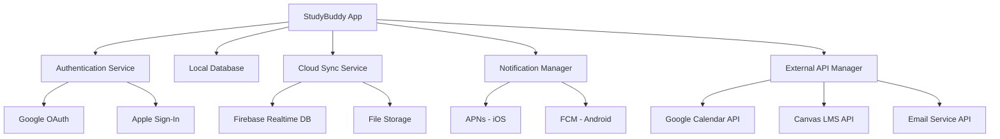

# Integration 🔗

## Connecting All the Pieces Together

Integration is where individual components, services, and systems work together as a unified application. This phase often reveals compatibility issues and requires careful coordination between different parts of your software.

## StudyBuddy Integration Points

### External Service Integration

**Calendar Systems:**
- Google Calendar API for assignment sync
- Apple Calendar (EventKit) for iOS users
- Outlook Calendar for Microsoft users

**School Management Systems:**
- Canvas LMS API for assignment import
- Google Classroom integration
- Blackboard and Moodle support

**Cloud Storage and Sync:**
- Firebase for real-time data synchronization
- Google Drive for file attachments
- iCloud for iOS user preferences

**Notification Services:**
- iOS Push Notifications (APNs)
- Android Firebase Cloud Messaging (FCM)
- Email notifications via SendGrid

### Integration Architecture

<div class="diagram-container">
<button class="diagram-expand-btn">🔍 View Larger</button>
<div class="diagram-content">

</div>
</div>

## Implementation Example

### Calendar Integration Service

```python
class CalendarIntegration:
    def __init__(self, calendar_service):
        self.calendar = calendar_service
        self.sync_enabled = False
    
    def sync_assignments(self, studybuddy_app):
        """Sync assignments with external calendar"""
        if not self.sync_enabled:
            return {"success": False, "error": "Sync not enabled"}
        
        try:
            synced_count = 0
            for assignment in studybuddy_app.get_pending_assignments():
                calendar_event = {
                    'title': f"📚 {assignment.title}",
                    'due_date': assignment.due_date,
                    'description': f"Subject: {assignment.subject}\\nPriority: {assignment.priority}",
                    'reminder': True
                }
                
                result = self.calendar.create_event(calendar_event)
                if result.success:
                    assignment.calendar_id = result.event_id
                    synced_count += 1
            
            return {"success": True, "synced": synced_count}
            
        except Exception as e:
            logger.error(f"Calendar sync failed: {e}")
            return {"success": False, "error": "Sync temporarily unavailable"}

    def handle_calendar_updates(self, event_data):
        """Handle updates from calendar service"""
        # Update assignment if calendar event is modified
        assignment = self.find_assignment_by_calendar_id(event_data.id)
        if assignment:
            assignment.due_date = event_data.due_date
            assignment.save()
```

### API Integration Manager

```python
class APIManager:
    def __init__(self):
        self.apis = {
            'google_calendar': GoogleCalendarAPI(),
            'canvas': CanvasAPI(),
            'notifications': NotificationAPI()
        }
        self.retry_count = 3
        self.timeout = 30
    
    async def make_request(self, service, endpoint, data=None):
        """Make API request with error handling and retries"""
        api = self.apis.get(service)
        if not api:
            raise ValueError(f"Unknown service: {service}")
        
        for attempt in range(self.retry_count):
            try:
                response = await api.request(
                    endpoint, 
                    data=data, 
                    timeout=self.timeout
                )
                
                if response.status == 200:
                    return response.json()
                elif response.status == 429:  # Rate limited
                    await asyncio.sleep(2 ** attempt)  # Exponential backoff
                    continue
                else:
                    raise APIError(f"API error: {response.status}")
                    
            except asyncio.TimeoutError:
                if attempt == self.retry_count - 1:
                    raise
                await asyncio.sleep(1)
        
        raise APIError("Max retries exceeded")
```

/// details | Real-World Integration Challenge 🌍
    type: example

**Spotify + Facebook Integration (2011):** When Spotify integrated with Facebook, they had to handle:

- **Authentication**: Users could sign in with Facebook accounts
- **Data Sync**: Music preferences and friend connections
- **Privacy**: Different privacy settings between platforms  
- **Performance**: Handling millions of users simultaneously

This integration helped Spotify grow from 1 million to 24 million users in just two years!

///

## Integration Challenges and Solutions

### 1. API Rate Limiting
**Challenge:** External services limit how many requests you can make
**Solution:** Implement exponential backoff and request queuing

```python
class RateLimiter:
    def __init__(self, max_requests=100, time_window=3600):
        self.max_requests = max_requests
        self.time_window = time_window
        self.requests = []
    
    async def wait_if_needed(self):
        now = time.time()
        # Remove old requests outside time window
        self.requests = [req for req in self.requests if now - req < self.time_window]
        
        if len(self.requests) >= self.max_requests:
            # Wait until oldest request expires
            wait_time = self.time_window - (now - self.requests[0])
            await asyncio.sleep(wait_time)
        
        self.requests.append(now)
```

### 2. Data Format Inconsistencies
**Challenge:** Different APIs use different data formats
**Solution:** Create adapter classes to normalize data

```python
class AssignmentAdapter:
    @staticmethod
    def from_canvas(canvas_assignment):
        """Convert Canvas assignment to StudyBuddy format"""
        return Assignment(
            title=canvas_assignment['name'],
            subject=canvas_assignment['course']['name'],
            due_date=parse_iso_date(canvas_assignment['due_at']),
            description=canvas_assignment['description'],
            external_id=canvas_assignment['id'],
            source='canvas'
        )
    
    @staticmethod  
    def from_google_classroom(gc_assignment):
        """Convert Google Classroom assignment to StudyBuddy format"""
        return Assignment(
            title=gc_assignment.title,
            subject=gc_assignment.courseId,
            due_date=gc_assignment.dueDate,
            description=gc_assignment.description,
            external_id=gc_assignment.id,
            source='google_classroom'
        )
```

### 3. Network Failures
**Challenge:** Internet connections aren't always reliable
**Solution:** Implement offline capabilities and sync when connection returns

```python
class OfflineSync:
    def __init__(self):
        self.pending_operations = []
        self.is_online = True
    
    def add_assignment_offline(self, assignment_data):
        """Queue assignment creation for when online"""
        operation = {
            'type': 'create_assignment',
            'data': assignment_data,
            'timestamp': datetime.now(),
            'retries': 0
        }
        self.pending_operations.append(operation)
    
    async def sync_when_online(self):
        """Process pending operations when connection restored"""
        if not self.is_online:
            return
        
        for operation in self.pending_operations[:]:  # Copy list to modify during iteration
            try:
                if operation['type'] == 'create_assignment':
                    await self.api.create_assignment(operation['data'])
                
                self.pending_operations.remove(operation)
                
            except Exception as e:
                operation['retries'] += 1
                if operation['retries'] > 3:
                    self.pending_operations.remove(operation)  # Give up after 3 retries
```

## Testing Integration

### 1. Mock External Services
Test integration logic without relying on external APIs

```python
class MockCalendarAPI:
    def __init__(self):
        self.events = []
    
    def create_event(self, event_data):
        event = {
            'id': f"mock_event_{len(self.events)}",
            'title': event_data['title'],
            'due_date': event_data['due_date']
        }
        self.events.append(event)
        return MockAPIResponse(success=True, event_id=event['id'])

def test_calendar_sync():
    mock_calendar = MockCalendarAPI()
    integration = CalendarIntegration(mock_calendar)
    
    # Test the sync logic without hitting real APIs
    result = integration.sync_assignments(test_app)
    assert result['success'] == True
```

### 2. Integration Testing Environment
Set up test environments that mirror production integrations

### 3. Monitor Integration Health
Track success rates, response times, and error patterns

---

**Next:** Learn about [Testing & Debugging](testing.md) - ensuring everything works correctly
