# Pseudocode & Flowcharts

## Introduction

Once you've applied computational thinking to break down a problem, you need to communicate your algorithm clearly. **Pseudocode** and **flowcharts** are the universal languages that programmers use to design and share algorithms before writing actual code.

/// details | Why Not Jump Straight to Code? 🤔
    type: question

**Planning saves time and prevents bugs:**
- Pseudocode helps you think through logic without syntax errors
- Flowcharts reveal missing steps and logic errors
- Team members can review algorithms regardless of programming language
- Changes are cheaper to make in planning than in code
- Documentation helps future developers understand your thinking

///

## Pseudocode

Pseudocode is structured English that describes an algorithm using programming concepts but without specific syntax rules.

### Pseudocode Conventions

#### Basic Structure
```
START algorithm_name
    // Algorithm steps go here
    // Use indentation to show structure
END algorithm_name
```

#### Common Keywords
- **START/END** - Begin and end of algorithm
- **INPUT/OUTPUT** - Data going in/coming out
- **SET/ASSIGN** - Variable assignment
- **IF/THEN/ELSE** - Decision making
- **WHILE/FOR** - Loops and repetition
- **FUNCTION/PROCEDURE** - Reusable code blocks

#### Data Operations
```
INPUT user_name
SET age = 17
OUTPUT "Hello " + user_name
CALCULATE total = price * quantity
```

### StudyBuddy Example: Login Algorithm

```
START User Login
    INPUT username, password
    
    IF username is empty OR password is empty THEN
        OUTPUT "Please enter both username and password"
        RETURN to login screen
    END IF
    
    SET stored_password = LOOKUP password for username in database
    
    IF stored_password does not exist THEN
        OUTPUT "Username not found"
        RETURN to login screen
    END IF
    
    IF password matches stored_password THEN
        SET user_session = CREATE new session for username
        OUTPUT "Login successful"
        REDIRECT to dashboard
    ELSE
        OUTPUT "Incorrect password"
        INCREMENT failed_attempts for username
        
        IF failed_attempts >= 3 THEN
            LOCK account for 15 minutes
            OUTPUT "Account temporarily locked due to failed attempts"
        END IF
    END IF
END User Login
```

### StudyBuddy Example: Assignment Reminder Algorithm

```
START Assignment Reminder System
    WHILE system is running DO
        SET current_time = GET current system time
        SET all_users = GET all active users from database
        
        FOR each user in all_users DO
            SET assignments = GET incomplete assignments for user
            
            FOR each assignment in assignments DO
                SET hours_until_due = CALCULATE time difference
                
                IF hours_until_due == 24 THEN
                    SEND notification "Assignment due in 24 hours"
                ELSE IF hours_until_due == 2 THEN
                    SEND notification "Assignment due in 2 hours!"
                ELSE IF hours_until_due == 0 THEN
                    SEND notification "Assignment is now overdue"
                    SET assignment.status = "overdue"
                END IF
            END FOR
        END FOR
        
        WAIT 1 hour
    END WHILE
END Assignment Reminder System
```

## Flowcharts

Flowcharts use standardized symbols to visually represent algorithm flow and decision points.

### Flowchart Symbols

#### Basic Symbols


#### Symbol Usage Rules
- **Oval**: Start and end points
- **Rectangle**: Processing steps and calculations
- **Diamond**: Decision points (yes/no questions)
- **Parallelogram**: Input and output operations
- **Circle**: Connectors for complex flows
- **Arrows**: Show flow direction

### StudyBuddy Example: Study Session Timer


### StudyBuddy Example: Assignment Priority Calculator

```mermaid
flowchart TD
    A([Start Priority Calculation]) --> B[Get All Incomplete Assignments]
    B --> C{Any Assignments?}
    C -->|No| D[/Display: No assignments found/]
    D --> Z([End])
    C -->|Yes| E[Select First Assignment]
    E --> F[Calculate Days Until Due]
    F --> G{Due Date Passed?}
    G -->|Yes| H[Set Urgency = 10]
    G -->|No| I[Set Urgency = 10 - Days Until Due]
    I --> J{Urgency < 0?}
    J -->|Yes| K[Set Urgency = 0]
    J -->|No| L[Get User Difficulty Rating 1-5]
    H --> L
    K --> L
    L --> M[Get User Importance Rating 1-5]
    M --> N[Calculate Priority Score<br/>= Urgency×0.4 + Difficulty×0.3 + Importance×0.3]
    N --> O[Store Priority Score]
    O --> P{More Assignments?}
    P -->|Yes| Q[Select Next Assignment]
    Q --> F
    P -->|No| R[Sort All Assignments by Priority Score]
    R --> S[/Display Top 3 Assignments/]
    S --> Z
    
    style A fill:#90EE90
    style Z fill:#FFB6C1
```



## Advanced Pseudocode Techniques

### Functions and Procedures

```
FUNCTION calculate_grade(score, total_points)
    SET percentage = (score / total_points) * 100
    
    IF percentage >= 90 THEN
        RETURN "A"
    ELSE IF percentage >= 80 THEN
        RETURN "B"
    ELSE IF percentage >= 70 THEN
        RETURN "C"
    ELSE IF percentage >= 60 THEN
        RETURN "D"
    ELSE
        RETURN "F"
    END IF
END FUNCTION

START Grade Calculator
    INPUT student_score, total_possible_points
    SET letter_grade = CALL calculate_grade(student_score, total_possible_points)
    OUTPUT "Your grade is: " + letter_grade
END Grade Calculator
```

### Error Handling

```
START File Upload
    INPUT selected_file
    
    TRY
        IF file_size > 10MB THEN
            THROW "File too large"
        END IF
        
        IF file_type NOT IN ["jpg", "png", "pdf"] THEN
            THROW "Invalid file type"
        END IF
        
        UPLOAD file to server
        OUTPUT "Upload successful"
        
    CATCH error
        OUTPUT "Upload failed: " + error.message
        CLEANUP temporary files
    END TRY
END File Upload
```

## Complex Flowchart Example: StudyBuddy Goal Tracking


## Best Practices

### Pseudocode Guidelines

#### ✅ Do This
```
// Clear, descriptive names
SET student_average = total_score / number_of_tests

// Proper indentation shows structure
IF student_average >= 70 THEN
    SET grade = "Pass"
    SEND congratulations_email
ELSE
    SET grade = "Fail"
    SCHEDULE remedial_session
END IF
```

#### ❌ Avoid This
```
// Vague variable names
SET x = y / z

// Poor structure makes logic unclear
IF x >= 70 THEN SET g = "Pass" SEND email ELSE SET g = "Fail" SCHEDULE session END IF
```

### Flowchart Guidelines

#### ✅ Good Flowchart
- One entry point, clear exit points
- Decision diamonds have exactly two outputs (Yes/No)
- Process boxes contain single actions
- Flow direction is top-to-bottom, left-to-right
- All paths lead somewhere

#### ❌ Poor Flowchart
- Multiple starting points
- Unclear decision criteria
- Processes that try to do too much
- Arrows going in random directions
- Dead ends with no exit

## Practice Exercises

### Exercise 1: Password Strength Checker
Create pseudocode and a flowchart for checking password strength:
- Minimum 8 characters
- Must contain uppercase and lowercase letters
- Must contain at least one number
- Must contain at least one special character
- Display strength as "Weak", "Medium", or "Strong"

### Exercise 2: Simple Calculator
Design an algorithm for a basic calculator that:
- Takes two numbers and an operation (+, -, *, /)
- Validates the input
- Performs the calculation
- Handles division by zero
- Displays the result

### Exercise 3: StudyBuddy Feature - Study Streak Tracker
Design an algorithm that:
- Tracks consecutive days of study
- Resets streak if a day is missed
- Awards badges for milestones (7, 30, 100 days)
- Sends encouragement after streak breaks

## Tools for Creating Flowcharts

### Online Tools
- **Mermaid** (text-based, works in Markdown)
- **Draw.io** (free, web-based)
- **Lucidchart** (professional features)
- **Creately** (collaborative)

### Desktop Software
- **Microsoft Visio** (industry standard)
- **Omnigraffle** (Mac)
- **yEd Graph Editor** (free)

## Converting to Code

Once your pseudocode and flowcharts are complete, converting to actual code becomes much easier:

### Pseudocode to Python Example
**Pseudocode:**
```
START Grade Calculator
    INPUT test_score
    IF test_score >= 90 THEN
        OUTPUT "Grade: A"
    ELSE IF test_score >= 80 THEN
        OUTPUT "Grade: B"
    ELSE
        OUTPUT "Grade: C"
    END IF
END
```

**Python Code:**
```python
def grade_calculator():
    test_score = int(input("Enter test score: "))
    
    if test_score >= 90:
        print("Grade: A")
    elif test_score >= 80:
        print("Grade: B")
    else:
        print("Grade: C")

grade_calculator()
```

## Key Takeaways

✅ **Plan before coding** - pseudocode and flowcharts save debugging time
✅ **Use standard conventions** - makes your algorithms readable by others
✅ **Keep it simple** - complex flowcharts indicate the algorithm needs simplification
✅ **Test your logic** - walk through with sample data before coding
✅ **Document decisions** - explain why certain paths were chosen

/// details | Professional Development Tip 💼
    type: tip

**In the software industry:**
- Technical interviews often require pseudocode solutions
- System design discussions use flowcharts
- Code reviews reference algorithmic documentation
- Client presentations use visual flowcharts to explain solutions
- Project planning relies on algorithm breakdown

Master these skills now for career success!

///

## Next Steps

Now that you can design and document algorithms clearly, learn how to evaluate their efficiency in [Algorithm Analysis](algorithm-analysis.md).

---

*Remember: The best code starts with the clearest plan. Invest time in pseudocode and flowcharts to build better software faster.*
