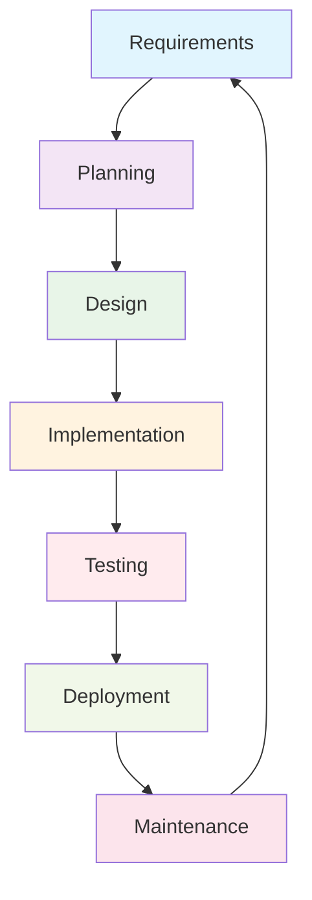

# Project Management

## Introduction

**Project management** in software development is like being a conductor of an orchestra - you need to coordinate multiple moving parts, ensure everyone knows their role, and keep everything in harmony to create something amazing. Whether you're building StudyBuddy alone or working with a team, effective project management transforms chaotic code-writing into systematic, successful software delivery.

/// details | Why Project Management Matters 🎯
    type: important

**Failed projects cost billions annually:**
- **68% of software projects** exceed their original budgets
- **45% are delivered late** due to poor planning
- **27% fail completely** - often due to lack of organization

**But well-managed projects deliver:**
- **On-time delivery** - Clear milestones and realistic planning
- **Better quality** - Systematic testing and review processes
- **Lower stress** - Everyone knows what they're doing and when
- **Scalable teams** - New members can contribute quickly
- **Satisfied users** - Requirements are properly captured and implemented

Whether building the next Instagram or a school assignment, project management skills separate professional developers from amateur coders!

///

## Project Lifecycle Overview

### The Software Development Lifecycle (SDLC)



### StudyBuddy Project Phases

Let's follow StudyBuddy through each phase of development:

#### Phase 1: Requirements Gathering
```python
class ProjectRequirements:
    """Capture and manage project requirements for StudyBuddy."""
    
    def __init__(self):
        self.functional_requirements = []
        self.non_functional_requirements = []
        self.user_stories = []
        self.acceptance_criteria = {}
    
    def add_user_story(self, story_id, title, description, priority="medium"):
        """Add user story with acceptance criteria."""
        user_story = {
            "id": story_id,
            "title": title,
            "description": description,
            "priority": priority,
            "status": "backlog",
            "estimated_hours": None,
            "assigned_to": None
        }
        
        self.user_stories.append(user_story)
        return story_id
    
    def add_acceptance_criteria(self, story_id, criteria):
        """Add acceptance criteria for a user story."""
        if story_id not in self.acceptance_criteria:
            self.acceptance_criteria[story_id] = []
        
        self.acceptance_criteria[story_id].extend(criteria)

# Example StudyBuddy requirements
studybuddy_requirements = ProjectRequirements()

# Core user stories
studybuddy_requirements.add_user_story(
    "SB-001",
    "Student Registration",
    "As a student, I want to create an account so I can track my study progress",
    "high"
)

studybuddy_requirements.add_acceptance_criteria("SB-001", [
    "Student can enter name, email, and password",
    "Email validation prevents invalid formats",
    "Password must meet security requirements (8+ chars, mixed case, number)",
    "Account confirmation email is sent",
    "Duplicate emails are rejected with clear error message",
    "Student profile is created with default preferences"
])

studybuddy_requirements.add_user_story(
    "SB-002", 
    "Assignment Tracking",
    "As a student, I want to add assignments so I can track due dates and progress",
    "high"
)

studybuddy_requirements.add_acceptance_criteria("SB-002", [
    "Student can add assignment with title, subject, due date",
    "Due dates cannot be in the past",
    "Student can mark assignments as complete",
    "Student can edit assignment details",
    "Student can delete assignments with confirmation",
    "Assignments are sorted by due date by default"
])

studybuddy_requirements.add_user_story(
    "SB-003",
    "Study Session Timer",
    "As a student, I want to time my study sessions so I can track productivity",
    "medium"
)

studybuddy_requirements.add_acceptance_criteria("SB-003", [
    "Student can start/pause/stop study timer",
    "Timer displays elapsed time in MM:SS format",
    "Student can add notes during or after session",
    "Session data is saved automatically",
    "Student can rate session productivity (1-5 stars)",
    "Study statistics are updated in real-time"
])
```

#### Phase 2: Project Planning

```python
from datetime import datetime, timedelta
from enum import Enum

class TaskStatus(Enum):
    BACKLOG = "backlog"
    IN_PROGRESS = "in_progress"
    REVIEW = "review"
    TESTING = "testing"
    DONE = "done"

class Priority(Enum):
    LOW = 1
    MEDIUM = 2
    HIGH = 3
    CRITICAL = 4

class ProjectPlan:
    """Manage project timeline, tasks, and resources."""
    
    def __init__(self, project_name, start_date):
        self.project_name = project_name
        self.start_date = start_date
        self.tasks = []
        self.milestones = []
        self.team_members = []
        self.sprints = []
    
    def add_task(self, task_id, title, description, estimated_hours, 
                 dependencies=None, assigned_to=None, priority=Priority.MEDIUM):
        """Add a task to the project plan."""
        task = {
            "id": task_id,
            "title": title,
            "description": description,
            "estimated_hours": estimated_hours,
            "actual_hours": 0,
            "status": TaskStatus.BACKLOG,
            "priority": priority,
            "dependencies": dependencies or [],
            "assigned_to": assigned_to,
            "created_date": datetime.now(),
            "start_date": None,
            "completion_date": None,
            "notes": []
        }
        
        self.tasks.append(task)
        return task_id
    
    def add_milestone(self, name, description, target_date, required_tasks):
        """Add a project milestone."""
        milestone = {
            "name": name,
            "description": description,
            "target_date": target_date,
            "required_tasks": required_tasks,
            "completed": False
        }
        
        self.milestones.append(milestone)
        return milestone
    
    def create_sprint(self, sprint_number, start_date, end_date, tasks):
        """Create a development sprint."""
        sprint = {
            "number": sprint_number,
            "start_date": start_date,
            "end_date": end_date,
            "tasks": tasks,
            "sprint_goal": "",
            "retrospective_notes": []
        }
        
        self.sprints.append(sprint)
        return sprint
    
    def calculate_critical_path(self):
        """Find the critical path through the project."""
        # Simplified critical path calculation
        task_dict = {task["id"]: task for task in self.tasks}
        
        def calculate_duration(task_id, visited=None):
            if visited is None:
                visited = set()
            
            if task_id in visited:
                return 0  # Circular dependency, handle appropriately
            
            task = task_dict.get(task_id)
            if not task:
                return 0
            
            visited.add(task_id)
            
            max_dependency_duration = 0
            for dep_id in task["dependencies"]:
                dep_duration = calculate_duration(dep_id, visited.copy())
                max_dependency_duration = max(max_dependency_duration, dep_duration)
            
            return max_dependency_duration + task["estimated_hours"]
        
        critical_tasks = []
        max_duration = 0
        
        for task in self.tasks:
            duration = calculate_duration(task["id"])
            if duration > max_duration:
                max_duration = duration
                critical_tasks = [task["id"]]
            elif duration == max_duration:
                critical_tasks.append(task["id"])
        
        return critical_tasks, max_duration
    
    def generate_gantt_data(self):
        """Generate data for Gantt chart visualization."""
        gantt_data = []
        
        for task in self.tasks:
            start_date = task["start_date"] or self.start_date
            duration_days = task["estimated_hours"] / 8  # Assuming 8-hour workdays
            end_date = start_date + timedelta(days=duration_days)
            
            gantt_data.append({
                "task_id": task["id"],
                "task_name": task["title"],
                "start_date": start_date.strftime("%Y-%m-%d"),
                "end_date": end_date.strftime("%Y-%m-%d"),
                "duration": duration_days,
                "progress": self._calculate_progress(task),
                "dependencies": task["dependencies"],
                "assigned_to": task["assigned_to"]
            })
        
        return gantt_data
    
    def _calculate_progress(self, task):
        """Calculate task completion percentage."""
        if task["status"] == TaskStatus.DONE:
            return 100
        elif task["status"] == TaskStatus.TESTING:
            return 80
        elif task["status"] == TaskStatus.REVIEW:
            return 70
        elif task["status"] == TaskStatus.IN_PROGRESS:
            return min(50, (task["actual_hours"] / task["estimated_hours"]) * 100)
        else:
            return 0

# Example StudyBuddy project plan
studybuddy_plan = ProjectPlan("StudyBuddy v1.0", datetime(2024, 3, 1))

# Add team members
studybuddy_plan.team_members = [
    {"name": "Sarah Johnson", "role": "Full Stack Developer", "skills": ["Python", "React", "Database"]},
    {"name": "Mike Chen", "role": "UI/UX Designer", "skills": ["Figma", "CSS", "User Research"]},
    {"name": "Emma Wilson", "role": "QA Tester", "skills": ["Manual Testing", "Automation", "Bug Tracking"]}
]

# Add development tasks
studybuddy_plan.add_task(
    "DEV-001",
    "Set up development environment",
    "Configure Python environment, database, and version control",
    8,
    priority=Priority.HIGH
)

studybuddy_plan.add_task(
    "DEV-002", 
    "Design database schema",
    "Create entity relationship diagram and database tables",
    16,
    dependencies=["DEV-001"],
    priority=Priority.HIGH
)

studybuddy_plan.add_task(
    "DEV-003",
    "Implement user authentication",
    "Create registration, login, and session management",
    24,
    dependencies=["DEV-002"],
    assigned_to="Sarah Johnson",
    priority=Priority.HIGH
)

studybuddy_plan.add_task(
    "DEV-004",
    "Build assignment CRUD operations",
    "Create, read, update, delete operations for assignments",
    32,
    dependencies=["DEV-003"],
    assigned_to="Sarah Johnson",
    priority=Priority.HIGH
)

studybuddy_plan.add_task(
    "UI-001",
    "Design user interface mockups",
    "Create wireframes and visual designs for all screens",
    20,
    assigned_to="Mike Chen",
    priority=Priority.MEDIUM
)

studybuddy_plan.add_task(
    "UI-002",
    "Implement responsive frontend",
    "Build React components based on designs",
    40,
    dependencies=["UI-001", "DEV-004"],
    assigned_to="Sarah Johnson",
    priority=Priority.MEDIUM
)

# Add milestones
studybuddy_plan.add_milestone(
    "MVP Complete",
    "Minimum viable product with core features",
    datetime(2024, 4, 15),
    ["DEV-003", "DEV-004", "UI-002"]
)

studybuddy_plan.add_milestone(
    "Beta Release", 
    "Feature-complete beta for user testing",
    datetime(2024, 5, 1),
    ["DEV-005", "TEST-001", "DOC-001"]
)

# Create sprints
sprint_1 = studybuddy_plan.create_sprint(
    1,
    datetime(2024, 3, 1),
    datetime(2024, 3, 14),
    ["DEV-001", "DEV-002", "UI-001"]
)
sprint_1["sprint_goal"] = "Set up foundation and begin core development"

sprint_2 = studybuddy_plan.create_sprint(
    2,
    datetime(2024, 3, 15),
    datetime(2024, 3, 28),
    ["DEV-003", "DEV-004"]
)
sprint_2["sprint_goal"] = "Implement core user and assignment functionality"
```

## Agile Development Practices

### Scrum Framework for StudyBuddy

```python
class ScrumMaster:
    """Facilitate Scrum ceremonies and practices."""
    
    def __init__(self, project_plan):
        self.project_plan = project_plan
        self.current_sprint = None
        self.backlog = []
        self.sprint_burndown = []
    
    def conduct_sprint_planning(self, sprint_number, capacity_hours):
        """Plan the next sprint with the team."""
        print(f"🏃‍♂️ SPRINT {sprint_number} PLANNING")
        print("=" * 40)
        
        # Get available tasks from backlog
        available_tasks = [
            task for task in self.project_plan.tasks 
            if task["status"] == TaskStatus.BACKLOG
        ]
        
        # Sort by priority and dependencies
        available_tasks.sort(key=lambda x: (x["priority"].value, x["id"]))
        
        selected_tasks = []
        total_hours = 0
        
        print("Available tasks:")
        for i, task in enumerate(available_tasks[:10], 1):  # Show top 10
            status = "✅ Can start" if not task["dependencies"] else f"⏳ Depends on: {', '.join(task['dependencies'])}"
            print(f"  {i}. {task['title']} ({task['estimated_hours']}h) - {status}")
        
        # Auto-select tasks that fit in capacity
        for task in available_tasks:
            if total_hours + task["estimated_hours"] <= capacity_hours:
                # Check if dependencies are met
                dependencies_met = all(
                    any(dep_task["id"] == dep_id and dep_task["status"] == TaskStatus.DONE 
                        for dep_task in self.project_plan.tasks)
                    for dep_id in task["dependencies"]
                )
                
                if dependencies_met or not task["dependencies"]:
                    selected_tasks.append(task)
                    total_hours += task["estimated_hours"]
                    task["status"] = TaskStatus.IN_PROGRESS
        
        print(f"\n📋 SPRINT {sprint_number} COMMITMENT")
        print(f"Capacity: {capacity_hours} hours")
        print(f"Committed: {total_hours} hours")
        print(f"Tasks selected: {len(selected_tasks)}")
        
        for task in selected_tasks:
            print(f"  • {task['title']} ({task['estimated_hours']}h)")
        
        # Create sprint
        start_date = datetime.now()
        end_date = start_date + timedelta(days=14)  # 2-week sprints
        
        sprint = self.project_plan.create_sprint(
            sprint_number, start_date, end_date, 
            [task["id"] for task in selected_tasks]
        )
        
        self.current_sprint = sprint
        return sprint
    
    def conduct_daily_standup(self):
        """Facilitate daily standup meeting."""
        print("🌅 DAILY STANDUP")
        print("=" * 40)
        
        if not self.current_sprint:
            print("No active sprint")
            return
        
        sprint_tasks = [
            task for task in self.project_plan.tasks 
            if task["id"] in self.current_sprint["tasks"]
        ]
        
        # Simulate team updates
        updates = {
            "Sarah Johnson": {
                "yesterday": "Completed user authentication setup",
                "today": "Working on password reset functionality", 
                "blockers": "Need clarification on email template design"
            },
            "Mike Chen": {
                "yesterday": "Finished wireframes for login screen",
                "today": "Creating high-fidelity mockups for dashboard",
                "blockers": "None"
            },
            "Emma Wilson": {
                "yesterday": "Set up test environment",
                "today": "Writing test cases for user registration",
                "blockers": "Waiting for dev environment access"
            }
        }
        
        for member, update in updates.items():
            print(f"\n👤 {member}:")
            print(f"  ✅ Yesterday: {update['yesterday']}")
            print(f"  🎯 Today: {update['today']}")
            print(f"  🚫 Blockers: {update['blockers']}")
        
        # Show sprint progress
        completed_tasks = len([t for t in sprint_tasks if t["status"] == TaskStatus.DONE])
        total_tasks = len(sprint_tasks)
        
        print(f"\n📊 SPRINT PROGRESS")
        print(f"Tasks completed: {completed_tasks}/{total_tasks}")
        print(f"Days remaining: {(self.current_sprint['end_date'] - datetime.now()).days}")
    
    def conduct_sprint_review(self):
        """Review sprint accomplishments with stakeholders."""
        print("🎉 SPRINT REVIEW")
        print("=" * 40)
        
        if not self.current_sprint:
            print("No sprint to review")
            return
        
        sprint_tasks = [
            task for task in self.project_plan.tasks 
            if task["id"] in self.current_sprint["tasks"]
        ]
        
        completed_tasks = [t for t in sprint_tasks if t["status"] == TaskStatus.DONE]
        in_progress_tasks = [t for t in sprint_tasks if t["status"] != TaskStatus.DONE]
        
        print(f"Sprint Goal: {self.current_sprint['sprint_goal']}")
        print(f"Duration: {self.current_sprint['start_date'].strftime('%Y-%m-%d')} to {self.current_sprint['end_date'].strftime('%Y-%m-%d')}")
        
        print(f"\n✅ COMPLETED ({len(completed_tasks)} tasks):")
        for task in completed_tasks:
            print(f"  • {task['title']}")
            print(f"    Estimated: {task['estimated_hours']}h, Actual: {task['actual_hours']}h")
        
        if in_progress_tasks:
            print(f"\n⏳ INCOMPLETE ({len(in_progress_tasks)} tasks):")
            for task in in_progress_tasks:
                print(f"  • {task['title']} - {task['status'].value}")
        
        # Calculate velocity
        planned_hours = sum(task["estimated_hours"] for task in sprint_tasks)
        completed_hours = sum(task["estimated_hours"] for task in completed_tasks)
        velocity = (completed_hours / planned_hours) * 100 if planned_hours > 0 else 0
        
        print(f"\n📈 METRICS:")
        print(f"Velocity: {velocity:.1f}% ({completed_hours}/{planned_hours} hours)")
        print(f"Task completion rate: {(len(completed_tasks)/len(sprint_tasks))*100:.1f}%")
    
    def conduct_retrospective(self):
        """Reflect on sprint process and identify improvements."""
        print("🔄 SPRINT RETROSPECTIVE")
        print("=" * 40)
        
        # Example retrospective format: Start, Stop, Continue
        retrospective = {
            "start": [
                "Daily code reviews to catch issues earlier",
                "Better time tracking to improve estimates",
                "Regular stakeholder check-ins for feedback"
            ],
            "stop": [
                "Working on multiple tasks simultaneously",
                "Skipping documentation during development",
                "Late-night coding sessions affecting code quality"
            ],
            "continue": [
                "Pair programming for complex features",
                "Automated testing with every commit",
                "Regular refactoring to maintain code quality"
            ]
        }
        
        print("What should we START doing?")
        for item in retrospective["start"]:
            print(f"  🟢 {item}")
        
        print("\nWhat should we STOP doing?")
        for item in retrospective["stop"]:
            print(f"  🔴 {item}")
        
        print("\nWhat should we CONTINUE doing?")
        for item in retrospective["continue"]:
            print(f"  🔵 {item}")
        
        # Add action items
        action_items = [
            {
                "item": "Set up automated code review tools",
                "assigned_to": "Sarah Johnson",
                "due_date": datetime.now() + timedelta(days=3)
            },
            {
                "item": "Create time tracking guidelines",
                "assigned_to": "Mike Chen", 
                "due_date": datetime.now() + timedelta(days=5)
            }
        ]
        
        print("\n📋 ACTION ITEMS:")
        for action in action_items:
            print(f"  • {action['item']}")
            print(f"    Assigned: {action['assigned_to']}, Due: {action['due_date'].strftime('%Y-%m-%d')}")
        
        # Store retrospective notes
        if self.current_sprint:
            self.current_sprint["retrospective_notes"] = retrospective

# Example usage
scrum_master = ScrumMaster(studybuddy_plan)

# Simulate sprint ceremonies
sprint_1 = scrum_master.conduct_sprint_planning(1, 80)  # 80 hours capacity
scrum_master.conduct_daily_standup()
scrum_master.conduct_sprint_review()
scrum_master.conduct_retrospective()
```

## Version Control and Collaboration

### Git Workflow for StudyBuddy

```python
class GitWorkflow:
    """Manage Git workflow and collaboration practices."""
    
    def __init__(self, repository_name):
        self.repository_name = repository_name
        self.branches = ["main", "develop"]
        self.commit_history = []
        self.pull_requests = []
    
    def create_feature_branch(self, feature_name, base_branch="develop"):
        """Create a new feature branch."""
        branch_name = f"feature/{feature_name.lower().replace(' ', '-')}"
        
        command = f"git checkout {base_branch} && git pull origin {base_branch} && git checkout -b {branch_name}"
        
        print(f"🌿 CREATING FEATURE BRANCH")
        print(f"Branch: {branch_name}")
        print(f"Base: {base_branch}")
        print(f"Command: {command}")
        
        self.branches.append(branch_name)
        return branch_name
    
    def commit_changes(self, branch, files, message, author):
        """Make a commit with proper message format."""
        # Conventional commit format: type(scope): description
        commit_types = {
            "feat": "New feature",
            "fix": "Bug fix",
            "docs": "Documentation",
            "style": "Code style changes",
            "refactor": "Code refactoring",
            "test": "Adding tests",
            "chore": "Maintenance tasks"
        }
        
        commit = {
            "id": f"abc{len(self.commit_history):04d}",
            "branch": branch,
            "files": files,
            "message": message,
            "author": author,
            "timestamp": datetime.now(),
            "verified": True  # GPG signed
        }
        
        self.commit_history.append(commit)
        
        print(f"📝 COMMIT CREATED")
        print(f"ID: {commit['id']}")
        print(f"Branch: {branch}")
        print(f"Message: {message}")
        print(f"Files: {', '.join(files)}")
        
        return commit["id"]
    
    def create_pull_request(self, source_branch, target_branch, title, description, author):
        """Create a pull request for code review."""
        pr_id = f"PR-{len(self.pull_requests) + 1:03d}"
        
        pull_request = {
            "id": pr_id,
            "title": title,
            "description": description,
            "source_branch": source_branch,
            "target_branch": target_branch,
            "author": author,
            "created_at": datetime.now(),
            "status": "open",
            "reviewers": [],
            "comments": [],
            "approvals": 0,
            "changes_requested": 0,
            "checks_passed": False
        }
        
        self.pull_requests.append(pull_request)
        
        print(f"🔍 PULL REQUEST CREATED")
        print(f"ID: {pr_id}")
        print(f"Title: {title}")
        print(f"Source: {source_branch} → Target: {target_branch}")
        print(f"Author: {author}")
        
        return pr_id
    
    def add_pr_review(self, pr_id, reviewer, status, comments=None):
        """Add a code review to pull request."""
        pr = next((pr for pr in self.pull_requests if pr["id"] == pr_id), None)
        if not pr:
            print(f"Pull request {pr_id} not found")
            return
        
        review = {
            "reviewer": reviewer,
            "status": status,  # "approved", "changes_requested", "commented"
            "timestamp": datetime.now(),
            "comments": comments or []
        }
        
        pr["reviewers"].append(review)
        
        if status == "approved":
            pr["approvals"] += 1
        elif status == "changes_requested":
            pr["changes_requested"] += 1
        
        print(f"📋 REVIEW ADDED")
        print(f"PR: {pr_id}")
        print(f"Reviewer: {reviewer}")
        print(f"Status: {status}")
        
        if comments:
            print("Comments:")
            for comment in comments:
                print(f"  • {comment}")
    
    def merge_pull_request(self, pr_id, merge_strategy="squash"):
        """Merge approved pull request."""
        pr = next((pr for pr in self.pull_requests if pr["id"] == pr_id), None)
        if not pr:
            print(f"Pull request {pr_id} not found")
            return False
        
        # Check merge requirements
        if pr["approvals"] < 1:
            print(f"❌ Cannot merge: Needs at least 1 approval (has {pr['approvals']})")
            return False
        
        if pr["changes_requested"] > 0:
            print(f"❌ Cannot merge: Has {pr['changes_requested']} change requests")
            return False
        
        if not pr["checks_passed"]:
            print("❌ Cannot merge: CI checks must pass")
            return False
        
        # Simulate merge
        pr["status"] = "merged"
        merge_commit_id = self.commit_changes(
            pr["target_branch"],
            ["merged_changes"],
            f"Merge {pr['source_branch']} into {pr['target_branch']} ({pr['title']})",
            "GitHub"
        )
        
        print(f"✅ PULL REQUEST MERGED")
        print(f"PR: {pr_id}")
        print(f"Merge commit: {merge_commit_id}")
        print(f"Strategy: {merge_strategy}")
        
        return True
    
    def generate_release_notes(self, from_tag, to_tag):
        """Generate release notes from commit history."""
        print(f"📋 RELEASE NOTES ({from_tag} → {to_tag})")
        print("=" * 50)
        
        # Group commits by type
        features = []
        fixes = []
        other = []
        
        for commit in self.commit_history[-10:]:  # Last 10 commits
            message = commit["message"].lower()
            if message.startswith("feat"):
                features.append(commit)
            elif message.startswith("fix"):
                fixes.append(commit)
            else:
                other.append(commit)
        
        if features:
            print("✨ NEW FEATURES:")
            for commit in features:
                print(f"  • {commit['message']} ({commit['id']})")
        
        if fixes:
            print("\n🐛 BUG FIXES:")
            for commit in fixes:
                print(f"  • {commit['message']} ({commit['id']})")
        
        if other:
            print("\n🔧 OTHER CHANGES:")
            for commit in other:
                print(f"  • {commit['message']} ({commit['id']})")
        
        print(f"\n📊 STATISTICS:")
        print(f"Total commits: {len(self.commit_history)}")
        print(f"Contributors: {len(set(c['author'] for c in self.commit_history))}")
        print(f"Files changed: {sum(len(c['files']) for c in self.commit_history)}")

# Example StudyBuddy Git workflow
studybuddy_git = GitWorkflow("studybuddy")

# Feature development workflow
branch = studybuddy_git.create_feature_branch("user authentication")

studybuddy_git.commit_changes(
    branch,
    ["auth/models.py", "auth/views.py"],
    "feat(auth): add user registration and login",
    "Sarah Johnson"
)

studybuddy_git.commit_changes(
    branch,
    ["auth/tests.py"],
    "test(auth): add unit tests for authentication",
    "Sarah Johnson"
)

pr_id = studybuddy_git.create_pull_request(
    branch,
    "develop",
    "Implement user authentication system",
    """
    ## Summary
    This PR implements the core user authentication system for StudyBuddy.
    
    ## Changes
    - User registration with email validation
    - Secure login with password hashing
    - Session management
    - Password reset functionality
    
    ## Testing
    - All unit tests pass
    - Manual testing completed
    - Security review conducted
    
    ## Screenshots
    [Login screen screenshot]
    [Registration form screenshot]
    """,
    "Sarah Johnson"
)

# Code review process
studybuddy_git.add_pr_review(
    pr_id,
    "Mike Chen",
    "approved",
    ["Code looks good!", "Nice test coverage", "UI integration ready"]
)

studybuddy_git.add_pr_review(
    pr_id,
    "Emma Wilson",
    "approved",
    ["Security measures look solid", "All test cases pass"]
)

# Update PR status to simulate CI checks
pr = next(pr for pr in studybuddy_git.pull_requests if pr["id"] == pr_id)
pr["checks_passed"] = True

# Merge the PR
studybuddy_git.merge_pull_request(pr_id)

# Generate release notes
studybuddy_git.generate_release_notes("v0.1.0", "v0.2.0")
```

## Risk Management

### Identifying and Mitigating Project Risks

```python
from enum import Enum

class RiskLevel(Enum):
    LOW = 1
    MEDIUM = 2
    HIGH = 3
    CRITICAL = 4

class RiskCategory(Enum):
    TECHNICAL = "technical"
    RESOURCE = "resource"
    SCHEDULE = "schedule"
    QUALITY = "quality"
    EXTERNAL = "external"

class RiskManager:
    """Identify, assess, and mitigate project risks."""
    
    def __init__(self):
        self.risks = []
        self.mitigation_strategies = {}
    
    def add_risk(self, risk_id, title, description, category, probability, impact, 
                 owner=None, mitigation_plan=None):
        """Add a new risk to the register."""
        # Calculate risk score (probability × impact)
        risk_score = probability * impact
        
        if risk_score >= 12:
            level = RiskLevel.CRITICAL
        elif risk_score >= 8:
            level = RiskLevel.HIGH
        elif risk_score >= 4:
            level = RiskLevel.MEDIUM
        else:
            level = RiskLevel.LOW
        
        risk = {
            "id": risk_id,
            "title": title,
            "description": description,
            "category": category,
            "probability": probability,  # 1-4 scale
            "impact": impact,  # 1-4 scale
            "risk_score": risk_score,
            "level": level,
            "owner": owner,
            "status": "open",
            "identified_date": datetime.now(),
            "mitigation_plan": mitigation_plan or [],
            "mitigation_actions": [],
            "notes": []
        }
        
        self.risks.append(risk)
        return risk_id
    
    def add_mitigation_action(self, risk_id, action, assigned_to, due_date):
        """Add mitigation action to a risk."""
        risk = next((r for r in self.risks if r["id"] == risk_id), None)
        if not risk:
            print(f"Risk {risk_id} not found")
            return
        
        action_item = {
            "action": action,
            "assigned_to": assigned_to,
            "due_date": due_date,
            "status": "open",
            "created_date": datetime.now()
        }
        
        risk["mitigation_actions"].append(action_item)
        
        print(f"🛡️ MITIGATION ACTION ADDED")
        print(f"Risk: {risk_id} - {risk['title']}")
        print(f"Action: {action}")
        print(f"Assigned: {assigned_to}")
        print(f"Due: {due_date.strftime('%Y-%m-%d')}")
    
    def update_risk_status(self, risk_id, new_probability=None, new_impact=None, notes=None):
        """Update risk assessment."""
        risk = next((r for r in self.risks if r["id"] == risk_id), None)
        if not risk:
            print(f"Risk {risk_id} not found")
            return
        
        if new_probability:
            risk["probability"] = new_probability
        if new_impact:
            risk["impact"] = new_impact
        
        # Recalculate risk score and level
        risk["risk_score"] = risk["probability"] * risk["impact"]
        
        if risk["risk_score"] >= 12:
            risk["level"] = RiskLevel.CRITICAL
        elif risk["risk_score"] >= 8:
            risk["level"] = RiskLevel.HIGH
        elif risk["risk_score"] >= 4:
            risk["level"] = RiskLevel.MEDIUM
        else:
            risk["level"] = RiskLevel.LOW
        
        if notes:
            risk["notes"].append({
                "date": datetime.now(),
                "note": notes
            })
        
        print(f"📊 RISK UPDATED")
        print(f"Risk: {risk_id}")
        print(f"New level: {risk['level'].name}")
        print(f"Score: {risk['risk_score']}")
    
    def generate_risk_report(self):
        """Generate comprehensive risk report."""
        print("⚠️ PROJECT RISK REGISTER")
        print("=" * 50)
        
        # Sort risks by score (highest first)
        sorted_risks = sorted(self.risks, key=lambda x: x["risk_score"], reverse=True)
        
        risk_counts = {level: 0 for level in RiskLevel}
        for risk in self.risks:
            risk_counts[risk["level"]] += 1
        
        print("📊 RISK SUMMARY:")
        for level in [RiskLevel.CRITICAL, RiskLevel.HIGH, RiskLevel.MEDIUM, RiskLevel.LOW]:
            count = risk_counts[level]
            emoji = {"CRITICAL": "🔴", "HIGH": "🟠", "MEDIUM": "🟡", "LOW": "🟢"}
            print(f"  {emoji[level.name]} {level.name}: {count} risks")
        
        print(f"\n📋 TOP RISKS:")
        for i, risk in enumerate(sorted_risks[:5], 1):
            status_emoji = "🔓" if risk["status"] == "open" else "🔒"
            print(f"\n{i}. {status_emoji} {risk['title']} ({risk['level'].name})")
            print(f"   Score: {risk['risk_score']} (P:{risk['probability']} × I:{risk['impact']})")
            print(f"   Category: {risk['category'].value}")
            print(f"   Owner: {risk['owner'] or 'Unassigned'}")
            
            if risk["mitigation_actions"]:
                print(f"   Mitigation actions: {len(risk['mitigation_actions'])} planned")
        
        # Risk trend analysis
        recent_risks = [r for r in self.risks if (datetime.now() - r["identified_date"]).days <= 30]
        print(f"\n📈 TREND ANALYSIS:")
        print(f"New risks (last 30 days): {len(recent_risks)}")
        print(f"Average risk score: {sum(r['risk_score'] for r in self.risks) / len(self.risks):.1f}")
        
        return sorted_risks

# StudyBuddy risk management example
risk_manager = RiskManager()

# Technical risks
risk_manager.add_risk(
    "TECH-001",
    "Database performance bottleneck",
    "As user base grows, database queries may become slow affecting user experience",
    RiskCategory.TECHNICAL,
    probability=3,  # Likely
    impact=3,       # Significant impact
    owner="Sarah Johnson",
    mitigation_plan=[
        "Implement database indexing strategy",
        "Set up query monitoring and optimization",
        "Plan for database scaling architecture"
    ]
)

risk_manager.add_risk(
    "TECH-002", 
    "Third-party API dependency failure",
    "Email service or authentication provider outage could break core functionality",
    RiskCategory.TECHNICAL,
    probability=2,  # Possible
    impact=4,       # Major impact
    owner="Sarah Johnson",
    mitigation_plan=[
        "Implement fallback email service",
        "Add circuit breaker pattern for API calls",
        "Create offline functionality for critical features"
    ]
)

# Resource risks
risk_manager.add_risk(
    "RES-001",
    "Key team member unavailability",
    "If lead developer becomes unavailable, project timeline could be severely impacted",
    RiskCategory.RESOURCE,
    probability=2,  # Possible
    impact=4,       # Major impact
    owner="Project Manager",
    mitigation_plan=[
        "Cross-train team members on critical components",
        "Maintain comprehensive documentation",
        "Identify backup resources"
    ]
)

# Schedule risks
risk_manager.add_risk(
    "SCH-001",
    "Feature creep from stakeholders", 
    "Additional feature requests could push back delivery timeline",
    RiskCategory.SCHEDULE,
    probability=3,  # Likely
    impact=2,       # Moderate impact
    owner="Product Manager",
    mitigation_plan=[
        "Establish clear scope and change control process",
        "Regular stakeholder communication",
        "Maintain feature backlog for future releases"
    ]
)

# Add mitigation actions
risk_manager.add_mitigation_action(
    "TECH-001",
    "Conduct database performance audit and add necessary indexes",
    "Sarah Johnson",
    datetime.now() + timedelta(days=14)
)

risk_manager.add_mitigation_action(
    "RES-001",
    "Create technical documentation for all core systems",
    "Mike Chen",
    datetime.now() + timedelta(days=21)
)

# Generate risk report
top_risks = risk_manager.generate_risk_report()

# Update risk status (simulate risk evolution)
risk_manager.update_risk_status(
    "TECH-001",
    new_probability=2,  # Reduced after mitigation
    notes="Implemented initial database optimizations, monitoring performance"
)
```

## Communication and Documentation

### Project Communication Plan

```python
class CommunicationPlan:
    """Manage project communication and stakeholder engagement."""
    
    def __init__(self):
        self.stakeholders = []
        self.communication_channels = []
        self.meeting_cadence = {}
        self.status_reports = []
    
    def add_stakeholder(self, name, role, interest_level, influence_level, 
                       preferred_communication, frequency):
        """Add stakeholder to communication plan."""
        stakeholder = {
            "name": name,
            "role": role,
            "interest_level": interest_level,  # 1-4 scale
            "influence_level": influence_level,  # 1-4 scale
            "preferred_communication": preferred_communication,
            "frequency": frequency,
            "last_contact": None,
            "concerns": [],
            "feedback": []
        }
        
        self.stakeholders.append(stakeholder)
        return stakeholder
    
    def create_status_report(self, week_ending, accomplishments, planned_work, 
                           risks, metrics, next_milestones):
        """Create weekly status report."""
        report = {
            "week_ending": week_ending,
            "accomplishments": accomplishments,
            "planned_work": planned_work,
            "risks": risks,
            "metrics": metrics,
            "next_milestones": next_milestones,
            "created_date": datetime.now()
        }
        
        self.status_reports.append(report)
        
        print(f"📊 WEEKLY STATUS REPORT - {week_ending.strftime('%Y-%m-%d')}")
        print("=" * 50)
        
        print("✅ THIS WEEK'S ACCOMPLISHMENTS:")
        for item in accomplishments:
            print(f"  • {item}")
        
        print("\n📋 NEXT WEEK'S PLANNED WORK:")
        for item in planned_work:
            print(f"  • {item}")
        
        if risks:
            print("\n⚠️ RISKS & ISSUES:")
            for risk in risks:
                print(f"  • {risk}")
        
        print("\n📈 KEY METRICS:")
        for metric, value in metrics.items():
            print(f"  • {metric}: {value}")
        
        print("\n🎯 UPCOMING MILESTONES:")
        for milestone in next_milestones:
            print(f"  • {milestone}")
        
        return report
    
    def send_stakeholder_updates(self, report):
        """Send appropriate updates to each stakeholder."""
        print(f"\n📨 SENDING STAKEHOLDER UPDATES")
        print("=" * 40)
        
        for stakeholder in self.stakeholders:
            # Customize message based on stakeholder preferences
            if stakeholder["role"] == "Executive Sponsor":
                # High-level summary
                message = self._create_executive_summary(report)
            elif stakeholder["role"] == "Product Manager":
                # Feature and timeline focus
                message = self._create_product_update(report)
            elif stakeholder["role"] == "Development Team":
                # Technical details
                message = self._create_technical_update(report)
            else:
                # Standard update
                message = self._create_standard_update(report)
            
            print(f"\n👤 {stakeholder['name']} ({stakeholder['role']})")
            print(f"📧 Channel: {stakeholder['preferred_communication']}")
            print(f"📄 Message type: {message['type']}")
            print(f"📝 Key points: {len(message['content'])} items")
    
    def _create_executive_summary(self, report):
        """Create executive-level summary."""
        return {
            "type": "Executive Summary",
            "content": [
                f"Project on track with {len(report['accomplishments'])} major deliverables completed",
                f"Next milestone: {report['next_milestones'][0] if report['next_milestones'] else 'TBD'}",
                f"Risk status: {len(report['risks'])} items being monitored"
            ]
        }
    
    def _create_product_update(self, report):
        """Create product-focused update."""
        return {
            "type": "Product Update",
            "content": [
                "Feature delivery progress and user story completion",
                "User feedback integration and backlog prioritization",
                "Upcoming feature demos and stakeholder reviews"
            ]
        }
    
    def _create_technical_update(self, report):
        """Create technical team update."""
        return {
            "type": "Technical Update", 
            "content": [
                "Code quality metrics and technical debt status",
                "Infrastructure improvements and performance optimizations",
                "Testing coverage and deployment pipeline status"
            ]
        }
    
    def _create_standard_update(self, report):
        """Create standard project update."""
        return {
            "type": "Standard Update",
            "content": [
                "Overall project progress and timeline status",
                "Team accomplishments and upcoming work",
                "Issues requiring attention or support"
            ]
        }

# StudyBuddy communication plan
comm_plan = CommunicationPlan()

# Add stakeholders
comm_plan.add_stakeholder(
    "Dr. Jennifer Martinez",
    "Executive Sponsor",
    interest_level=3,
    influence_level=4,
    preferred_communication="Email summary",
    frequency="Weekly"
)

comm_plan.add_stakeholder(
    "Alex Thompson", 
    "Product Manager",
    interest_level=4,
    influence_level=3,
    preferred_communication="Slack + demo sessions",
    frequency="Daily"
)

comm_plan.add_stakeholder(
    "StudyBuddy Development Team",
    "Development Team", 
    interest_level=4,
    influence_level=2,
    preferred_communication="Daily standups + Slack",
    frequency="Daily"
)

# Create status report
week_ending = datetime(2024, 3, 15)
accomplishments = [
    "Completed user authentication system with 98% test coverage",
    "Implemented assignment CRUD operations with validation",
    "Deployed development environment to staging server",
    "Conducted security review with no critical issues found"
]

planned_work = [
    "Implement study session timer with break tracking",
    "Create responsive dashboard UI components",
    "Set up automated deployment pipeline",
    "Begin user acceptance testing preparation"
]

risks = [
    "Database performance concerns identified, optimization in progress",
    "Third-party email service reliability being monitored"
]

metrics = {
    "Code coverage": "94%",
    "Sprint velocity": "32 story points",
    "Bug count": "3 open (0 critical)",
    "User stories completed": "8/10"
}

next_milestones = [
    "MVP demo scheduled for March 28th",
    "Beta release planned for April 15th"
]

report = comm_plan.create_status_report(
    week_ending, accomplishments, planned_work, 
    risks, metrics, next_milestones
)

# Send updates to stakeholders
comm_plan.send_stakeholder_updates(report)
```

## Key Takeaways

✅ **Plan before you code** - Requirements and design save time later
✅ **Use agile practices** - Sprint planning, standups, retrospectives improve delivery
✅ **Version control is essential** - Proper Git workflow enables team collaboration
✅ **Manage risks proactively** - Identify and mitigate issues before they become problems
✅ **Communicate regularly** - Keep stakeholders informed with appropriate detail level
✅ **Document decisions** - Future you (and your team) will thank you
✅ **Measure progress** - Metrics help identify problems and celebrate successes
✅ **Continuous improvement** - Regular retrospectives and process refinement

/// details | Professional Project Management Impact 💼
    type: tip

**Industry research shows:**
- **Well-managed projects** are 2.5x more likely to succeed
- **Agile practices** reduce project failure rates by 3x
- **Good communication** prevents 57% of project failures
- **Risk management** reduces budget overruns by 40%
- **Version control** eliminates 90% of code integration problems

Project management isn't overhead - it's the foundation that enables technical excellence to flourish!

///

## Practice Exercises

### Exercise 1: Create Your Project Plan
For your current coding project:
1. Define clear requirements and user stories
2. Break work into 2-week sprints
3. Identify dependencies and critical path
4. Create a risk register with mitigation plans

### Exercise 2: Git Workflow Practice
Set up a proper Git workflow:
1. Create feature branches for each task
2. Write meaningful commit messages
3. Create pull requests with descriptions
4. Practice code review feedback

### Exercise 3: Communication Plan
Design a communication strategy:
1. Identify your project stakeholders
2. Determine appropriate update frequency
3. Create templates for status reports
4. Practice presenting technical information to non-technical audiences

### Exercise 4: Risk Assessment
Analyze your project for risks:
1. Identify potential technical, schedule, and resource risks
2. Assess probability and impact
3. Create mitigation strategies
4. Monitor and update risk status regularly

## Next Steps

Congratulations! You've completed Module 5 (Code Development). You now have the tools to not only write great code, but to manage projects professionally from start to finish.

Ready to put your skills to the test? Continue to [Module 6: Assessment & Practice](../06-Assessment/index.md) where you'll tackle real-world coding challenges.

---

*Remember: Great developers aren't just great coders - they're great project managers, communicators, and team players. These skills will set you apart in your career!*
