# Programming Mechatronics 🤖⚙️

*Where Code Meets the Physical World!*

## Understanding Mechatronic Hardware and Software

### Introduction: Welcome to the Robot Revolution! 

Ever wondered how your Tesla knows when to brake? Or how a robot can perform delicate surgery? Welcome to **mechatronics** - the magical fusion of mechanical engineering, electronics, and programming that brings machines to life!

Think about it: your smartphone automatically rotates the screen (motion sensors + software), your gaming controller rumbles during explosions (actuators + code), and voice assistants like Alexa respond to your commands (microphones + AI algorithms). That's mechatronics in action!

```mermaid
flowchart LR
    M[🔧 Mechanical<br/>Parts] --> E[⚡ Electronics<br/>Circuits] --> S[💻 Software<br/>Code] --> ME[🤖 Smart<br/>Machines]
```

<div class="diagram-container">
<button class="diagram-expand-btn">🔍 View Larger</button>
<div class="diagram-content">



</div>
</div>

**The Mechatronics Trinity**  
Just like how your favorite video game needs graphics, sound, and gameplay mechanics to be awesome, mechatronic systems need all three components working together. Remove any one piece, and the magic disappears!

-  **Real-World Connection:** 🎮 Gaming controllers are perfect mechatronic examples:

* **Mechanical**: Buttons, joysticks, triggers that you physically move
* **Electronic**: Sensors detect your finger movements and button presses
* **Software**: Code translates your actions into game commands

The coolest part? The software has to understand the hardware, and the hardware design affects what the software can do. It's like a perfectly choreographed dance!

### Cool Applications of Mechatronics 🚀

Let's explore some mind-blowing examples of mechatronics that are shaping our world:

#### 🎬 **Movie Magic: Animatronics**
Ever see those incredibly realistic dinosaurs in Jurassic Park? Animatronic creatures use:

* **Mechanical**: Articulated joints and hydraulic muscles
* **Electronic**: Hundreds of sensors and servo motors
* **Software**: AI that coordinates realistic movement patterns

#### 🚗 **Self-Driving Cars: The Ultimate Mechatronic System**
Your future autonomous car will be a computer on wheels:

* **LIDAR sensors** create 3D maps of surroundings (hardware + software working together)
* **Machine learning algorithms** make split-second driving decisions
* **Electronic actuators** control steering, braking, and acceleration
* **Safety systems** can override human input when danger is detected
> ### 🧠 Think About It!
>
> When you play a racing game with a steering wheel controller, you’re experiencing mechatronics in action:
>
> - **Force feedback motors** make the wheel harder to turn during tight corners.
> - **Position sensors** detect exactly how far you’ve turned.
> - **Software algorithms** simulate realistic car physics.
>
> You’re literally feeling the code through mechanical forces!

#### 🏥 **Medical Mechatronics: Saving Lives**

* **Surgical robots** like da Vinci systems allow surgeons to operate with superhuman precision
* **Prosthetic limbs** with neural interfaces respond to brain signals
* **Robotic pharmacies** accurately dispense medications 24/7

#### 🎮 **Gaming & Entertainment**

* **VR haptic suits** let you feel virtual objects
* **Motion capture systems** turn actor movements into CGI characters
* **Theme park rides** create thrilling experiences with precise timing

#### 🌾 **Smart Farming Revolution**

* **Autonomous tractors** plant and harvest crops with GPS precision
* **Drone swarms** monitor crop health and spray pesticides exactly where needed
* **Robotic greenhouses** optimize growing conditions for each individual plant

### Hardware Requirements & Code Impact 💻⚙️

Here's where things get interesting: **the hardware you choose completely changes how you write your code!** It's like choosing between drawing with crayons vs. a digital tablet - same artistic vision, totally different techniques.

```mermaid
flowchart TD
    H[Hardware Choice] --> C[Code Structure]
    H --> P[Performance Limits]  
    H --> F[Available Features]
    
    A[Arduino Uno<br/>🎯 Simple & Cheap] --> A1[Basic loops<br/>Limited memory<br/>8-bit operations]
    R[Raspberry Pi<br/>🚀 Powerful & Flexible] --> R1[Complex algorithms<br/>Multithreading<br/>32/64-bit operations]
```

<div class="diagram-container">
<button class="diagram-expand-btn">🔍 View Larger</button>
<div class="diagram-content">



</div>
</div>

**Hardware = Your Programming Playground**  
Think of it like video game consoles - a Nintendo Switch game looks different from a PlayStation 5 game because of hardware limitations and capabilities. Same with mechatronic programming!

#### 🎯 **Arduino vs. Raspberry Pi: The Ultimate Showdown**

Imagine you're building a smart pet feeder. Here's how your code would differ:

**Arduino Approach (The Minimalist):**
```c
// Simple, direct control
void loop() {
    if (isTimeToFeed()) {
        dispenseFood();
        delay(1000);
    }
    checkSensors();
}
```

**Raspberry Pi Approach (The Powerhouse):**
```python
# Advanced features possible
import threading
import computer_vision
import wifi_connectivity

class SmartPetFeeder:
    def __init__(self):
        self.camera = Camera()
        self.wifi = WiFiManager()
        self.ai_vision = PetRecognition()
    
    def smart_feeding(self):
        if self.ai_vision.detect_pet_size() == "large":
            self.dispense_large_portion()
        self.send_notification_to_phone()
```

| Feature | Arduino (AVR) 🎯 | Raspberry Pi (ARM) 🚀 | Real-World Example |
|---------|:----------------:|:--------------------:|:------------------:|
| **Processing Power** | Like a calculator | Like a smartphone | Arduino: Blinking LED<br>Pi: Face recognition |
| **Memory** | 2KB RAM (tiny!) | 1GB+ RAM (huge!) | Arduino: Store 100 sensor readings<br>Pi: Process HD video |
| **Programming** | C/C++ (close to hardware) | Python/Java (high-level) | Arduino: Direct pin control<br>Pi: Complex algorithms |
| **Cost** | $25 | $75+ | Arduino: Budget projects<br>Pi: Commercial products |
| **Power Usage** | Sips power like a LED | Hungry like laptop | Arduino: Battery lasts months<br>Pi: Needs constant power |
| **Best For** | Simple, reliable tasks | Complex, smart behaviors | Arduino: Sensor monitoring<br>Pi: AI-powered systems |

#### ⚡ **Why This Matters for Your Code**

**Memory Constraints = Smart Coding:**

* **Arduino**: Every variable counts! You learn to write super-efficient code
* **Raspberry Pi**: You can be more relaxed with memory usage

**Real-Time vs. Multitasking:**

* **Arduino**: Perfect timing for motors and sensors (real-time control)
* **Raspberry Pi**: Can run multiple programs simultaneously
- **Raspberry Pi**: Can run multiple programs simultaneously

**Example: Smart Door Lock**
```c
// Arduino version - focused and fast
if (rfid_card_detected() && valid_card()) {
    unlock_door();
    start_timer(5000); // lock again in 5 seconds
}
```

```python
# Raspberry Pi version - feature-rich
import face_recognition
import send_notifications
import log_to_database

if face_recognition.match() or rfid_valid() or mobile_app_unlock():
    unlock_door()
    send_notification("Door unlocked by: " + get_user_name())
    log_to_database(timestamp, user, action)
    schedule_auto_lock(delay=5000)
```

### Sensors, Actuators & End Effectors: The Body Parts of Robots 🤖👁️

Think of mechatronic systems like a human body - they need **senses** (sensors), **muscles** (actuators), and **hands** (end effectors) to interact with the world!

```mermaid
flowchart LR
    S[👁️ SENSORS<br/>The Senses] --> B[🧠 BRAIN<br/>Microcontroller]
    B --> A[💪 ACTUATORS<br/>The Muscles]
    A --> E[✋ END EFFECTORS<br/>The Hands]
    E -.->|Feedback| S
```

<div class="diagram-container">
<button class="diagram-expand-btn">🔍 View Larger</button>
<div class="diagram-content">



</div>
</div>

**The Robot Body Analogy**  
Just like you use your eyes to see, brain to think, muscles to move, and hands to grab things, robots need the same basic components to function in the real world!

#### 👁️ **Sensors: Giving Robots Super Senses**

**Motion Sensors - The Robot's Inner Ear:**

* **What they do**: Detect movement, tilt, rotation, acceleration
* **Examples**: Accelerometers in phones (auto-rotate), gyroscopes in drones (stability)
* **Code Impact**: Your software needs to handle constantly changing numbers!

```python
# Example: Drone stability control
def keep_drone_stable():
    tilt_x = accelerometer.read_x()
    tilt_y = accelerometer.read_y()
    
    if tilt_x > 10:  # Tilting too much right
        left_motor.speed_up()   # Compensate
        right_motor.slow_down()
    
    # Software constantly adjusts based on sensor data!
```

**Light Sensors - The Robot's Eyes:**

* **What they do**: Measure brightness, detect objects, read colors
* **Examples**: Auto-adjusting screen brightness, security light activation
* **Programming Challenge**: Light levels change constantly - your code must adapt!

```python
# Smart streetlight example
def smart_streetlight():
    light_level = light_sensor.read()
    motion_detected = motion_sensor.read()
    
    if light_level < 100 and motion_detected:
        led.turn_on()
        print("Someone's walking in the dark - light on!")
    elif light_level > 500:  # Bright daylight
        led.turn_off()
        print("Sunny day - saving energy!")
```

#### 🎮 Gaming Connection

Your game controller uses tons of sensors:

* **Joystick position sensors** - detect exactly where you're pointing
* **Button pressure sensors** - know how hard you're pressing triggers
* **Motion sensors** - for motion-controlled games like Mario Kart steering

The game software reads these sensors 60+ times per second to create smooth gameplay!

#### 💪 **Actuators: The Robot's Muscles**

**Servo Motors - Precise Positioning Masters:**
```python
# Robot arm picking up objects
def pick_up_object():
    shoulder_servo.move_to(45)    # Lift arm
    elbow_servo.move_to(90)       # Bend elbow
    wrist_servo.move_to(0)        # Straighten wrist
    gripper_servo.move_to(180)    # Close gripper
    
    print("Object grabbed with precision!")
```

**DC Motors - Speed and Power:**
```python
# Robot car navigation
def drive_forward(speed_percent):
    left_motor.set_speed(speed_percent)
    right_motor.set_speed(speed_percent)
    
    # Monitor sensors while driving
    while ultrasonic_sensor.distance() > 10:  # 10cm obstacle detection
        continue  # Keep driving
    
    stop_motors()  # Emergency stop!
    print("Obstacle detected - stopped safely!")
```

**Hydraulic Actuators - The Heavy Lifters:**

* **Real-world example**: Excavator arms, car brakes, airplane wing flaps
* **Programming challenge**: Managing pressure and timing safely

```python
# Hydraulic press control (simplified)
def hydraulic_press_cycle():
    if safety_sensors_clear():
        hydraulic_valve.open()
        
        while pressure_sensor.read() < target_pressure:
            continue  # Building pressure
            
        hydraulic_valve.close()
        print("Press cycle complete - part formed!")
    else:
        emergency_stop()
        print("Safety violation - system halted!")
```

#### ✋ **End Effectors: The Robot's Hands**

**Robotic Grippers - Gentle Giants:**
```python
class SmartGripper:
    def __init__(self):
        self.force_sensor = ForceSensor()
        self.position_servo = Servo()
    
    def gentle_grip(self, target_object):
        # Start closing gripper
        for position in range(0, 180, 5):  # Slow, controlled movement
            self.position_servo.move_to(position)
            
            # Check if we're touching something
            if self.force_sensor.read() > 0.1:
                break  # Stop before crushing!
        
        print(f"Gently holding {target_object} with perfect force!")
```

**Multi-Tool End Effectors:**
Modern robots can swap tools like a Swiss Army knife:
```python
def robot_factory_worker():
    if task == "welding":
        attach_welding_torch()
    elif task == "painting":
        attach_spray_gun()
    elif task == "assembly":
        attach_precision_gripper()
    
    # Same robot, different capabilities!
```

### Data in Mechatronic Systems: The Information Highway 📊🚗

Imagine you're driving and your brain is constantly processing information: *"How fast am I going? Is that car getting closer? Should I brake? How hard should I turn the steering wheel?"* That's exactly what happens in mechatronic systems - a constant flow of data driving intelligent decisions!

```mermaid
flowchart LR
    S1[🌡️ Temperature<br/>Sensor] --> P[🧠 Processing<br/>Unit]
    S2[📏 Distance<br/>Sensor] --> P
    S3[⚡ Speed<br/>Sensor] --> P
    
    P --> A1[🔥 Heater<br/>Control]
    P --> A2[🚗 Motor<br/>Control]
    P --> A3[🚨 Warning<br/>System]
    
    A1 -.->|Feedback| S1
    A2 -.->|Feedback| S2
    A3 -.->|Feedback| S3
```

<div class="diagram-container">
<button class="diagram-expand-btn">🔍 View Larger</button>
<div class="diagram-content">



</div>
</div>

**The Never-Ending Data Loop**  
Just like your brain never stops processing what your eyes see, mechatronic systems continuously read sensors, make decisions, and adjust actuators. It's like having a super-fast conversation between hardware and software!

#### 🎯 **Real Example: Smart Home Thermostat**

Let's see how data flows in a system you probably use every day:

```python
class SmartThermostat:
    def __init__(self):
        self.target_temp = 22  # Celsius
        self.learning_data = []  # AI learning from your habits!
        
    def control_loop(self):
        while True:
            # 1. SENSE: Gather data from multiple sources
            current_temp = temperature_sensor.read()
            humidity = humidity_sensor.read()
            time_of_day = get_current_time()
            occupancy = motion_sensor.detected_recently()
            
            # 2. THINK: Process the data intelligently
            comfort_adjustment = self.calculate_comfort_factor(humidity)
            energy_savings = self.check_away_mode(occupancy)
            predicted_needs = self.ai_prediction(time_of_day)
            
            # 3. ACT: Make smart decisions
            if current_temp < (self.target_temp - comfort_adjustment):
                heater.turn_on()
                data_point = {"action": "heating", "temp": current_temp, 
                            "time": time_of_day}
            elif current_temp > (self.target_temp + 1):
                air_conditioner.turn_on()
                data_point = {"action": "cooling", "temp": current_temp, 
                            "time": time_of_day}
            else:
                heater.turn_off()
                air_conditioner.turn_off()
                data_point = {"action": "maintaining", "temp": current_temp}
            
            # 4. LEARN: Store data for future improvement
            self.learning_data.append(data_point)
            self.update_ai_model()  # Get smarter over time!
            
            time.sleep(30)  # Check every 30 seconds
```

#### 📱 **Data Types That Matter**

**Sensor Data - The Raw Truth:**
```python
# Examples of different data types sensors produce
temperature_reading = 23.5      # float - precise measurements
button_pressed = True           # boolean - on/off states  
rgb_color = [255, 128, 64]     # list - complex sensor data
error_code = "SENSOR_FAILURE"   # string - diagnostic info
timestamp = 1699123456          # integer - when it happened
```

**Processed Data - The Smart Insights:**
```python
# Your code transforms raw data into useful information
def analyze_sensor_data(raw_readings):
    average = sum(raw_readings) / len(raw_readings)
    trend = "increasing" if raw_readings[-1] > raw_readings[0] else "decreasing"
    
    if average > 30:
        status = "HOT"
        recommended_action = "activate_cooling"
    elif average < 10:
        status = "COLD"  
        recommended_action = "activate_heating"
    else:
        status = "COMFORTABLE"
        recommended_action = "maintain"
    
    return {
        "status": status,
        "trend": trend,
        "action": recommended_action,
        "confidence": calculate_confidence(raw_readings)
    }
```

#### 🎮 Gaming Data Flow

Ever notice how responsive modern games are? Here's the data flow in a racing game:

1. **Input**: Steering wheel angle, pedal pressure, button states
2. **Processing**: Physics engine calculates car behavior
3. **Output**: Force feedback to wheel, sound effects, screen updates
4. **Feedback Loop**: Your reactions create new inputs - continuous cycle!

This happens 60+ times per second for smooth gameplay. That's mechatronics in action!

#### 🔄 **The Control Loop: Where Magic Happens**

Every mechatronic system runs on this basic pattern:

```python
def universal_control_loop():
    while system_active:
        # STEP 1: Read the world
        sensor_data = read_all_sensors()
        
        # STEP 2: Understand the situation  
        current_state = analyze_data(sensor_data)
        
        # STEP 3: Decide what to do
        desired_action = make_decision(current_state, goals)
        
        # STEP 4: Take action
        execute_commands(desired_action)
        
        # STEP 5: Learn from results
        record_performance(sensor_data, desired_action, results)
        
        # STEP 6: Wait a bit, then repeat
        sleep(control_frequency)  # Maybe 50 times per second!
```

**Real-World Example: Autonomous Drone Delivery**
```python
def drone_delivery_mission():
    while not package_delivered:
        # Read GPS, cameras, wind sensors, battery level
        position = gps.get_coordinates()
        obstacles = camera.detect_objects()
        wind_speed = wind_sensor.read()
        battery_level = battery.get_charge()
        
        # Make intelligent decisions
        if obstacles_detected(obstacles):
            navigate_around_obstacles()
        elif wind_speed > safe_threshold:
            adjust_flight_pattern_for_wind()
        elif battery_level < return_threshold:
            return_to_base()
        else:
            continue_to_destination()
        
        # Update flight controls based on decisions
        update_motor_speeds()
        adjust_camera_gimbal()
        
        # Log everything for analysis
        flight_data.append({
            "timestamp": now(),
            "position": position,
            "action": current_action,
            "sensor_readings": get_all_sensor_data()
        })
```

## Programming and Building: From Idea to Reality! 🛠️💡

### Introduction: The Maker's Journey

Ever had a crazy idea for a robot that could help you with daily tasks? Maybe a coffee-making robot, or a pet-feeding system, or even a homework-organizing assistant? Welcome to the most exciting part of mechatronics - **turning your wild ideas into working reality!**

This is where engineering meets creativity, where coding meets crafting, and where your imagination becomes something you can actually touch and use. It's like being Tony Stark building his first Iron Man suit in a cave... except you're building something awesome in your school lab or bedroom!

```mermaid
flowchart LR
    I[💡 Crazy Idea] --> P[📝 Planning<br/>& Design]
    P --> B[🔨 Building<br/>Prototype]
    B --> C[💻 Coding<br/>the Brain]
    C --> T[🧪 Testing<br/>& Debugging]
    T --> I2[✨ Improved<br/>Version]
    
    T -.->|"Oops, that didn't work!"| P
    C -.->|"Need better sensors"| B
    B -.->|"Different approach needed"| P
```

<div class="diagram-container">
<button class="diagram-expand-btn">🔍 View Larger</button>
<div class="diagram-content">



</div>
</div>

**The Iterative Design Process**  
Just like developing a video game, building mechatronic systems is all about iterations. You'll go around this loop many times, each version getting better and better. Embrace the "failures" - they're actually learning opportunities!

The best part? Every challenge you solve makes you a better problem-solver, and every project teaches you skills that are incredibly valuable in today's tech-driven world.

### System Design & Development: Building Your Dream Machine 🎯

Let's walk through creating a real project: **The Ultimate Study Buddy Robot** - because who doesn't need help staying focused while studying?

#### 🎯 **Step 1: Define the Challenge**

**The Problem**: Students get distracted while studying and forget to take healthy breaks.

**Our Solution**: A friendly desktop robot that:

* Detects when you're getting distracted (looking at your phone)
* Reminds you to take breaks every 25 minutes (Pomodoro Technique)
* Plays motivational sounds and moves expressively
* Tracks your study sessions and celebrates achievements

#### 📋 **Step 2: Requirements Analysis**

| Subsystem | Specific Requirement | Why It Matters | Component Choice |
|-----------|:-------------------:|:--------------:|:----------------:|
| **👁️ Vision** | Detect face direction & phone usage | Know when student is distracted | Camera module + AI |
| **🧠 Processing** | Run AI algorithms, timer, data logging | Smart decision making | Raspberry Pi 4 |
| **🔊 Audio** | Play sounds, voice alerts | Friendly communication | Speaker + microphone |
| **🤖 Movement** | Expressive gestures, head turns | Personality & engagement | Servo motors |
| **💾 Data** | Store study sessions, progress tracking | Long-term motivation | SD card storage |
| **⚡ Power** | 8+ hours battery life | All-day study companion | Rechargeable battery pack |

#### 🏗️ **Step 3: System Architecture**

```mermaid
flowchart TD
    subgraph "INPUT LAYER"
        C[📹 Camera<br/>Face Detection]
        M[🎤 Microphone<br/>Voice Commands]
        B[🔘 Touch Buttons<br/>User Controls]
    end
    
    subgraph "PROCESSING LAYER"  
        PI[🥧 Raspberry Pi<br/>Main Controller]
        AI[🤖 AI Module<br/>Behavior Engine]
    end
    
    subgraph "OUTPUT LAYER"
        S[🔊 Speaker<br/>Audio Feedback]
        LED[💡 LED Eyes<br/>Visual Status]
        SERVO[⚙️ Servo Motors<br/>Head Movement]
    end
    
    C --> PI
    M --> PI  
    B --> PI
    PI --> AI
    AI --> S
    AI --> LED
    AI --> SERVO
```

<div class="diagram-container">
<button class="diagram-expand-btn">🔍 View Larger</button>
<div class="diagram-content">



</div>
</div>

**Layered Architecture Design**  
Just like how your phone has input (touchscreen, microphone), processing (CPU), and output (screen, speaker), our Study Buddy follows the same logical structure. This makes the code much easier to organize and debug!

#### 💻 **Step 4: Software Architecture**

```python
class StudyBuddyRobot:
    def __init__(self):
        # Initialize all hardware components
        self.camera = Camera()
        self.face_detector = FaceDetectionAI()
        self.speaker = AudioSystem()
        self.head_servo = ServoMotor(pin=18)
        self.led_eyes = LEDController()
        
        # Study session tracking
        self.study_timer = PomodoroTimer(25)  # 25-minute sessions
        self.distraction_count = 0
        self.session_data = []
        
    def main_behavior_loop(self):
        """The robot's main 'brain' function"""
        while True:
            # SENSE: What's happening?
            face_data = self.camera.detect_faces()
            audio_level = self.microphone.get_volume()
            
            # THINK: Analyze the situation
            student_status = self.analyze_student_behavior(face_data)
            
            # ACT: Respond appropriately
            if student_status == "DISTRACTED":
                self.gentle_refocus_reminder()
            elif student_status == "FOCUSED" and self.study_timer.break_time():
                self.encourage_break()
            elif student_status == "FOCUSED":
                self.supportive_presence()
            
            # LEARN: Track progress
            self.log_session_data(student_status)
            
            time.sleep(1)  # Check every second
    
    def gentle_refocus_reminder(self):
        """Friendly, non-annoying way to help refocus"""
        self.head_servo.turn_towards_student()
        self.led_eyes.pulse_slowly()  # Gentle attention
        
        friendly_messages = [
            "Hey there! Ready to tackle that next problem?",
            "I believe in you! Let's focus for just 5 more minutes.",
            "You've got this! Your future self will thank you."
        ]
        
        message = random.choice(friendly_messages)
        self.speaker.say(message)
        
        self.distraction_count += 1
    
    def encourage_break(self):
        """Celebrate progress and suggest healthy breaks"""
        self.head_servo.celebratory_dance()  # Happy movement!
        self.led_eyes.sparkle()
        
        self.speaker.say("Amazing work! You've earned a 5-minute break. "
                        "Maybe stretch, grab some water, or do some deep breathing!")
        
        self.track_achievement("completed_pomodoro_session")
```

#### 🧩 Design Challenge!

What would you add to make the Study Buddy even better? Think about:

* **Environmental sensors** - Should it detect room temperature and suggest opening a window?
* **Health monitoring** - Could it remind you about posture or eye strain?
* **Gamification** - What about earning points for focused study time?
* **Social features** - Could it connect with friends for study competitions?

Every feature you imagine requires balancing hardware capabilities, software complexity, and user needs!

#### ⚙️ **Step 5: Hardware-Software Integration**

Here's where the magic happens - making hardware and software work together seamlessly:

```python
class HardwareManager:
    """Handles all the low-level hardware communication"""
    
    def __init__(self):
        # Initialize hardware with error handling
        try:
            self.setup_gpio_pins()
            self.calibrate_servos()
            self.test_camera_connection()
            self.initialize_audio_system()
            print("✅ All hardware systems ready!")
        except Exception as e:
            print(f"❌ Hardware setup failed: {e}")
            self.safe_shutdown()
    
    def setup_gpio_pins(self):
        """Configure Raspberry Pi pins for different components"""
        GPIO.setmode(GPIO.BCM)
        
        # Servo motor controls
        GPIO.setup(18, GPIO.OUT)  # Head rotation
        GPIO.setup(19, GPIO.OUT)  # Head tilt
        
        # LED eye controls  
        GPIO.setup(20, GPIO.OUT)  # Left eye
        GPIO.setup(21, GPIO.OUT)  # Right eye
        
        # Button inputs
        GPIO.setup(2, GPIO.IN, pull_up_down=GPIO.PUD_UP)  # Start button
        GPIO.setup(3, GPIO.IN, pull_up_down=GPIO.PUD_UP)  # Settings button
    
    def safe_shutdown(self):
        """Properly shut down all hardware before exiting"""
        self.head_servo.center_position()  # Return to neutral
        self.led_eyes.turn_off()
        GPIO.cleanup()  # Release all GPIO pins
        print("Hardware safely shut down")
```

This integration layer is crucial because:

* **Hardware can fail** - your code needs to handle sensor errors gracefully
* **Timing matters** - some operations need precise coordination
* **Safety first** - always have emergency stop procedures

### Algorithm Implementation: The Robot's Decision-Making Brain 🧠⚡

Now for the most exciting part - writing the algorithms that make your robot intelligent! This is where your coding skills transform mechanical parts into a thinking, responding machine.

#### 🎯 **Smart Motor Control: Smooth as Butter**

Remember jerky robot movements in old sci-fi movies? Modern robots are smooth because of smart control algorithms:

```python
class SmoothMotorController:
    def __init__(self, motor_pin):
        self.motor = ServoMotor(motor_pin)
        self.current_position = 90  # Start at center
        self.target_position = 90
        
    def move_to_position_smoothly(self, target, speed_factor=0.1):
        """Move to target position with smooth acceleration/deceleration"""
        self.target_position = target
        
        while abs(self.current_position - self.target_position) > 1:
            # Calculate how far we need to move
            distance = self.target_position - self.current_position
            
            # Move a fraction of the remaining distance (creates smooth curve)
            step = distance * speed_factor
            
            # Ensure we don't overshoot with tiny movements
            if abs(step) < 0.5:
                step = 1 if distance > 0 else -1
            
            self.current_position += step
            self.motor.set_angle(self.current_position)
            
            time.sleep(0.02)  # 50Hz update rate - smooth motion!
        
        print(f"Smoothly reached position {self.target_position}°")

# Example usage: Head tracking
def track_student_face():
    head_controller = SmoothMotorController(18)
    
    while True:
        face_x, face_y = camera.detect_face_position()
        
        if face_x is not None:
            # Convert face position to servo angle (0-180°)
            target_angle = map_range(face_x, 0, camera.width, 0, 180)
            head_controller.move_to_position_smoothly(target_angle)
        
        time.sleep(0.1)  # 10Hz face tracking
```

#### 🎮 Gaming Connection: Smooth Camera Movement

Ever notice how camera movement in modern games feels natural? Game developers use similar smoothing algorithms:

* **Exponential smoothing** - like our robot's smooth movement
* **Acceleration curves** - faster movement when far from target, slower when close
* **Predictive movement** - anticipating where the player wants to look

The same math that makes your robot move smoothly makes your gaming experience enjoyable!

#### 🔍 **Object Detection & Response: Robot Vision**

Teaching robots to "see" and react is like giving them superpowers:

```python
import cv2
import numpy as np

class ObjectDetectionSystem:
    def __init__(self):
        self.camera = cv2.VideoCapture(0)
        self.object_cascade = cv2.CascadeClassifier('phone_detector.xml')
        self.distraction_threshold = 3  # seconds
        self.distraction_timer = 0
        
    def detect_phone_usage(self):
        """Detect if student is looking at phone instead of studying"""
        ret, frame = self.camera.read()
        if not ret:
            return False
            
        # Convert to grayscale for processing
        gray = cv2.cvtColor(frame, cv2.COLOR_BGR2GRAY)
        
        # Detect phone-like objects
        phones = self.object_cascade.detectMultiScale(gray, 1.1, 4)
        
        # Detect faces and their direction
        faces = self.detect_faces(gray)
        
        # Analyze if person is looking at phone
        for (x, y, w, h) in phones:
            for (fx, fy, fw, fh) in faces:
                if self.is_person_looking_at_phone(faces, phones):
                    self.distraction_timer += 0.1  # 100ms increment
                    
                    if self.distraction_timer >= self.distraction_threshold:
                        return True  # Distracted for too long!
                else:
                    self.distraction_timer = max(0, self.distraction_timer - 0.1)
        
        return False
    
    def is_person_looking_at_phone(self, faces, phones):
        """Determine if face is oriented toward phone"""
        # This would use more complex computer vision
        # For simplicity, checking if phone and face are close
        for (fx, fy, fw, fh) in faces:
            face_center_x = fx + fw // 2
            face_center_y = fy + fh // 2
            
            for (px, py, pw, ph) in phones:
                phone_center_x = px + pw // 2
                phone_center_y = py + ph // 2
                
                # Calculate distance between face and phone
                distance = np.sqrt((face_center_x - phone_center_x)**2 + 
                                 (face_center_y - phone_center_y)**2)
                
                if distance < 200:  # pixels - they're close together
                    return True
        
        return False

# Integration with Study Buddy behavior
def smart_distraction_detection():
    detector = ObjectDetectionSystem()
    
    while True:
        if detector.detect_phone_usage():
            print("📱 Phone distraction detected!")
            study_buddy.gentle_refocus_reminder()
        else:
            print("✅ Student focused - great job!")
            study_buddy.supportive_presence()
        
        time.sleep(0.1)  # Check 10 times per second
```

#### 🎯 **Multi-Sensor Integration: The Complete Picture**

Real intelligence comes from combining multiple sensors - just like how you use all your senses together:

```python
class MultiModalStudyTracker:
    def __init__(self):
        self.camera = ObjectDetectionSystem()
        self.microphone = AudioAnalyzer()
        self.environment = EnvironmentalSensors()
        
        # Weighted scoring system
        self.focus_score = 0.0  # 0 = totally distracted, 1 = perfectly focused
        
    def calculate_focus_score(self):
        """Combine multiple sensor inputs for accurate assessment"""
        
        # Visual focus (50% weight)
        visual_focus = 1.0 if not self.camera.detect_phone_usage() else 0.0
        if self.camera.detect_book_or_computer():
            visual_focus += 0.5  # Bonus for study materials
        
        # Audio environment (25% weight)
        noise_level = self.microphone.get_background_noise()
        audio_focus = 1.0 if noise_level < 40 else max(0, (60 - noise_level) / 20)
        
        # Environmental factors (15% weight)
        lighting = self.environment.get_light_level()
        lighting_focus = 1.0 if 300 < lighting < 800 else 0.7
        
        # Movement/fidgeting (10% weight)
        movement = self.camera.detect_excessive_movement()
        movement_focus = 0.3 if movement else 1.0
        
        # Weighted combination
        total_focus = (visual_focus * 0.5 + 
                      audio_focus * 0.25 + 
                      lighting_focus * 0.15 + 
                      movement_focus * 0.1)
        
        # Smooth the score to avoid jittery behavior
        self.focus_score = (self.focus_score * 0.8) + (total_focus * 0.2)
        
        return self.focus_score
    
    def intelligent_response(self):
        """Respond based on comprehensive analysis"""
        focus = self.calculate_focus_score()
        
        if focus > 0.8:
            return "EXCELLENT_FOCUS"  # Celebrate silently
        elif focus > 0.6:
            return "GOOD_FOCUS"       # Gentle encouragement
        elif focus > 0.4:
            return "MILD_DISTRACTION" # Friendly reminder
        else:
            return "NEEDS_HELP"       # Active intervention

# Usage in main control loop
def main_intelligence_loop():
    tracker = MultiModalStudyTracker()
    
    while True:
        focus_level = tracker.intelligent_response()
        
        if focus_level == "EXCELLENT_FOCUS":
            study_buddy.subtle_positive_reinforcement()
        elif focus_level == "GOOD_FOCUS":
            study_buddy.gentle_encouragement()
        elif focus_level == "MILD_DISTRACTION":
            study_buddy.friendly_refocus_reminder()
        else:  # NEEDS_HELP
            study_buddy.active_intervention()
        
        time.sleep(5)  # Evaluate every 5 seconds
```

This multi-sensor approach is what makes modern robots so intelligent - they don't rely on just one type of information, but combine multiple data sources to make smart decisions, just like humans do!

### Simulation & Prototyping

Simulation tools (e.g., VEXcode VR, Tinkercad Circuits) allow you to test control algorithms virtually before building hardware. For physical prototyping, breadboards and microcontroller kits (Arduino, Raspberry Pi) help validate code and hardware integration. Example: Simulate a robotic arm’s movement in VEXcode VR, then build a breadboard circuit to test motor control.

### Closed-Loop Control Systems: The Secret of Smooth Robots 🔄🎯

Ever wonder why your car doesn't overshoot when you set cruise control to 100 km/h? Or how a robot arm can pick up an egg without crushing it? The magic is **closed-loop control** - where systems constantly adjust their behavior based on feedback, just like how you adjust your hand when reaching for a glass of water!

??? info "Control System Architecture"
    Closed-loop control systems create a continuous feedback loop that enables precise, adaptive behavior in mechatronic systems.

    ```mermaid
    flowchart LR
        R[🎯 Reference<br/>Desired Value] --> E[➖ Error<br/>Calculator]
        E --> C[🧠 Controller<br/>PID Algorithm]
        C --> A[⚙️ Actuator<br/>Motor/Servo]
        A --> P[🏭 Plant<br/>Physical System]
        P --> S[📊 Sensor<br/>Feedback]
        S --> E
        
        P --> O[📈 Output<br/>Actual Value]
        
        style R fill:#e3f2fd
        style E fill:#ffebee
        style C fill:#e8f5e8
        style A fill:#fff3e0
        style P fill:#f3e5f5
        style S fill:#e0f2f1
        style O fill:#fce4ec
    ```
    
    **The Control Loop in Action:**
    1. **Set Target:** "I want the robot arm at 45 degrees"
    2. **Measure Reality:** "The arm is currently at 30 degrees"
    3. **Calculate Error:** "15 degrees off target"
    4. **Adjust Output:** "Speed up the motor to close the gap"
    5. **Repeat Continuously:** Monitor and adjust 50+ times per second!

#### 🎯 **PID Control: The Industry Standard Algorithm**

PID (Proportional-Integral-Derivative) control is like having three different driving personalities working together:

- **Proportional (P):** "The further I am from target, the harder I try" - *The Aggressive Driver*
- **Integral (I):** "I remember past mistakes and compensate" - *The Learning Driver*  
- **Derivative (D):** "I predict where I'm heading and slow down early" - *The Smart Driver*

**Real-World Example: Temperature Control System**
```python
class SmartThermostat:
    def __init__(self):
        self.target_temp = 22.0  # Celsius
        self.current_temp = 18.0  # Start cold
        
        # PID coefficients (these determine behavior!)
        self.Kp = 2.0   # Proportional gain - how aggressively to respond
        self.Ki = 0.1   # Integral gain - how much to learn from past errors
        self.Kd = 0.5   # Derivative gain - how much to predict future
        
        # Memory for integral and derivative calculations
        self.previous_error = 0.0
        self.integral_sum = 0.0
        
        self.heater_power = 0.0  # 0-100% heater output
        
    def pid_control_step(self):
        """One iteration of PID control - call this continuously!"""
        
        # STEP 1: Calculate current error
        error = self.target_temp - self.current_temp
        
        # STEP 2: Proportional term - immediate response to current error
        proportional = self.Kp * error
        
        # STEP 3: Integral term - learn from accumulated past errors
        self.integral_sum += error
        integral = self.Ki * self.integral_sum
        
        # STEP 4: Derivative term - predict future based on error trend
        derivative = self.Kd * (error - self.previous_error)
        
        # STEP 5: Combine all three terms
        control_output = proportional + integral + derivative
        
        # STEP 6: Convert to heater power (0-100%)
        self.heater_power = max(0, min(100, control_output))
        
        # STEP 7: Apply control to physical system
        self.apply_heating(self.heater_power)
        
        # STEP 8: Remember this error for next time
        self.previous_error = error
        
        # Debug output to understand what's happening
        print(f"Temp: {self.current_temp:.1f}°C, Target: {self.target_temp:.1f}°C")
        print(f"P: {proportional:.2f}, I: {integral:.2f}, D: {derivative:.2f}")
        print(f"Heater Power: {self.heater_power:.1f}%")
        print("-" * 40)
        
        return self.heater_power
    
    def apply_heating(self, power_percent):
        """Simulate the physical heating process"""
        # Heat added based on heater power
        heat_added = power_percent * 0.05  # 0.05°C per % of power
        
        # Heat lost to environment (room cools down naturally)
        heat_lost = (self.current_temp - 20.0) * 0.02  # Proportional to temp difference
        
        # Update temperature based on physics
        self.current_temp += heat_added - heat_lost
        
        # Simulate sensor noise (real world is never perfect!)
        import random
        sensor_noise = random.uniform(-0.1, 0.1)
        self.current_temp += sensor_noise

# Demo: Watch PID control in action!
def demonstrate_pid_control():
    thermostat = SmartThermostat()
    
    print("🌡️ Smart Thermostat PID Control Demo")
    print("=" * 50)
    
    # Simulate 30 seconds of control (30 iterations)
    for second in range(30):
        print(f"Time: {second}s")
        thermostat.pid_control_step()
        
        # Simulate external disturbance (someone opens a window!)
        if second == 15:
            print("🌬️ DISTURBANCE: Window opened - temperature drops!")
            thermostat.current_temp -= 3.0
        
        time.sleep(0.1)  # Small delay for visualization
    
    print("✅ Demo complete! Notice how PID control:")
    print("   - Quickly responds to temperature changes (P term)")
    print("   - Eliminates steady-state error over time (I term)")  
    print("   - Reduces overshoot and oscillation (D term)")

# Run the demo
demonstrate_pid_control()
```

#### 🎮 **Gaming Connection: PID in Action**

Racing games use PID control everywhere:

- **Steering assist:** Helps keep your car on track without oversteering
- **Adaptive AI:** Computer opponents adjust their difficulty based on your performance
- **Camera smoothing:** Follows your car smoothly without jarring movements

The same math that keeps your thermostat comfortable keeps your gaming experience smooth!

#### 🤖 **Robot Arm Position Control**

Let's see PID control a robot arm with realistic physics:

```python
class RobotArmController:
    def __init__(self):
        # Physical parameters
        self.current_angle = 0.0    # degrees
        self.target_angle = 90.0    # degrees
        self.velocity = 0.0         # degrees/second
        self.motor_torque = 0.0     # Nm
        
        # PID parameters (tuned for smooth arm movement)
        self.Kp = 3.0   # Strong proportional response
        self.Ki = 0.05  # Small integral to eliminate steady-state error
        self.Kd = 1.2   # Strong derivative to prevent overshoot
        
        # Control history
        self.previous_error = 0.0
        self.integral_sum = 0.0
        
        # Physical constraints
        self.max_torque = 10.0      # Motor torque limit
        self.arm_inertia = 0.5      # Rotational inertia (kg⋅m²)
        self.friction = 0.1         # Friction coefficient
    
    def pid_control_loop(self):
        """Advanced PID control with realistic physics"""
        
        # Calculate position error
        error = self.target_angle - self.current_angle
        
        # PID calculations
        proportional = self.Kp * error
        
        self.integral_sum += error
        # Prevent integral windup (common real-world problem!)
        self.integral_sum = max(-100, min(100, self.integral_sum))
        integral = self.Ki * self.integral_sum
        
        derivative = self.Kd * (error - self.previous_error)
        
        # Calculate desired motor torque
        desired_torque = proportional + integral + derivative
        
        # Apply torque limits (motors have physical limits!)
        self.motor_torque = max(-self.max_torque, min(self.max_torque, desired_torque))
        
        # Physics simulation: torque → acceleration → velocity → position
        acceleration = (self.motor_torque - self.friction * self.velocity) / self.arm_inertia
        self.velocity += acceleration * 0.01  # 10ms time step
        self.current_angle += self.velocity * 0.01
        
        # Update for next iteration
        self.previous_error = error
        
        return {
            'angle': self.current_angle,
            'target': self.target_angle,
            'error': error,
            'torque': self.motor_torque,
            'velocity': self.velocity
        }
    
    def set_target(self, new_target):
        """Change target position - watch PID adapt!"""
        self.target_angle = new_target
        print(f"🎯 New target: {new_target}°")

# Demo: Interactive robot arm control
def robot_arm_demo():
    arm = RobotArmController()
    
    print("🤖 Robot Arm PID Control Demo")
    print("=" * 40)
    
    # Sequence of movements
    targets = [90, 45, 135, 0, 180]
    
    for target in targets:
        arm.set_target(target)
        
        # Let PID control run for 3 seconds per target
        for step in range(300):  # 300 steps × 10ms = 3 seconds
            status = arm.pid_control_loop()
            
            # Print status every 50 steps (0.5 seconds)
            if step % 50 == 0:
                print(f"Angle: {status['angle']:.1f}° | "
                      f"Error: {status['error']:.1f}° | "
                      f"Torque: {status['torque']:.2f}Nm")
            
            # Check if we've reached the target (within 1 degree)
            if abs(status['error']) < 1.0 and abs(status['velocity']) < 0.5:
                print(f"✅ Target reached in {step * 10}ms!")
                break
        
        print("-" * 40)

robot_arm_demo()
```

#### ⚡ **Advanced Control Techniques**

**1. Feedforward Control - The Predictive Helper**
```python
def feedforward_control(desired_velocity, desired_acceleration):
    """Predict what motor output we'll need - faster response!"""
    
    # Based on system model: τ = J⋅α + b⋅ω + τ_gravity
    predicted_torque = (
        0.5 * desired_acceleration +    # Inertia compensation
        0.1 * desired_velocity +        # Friction compensation  
        2.0 * math.sin(current_angle)   # Gravity compensation
    )
    
    return predicted_torque

# Combine with PID for superior performance
total_torque = pid_output + feedforward_control(target_velocity, target_acceleration)
```

**2. Adaptive Control - The Learning Controller**
```python
class AdaptiveController:
    def __init__(self):
        self.Kp = 2.0  # Start with reasonable guess
        self.performance_history = []
    
    def adaptive_control_step(self, error):
        """Automatically tune PID gains based on performance"""
        
        # Calculate control output
        output = self.Kp * error
        
        # Monitor performance
        performance = abs(error)
        self.performance_history.append(performance)
        
        # Adapt gains every 100 steps
        if len(self.performance_history) >= 100:
            avg_error = sum(self.performance_history[-100:]) / 100
            
            if avg_error > 2.0:  # Poor performance - increase gain
                self.Kp *= 1.05
                print(f"📈 Increasing Kp to {self.Kp:.2f}")
            elif avg_error < 0.5:  # Excellent performance - might be able to reduce gain
                self.Kp *= 0.98
                print(f"📉 Reducing Kp to {self.Kp:.2f}")
        
        return output
```

**3. Cascaded Control - Multiple Loops Working Together**
```python
class CascadedController:
    """Inner loop controls velocity, outer loop controls position"""
    
    def __init__(self):
        # Position controller (outer loop)
        self.position_pid = PIDController(Kp=5.0, Ki=0.1, Kd=0.8)
        
        # Velocity controller (inner loop) 
        self.velocity_pid = PIDController(Kp=2.0, Ki=0.5, Kd=0.1)
    
    def control_step(self, target_position, current_position, current_velocity):
        # Outer loop: position error → desired velocity
        desired_velocity = self.position_pid.calculate(target_position, current_position)
        
        # Inner loop: velocity error → motor torque
        motor_torque = self.velocity_pid.calculate(desired_velocity, current_velocity)
        
        return motor_torque
```

This cascaded approach gives much better performance for complex systems - it's like having a GPS (position control) and cruise control (velocity control) working together in your car!

### Performance Enhancement: Making Your Robot Lightning Fast ⚡🚀

Think of performance enhancement like tuning a race car - you can have the best engine (controller) in the world, but without proper tuning, you'll still lose the race! Let's explore advanced techniques that professional roboticists use to make their systems faster, smoother, and more responsive.

#### 🔮 **Feedforward Compensation: The Crystal Ball Technique**

Imagine if you could predict the future and act before problems occur - that's exactly what feedforward control does! Instead of waiting for errors to happen and then reacting (like PID), feedforward predicts what the system needs and provides it proactively.

**The Restaurant Analogy:**
- **Feedback Control (PID):** Wait for customers to complain about slow service, then add more staff
- **Feedforward Control:** See a bus of tourists arriving and immediately call in extra staff

**Real-World Example: Robotic 3D Printer Head**
```python
class Advanced3DPrinterController:
    def __init__(self):
        # System parameters learned from calibration
        self.nozzle_mass = 0.05  # kg
        self.belt_friction = 0.02  # N⋅s/m
        self.motor_efficiency = 0.85
        
        # PID controller for feedback
        self.pid = PIDController(Kp=100, Ki=5, Kd=20)
        
        # Feedforward model of the system
        self.motion_profile = MotionProfile()
    
    def calculate_feedforward_force(self, desired_velocity, desired_acceleration):
        """Predict exactly what force we'll need - physics-based!"""
        
        # Newton's Second Law: F = ma (force needed for acceleration)
        inertial_force = self.nozzle_mass * desired_acceleration
        
        # Overcome friction proportional to velocity
        friction_force = self.belt_friction * desired_velocity
        
        # Compensate for motor inefficiency
        total_predicted_force = (inertial_force + friction_force) / self.motor_efficiency
        
        return total_predicted_force
    
    def enhanced_position_control(self, target_position, current_position, current_velocity):
        """Combine feedforward prediction with feedback correction"""
        
        # Generate smooth motion profile to target
        motion_plan = self.motion_profile.calculate(
            start=current_position,
            end=target_position,
            max_velocity=50,  # mm/s
            max_acceleration=200  # mm/s²
        )
        
        # FEEDFORWARD: Predict what we need based on physics
        feedforward_force = self.calculate_feedforward_force(
            motion_plan.desired_velocity,
            motion_plan.desired_acceleration
        )
        
        # FEEDBACK: Correct for any prediction errors
        position_error = motion_plan.desired_position - current_position
        feedback_force = self.pid.calculate(position_error)
        
        # Combine both for superior performance
        total_force = feedforward_force + feedback_force
        
        # Convert force to motor PWM signal
        motor_pwm = self.force_to_pwm(total_force)
        
        return {
            'motor_command': motor_pwm,
            'feedforward_contribution': feedforward_force,
            'feedback_contribution': feedback_force,
            'predicted_position': motion_plan.desired_position,
            'position_error': position_error
        }

class MotionProfile:
    """Generate smooth, efficient motion paths"""
    
    def calculate(self, start, end, max_velocity, max_acceleration):
        """Create trapezoidal velocity profile - like how elevators move smoothly"""
        
        distance = abs(end - start)
        direction = 1 if end > start else -1
        
        # Phase 1: Accelerate to max velocity (or halfway point)
        accel_time = max_velocity / max_acceleration
        accel_distance = 0.5 * max_acceleration * accel_time**2
        
        if 2 * accel_distance >= distance:
            # Short move - triangular profile (never reach max velocity)
            actual_max_velocity = math.sqrt(distance * max_acceleration)
            accel_time = actual_max_velocity / max_acceleration
            cruise_time = 0
            decel_time = accel_time
        else:
            # Long move - trapezoidal profile
            cruise_distance = distance - 2 * accel_distance
            cruise_time = cruise_distance / max_velocity
            decel_time = accel_time
            actual_max_velocity = max_velocity
        
        return MotionState(
            desired_position=start + direction * distance,
            desired_velocity=actual_max_velocity * direction,
            desired_acceleration=max_acceleration * direction,
            total_time=accel_time + cruise_time + decel_time
        )

# Performance comparison demo
def compare_control_methods():
    """See the dramatic difference feedforward makes!"""
    
    print("🏁 Control Method Performance Comparison")
    print("=" * 50)
    
    # Test both methods on the same challenging motion
    target_positions = [0, 100, 50, 150, 25, 175]  # mm
    
    feedback_only_times = []
    feedforward_times = []
    
    for i, target in enumerate(target_positions[1:], 1):
        print(f"\nMove {i}: {target_positions[i-1]}mm → {target}mm")
        
        # Simulate feedback-only control
        fb_time = simulate_move(
            method="feedback_only",
            start=target_positions[i-1], 
            end=target,
            tolerance=0.1  # mm
        )
        feedback_only_times.append(fb_time)
        
        # Simulate feedforward + feedback control
        ff_time = simulate_move(
            method="feedforward_feedback",
            start=target_positions[i-1],
            end=target, 
            tolerance=0.1  # mm
        )
        feedforward_times.append(ff_time)
        
        improvement = ((fb_time - ff_time) / fb_time) * 100
        print(f"Feedback only: {fb_time:.3f}s")
        print(f"Feedforward+FB: {ff_time:.3f}s")
        print(f"Improvement: {improvement:.1f}% faster! ⚡")
    
    avg_improvement = ((sum(feedback_only_times) - sum(feedforward_times)) / 
                      sum(feedback_only_times)) * 100
    
    print(f"\n🎯 Overall Performance Improvement: {avg_improvement:.1f}%")
    print("💡 Feedforward prediction makes robots dramatically faster!")

compare_control_methods()
```

#### 🧠 **Adaptive Control: The Self-Learning System**

What if your robot could automatically tune itself? Adaptive control systems monitor their own performance and adjust their parameters in real-time - like a robot that gets better at its job the more it works!

**Example: Self-Tuning Drone Stabilization**
```python
class AdaptiveDroneController:
    def __init__(self):
        # Initial PID gains (starting guess)
        self.pitch_gains = {'Kp': 2.0, 'Ki': 0.1, 'Kd': 0.8}
        self.roll_gains = {'Kp': 2.0, 'Ki': 0.1, 'Kd': 0.8}
        
        # Performance monitoring
        self.performance_window = 100  # Last 100 measurements
        self.pitch_errors = []
        self.roll_errors = []
        
        # Learning parameters
        self.learning_rate = 0.05
        self.adaptation_threshold = 5.0  # Start adapting if error > 5°
        
        # Flight conditions that affect performance
        self.wind_estimate = 0.0
        self.payload_estimate = 0.0
        
    def adaptive_stabilization_control(self, target_attitude, current_attitude, dt):
        """Self-tuning flight control that adapts to conditions"""
        
        # Calculate attitude errors
        pitch_error = target_attitude['pitch'] - current_attitude['pitch']
        roll_error = target_attitude['roll'] - current_attitude['roll']
        
        # Store errors for performance analysis
        self.pitch_errors.append(abs(pitch_error))
        self.roll_errors.append(abs(roll_error))
        
        # Keep only recent history
        if len(self.pitch_errors) > self.performance_window:
            self.pitch_errors.pop(0)
            self.roll_errors.pop(0)
        
        # Calculate current performance metrics
        if len(self.pitch_errors) >= 50:  # Need enough data
            avg_pitch_error = sum(self.pitch_errors[-50:]) / 50
            avg_roll_error = sum(self.roll_errors[-50:]) / 50
            
            # Adapt gains based on performance
            self.adapt_gains(avg_pitch_error, avg_roll_error, dt)
        
        # Apply current control gains
        pitch_output = self.pid_calculate(
            pitch_error, self.pitch_gains, 'pitch', dt
        )
        roll_output = self.pid_calculate(
            roll_error, self.roll_gains, 'roll', dt
        )
        
        return {
            'pitch_command': pitch_output,
            'roll_command': roll_output,
            'current_gains': {
                'pitch': self.pitch_gains.copy(),
                'roll': self.roll_gains.copy()
            },
            'performance': {
                'pitch_error': avg_pitch_error if len(self.pitch_errors) >= 50 else 0,
                'roll_error': avg_roll_error if len(self.roll_errors) >= 50 else 0
            }
        }
    
    def adapt_gains(self, pitch_error, roll_error, dt):
        """Automatically tune PID gains based on performance"""
        
        # Estimate external disturbances
        self.estimate_flight_conditions()
        
        # Pitch axis adaptation
        if pitch_error > self.adaptation_threshold:
            if self.is_oscillating(self.pitch_errors):
                # Reduce derivative gain to stop oscillation
                self.pitch_gains['Kd'] *= 0.95
                print(f"🔧 Pitch oscillation detected - reducing Kd to {self.pitch_gains['Kd']:.3f}")
            else:
                # Increase proportional gain for faster response
                self.pitch_gains['Kp'] *= 1.02
                print(f"📈 Slow pitch response - increasing Kp to {self.pitch_gains['Kp']:.3f}")
        
        elif pitch_error < 1.0 and not self.is_oscillating(self.pitch_errors):
            # Performance is good - try to optimize further
            self.pitch_gains['Kp'] *= 1.001  # Gentle increase
        
        # Roll axis adaptation (similar logic)
        if roll_error > self.adaptation_threshold:
            if self.is_oscillating(self.roll_errors):
                self.roll_gains['Kd'] *= 0.95
                print(f"🔧 Roll oscillation detected - reducing Kd to {self.roll_gains['Kd']:.3f}")
            else:
                self.roll_gains['Kp'] *= 1.02
                print(f"📈 Slow roll response - increasing Kp to {self.roll_gains['Kp']:.3f}")
        
        # Adapt to environmental conditions
        wind_compensation = 1.0 + self.wind_estimate * 0.1
        payload_compensation = 1.0 + self.payload_estimate * 0.05
        
        # Apply environmental adaptations
        for axis in [self.pitch_gains, self.roll_gains]:
            axis['Kp'] *= wind_compensation * payload_compensation
    
    def estimate_flight_conditions(self):
        """Estimate wind and payload based on control effort"""
        # This would use accelerometer, gyro, and motor current data
        # Simplified version for demonstration
        
        recent_errors = self.pitch_errors[-20:] + self.roll_errors[-20:]
        if recent_errors:
            avg_disturbance = sum(recent_errors) / len(recent_errors)
            
            # High consistent error suggests wind
            if avg_disturbance > 3.0:
                self.wind_estimate = min(1.0, self.wind_estimate + 0.01)
            else:
                self.wind_estimate = max(0.0, self.wind_estimate - 0.005)
    
    def is_oscillating(self, error_history):
        """Detect if the system is oscillating (sign of too much gain)"""
        if len(error_history) < 20:
            return False
        
        # Look for alternating high-low pattern
        recent = error_history[-20:]
        sign_changes = 0
        
        for i in range(1, len(recent)):
            if (recent[i] > recent[i-1]) != (recent[i-1] > recent[i-2] if i > 1 else True):
                sign_changes += 1
        
        # More than 10 sign changes in 20 samples suggests oscillation
        return sign_changes > 10

# Adaptive control demonstration
def adaptive_drone_demo():
    """Show how adaptive control handles changing conditions"""
    
    drone = AdaptiveDroneController()
    
    print("🚁 Adaptive Drone Control Demo")
    print("=" * 40)
    
    # Simulate different flight conditions
    conditions = [
        {'name': 'Calm weather', 'wind': 0, 'payload': 0, 'duration': 100},
        {'name': 'Light wind', 'wind': 2, 'payload': 0, 'duration': 150},
        {'name': 'Heavy payload', 'wind': 1, 'payload': 3, 'duration': 200},
        {'name': 'Windy + payload', 'wind': 4, 'payload': 2, 'duration': 250}
    ]
    
    target_attitude = {'pitch': 0, 'roll': 0}  # Level flight
    
    for condition in conditions:
        print(f"\n🌪️ Condition: {condition['name']}")
        print("-" * 30)
        
        for step in range(condition['duration']):
            # Simulate disturbances
            wind_disturbance = condition['wind'] * math.sin(step * 0.1)
            payload_effect = condition['payload'] * 0.5
            
            # Current attitude affected by disturbances
            current_attitude = {
                'pitch': wind_disturbance + payload_effect,
                'roll': wind_disturbance * 0.7
            }
            
            # Run adaptive control
            control_output = drone.adaptive_stabilization_control(
                target_attitude, current_attitude, 0.01  # 10ms timestep
            )
            
            # Print status every 50 steps
            if step % 50 == 0:
                gains = control_output['current_gains']['pitch']
                perf = control_output['performance']
                print(f"Step {step}: Kp={gains['Kp']:.3f}, "
                      f"Error={perf.get('pitch_error', 0):.2f}°")
    
    print("\n✅ Adaptive control automatically tuned gains for each condition!")
    print("💡 The drone learned to handle wind and payload without manual tuning!")

adaptive_drone_demo()
```

#### 🏎️ **Performance Optimization Techniques**

**1. Multi-Rate Control - Different Loops, Different Speeds**
```python
class MultiRateController:
    """Run different control loops at optimal frequencies"""
    
    def __init__(self):
        # Fast inner loop - motor current control (10kHz)
        self.current_controller = CurrentController(frequency=10000)
        
        # Medium loop - velocity control (1kHz) 
        self.velocity_controller = VelocityController(frequency=1000)
        
        # Slow outer loop - position control (100Hz)
        self.position_controller = PositionController(frequency=100)
        
        self.step_counter = 0
    
    def control_step(self):
        """Efficient multi-rate control execution"""
        
        # Current control runs every step (10kHz)
        current_command = self.current_controller.update()
        
        # Velocity control runs every 10 steps (1kHz)
        if self.step_counter % 10 == 0:
            velocity_command = self.velocity_controller.update()
            self.current_controller.set_reference(velocity_command)
        
        # Position control runs every 100 steps (100Hz)
        if self.step_counter % 100 == 0:
            position_command = self.position_controller.update()
            self.velocity_controller.set_reference(position_command)
        
        self.step_counter += 1
        return current_command
```

**2. Predictive Control - The Chess Master Approach**
```python
class ModelPredictiveController:
    """Look ahead and plan optimal control sequence"""
    
    def __init__(self, prediction_horizon=20):
        self.horizon = prediction_horizon
        self.system_model = SystemModel()  # Mathematical model of robot
        
    def calculate_optimal_control(self, current_state, target_trajectory):
        """Find best control sequence for next N steps"""
        
        best_control_sequence = []
        min_cost = float('inf')
        
        # Try different control sequences (simplified optimization)
        for control_sequence in self.generate_candidate_sequences():
            
            # Simulate what would happen with this control sequence
            predicted_states = self.simulate_future(
                current_state, control_sequence
            )
            
            # Calculate how good this sequence is
            cost = self.evaluate_performance(
                predicted_states, target_trajectory
            )
            
            if cost < min_cost:
                min_cost = cost
                best_control_sequence = control_sequence
        
        # Return just the first control action (receding horizon)
        return best_control_sequence[0]
    
    def simulate_future(self, initial_state, control_sequence):
        """Predict future states using system model"""
        states = [initial_state]
        
        for control_input in control_sequence:
            next_state = self.system_model.predict_next_state(
                states[-1], control_input
            )
            states.append(next_state)
        
        return states
```

This is just a taste of advanced control techniques! Professional robotics uses even more sophisticated methods like machine learning-based control, robust control theory, and multi-agent coordination algorithms.

### User Interface Design

Simple user interfaces allow humans to interact with mechatronic systems. Example: Console menu for robotic arm control.

```python
def menu():
    print("1. Move to position")
    print("2. Activate gripper")
    choice = input("Select option: ")
    if choice == "1":
        pos = int(input("Enter position: "))
        move_to_position(pos, read_position_sensor())
    elif choice == "2":
        activate_gripper()
```

### Testing & Validation

Unit tests ensure each control subroutine works as intended. Example test case:

```python
def test_move_to_position():
    assert move_to_position(100, 90) == 5.0  # expected motor speed
```

Run tests regularly to catch errors and ensure robustness.

### Conclusion

**Reflection Questions:**

1. How does simulation help you refine your control algorithms before building hardware?
2. What strategies can you use to improve the maintainability of your mechatronic code?
3. How does user interface design impact the usability of your mechatronic solution?

### Software Control & Dependencies

Managing motion constraints and degrees of freedom requires combining subsystems, sensors, actuators, and end effectors into cohesive routines. Example pseudocode:

```python
def control_robot_arm(position, speed):
    if within_limits(position):
        set_motor_speed(speed)
        read_sensors()
        adjust_gripper()
    else:
        stop_motion()
```

### Power, Battery & Materials

Determining power and battery requirements involves calculating the consumption of all system components and ensuring adequate supply for peak loads. Material choices (e.g., aluminum vs. plastic) affect weight, conductivity, and durability, influencing both electrical design and control strategies.

### Wiring Diagrams

**Sample Wiring Diagram:**


### Specialist Requirements for Assistive Systems: Technology That Changes Lives 🦽♿💪

Designing mechatronic solutions for people with disabilities isn't just engineering - it's about creating independence, dignity, and opportunity. These systems must be extraordinarily reliable, intuitive, and adaptive because they become extensions of the human body.

#### **Universal Design Principles in Mechatronics**

**The Seven Principles Every Assistive System Must Follow:**

1. **Equitable Use:** The design is useful to people with diverse abilities
2. **Flexibility in Use:** Accommodates preferences and abilities  
3. **Simple and Intuitive:** Easy to understand regardless of experience
4. **Perceptible Information:** Communicates effectively to the user
5. **Tolerance for Error:** Minimizes hazards of accidental actions
6. **Low Physical Effort:** Efficient and comfortable to use
7. **Size/Space:** Appropriate for approach and use

#### **Real-World Assistive Mechatronics Case Studies**

**Case Study 1: Advanced Prosthetic Hand Control**
```python
class BionicHandController:
    """EMG-controlled prosthetic hand with machine learning adaptation"""
    
    def __init__(self):
        # Multi-channel EMG sensors
        self.emg_sensors = EMGArray(channels=8, sample_rate=1000)
        
        # Machine learning for gesture recognition
        self.gesture_classifier = AdaptiveMLModel(
            model_type='neural_network',
            input_features=40,  # EMG feature vector
            output_classes=['open', 'close', 'pinch', 'point', 'rest']
        )
        
        # Hand mechanics
        self.finger_actuators = [
            ServoMotor(id=i, max_force=50, position_resolution=0.1) 
            for i in range(5)
        ]
        
        # Force feedback sensors
        self.force_sensors = [
            PressureSensor(finger=i, sensitivity=0.01) 
            for i in range(5)
        ]
        
        # Safety systems
        self.emergency_stop = EmergencySystem(timeout=0.1)
        self.force_limiter = ForceLimiter(max_grip_force=20)  # Newtons
        
        # User adaptation system
        self.user_profile = UserProfile()
        self.learning_system = ContinualLearning()
        
        print("🦾 Bionic hand controller initialized")
        print("Learning user's unique muscle patterns...")
    
    def continuous_control_loop(self):
        """Main control loop with adaptive learning"""
        
        while True:
            try:
                # Read EMG signals from residual limb muscles
                raw_emg = self.emg_sensors.read_all_channels()
                
                # Filter and extract features
                emg_features = self.process_emg_signals(raw_emg)
                
                # Classify intended gesture
                intended_gesture = self.gesture_classifier.predict(emg_features)
                confidence = self.gesture_classifier.get_confidence()
                
                # Only act on high-confidence predictions
                if confidence > 0.8:
                    # Execute gesture with force control
                    self.execute_gesture_safely(intended_gesture)
                    
                    # Learn from this interaction
                    self.learning_system.update_model(emg_features, intended_gesture)
                
                # Provide haptic feedback to user
                self.provide_tactile_feedback()
                
                # Safety monitoring
                self.monitor_system_health()
                
            except Exception as e:
                # Fail-safe: open hand and alert user
                self.emergency_stop.activate()
                self.alert_user(f"System error: {e}")
            
            time.sleep(0.001)  # 1000 Hz control rate
    
    def execute_gesture_safely(self, gesture):
        """Execute hand gesture with multiple safety layers"""
        
        # Pre-movement safety checks
        if not self.safety_clearance_check():
            return False
        
        gesture_commands = {
            'open': [0, 0, 0, 0, 0],  # All fingers extended
            'close': [90, 90, 90, 90, 90],  # Full grip
            'pinch': [80, 80, 20, 20, 20],  # Thumb-index pinch
            'point': [0, 80, 80, 80, 80],  # Index finger pointing
            'rest': self.get_rest_position()  # Neutral position
        }
        
        target_positions = gesture_commands.get(gesture, [0, 0, 0, 0, 0])
        
        # Execute with force feedback
        for finger_id, target_pos in enumerate(target_positions):
            
            # Gradual movement with force monitoring
            current_pos = self.finger_actuators[finger_id].get_position()
            
            # Plan smooth trajectory
            trajectory = self.plan_safe_trajectory(current_pos, target_pos)
            
            for waypoint in trajectory:
                # Move to waypoint
                self.finger_actuators[finger_id].move_to(waypoint)
                
                # Monitor contact forces
                contact_force = self.force_sensors[finger_id].read()
                
                if contact_force > self.force_limiter.safe_threshold:
                    # Stop movement - contact detected
                    print(f"👆 Finger {finger_id}: Contact detected at {contact_force:.1f}N")
                    break
                
                time.sleep(0.002)  # Smooth movement
        
        # Log successful gesture
        self.user_profile.log_gesture(gesture, success=True)
        
        return True
    
    def process_emg_signals(self, raw_signals):
        """Advanced EMG signal processing for gesture recognition"""
        
        features = []
        
        for channel in raw_signals:
            # Time domain features
            features.extend([
                np.mean(np.abs(channel)),  # Mean Absolute Value
                np.var(channel),           # Variance
                np.sqrt(np.mean(channel**2)),  # Root Mean Square
                len(self.zero_crossings(channel))  # Zero crossings
            ])
            
            # Frequency domain features
            fft = np.fft.fft(channel)
            power_spectrum = np.abs(fft)**2
            
            features.extend([
                np.sum(power_spectrum[10:50]),   # Low frequency power
                np.sum(power_spectrum[50:150]),  # Mid frequency power
                np.sum(power_spectrum[150:250])  # High frequency power
            ])
        
        return np.array(features)
    
    def provide_tactile_feedback(self):
        """Provide haptic feedback about hand state"""
        
        # Simple vibration patterns for different states
        total_force = sum(sensor.read() for sensor in self.force_sensors)
        
        if total_force > 10:  # Strong grip
            self.haptic_actuator.pulse(intensity=0.8, duration=0.1)
        elif total_force > 5:  # Light grip
            self.haptic_actuator.pulse(intensity=0.4, duration=0.1)
        # No feedback for no contact
    
    def calibrate_to_user(self, user_id):
        """Personalized calibration process"""
        
        print(f"🎯 Starting calibration for user {user_id}")
        print("Please perform each gesture when prompted...")
        
        calibration_data = {}
        gestures_to_learn = ['open', 'close', 'pinch', 'point', 'rest']
        
        for gesture in gestures_to_learn:
            print(f"\n👋 Please perform: {gesture}")
            print("Hold the gesture for 3 seconds...")
            
            # Collect training data
            emg_samples = []
            for _ in range(300):  # 3 seconds at 100Hz
                raw_emg = self.emg_sensors.read_all_channels()
                features = self.process_emg_signals(raw_emg)
                emg_samples.append(features)
                time.sleep(0.01)
            
            calibration_data[gesture] = emg_samples
            print(f"✅ {gesture} pattern learned!")
        
        # Train personalized model
        self.gesture_classifier.train_user_model(calibration_data)
        self.user_profile.save_calibration(user_id, calibration_data)
        
        print("🎊 Calibration complete! Hand is ready for use.")

# Usage example
bionic_hand = BionicHandController()
bionic_hand.calibrate_to_user("PATIENT_001")
bionic_hand.continuous_control_loop()
```

**Case Study 2: Eye-Tracking Wheelchair Control**
```python
class EyeControlledWheelchair:
    """Advanced wheelchair controlled by eye movements and blinks"""
    
    def __init__(self):
        # Eye tracking hardware
        self.eye_tracker = EyeTracker(
            camera_resolution=(1920, 1080),
            tracking_frequency=120,  # Hz
            calibration_points=9
        )
        
        # Wheelchair mechanics
        self.left_motor = WheelchairMotor(side='left', max_speed=5.0)  # m/s
        self.right_motor = WheelchairMotor(side='right', max_speed=5.0)
        
        # Safety systems
        self.obstacle_sensors = LidarArray(range_max=5.0, resolution=0.1)
        self.emergency_stop = WirelessEmergencyButton()
        self.tilt_sensor = IMU()
        
        # User interface
        self.display = HeadMountedDisplay()
        self.voice_feedback = TextToSpeech()
        
        # Control modes
        self.control_mode = 'gaze_pointing'  # or 'blink_commands'
        self.safety_enabled = True
        
        print("👁️ Eye-controlled wheelchair system initialized")
    
    def main_control_loop(self):
        """Main wheelchair control with eye tracking"""
        
        # Display control interface
        self.display.show_control_overlay()
        
        while True:
            try:
                # Get eye tracking data
                gaze_data = self.eye_tracker.get_gaze_point()
                blink_data = self.eye_tracker.get_blink_events()
                
                # Safety checks first
                if not self.safety_checks_passed():
                    self.stop_wheelchair()
                    continue
                
                # Process control commands
                if self.control_mode == 'gaze_pointing':
                    command = self.process_gaze_control(gaze_data)
                elif self.control_mode == 'blink_commands':
                    command = self.process_blink_control(blink_data)
                else:
                    command = {'linear': 0, 'angular': 0}
                
                # Execute movement command
                self.execute_movement(command)
                
                # Update user interface
                self.update_display(gaze_data, command)
                
            except Exception as e:
                self.emergency_stop.activate()
                self.voice_feedback.speak(f"System error: {e}")
                break
            
            time.sleep(1/60)  # 60 Hz control loop
    
    def process_gaze_control(self, gaze_data):
        """Convert eye gaze to wheelchair movement commands"""
        
        if not gaze_data.is_valid:
            return {'linear': 0, 'angular': 0}
        
        # Get gaze position on screen (normalized 0-1)
        gaze_x, gaze_y = gaze_data.normalized_position
        
        # Convert to movement commands
        # Center of screen = no movement
        # Look up = forward, look down = backward
        # Look left/right = turn
        
        center_x, center_y = 0.5, 0.5
        deadzone = 0.1  # 10% deadzone around center
        
        # Calculate distances from center
        dx = gaze_x - center_x
        dy = gaze_y - center_y
        
        # Apply deadzone
        if abs(dx) < deadzone and abs(dy) < deadzone:
            return {'linear': 0, 'angular': 0}
        
        # Convert to movement (with scaling and limits)
        max_linear_speed = 2.0  # m/s
        max_angular_speed = 1.0  # rad/s
        
        # Forward/backward based on vertical gaze
        linear_speed = -(dy - np.sign(dy) * deadzone) * max_linear_speed / (0.5 - deadzone)
        linear_speed = np.clip(linear_speed, -max_linear_speed, max_linear_speed)
        
        # Turning based on horizontal gaze
        angular_speed = -(dx - np.sign(dx) * deadzone) * max_angular_speed / (0.5 - deadzone)
        angular_speed = np.clip(angular_speed, -max_angular_speed, max_angular_speed)
        
        return {
            'linear': linear_speed,
            'angular': angular_speed,
            'confidence': gaze_data.confidence
        }
    
    def process_blink_control(self, blink_data):
        """Alternative control using blink patterns"""
        
        # Blink command mapping
        blink_commands = {
            'single_left': {'linear': 1.0, 'angular': 0},      # Forward
            'single_right': {'linear': -1.0, 'angular': 0},    # Backward  
            'double_left': {'linear': 0, 'angular': 0.5},      # Turn left
            'double_right': {'linear': 0, 'angular': -0.5},    # Turn right
            'long_blink': {'linear': 0, 'angular': 0}          # Stop
        }
        
        # Detect blink patterns
        pattern = self.analyze_blink_pattern(blink_data)
        
        if pattern in blink_commands:
            command = blink_commands[pattern]
            self.voice_feedback.speak(f"Command: {pattern}")
            return command
        
        return {'linear': 0, 'angular': 0}
    
    def safety_checks_passed(self):
        """Comprehensive safety validation"""
        
        # Check for obstacles
        obstacles = self.obstacle_sensors.scan()
        min_distance = min(obstacles) if obstacles else float('inf')
        
        if min_distance < 0.5:  # 50cm safety margin
            self.voice_feedback.speak("Obstacle detected. Stopping.")
            return False
        
        # Check wheelchair stability
        tilt_angle = self.tilt_sensor.get_tilt_angle()
        if abs(tilt_angle) > 15:  # degrees
            self.voice_feedback.speak("Unsafe tilt detected. Stopping.")
            return False
        
        # Check emergency stop
        if self.emergency_stop.is_pressed():
            self.voice_feedback.speak("Emergency stop activated.")
            return False
        
        # Check eye tracker health
        if not self.eye_tracker.is_calibrated():
            self.voice_feedback.speak("Eye tracker needs recalibration.")
            return False
        
        return True
    
    def execute_movement(self, command):
        """Convert high-level commands to motor controls"""
        
        linear_speed = command['linear']
        angular_speed = command['angular']
        
        # Differential drive kinematics
        wheel_base = 0.6  # meters between wheels
        
        # Calculate individual wheel speeds
        left_speed = linear_speed - (angular_speed * wheel_base / 2)
        right_speed = linear_speed + (angular_speed * wheel_base / 2)
        
        # Apply speed limits
        max_wheel_speed = 3.0  # m/s
        left_speed = np.clip(left_speed, -max_wheel_speed, max_wheel_speed)
        right_speed = np.clip(right_speed, -max_wheel_speed, max_wheel_speed)
        
        # Send commands to motors
        self.left_motor.set_speed(left_speed)
        self.right_motor.set_speed(right_speed)
    
    def calibrate_user_eyes(self, user_id):
        """Personalized eye tracking calibration"""
        
        print(f"👁️ Starting eye calibration for {user_id}")
        
        calibration_points = [
            (0.1, 0.1), (0.5, 0.1), (0.9, 0.1),  # Top row
            (0.1, 0.5), (0.5, 0.5), (0.9, 0.5),  # Middle row  
            (0.1, 0.9), (0.5, 0.9), (0.9, 0.9)   # Bottom row
        ]
        
        self.voice_feedback.speak("Look at each point when it appears")
        
        for i, (x, y) in enumerate(calibration_points):
            # Show calibration point
            self.display.show_calibration_point(x, y)
            self.voice_feedback.speak(f"Point {i+1}")
            
            # Collect gaze data
            time.sleep(2.0)  # Give user time to look
            gaze_samples = []
            
            for _ in range(100):  # 1 second of data at 100Hz
                sample = self.eye_tracker.get_raw_gaze()
                gaze_samples.append(sample)
                time.sleep(0.01)
            
            # Store calibration data
            self.eye_tracker.add_calibration_point(x, y, gaze_samples)
        
        # Calculate calibration transformation
        calibration_accuracy = self.eye_tracker.compute_calibration()
        
        if calibration_accuracy > 0.95:  # 95% accuracy threshold
            self.voice_feedback.speak("Calibration successful!")
            return True
        else:
            self.voice_feedback.speak("Calibration failed. Please try again.")
            return False

# Complete assistive system
wheelchair = EyeControlledWheelchair()
if wheelchair.calibrate_user_eyes("USER_001"):
    wheelchair.main_control_loop()
```

#### **Ethical Considerations in Assistive Technology**

**Privacy and Data Security:**
- EMG signals and eye movements are biometric data
- Must be encrypted and stored securely
- User owns their biological data
- No sharing without explicit consent

**Autonomy vs. Safety:**
- Balance user independence with safety systems
- Transparent fail-safes that user understands
- Options to override safety systems when appropriate
- Regular safety system testing and validation

**Accessibility Economics:**
- Cost-effective designs for wider access
- Modular systems that can be upgraded
- Repair-friendly designs to reduce lifetime costs
- Insurance compatibility and funding pathways

### Comprehensive Reflection Questions 🤔💭

These questions will help you synthesize everything you've learned and think critically about the future of mechatronics:

#### **Technical Integration Questions**

1. **Hardware-Software Synergy:** How do hardware choices (e.g., microcontroller family, sensor resolution, actuator precision) fundamentally shape the way you write and optimize software? Give specific examples of how a hardware constraint forced you to change your programming approach.

2. **Sensor-Algorithm Interaction:** In what ways can sensor characteristics (noise, latency, resolution, drift) affect control algorithms? Design a compensation strategy for a temperature sensor that drifts 0.1°C per hour in a precision heating system.

3. **Real-Time Constraints:** How do you balance computational complexity with real-time requirements? Compare the trade-offs between a simple PID controller running at 10kHz vs. a sophisticated machine learning controller running at 100Hz for the same mechatronic system.

#### **Design Philosophy Questions**

4. **Assistive Technology Ethics:** How does designing for assistive technologies change your approach to mechatronic system development? Consider safety margins, user interface design, failure modes, and user dignity in your answer.

5. **Simulation vs. Reality Gap:** You've built a perfect robot controller in simulation, but it fails catastrophically on the real hardware. What are the most likely causes, and how would you systematically debug this reality gap?

6. **Scalability Challenges:** Your mechatronic system works perfectly for one robot. How would you modify your design to coordinate 100 identical robots working together? What new challenges emerge at scale?

#### **Future-Thinking Questions**

7. **AI Integration:** How will machine learning and AI change mechatronics in the next decade? What aspects of current control theory will become obsolete, and what will remain fundamental?

8. **Sustainability Impact:** Design a mechatronic system that actively improves environmental sustainability. How do you measure and optimize for environmental impact alongside traditional performance metrics?

9. **Human-Robot Collaboration:** As robots work more closely with humans, how do safety, trust, and communication change mechatronic system requirements? Design a control system that adapts its behavior based on human comfort levels.

#### **Creative Problem-Solving Challenges**

10. **Resource Constraints:** You need to build a Mars rover with only components available at a high school electronics lab. What compromises would you make, and how would clever software compensate for hardware limitations?

11. **Cross-Domain Innovation:** Take a control algorithm from one field (e.g., autopilot from aerospace) and adapt it for a completely different application (e.g., automated coffee brewing). What insights transfer, and what must be completely reimagined?

12. **Failure Mode Design:** Design a mechatronic system where controlled failure is a feature, not a bug. How do you engineer graceful degradation and self-repair capabilities?

#### **Interdisciplinary Integration**

13. **Biology-Inspired Engineering:** What control strategies from biological systems (neural networks, muscle control, homeostasis) could improve traditional mechatronic designs? Propose a specific bio-inspired improvement to a conventional system.

14. **Social Impact Assessment:** Your mechatronic system could automate jobs that currently employ millions of people. How do you balance technological capability with social responsibility? What role should engineers play in managing technological disruption?

15. **Economic Optimization:** Design a mechatronic system that optimizes not just for performance, but for total cost of ownership over 20 years. How do maintenance costs, energy efficiency, and upgrade pathways affect your design decisions?

**🎯 Capstone Challenge: Design Your Legacy System**

Choose one complex problem that matters to you personally - it could be environmental restoration, medical assistance, space exploration, disaster response, or any other challenge that motivates you. Design a complete mechatronic system that addresses this problem, including:

- **Control algorithms** with mathematical justification
- **Hardware specifications** with cost analysis  
- **Safety systems** with failure mode analysis
- **User interface** designed for your target users
- **Testing strategy** including simulation and validation
- **Ethical considerations** and social impact assessment
- **10-year roadmap** for system evolution and improvement

Present your design as if you're proposing it to investors, engineers, and the people who would use it. This is your chance to show how mechatronics can change the world!

Remember: The best mechatronic engineers don't just build robots - they build solutions that make life better for everyone. What will your contribution be? 🚀
