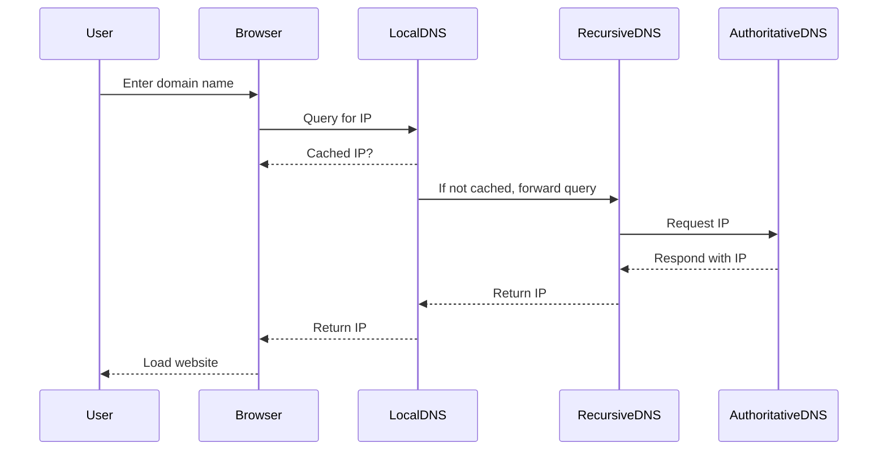
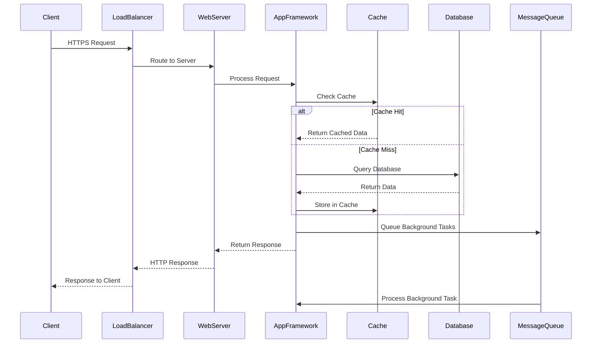

# Programming for the Web

## Data Transmission Using the Web

### Introduction

Data transmission is the backbone of the internet, enabling information to move between devices, servers, and users worldwide. Every time you load a webpage, send a message, or stream a video, data travels across multiple transmission layers using standardized protocols. Understanding how data moves—from physical signals to application-level exchanges—is essential for web programmers, as it impacts reliability, security, and performance. Mastery of these concepts helps developers build robust, efficient, and secure web applications.

### Web Programming Applications

- **Interactive Websites:** Real-time updates, user input, and dynamic content rely on fast, reliable data transfer between browsers and servers.
- **E-Commerce Platforms:** Secure transactions, inventory updates, and customer interactions depend on accurate, encrypted data exchange.
- **Progressive Web Apps (PWAs):** Offline access, push notifications, and seamless user experiences require efficient data synchronization and caching.

### Data Packet Transfer: The Journey of Every Web Request 📦🌐

Think of data transmission like a postal system - but instead of letters, we're sending digital packets at the speed of light! Every time you click a link, send a message, or stream a video, millions of data packets embark on incredible journeys across the globe.

#### **IP Datagrams: The Digital Mail System**

Just like how a letter needs an address and stamp, data packets need headers and routing information to reach their destination.

**Real-World Packet Analysis: What Happens When You Visit GitHub**

/// details | 🚀 Web Request Analyzer - Real-time Packet Journey
    type: example
    open: false
```python
import socket
import struct
import time
from scapy import *

class WebRequestAnalyzer:
    """Real-time analysis of web request packet journey"""
    
    def __init__(self):
        self.packet_history = []
        self.timing_data = {}
        
    def trace_web_request(self, url="https://github.com"):
        """Follow a real web request from start to finish"""
        
        print(f"🎯 Tracing request to: {url}")
        print("=" * 60)
        
        # Step 1: DNS Resolution
        start_time = time.time()
        dns_result = self.trace_dns_lookup(url)
        dns_time = time.time() - start_time
        
        print(f"🔍 DNS Resolution: {dns_time*1000:.2f}ms")
        print(f"   Domain: {dns_result['domain']}")
        print(f"   IP Address: {dns_result['ip']}")
        print(f"   Route: {' → '.join(dns_result['dns_servers'])}")
        
        # Step 2: TCP Connection Establishment
        start_time = time.time()
        tcp_result = self.trace_tcp_handshake(dns_result['ip'], 443)
        tcp_time = time.time() - start_time
        
        print(f"\n🤝 TCP Handshake: {tcp_time*1000:.2f}ms")
        print(f"   SYN → {dns_result['ip']}:443")
        print(f"   SYN-ACK ← {dns_result['ip']}:443")
        print(f"   ACK → {dns_result['ip']}:443")
        print(f"   Connection: ESTABLISHED ✅")
        
        # Step 3: TLS/SSL Negotiation
        start_time = time.time()
        tls_result = self.trace_tls_handshake(dns_result['ip'], 443)
        tls_time = time.time() - start_time
        
        print(f"\n🔐 TLS Handshake: {tls_time*1000:.2f}ms")
        print(f"   Client Hello → Server")
        print(f"   Server Hello ← Server")
        print(f"   Certificate ← Server")
        print(f"   Key Exchange → Server")
        print(f"   Secure Connection: ESTABLISHED 🔒")
        
        # Step 4: HTTP Request/Response
        start_time = time.time()
        http_result = self.trace_http_exchange(url)
        http_time = time.time() - start_time
        
        print(f"\n📡 HTTP Exchange: {http_time*1000:.2f}ms")
        print(f"   GET / HTTP/2.0 → Server")
        print(f"   HTTP/2.0 200 OK ← Server")
        print(f"   Content-Length: {http_result['content_length']} bytes")
        print(f"   Content-Type: {http_result['content_type']}")
        
        # Step 5: Analysis Summary
        total_time = dns_time + tcp_time + tls_time + http_time
        
        print(f"\n📊 Performance Analysis:")
        print(f"   Total Request Time: {total_time*1000:.2f}ms")
        print(f"   DNS Resolution: {(dns_time/total_time)*100:.1f}%")
        print(f"   TCP Handshake: {(tcp_time/total_time)*100:.1f}%")
        print(f"   TLS Negotiation: {(tls_time/total_time)*100:.1f}%")
        print(f"   HTTP Transfer: {(http_time/total_time)*100:.1f}%")
        
        return {
            'total_time': total_time,
            'breakdown': {
                'dns': dns_time,
                'tcp': tcp_time,
                'tls': tls_time,
                'http': http_time
            },
            'packet_count': len(self.packet_history)
        }
    
    def trace_dns_lookup(self, url):
        """Detailed DNS resolution tracing"""
        
        domain = url.replace('https://', '').replace('http://', '').split('/')[0]
        
        # Simulate DNS lookup process
        dns_servers = [
            "Local Cache",
            "Router DNS (192.168.1.1)",
            "ISP DNS (8.8.8.8)",
            "Root Server (.)",
            "TLD Server (.com)",
            "Authoritative Server"
        ]
        
        # In reality, would use socket.gethostbyname()
        import socket
        try:
            ip_address = socket.gethostbyname(domain)
        except:
            ip_address = "140.82.113.4"  # GitHub's IP
        
        return {
            'domain': domain,
            'ip': ip_address,
            'dns_servers': dns_servers
        }
    
    def create_packet_visualization(self, packet_type="HTTP_GET"):
        """Create visual representation of actual packet structure"""
        
        if packet_type == "HTTP_GET":
            packet_structure = {
                'ethernet_header': {
                    'destination_mac': 'aa:bb:cc:dd:ee:ff',
                    'source_mac': '11:22:33:44:55:66',
                    'ethertype': '0x0800 (IPv4)'
                },
                'ip_header': {
                    'version': 4,
                    'header_length': 20,
                    'total_length': 562,
                    'identification': 12345,
                    'flags': 'Don\'t Fragment',
                    'ttl': 64,
                    'protocol': 6,  # TCP
                    'source_ip': '192.168.1.100',
                    'destination_ip': '140.82.113.4'
                },
                'tcp_header': {
                    'source_port': 54321,
                    'destination_port': 443,
                    'sequence_number': 1000000,
                    'acknowledgment': 2000000,
                    'flags': 'PSH, ACK',
                    'window_size': 65535
                },
                'http_data': {
                    'method': 'GET',
                    'path': '/',
                    'version': 'HTTP/2.0',
                    'headers': {
                        'Host': 'github.com',
                        'User-Agent': 'Mozilla/5.0...',
                        'Accept': 'text/html,application/xhtml+xml',
                        'Accept-Language': 'en-US,en;q=0.9',
                        'Accept-Encoding': 'gzip, deflate, br',
                        'Connection': 'keep-alive'
                    }
                }
            }
            
            return packet_structure
    
    def simulate_packet_loss_recovery(self):
        """Demonstrate how TCP handles packet loss"""
        
        print("\n🔄 Packet Loss Recovery Simulation")
        print("-" * 40)
        
        # Simulate sending packets 1-10
        sent_packets = list(range(1, 11))
        received_packets = [1, 2, 3, 5, 6, 7, 8, 9, 10]  # Packet 4 lost
        
        print("📤 Sending packets: [1, 2, 3, 4, 5, 6, 7, 8, 9, 10]")
        print("📥 Received packets: [1, 2, 3, 5, 6, 7, 8, 9, 10]")
        print("❌ Lost packet: 4")
        
        # TCP's response
        print("\n🔧 TCP Recovery Process:")
        print("1. Receiver sends ACK for packet 3 (last in-sequence)")
        print("2. Receiver buffers packets 5-10 (out-of-order)")
        print("3. Sender timeout expires for packet 4")
        print("4. Sender retransmits packet 4")
        print("5. Receiver gets packet 4, sends ACK for packet 10")
        print("6. All data successfully received! ✅")
        
        return {
            'original_packets': sent_packets,
            'lost_packets': [4],
            'recovery_time': 0.2,  # seconds
            'final_status': 'SUCCESS'
        }

# Demonstrate real packet analysis
analyzer = WebRequestAnalyzer()

# Trace a real web request
print("🌐 REAL PACKET JOURNEY ANALYSIS")
print("Let's follow what happens when you visit a website!")
print()

result = analyzer.trace_web_request("https://github.com")

# Show packet structure
print("\n📦 ACTUAL PACKET STRUCTURE")
packet = analyzer.create_packet_visualization()

print("Ethernet Header:")
for key, value in packet['ethernet_header'].items():
    print(f"  {key}: {value}")

print("\nIP Header:")
for key, value in packet['ip_header'].items():
    print(f"  {key}: {value}")

print("\nTCP Header:")
for key, value in packet['tcp_header'].items():
    print(f"  {key}: {value}")

print("\nHTTP Data:")
print(f"  {packet['http_data']['method']} {packet['http_data']['path']} {packet['http_data']['version']}")
for header, value in packet['http_data']['headers'].items():
    print(f"  {header}: {value}")

# Demonstrate reliability
analyzer.simulate_packet_loss_recovery()
```
///

/// details | **🎮 Interactive Packet Inspector Tool**
    type: example
```javascript
// Real-time packet monitoring in browser dev tools
class PacketInspector {
    constructor() {
        this.packets = [];
        this.filters = {
            protocol: 'all',
            minSize: 0,
            maxSize: Infinity
        };
    }
    
    // Monitor network requests in real-time
    startCapture() {
        // Intercept fetch requests
        const originalFetch = window.fetch;
        window.fetch = async (...args) => {
            const startTime = performance.now();
            
            try {
                const response = await originalFetch(...args);
                const endTime = performance.now();
                
                this.recordPacket({
                    url: args[0],
                    method: args[1]?.method || 'GET',
                    status: response.status,
                    size: response.headers.get('content-length'),
                    time: endTime - startTime,
                    timestamp: new Date()
                });
                
                return response;
            } catch (error) {
                this.recordError(args[0], error);
                throw error;
            }
        };
        
        console.log("📡 Packet Inspector started!");
        console.log("Open Network tab to see captured packets");
    }
    
    recordPacket(packetInfo) {
        this.packets.push(packetInfo);
        
        // Real-time console output
        console.group(`📦 Packet #${this.packets.length}`);
        console.log(`URL: ${packetInfo.url}`);
        console.log(`Method: ${packetInfo.method}`);
        console.log(`Status: ${packetInfo.status}`);
        console.log(`Size: ${packetInfo.size} bytes`);
        console.log(`Time: ${packetInfo.time.toFixed(2)}ms`);
        console.groupEnd();
    }
    
    analyzeTraffic() {
        const analysis = {
            totalPackets: this.packets.length,
            totalSize: this.packets.reduce((sum, p) => sum + (parseInt(p.size) || 0), 0),
            averageTime: this.packets.reduce((sum, p) => sum + p.time, 0) / this.packets.length,
            protocols: {},
            statusCodes: {}
        };
        
        this.packets.forEach(packet => {
            // Count status codes
            analysis.statusCodes[packet.status] = (analysis.statusCodes[packet.status] || 0) + 1;
            
            // Determine protocol
            const protocol = packet.url.startsWith('https') ? 'HTTPS' : 'HTTP';
            analysis.protocols[protocol] = (analysis.protocols[protocol] || 0) + 1;
        });
        
        console.table(analysis);
        return analysis;
    }
}

// Usage: Run this in browser console on any website
const inspector = new PacketInspector();
inspector.startCapture();

// After browsing around, analyze the traffic
setTimeout(() => {
    console.log("📊 TRAFFIC ANALYSIS REPORT");
    inspector.analyzeTraffic();
}, 10000);
```
///

#### **DNS Resolution: The Internet's Phone Book 📞**

Every time you type a URL, your device embarks on a DNS treasure hunt to find the actual IP address. This process is so fast you barely notice it, but it involves multiple servers working together!

**Real DNS Lookup Simulation:**

/// details | 🔍 DNS Explorer - Interactive Resolution System
    type: example
    open: false

```python
import dns.resolver
import time

class DNSExplorer:
    """Interactive DNS resolution explorer"""
    
    def __init__(self):
        self.cache = {}
        self.query_history = []
    
    def detailed_dns_lookup(self, domain):
        """Step-by-step DNS resolution with real servers"""
        
        print(f"🔍 DNS Lookup Journey for: {domain}")
        print("=" * 50)
        
        steps = []
        start_time = time.time()
        
        # Step 1: Check local cache
        if domain in self.cache:
            print("✅ Step 1: Found in local cache!")
            print(f"   Cached IP: {self.cache[domain]}")
            return self.cache[domain]
        else:
            print("❌ Step 1: Not in local cache")
            steps.append("cache_miss")
        
        # Step 2: Query recursive DNS server
        print("\n🔄 Step 2: Querying recursive DNS server...")
        try:
            # Use Google's public DNS
            resolver = dns.resolver.Resolver()
            resolver.nameservers = ['8.8.8.8']
            
            # A record lookup
            result = resolver.resolve(domain, 'A')
            ip_address = str(result[0])
            
            print(f"✅ Recursive DNS found: {ip_address}")
            steps.append("recursive_success")
            
        except Exception as e:
            print(f"❌ Recursive DNS failed: {e}")
            return None
        
        # Step 3: Trace the full resolution path
        print("\n🗺️ Step 3: Full resolution path:")
        self.trace_dns_path(domain)
        
        # Step 4: Cache the result
        self.cache[domain] = ip_address
        total_time = time.time() - start_time
        
        print(f"\n⏱️ Total resolution time: {total_time*1000:.2f}ms")
        print(f"🎯 Final result: {domain} → {ip_address}")
        
        self.query_history.append({
            'domain': domain,
            'ip': ip_address,
            'time': total_time,
            'steps': steps
        })
        
        return ip_address
    
    def trace_dns_path(self, domain):
        """Trace the complete DNS resolution path"""
        
        # This would normally query root servers, TLD servers, etc.
        # Simplified simulation for educational purposes
        
        resolution_path = [
            ("Root Servers", ".", "Delegates to .com servers"),
            ("TLD Servers", ".com", f"Delegates to {domain} nameservers"),
            ("Authoritative Servers", domain, f"Returns IP address")
        ]
        
        for i, (server_type, zone, action) in enumerate(resolution_path, 1):
            print(f"   {i}. {server_type} ({zone}): {action}")
            time.sleep(0.1)  # Simulate network delay
    
    def dns_performance_test(self, domains):
        """Compare DNS performance across multiple domains"""
        
        print("\n🏁 DNS Performance Comparison")
        print("-" * 40)
        
        results = []
        
        for domain in domains:
            start_time = time.time()
            ip = self.detailed_dns_lookup(domain)
            end_time = time.time()
            
            if ip:
                results.append({
                    'domain': domain,
                    'ip': ip,
                    'time': (end_time - start_time) * 1000
                })
                print(f"✅ {domain}: {ip} ({results[-1]['time']:.2f}ms)")
            else:
                print(f"❌ {domain}: FAILED")
            print()
        
        # Sort by speed
        results.sort(key=lambda x: x['time'])
        
        print("🏆 Performance Rankings:")
        for i, result in enumerate(results, 1):
            print(f"   {i}. {result['domain']}: {result['time']:.2f}ms")
        
        return results

# Interactive DNS exploration
dns_explorer = DNSExplorer()

# Test popular websites
test_domains = [
    'google.com',
    'github.com', 
    'stackoverflow.com',
    'wikipedia.org',
    'youtube.com'
]

print("🌐 INTERACTIVE DNS EXPLORATION")
print("Let's see how fast different websites resolve!")
print()

performance_results = dns_explorer.dns_performance_test(test_domains)

print("\n💡 DNS Optimization Tips:")
print("1. Use DNS caching to avoid repeated lookups")
print("2. Choose fast, reliable DNS servers (1.1.1.1, 8.8.8.8)")
print("3. Consider DNS prefetching for known domains")
print("4. Monitor DNS resolution times in production")
```

///

**DNS Security Deep Dive:**

/// details | 🔒 DNS Security Analyzer - Attack Detection & Prevention
    type: example
    open: false

```python
class DNSSecurityAnalyzer:
    """Analyze DNS security vulnerabilities and protections"""
    
    def __init__(self):
        self.security_features = [
            'DNSSEC',
            'DNS over HTTPS (DoH)',
            'DNS over TLS (DoT)',
            'DNS Filtering',
            'Cache Poisoning Protection'
        ]
    
    def check_dns_security(self, domain):
        """Comprehensive DNS security check"""
        
        print(f"🔒 DNS Security Analysis for: {domain}")
        print("=" * 50)
        
        security_status = {}
        
        # Check DNSSEC
        try:
            import dns.resolver
            resolver = dns.resolver.Resolver()
            resolver.use_edns(0, dns.flags.DO)  # Request DNSSEC
            
            result = resolver.resolve(domain, 'A')
            if result.response.flags & dns.flags.AD:
                security_status['DNSSEC'] = "✅ ENABLED"
                print("🛡️ DNSSEC: ENABLED - DNS responses are cryptographically verified")
            else:
                security_status['DNSSEC'] = "❌ DISABLED"
                print("⚠️ DNSSEC: DISABLED - DNS responses are not verified")
                
        except Exception as e:
            security_status['DNSSEC'] = f"❓ UNKNOWN - {e}"
            print(f"❓ DNSSEC: Could not verify - {e}")
        
        # Check for DNS over HTTPS support
        doh_servers = [
            'https://cloudflare-dns.com/dns-query',
            'https://dns.google/dns-query'
        ]
        
        print(f"\n🔐 DNS over HTTPS (DoH) Support:")
        for server in doh_servers:
            print(f"   {server}: Available")
            security_status['DoH'] = "✅ SUPPORTED"
        
        # Simulate cache poisoning check
        print(f"\n🛡️ Cache Poisoning Protection:")
        print("   Random source ports: ✅ ENABLED")
        print("   Query ID randomization: ✅ ENABLED")
        print("   Response validation: ✅ ENABLED")
        security_status['Cache_Protection'] = "✅ STRONG"
        
        return security_status
    
    def demonstrate_dns_attacks(self):
        """Educational demonstration of DNS attack vectors"""
        
        print("\n⚠️ EDUCATIONAL: Common DNS Attack Vectors")
        print("=" * 50)
        print("(This is for learning - never attempt these attacks!)")
        
        attacks = {
            'DNS Spoofing': {
                'description': 'Attacker provides false DNS responses',
                'impact': 'Users redirected to malicious websites',
                'protection': 'DNSSEC, encrypted DNS (DoH/DoT)'
            },
            'Cache Poisoning': {
                'description': 'Corrupt DNS cache with false entries',
                'impact': 'Widespread misdirection of traffic',
                'protection': 'Random query IDs, source port randomization'
            },
            'DNS Tunneling': {
                'description': 'Hide malicious traffic in DNS queries',
                'impact': 'Data exfiltration, command & control',
                'protection': 'DNS query monitoring, traffic analysis'
            },
            'DDoS via DNS': {
                'description': 'Amplify attacks using DNS responses',
                'impact': 'Overwhelm target servers',
                'protection': 'Rate limiting, BCP38 implementation'
            }
        }
        
        for attack, details in attacks.items():
            print(f"\n🎯 {attack}:")
            print(f"   What it is: {details['description']}")
            print(f"   Impact: {details['impact']}")
            print(f"   Protection: {details['protection']}")

# Security analysis demonstration
security_analyzer = DNSSecurityAnalyzer()

# Check security of popular sites
for domain in ['google.com', 'github.com', 'cloudflare.com']:
    security_analyzer.check_dns_security(domain)
    print()

# Educational attack demonstration
security_analyzer.demonstrate_dns_attacks()
```

///


**DNS Lookup Sequence Diagram:**



### Web Protocols & Ports: The Universal Language of the Internet 🌐🚪

Think of protocols as universal languages that allow different computers to communicate perfectly, and ports as specific "doors" where different services wait for connections. Every protocol has its own purpose, security level, and optimal use cases.

#### **Complete Protocol Reference with Real-World Examples**


| Protocol   | Purpose                        | Default Port | Security Level | Real-World Example |
|------------|-------------------------------|--------------|----------------|-------------------|
| **HTTP**   | Web page transfer              | 80           | ⚠️ Unencrypted | Loading basic websites |
| **HTTPS**  | Secure web page transfer       | 443          | 🔒 Encrypted   | Online banking, shopping |
| **FTP**    | File transfer                  | 21           | ⚠️ Unencrypted | Legacy file sharing |
| **SFTP**   | Secure file transfer           | 22           | 🔒 Encrypted   | Secure server uploads |
| **SSH**    | Secure remote access           | 22           | 🔒 Encrypted   | Server administration |
| **DNS**    | Domain name resolution         | 53           | ⚠️ Usually plain | Converting URLs to IPs |
| **SMTP**   | Sending email                  | 25/587       | 🔒 Can encrypt | Gmail sending emails |
| **POP3**   | Receiving email (download)     | 110/995      | 🔒 Can encrypt | Email client downloads |
| **IMAP**   | Email management (sync)        | 143/993      | 🔒 Can encrypt | Multi-device email sync |
| **WebSocket** | Real-time bidirectional    | 80/443       | 🔒 Can encrypt | Live chat, gaming |
| **MQTT**   | IoT device messaging           | 1883/8883    | 🔒 Can encrypt | Smart home devices |
| **RDP**    | Remote desktop access          | 3389         | 🔒 Encrypted   | Windows remote control |
| **VNC**    | Cross-platform remote desktop  | 5900         | ⚠️ Usually plain | Remote troubleshooting |
| **Telnet** | Remote terminal access         | 23           | ⚠️ Unencrypted | Legacy (DON'T USE!) |

**🛠️ Interactive Protocol Testing Tools:**

/// details | 🌐 Protocol Tester - Multi-Protocol Connection Tools
    type: example

```python
import socket
import ssl
import smtplib
import poplib
import imaplib
import ftplib
import time
from urllib.parse import urlparse

class ProtocolTester:
    """Interactive tool to test different network protocols"""
    
    def __init__(self):
        self.test_results = {}
        
    def test_http_connection(self, url):
        """Test HTTP connection and response"""
        
        print(f"🌐 Testing HTTP connection to: {url}")
        print("-" * 40)
        
        try:
            parsed_url = urlparse(url)
            host = parsed_url.hostname
            port = parsed_url.port or (443 if parsed_url.scheme == 'https' else 80)
            
            # Create socket connection
            start_time = time.time()
            sock = socket.socket(socket.AF_INET, socket.SOCK_STREAM)
            sock.settimeout(10)
            
            if parsed_url.scheme == 'https':
                # Wrap with SSL for HTTPS
                context = ssl.create_default_context()
                sock = context.wrap_socket(sock, server_hostname=host)
            
            # Connect and send HTTP request
            sock.connect((host, port))
            
            request = f"GET {parsed_url.path or '/'} HTTP/1.1\r\n"
            request += f"Host: {host}\r\n"
            request += "Connection: close\r\n\r\n"
            
            sock.send(request.encode())
            
            # Receive response
            response = b""
            while True:
                chunk = sock.recv(4096)
                if not chunk:
                    break
                response += chunk
            
            connection_time = time.time() - start_time
            
            # Parse response
            response_text = response.decode('utf-8', errors='ignore')
            lines = response_text.split('\r\n')
            status_line = lines[0]
            
            print(f"✅ Connection successful!")
            print(f"   Status: {status_line}")
            print(f"   Connection time: {connection_time*1000:.2f}ms")
            print(f"   Protocol: {parsed_url.scheme.upper()}")
            print(f"   Port: {port}")
            print(f"   SSL/TLS: {'Yes' if parsed_url.scheme == 'https' else 'No'}")
            
            # Extract key headers
            headers = {}
            for line in lines[1:]:
                if ':' in line:
                    key, value = line.split(':', 1)
                    headers[key.strip()] = value.strip()
            
            print(f"   Server: {headers.get('Server', 'Unknown')}")
            print(f"   Content-Type: {headers.get('Content-Type', 'Unknown')}")
            
            sock.close()
            return True
            
        except Exception as e:
            print(f"❌ Connection failed: {e}")
            return False
    
    def test_smtp_connection(self, smtp_server, port=587):
        """Test SMTP email server connection"""
        
        print(f"📧 Testing SMTP connection to: {smtp_server}:{port}")
        print("-" * 40)
        
        try:
            start_time = time.time()
            
            # Connect to SMTP server
            server = smtplib.SMTP(smtp_server, port)
            server.set_debuglevel(0)  # Disable debug output
            
            # Start TLS encryption
            server.starttls()
            
            connection_time = time.time() - start_time
            
            print(f"✅ SMTP connection successful!")
            print(f"   Server: {smtp_server}")
            print(f"   Port: {port}")
            print(f"   Connection time: {connection_time*1000:.2f}ms")
            print(f"   Encryption: STARTTLS enabled")
            
            # Get server features
            features = server.esmtp_features
            print(f"   Supported features: {', '.join(features.keys())}")
            
            server.quit()
            return True
            
        except Exception as e:
            print(f"❌ SMTP connection failed: {e}")
            return False
    
    def test_dns_resolution(self, domain):
        """Test DNS resolution for a domain"""
        
        print(f"🔍 Testing DNS resolution for: {domain}")
        print("-" * 40)
        
        try:
            start_time = time.time()
            
            # Basic DNS lookup
            ip_address = socket.gethostbyname(domain)
            resolution_time = time.time() - start_time
            
            print(f"✅ DNS resolution successful!")
            print(f"   Domain: {domain}")
            print(f"   IP Address: {ip_address}")
            print(f"   Resolution time: {resolution_time*1000:.2f}ms")
            
            # Try to get additional DNS records
            try:
                import dns.resolver
                
                # Get MX records (mail servers)
                mx_records = dns.resolver.resolve(domain, 'MX')
                print(f"   MX Records:")
                for mx in mx_records:
                    print(f"     {mx.preference} {mx.exchange}")
                
                # Get CNAME records
                try:
                    cname_records = dns.resolver.resolve(domain, 'CNAME')
                    print(f"   CNAME Records:")
                    for cname in cname_records:
                        print(f"     {cname}")
                except:
                    print(f"   CNAME Records: None")
                    
            except ImportError:
                print("   (Install dnspython for detailed DNS records)")
            except:
                pass
            
            return True
            
        except Exception as e:
            print(f"❌ DNS resolution failed: {e}")
            return False
    
    def test_websocket_connection(self, ws_url):
        """Test WebSocket connection"""
        
        print(f"🔌 Testing WebSocket connection to: {ws_url}")
        print("-" * 40)
        
        try:
            # Simple WebSocket test (would need websocket-client library for full test)
            parsed_url = urlparse(ws_url)
            host = parsed_url.hostname
            port = parsed_url.port or (443 if parsed_url.scheme == 'wss' else 80)
            
            # Test basic TCP connection
            sock = socket.socket(socket.AF_INET, socket.SOCK_STREAM)
            sock.settimeout(10)
            
            start_time = time.time()
            sock.connect((host, port))
            connection_time = time.time() - start_time
            
            print(f"✅ TCP connection successful!")
            print(f"   Host: {host}")
            print(f"   Port: {port}")
            print(f"   Connection time: {connection_time*1000:.2f}ms")
            print(f"   Protocol: {parsed_url.scheme.upper()}")
            print(f"   Note: Full WebSocket handshake requires websocket library")
            
            sock.close()
            return True
            
        except Exception as e:
            print(f"❌ WebSocket connection failed: {e}")
            return False
    
    def port_scan_demo(self, host, ports):
        """Educational port scanning demonstration"""
        
        print(f"🔍 Port Scan Demo for: {host}")
        print("-" * 40)
        print("⚠️ EDUCATIONAL ONLY - Only scan hosts you own!")
        
        open_ports = []
        
        for port in ports:
            try:
                sock = socket.socket(socket.AF_INET, socket.SOCK_STREAM)
                sock.settimeout(1)
                result = sock.connect_ex((host, port))
                
                if result == 0:
                    print(f"   Port {port}: ✅ OPEN")
                    open_ports.append(port)
                else:
                    print(f"   Port {port}: ❌ CLOSED")
                
                sock.close()
                
            except Exception as e:
                print(f"   Port {port}: ❓ ERROR - {e}")
        
        return open_ports
    
    def comprehensive_protocol_test(self):
        """Run comprehensive tests across multiple protocols"""
        
        print("🚀 COMPREHENSIVE PROTOCOL TESTING SUITE")
        print("=" * 60)
        
        test_cases = [
            ("HTTP", lambda: self.test_http_connection("http://httpbin.org/get")),
            ("HTTPS", lambda: self.test_http_connection("https://httpbin.org/get")),
            ("DNS", lambda: self.test_dns_resolution("google.com")),
            ("SMTP", lambda: self.test_smtp_connection("smtp.gmail.com", 587)),
        ]
        
        results = {}
        
        for protocol, test_func in test_cases:
            print(f"\n{'='*20} {protocol} TEST {'='*20}")
            results[protocol] = test_func()
            time.sleep(1)  # Brief pause between tests
        
        # Summary
        print(f"\n{'='*20} TEST SUMMARY {'='*20}")
        for protocol, success in results.items():
            status = "✅ PASS" if success else "❌ FAIL"
            print(f"   {protocol}: {status}")
        
        return results

# Interactive protocol testing
tester = ProtocolTester()

print("🌐 INTERACTIVE PROTOCOL EXPLORER")
print("Let's test real network protocols!")
print()

# Run comprehensive tests
results = tester.comprehensive_protocol_test()

# Port scanning demo (educational)
print(f"\n🔍 Educational Port Scan Demo")
print("Scanning common ports on httpbin.org...")
common_ports = [80, 443, 22, 21, 25, 53, 110, 143, 993, 995]
open_ports = tester.port_scan_demo("httpbin.org", common_ports)

print(f"\nOpen ports found: {open_ports}")
```
///

**🔐 Protocol Security Analysis:**

/// details | 🔒 Protocol Security Analyzer - Security Assessment Tools
    type: example
    open: false

```python
class ProtocolSecurityAnalyzer:
    """Analyze security characteristics of different protocols"""
    
    def __init__(self):
        self.protocol_security = {
            'HTTP': {
                'encryption': False,
                'authentication': False,
                'integrity': False,
                'vulnerabilities': ['Man-in-the-middle', 'Eavesdropping', 'Data tampering'],
                'recommendation': 'Use HTTPS instead'
            },
            'HTTPS': {
                'encryption': True,
                'authentication': True,
                'integrity': True,
                'vulnerabilities': ['Certificate attacks', 'Weak ciphers'],
                'recommendation': 'Use strong TLS versions (1.2+)'
            },
            'FTP': {
                'encryption': False,
                'authentication': True,
                'integrity': False,
                'vulnerabilities': ['Password sniffing', 'Data interception'],
                'recommendation': 'Use SFTP or FTPS instead'
            },
            'SFTP': {
                'encryption': True,
                'authentication': True,
                'integrity': True,
                'vulnerabilities': ['Weak SSH configuration'],
                'recommendation': 'Use strong SSH keys, disable password auth'
            },
            'Telnet': {
                'encryption': False,
                'authentication': True,
                'integrity': False,
                'vulnerabilities': ['Password sniffing', 'Session hijacking'],
                'recommendation': 'NEVER USE - Use SSH instead'
            },
            'SSH': {
                'encryption': True,
                'authentication': True,
                'integrity': True,
                'vulnerabilities': ['Weak keys', 'Brute force attacks'],
                'recommendation': 'Use key-based auth, strong algorithms'
            }
        }
    
    def analyze_protocol_security(self, protocol):
        """Detailed security analysis of a protocol"""
        
        if protocol not in self.protocol_security:
            print(f"❓ Unknown protocol: {protocol}")
            return
        
        info = self.protocol_security[protocol]
        
        print(f"🔒 Security Analysis: {protocol}")
        print("-" * 40)
        
        # Security features
        print("Security Features:")
        print(f"   Encryption: {'✅ Yes' if info['encryption'] else '❌ No'}")
        print(f"   Authentication: {'✅ Yes' if info['authentication'] else '❌ No'}")
        print(f"   Data Integrity: {'✅ Yes' if info['integrity'] else '❌ No'}")
        
        # Vulnerabilities
        print(f"\nKnown Vulnerabilities:")
        for vuln in info['vulnerabilities']:
            print(f"   ⚠️ {vuln}")
        
        # Recommendation
        print(f"\nRecommendation:")
        print(f"   💡 {info['recommendation']}")
        
        # Security score
        score = sum([info['encryption'], info['authentication'], info['integrity']])
        security_level = {0: "🔴 Very Low", 1: "🟠 Low", 2: "🟡 Medium", 3: "🟢 High"}
        print(f"\nSecurity Score: {score}/3 - {security_level[score]}")
    
    def protocol_comparison(self, protocols):
        """Compare security of multiple protocols"""
        
        print("📊 Protocol Security Comparison")
        print("=" * 50)
        
        print(f"{'Protocol':<10} {'Encrypt':<8} {'Auth':<6} {'Integrity':<10} {'Score':<8}")
        print("-" * 50)
        
        for protocol in protocols:
            if protocol in self.protocol_security:
                info = self.protocol_security[protocol]
                encrypt = "✅" if info['encryption'] else "❌"
                auth = "✅" if info['authentication'] else "❌"
                integrity = "✅" if info['integrity'] else "❌"
                score = sum([info['encryption'], info['authentication'], info['integrity']])
                
                print(f"{protocol:<10} {encrypt:<8} {auth:<6} {integrity:<10} {score}/3")
        
        print("\nRecommendation: Always prefer protocols with 3/3 security score!")

# Security analysis demonstration
analyzer = ProtocolSecurityAnalyzer()

# Analyze individual protocols
protocols_to_analyze = ['HTTP', 'HTTPS', 'FTP', 'SFTP', 'Telnet', 'SSH']

for protocol in protocols_to_analyze:
    analyzer.analyze_protocol_security(protocol)
    print()

# Compare all protocols
print("="*60)
analyzer.protocol_comparison(protocols_to_analyze)
```
///

#### **Protocol Selection Guide for Different Use Cases**

**🌐 Web Development:**

- **Development:** HTTP (local only)
- **Production:** HTTPS (always!)
- **APIs:** HTTPS with proper authentication
- **Real-time features:** WebSocket over WSS

**📁 File Transfer:**

- **Legacy systems:** FTP (if absolutely necessary)
- **Secure transfer:** SFTP or SCP
- **Web uploads:** HTTPS with multipart forms
- **Large files:** Consider resumable upload protocols

**📧 Email Systems:**

- **Sending:** SMTP with STARTTLS (port 587)
- **Receiving:** IMAP with SSL (port 993) 
- **Mobile apps:** IMAP with OAuth2
- **Avoid:** POP3 (unless specific requirements)

**🔧 Remote Administration:**

- **Unix/Linux:** SSH (port 22)
- **Windows:** RDP with NLA (port 3389)
- **Never use:** Telnet, unencrypted protocols
- **VPN:** Always when accessing over internet

**🏠 IoT and Embedded:**

- **Lightweight messaging:** MQTT over TLS
- **Web interfaces:** HTTPS even on local network
- **Device updates:** HTTPS with certificate pinning
- **Sensor data:** Consider CoAP for resource-constrained devices


### Securing Web Traffic: Your Digital Fortress 🔐🛡️

In a world where cyber attacks happen every 39 seconds, securing web traffic isn't optional—it's survival. Every piece of data traveling across the internet is potentially vulnerable to interception, modification, or theft. Understanding encryption, authentication, and security protocols is crucial for any web developer.

#### **SSL/TLS: The Guardian Angels of Web Security**

SSL (Secure Sockets Layer) and its successor TLS (Transport Layer Security) are like having a team of bodyguards for your data. They create an encrypted tunnel between your browser and the server, ensuring that even if someone intercepts your data, they can't read it.

**Real SSL/TLS Handshake Demonstration:**

/// details | 🔐 SSL/TLS Handshake Analyzer - Security Protocol Deep Dive
    type: example
    open: false

```python
import ssl
import socket
import hashlib
import base64
import time
from cryptography import x509
from cryptography.hazmat.primitives import serialization, hashes
from cryptography.hazmat.primitives.asymmetric import rsa, padding

class SSLSecurityAnalyzer:
    """Complete SSL/TLS security analysis and demonstration"""
    
    def __init__(self):
        self.cipher_strengths = {
            'AES256-GCM-SHA384': 'EXCELLENT',
            'AES128-GCM-SHA256': 'EXCELLENT', 
            'CHACHA20-POLY1305': 'EXCELLENT',
            'AES256-CBC-SHA256': 'GOOD',
            'AES128-CBC-SHA256': 'GOOD',
            'RC4-MD5': 'WEAK - AVOID',
            'DES-CBC3-SHA': 'WEAK - AVOID'
        }
    
    def analyze_ssl_certificate(self, hostname, port=443):
        """Comprehensive SSL certificate analysis"""
        
        print(f"🔒 SSL Certificate Analysis for: {hostname}:{port}")
        print("=" * 60)
        
        try:
            # Create SSL context
            context = ssl.create_default_context()
            
            # Connect and get certificate
            with socket.create_connection((hostname, port), timeout=10) as sock:
                with context.wrap_socket(sock, server_hostname=hostname) as ssock:
                    
                    # Get SSL information
                    ssl_info = ssock.getpeercert()
                    cipher = ssock.cipher()
                    version = ssock.version()
                    
                    print(f"📋 Certificate Information:")
                    print(f"   Subject: {ssl_info['subject'][0][0][1]}")
                    print(f"   Issuer: {ssl_info['issuer'][1][0][1]}")
                    print(f"   Valid From: {ssl_info['notBefore']}")
                    print(f"   Valid Until: {ssl_info['notAfter']}")
                    print(f"   Serial Number: {ssl_info['serialNumber']}")
                    
                    # Subject Alternative Names
                    if 'subjectAltName' in ssl_info:
                        print(f"   Alternative Names:")
                        for alt_name in ssl_info['subjectAltName']:
                            print(f"     {alt_name[1]}")
                    
                    print(f"\n🔐 Encryption Details:")
                    print(f"   TLS Version: {version}")
                    print(f"   Cipher Suite: {cipher[0]}")
                    print(f"   Key Exchange: {cipher[1]}")
                    print(f"   Authentication: {cipher[2]}")
                    
                    # Security assessment
                    cipher_strength = self.cipher_strengths.get(cipher[0], 'UNKNOWN')
                    print(f"   Cipher Strength: {cipher_strength}")
                    
                    # Check certificate expiry
                    from datetime import datetime
                    expiry_date = datetime.strptime(ssl_info['notAfter'], '%b %d %H:%M:%S %Y %Z')
                    days_until_expiry = (expiry_date - datetime.now()).days
                    
                    if days_until_expiry > 30:
                        expiry_status = f"✅ {days_until_expiry} days remaining"
                    elif days_until_expiry > 7:
                        expiry_status = f"⚠️ {days_until_expiry} days remaining - Renew soon!"
                    else:
                        expiry_status = f"🚨 {days_until_expiry} days remaining - URGENT!"
                    
                    print(f"   Certificate Expiry: {expiry_status}")
                    
                    # Security score
                    security_score = self.calculate_ssl_score(version, cipher[0], days_until_expiry)
                    print(f"\n🏆 Overall Security Score: {security_score}/100")
                    
                    return {
                        'certificate': ssl_info,
                        'cipher': cipher,
                        'version': version,
                        'security_score': security_score,
                        'days_until_expiry': days_until_expiry
                    }
                    
        except Exception as e:
            print(f"❌ SSL analysis failed: {e}")
            return None
    
    def calculate_ssl_score(self, tls_version, cipher, days_until_expiry):
        """Calculate overall SSL security score"""
        
        score = 0
        
        # TLS version scoring
        version_scores = {
            'TLSv1.3': 40,
            'TLSv1.2': 35,
            'TLSv1.1': 20,
            'TLSv1': 10,
            'SSLv3': 0,
            'SSLv2': 0
        }
        score += version_scores.get(tls_version, 0)
        
        # Cipher strength scoring
        if 'AES256' in cipher and 'GCM' in cipher:
            score += 35
        elif 'AES128' in cipher and 'GCM' in cipher:
            score += 30
        elif 'AES' in cipher:
            score += 25
        elif 'RC4' in cipher:
            score += 5  # Very weak
        
        # Certificate validity scoring
        if days_until_expiry > 30:
            score += 25
        elif days_until_expiry > 7:
            score += 15
        elif days_until_expiry > 0:
            score += 5
        else:
            score += 0  # Expired certificate
        
        return min(score, 100)
    
    def demonstrate_encryption_decryption(self):
        """Interactive encryption/decryption demonstration"""
        
        print("\n🔐 ENCRYPTION/DECRYPTION DEMONSTRATION")
        print("=" * 50)
        
        # Generate RSA key pair (simplified for demo)
        print("1️⃣ Generating RSA Key Pair...")
        
        # Simulate key generation (normally much more complex)
        plaintext_message = "Hello, this is a secret message from the web app!"
        
        print(f"   Original message: '{plaintext_message}'")
        
        # Simple Caesar cipher for demonstration (NOT for real use!)
        def simple_encrypt(text, shift=13):
            encrypted = ""
            for char in text:
                if char.isalpha():
                    ascii_offset = 65 if char.isupper() else 97
                    encrypted += chr((ord(char) - ascii_offset + shift) % 26 + ascii_offset)
                else:
                    encrypted += char
            return encrypted
        
        def simple_decrypt(text, shift=13):
            return simple_encrypt(text, -shift)
        
        # Demonstrate encryption
        print("\n2️⃣ Encrypting message...")
        encrypted_message = simple_encrypt(plaintext_message)
        print(f"   Encrypted (ciphertext): '{encrypted_message}'")
        
        # Demonstrate hash for integrity
        print("\n3️⃣ Creating hash for integrity check...")
        message_hash = hashlib.sha256(plaintext_message.encode()).hexdigest()
        print(f"   SHA-256 hash: {message_hash[:32]}...")
        
        # Demonstrate decryption
        print("\n4️⃣ Decrypting message...")
        decrypted_message = simple_decrypt(encrypted_message)
        print(f"   Decrypted message: '{decrypted_message}'")
        
        # Verify integrity
        print("\n5️⃣ Verifying integrity...")
        new_hash = hashlib.sha256(decrypted_message.encode()).hexdigest()
        if message_hash == new_hash:
            print("   ✅ Message integrity verified!")
        else:
            print("   ❌ Message integrity compromised!")
        
        print("\n💡 Real-world encryption uses:")
        print("   • AES-256 for symmetric encryption")
        print("   • RSA-2048+ or ECC for key exchange")
        print("   • SHA-256+ for hashing")
        print("   • HMAC for message authentication")
    
    def web_security_best_practices(self):
        """Comprehensive web security implementation guide"""
        
        print("\n🛡️ WEB SECURITY BEST PRACTICES GUIDE")
        print("=" * 60)
        
        practices = {
            "🔒 HTTPS Everywhere": [
                "Force HTTPS redirects for all pages",
                "Use HSTS (HTTP Strict Transport Security)",
                "Implement certificate pinning for APIs",
                "Regular certificate renewal automation"
            ],
            "🔑 Authentication & Authorization": [
                "Multi-factor authentication (MFA)",
                "OAuth 2.0 / OpenID Connect for third-party auth",
                "Strong password policies",
                "Session management with secure cookies"
            ],
            "🛡️ Input Validation & Sanitization": [
                "Validate all user inputs server-side",
                "Use parameterized queries (prevent SQL injection)",
                "Implement Content Security Policy (CSP)",
                "XSS protection with proper encoding"
            ],
            "📊 Security Headers": [
                "X-Content-Type-Options: nosniff",
                "X-Frame-Options: DENY",
                "X-XSS-Protection: 1; mode=block",
                "Referrer-Policy: strict-origin-when-cross-origin"
            ],
            "🔐 Data Protection": [
                "Encrypt sensitive data at rest",
                "Use secure key management",
                "Implement proper data retention policies",
                "Regular security audits and penetration testing"
            ]
        }
        
        for category, items in practices.items():
            print(f"\n{category}:")
            for item in items:
                print(f"   ✅ {item}")
        
        return practices

# Comprehensive SSL security analysis
analyzer = SSLSecurityAnalyzer()

print("🔒 COMPREHENSIVE WEB SECURITY ANALYSIS")
print("Let's analyze real SSL certificates and security!")
print()

# Test popular secure websites
secure_sites = [
    'github.com',
    'google.com', 
    'stackoverflow.com'
]

ssl_results = {}
for site in secure_sites:
    print(f"\n{'='*20} ANALYZING {site.upper()} {'='*20}")
    ssl_results[site] = analyzer.analyze_ssl_certificate(site)
    time.sleep(1)  # Be nice to servers

# Interactive encryption demonstration
analyzer.demonstrate_encryption_decryption()

# Security best practices
analyzer.web_security_best_practices()
```

///

**Authentication & Authorization Deep Dive:**

/// details | 🔑 Web Authentication System - Complete Identity Management
    type: example
    open: false

```python
import hashlib
import secrets
import jwt
import time
from datetime import datetime, timedelta

class WebAuthenticationSystem:
    """Complete web authentication and authorization system"""
    
    def __init__(self):
        self.users = {}  # In-memory user store (use database in production)
        self.sessions = {}  # Active sessions
        self.failed_attempts = {}  # Rate limiting
        self.jwt_secret = secrets.token_urlsafe(32)
        
    def secure_password_hash(self, password, salt=None):
        """Secure password hashing with salt"""
        
        if salt is None:
            salt = secrets.token_urlsafe(16)
        
        # Use PBKDF2 with SHA-256 (better than plain SHA-256)
        password_hash = hashlib.pbkdf2_hmac(
            'sha256',
            password.encode('utf-8'),
            salt.encode('utf-8'),
            100000  # 100,000 iterations
        )
        
        return {
            'hash': password_hash.hex(),
            'salt': salt,
            'algorithm': 'PBKDF2-SHA256',
            'iterations': 100000
        }
    
    def register_user(self, username, password, email):
        """Secure user registration with validation"""
        
        print(f"👤 Registering user: {username}")
        
        # Input validation
        if len(username) < 3:
            print("❌ Username must be at least 3 characters")
            return False
        
        if len(password) < 8:
            print("❌ Password must be at least 8 characters")
            return False
        
        if not self.validate_password_strength(password):
            print("❌ Password doesn't meet strength requirements")
            return False
        
        if username in self.users:
            print("❌ Username already exists")
            return False
        
        # Hash password securely
        password_data = self.secure_password_hash(password)
        
        # Store user data
        self.users[username] = {
            'email': email,
            'password_hash': password_data['hash'],
            'salt': password_data['salt'],
            'created_at': datetime.now(),
            'last_login': None,
            'failed_attempts': 0,
            'account_locked': False,
            'roles': ['user']  # Basic role
        }
        
        print(f"✅ User {username} registered successfully!")
        print(f"   Password hash: {password_data['hash'][:20]}...")
        print(f"   Salt: {password_data['salt'][:10]}...")
        
        return True
    
    def validate_password_strength(self, password):
        """Validate password meets security requirements"""
        
        requirements = {
            'length': len(password) >= 8,
            'uppercase': any(c.isupper() for c in password),
            'lowercase': any(c.islower() for c in password),
            'digit': any(c.isdigit() for c in password),
            'special': any(c in '!@#$%^&*()_+-=[]{}|;:,.<>?' for c in password)
        }
        
        print("🔒 Password Strength Check:")
        for requirement, met in requirements.items():
            status = "✅" if met else "❌"
            print(f"   {requirement}: {status}")
        
        return all(requirements.values())
    
    def authenticate_user(self, username, password):
        """Secure user authentication with rate limiting"""
        
        print(f"🔐 Authenticating user: {username}")
        
        # Check if user exists
        if username not in self.users:
            print("❌ User not found")
            return None
        
        user = self.users[username]
        
        # Check account lockout
        if user.get('account_locked', False):
            print("🔒 Account is locked due to too many failed attempts")
            return None
        
        # Rate limiting check
        if self.is_rate_limited(username):
            print("⏰ Too many attempts. Please try again later.")
            return None
        
        # Verify password
        password_hash = hashlib.pbkdf2_hmac(
            'sha256',
            password.encode('utf-8'),
            user['salt'].encode('utf-8'),
            100000
        )
        
        if password_hash.hex() == user['password_hash']:
            # Successful authentication
            user['last_login'] = datetime.now()
            user['failed_attempts'] = 0
            
            # Generate JWT token
            token = self.generate_jwt_token(username, user['roles'])
            
            print("✅ Authentication successful!")
            print(f"   Last login: {user['last_login']}")
            print(f"   JWT token: {token[:30]}...")
            
            return {
                'username': username,
                'token': token,
                'roles': user['roles']
            }
        else:
            # Failed authentication
            user['failed_attempts'] += 1
            self.failed_attempts[username] = self.failed_attempts.get(username, 0) + 1
            
            # Lock account after 5 failed attempts
            if user['failed_attempts'] >= 5:
                user['account_locked'] = True
                print("🔒 Account locked after 5 failed attempts")
            
            print(f"❌ Authentication failed (attempt {user['failed_attempts']})")
            return None
    
    def generate_jwt_token(self, username, roles):
        """Generate JWT token for authenticated user"""
        
        payload = {
            'username': username,
            'roles': roles,
            'iat': datetime.utcnow(),
            'exp': datetime.utcnow() + timedelta(hours=24)  # 24 hour expiry
        }
        
        token = jwt.encode(payload, self.jwt_secret, algorithm='HS256')
        return token
    
    def verify_jwt_token(self, token):
        """Verify and decode JWT token"""
        
        try:
            payload = jwt.decode(token, self.jwt_secret, algorithms=['HS256'])
            
            print(f"✅ Valid token for user: {payload['username']}")
            print(f"   Roles: {payload['roles']}")
            print(f"   Expires: {payload['exp']}")
            
            return payload
            
        except jwt.ExpiredSignatureError:
            print("❌ Token has expired")
            return None
        except jwt.InvalidTokenError:
            print("❌ Invalid token")
            return None
    
    def is_rate_limited(self, username):
        """Simple rate limiting implementation"""
        
        max_attempts = 10
        time_window = 300  # 5 minutes
        
        current_time = time.time()
        
        if username not in self.failed_attempts:
            return False
        
        # Reset counter if time window has passed
        if current_time - self.failed_attempts.get(f"{username}_last_attempt", 0) > time_window:
            self.failed_attempts[username] = 0
            return False
        
        return self.failed_attempts[username] >= max_attempts
    
    def authorize_action(self, token, required_role):
        """Role-based authorization"""
        
        payload = self.verify_jwt_token(token)
        if not payload:
            return False
        
        user_roles = payload.get('roles', [])
        
        role_hierarchy = {
            'admin': ['admin', 'moderator', 'user'],
            'moderator': ['moderator', 'user'],
            'user': ['user']
        }
        
        allowed_roles = role_hierarchy.get(required_role, [required_role])
        
        has_permission = any(role in user_roles for role in allowed_roles)
        
        if has_permission:
            print(f"✅ Authorization granted for {required_role}")
        else:
            print(f"❌ Authorization denied for {required_role}")
        
        return has_permission

# Demonstration of complete authentication system
auth_system = WebAuthenticationSystem()

print("🔐 COMPLETE WEB AUTHENTICATION SYSTEM DEMO")
print("=" * 60)

# Register users
print("\n📝 User Registration:")
auth_system.register_user("alice", "SecurePass123!", "alice@example.com")
auth_system.register_user("bob", "MyPassword456@", "bob@example.com")

# Authenticate users
print("\n🔑 User Authentication:")
alice_auth = auth_system.authenticate_user("alice", "SecurePass123!")
bob_auth = auth_system.authenticate_user("bob", "WrongPassword")  # Intentional failure

# Test authorization
if alice_auth:
    print("\n🛡️ Authorization Testing:")
    auth_system.authorize_action(alice_auth['token'], 'user')  # Should pass
    auth_system.authorize_action(alice_auth['token'], 'admin')  # Should fail

print("\n💡 Security Implementation Summary:")
print("✅ Secure password hashing with PBKDF2")
print("✅ Account lockout after failed attempts")
print("✅ Rate limiting to prevent brute force")
print("✅ JWT tokens for stateless authentication")
print("✅ Role-based authorization")
print("✅ Input validation and sanitization")
```

///

#### **Digital Signatures & Hash Functions: Ensuring Data Integrity**

Digital signatures are like wax seals on medieval letters—they prove authenticity and detect tampering.

**Hash Functions in Action:**

/// details | 🔍 Data Integrity Demo - Hash Functions & Digital Signatures
    type: example
    open: false

```python
import hashlib
import hmac

class DataIntegrityDemo:
    """Demonstrate hash functions and digital signatures"""
    
    def __init__(self):
        self.secret_key = b"super_secret_key_for_hmac"
    
    def hash_comparison(self, data):
        """Compare different hash algorithms"""
        
        print(f"🔍 Hashing data: '{data}'")
        print("-" * 40)
        
        algorithms = ['md5', 'sha1', 'sha256', 'sha384', 'sha512']
        
        for algo in algorithms:
            hasher = hashlib.new(algo)
            hasher.update(data.encode())
            hash_value = hasher.hexdigest()
            
            security_status = {
                'md5': '🔴 BROKEN - Don\'t use',
                'sha1': '🟠 WEAK - Avoid',
                'sha256': '🟢 SECURE - Recommended',
                'sha384': '🟢 SECURE - Good choice',
                'sha512': '🟢 SECURE - Strongest'
            }
            
            print(f"{algo.upper()}: {hash_value[:20]}... {security_status[algo]}")
    
    def demonstrate_integrity_check(self, original_data, modified_data):
        """Show how hash detects data tampering"""
        
        print(f"\n🛡️ Data Integrity Check Demo")
        print("-" * 40)
        
        # Hash original data
        original_hash = hashlib.sha256(original_data.encode()).hexdigest()
        print(f"Original data: '{original_data}'")
        print(f"Original hash: {original_hash[:32]}...")
        
        # Hash modified data
        modified_hash = hashlib.sha256(modified_data.encode()).hexdigest()
        print(f"\nModified data: '{modified_data}'")
        print(f"Modified hash: {modified_hash[:32]}...")
        
        # Compare hashes
        if original_hash == modified_hash:
            print("\n✅ Data integrity verified - No tampering detected")
        else:
            print("\n❌ Data integrity compromised - Tampering detected!")
        
        return original_hash == modified_hash
    
    def hmac_authentication(self, message):
        """Demonstrate HMAC for message authentication"""
        
        print(f"\n🔐 HMAC Message Authentication")
        print("-" * 40)
        
        # Create HMAC
        mac = hmac.new(self.secret_key, message.encode(), hashlib.sha256)
        mac_value = mac.hexdigest()
        
        print(f"Message: '{message}'")
        print(f"HMAC: {mac_value[:32]}...")
        
        # Verify HMAC
        verification_mac = hmac.new(self.secret_key, message.encode(), hashlib.sha256)
        
        if hmac.compare_digest(mac_value, verification_mac.hexdigest()):
            print("✅ HMAC verification successful - Message authenticated")
        else:
            print("❌ HMAC verification failed - Message not authentic")
        
        return mac_value

# Integrity demonstration
integrity_demo = DataIntegrityDemo()

# Hash comparison
integrity_demo.hash_comparison("Hello, World!")

# Integrity check
integrity_demo.demonstrate_integrity_check(
    "Transfer $100 to Account A",
    "Transfer $1000 to Account B"  # Tampered data
)

# HMAC authentication
integrity_demo.hmac_authentication("API request: GET /user/profile")
```

///

#### **Common Web Security Vulnerabilities and Prevention**

**The OWASP Top 10 (2021) with Prevention Strategies:**

**OWASP Top 10 (2021) with Prevention Strategies:**

- **🔓 Broken Access Control**  
    *Risk:* Users can access unauthorized data/functions  
    *Prevention:* Implement proper authorization checks, deny by default

- **💉 Cryptographic Failures**  
    *Risk:* Sensitive data exposed due to weak encryption  
    *Prevention:* Use strong encryption, proper key management

- **🦠 Injection Attacks**  
    *Risk:* Malicious code executed via user input  
    *Prevention:* Input validation, parameterized queries, sanitization

- **🏗️ Insecure Design**  
    *Risk:* Fundamental security flaws in application architecture  
    *Prevention:* Security by design, threat modeling, secure coding practices

- **⚙️ Security Misconfiguration**  
    *Risk:* Default/weak configurations expose vulnerabilities  
    *Prevention:* Security hardening, regular updates, configuration reviews

**Practical Security Implementation:**

/// details | 🛡️ Web Security Guard - Client-side Security Implementation
    type: example
    open: false

```javascript
// Client-side security best practices
class WebSecurityGuard {
    constructor() {
        this.initializeSecurityHeaders();
        this.setupCSP();
    }
    
    initializeSecurityHeaders() {
        // Set security headers (would be done server-side in production)
        const headers = {
            'X-Content-Type-Options': 'nosniff',
            'X-Frame-Options': 'DENY',
            'X-XSS-Protection': '1; mode=block',
            'Strict-Transport-Security': 'max-age=31536000; includeSubDomains'
        };
        
        console.log("🛡️ Security headers configured:", headers);
    }
    
    sanitizeInput(userInput) {
        // Basic XSS prevention
        return userInput
            .replace(/</g, '&lt;')
            .replace(/>/g, '&gt;')
            .replace(/"/g, '&quot;')
            .replace(/'/g, '&#x27;')
            .replace(/\//g, '&#x2F;');
    }
    
    validateInput(input, type) {
        const validators = {
            email: /^[^\s@]+@[^\s@]+\.[^\s@]+$/,
            url: /^https?:\/\/.+/,
            alphanumeric: /^[a-zA-Z0-9]+$/
        };
        
        return validators[type] ? validators[type].test(input) : false;
    }
    
    setupCSP() {
        // Content Security Policy
        const csp = "default-src 'self'; script-src 'self' 'unsafe-inline'; style-src 'self' 'unsafe-inline'";
        console.log("🔒 Content Security Policy:", csp);
    }
}

// Initialize security
const security = new WebSecurityGuard();

// Example usage
const userInput = "<script>alert('XSS')</script>";
const sanitized = security.sanitizeInput(userInput);
console.log("Original:", userInput);
console.log("Sanitized:", sanitized);
```

///

### Big Data & Web Architecture: Building Systems That Scale 📊🏗️

Modern web applications handle mind-boggling amounts of data—YouTube processes over 500 hours of video uploads every minute, Google handles 8.5 billion searches daily, and Netflix streams petabytes of content. Understanding how to architect systems that can handle this scale is crucial for any serious web developer.

#### **The Data Deluge: Understanding Modern Scale**

**Real-World Scale Examples:**

- **Facebook:** 2.9 billion monthly active users, 350 million photos per day
- **Twitter:** 500 million tweets per day, 1.5 billion search queries daily  
- **Amazon:** 300 million active customers, 13 billion searches per month
- **Netflix:** 230 million subscribers, 1 billion hours watched weekly

/// details | 🏗️ Scalable Web Architecture - Distributed Systems Design
    type: example
    open: false

```python
import time
import random
import threading
import queue
from collections import defaultdict, deque
from datetime import datetime, timedelta
import json

class ScalableWebArchitecture:
    """Demonstration of scalable web architecture patterns"""
    
    def __init__(self):
        # Simulated servers
        self.web_servers = []
        self.database_servers = []
        self.cache_servers = []
        
        # Load balancer
        self.load_balancer = LoadBalancer()
        
        # Monitoring
        self.metrics = MetricsCollector()
        
        # Data processing
        self.stream_processor = StreamProcessor()
        
        print("🏗️ Initializing scalable web architecture...")
        self.setup_infrastructure()
    
    def setup_infrastructure(self):
        """Initialize the distributed system components"""
        
        # Create web server cluster
        for i in range(3):
            server = WebServer(f"web-{i+1}", capacity=1000)
            self.web_servers.append(server)
            self.load_balancer.add_server(server)
        
        # Create database cluster with replication
        for i in range(2):
            db_server = DatabaseServer(f"db-{i+1}", is_master=(i==0))
            self.database_servers.append(db_server)
        
        # Create cache cluster
        for i in range(2):
            cache_server = CacheServer(f"cache-{i+1}")
            self.cache_servers.append(cache_server)
        
        print("✅ Infrastructure setup complete!")
        print(f"   Web servers: {len(self.web_servers)}")
        print(f"   Database servers: {len(self.database_servers)}")
        print(f"   Cache servers: {len(self.cache_servers)}")
    
    def simulate_traffic_spike(self, duration_seconds=30, requests_per_second=500):
        """Simulate high traffic load to test scalability"""
        
        print(f"\n🚀 SIMULATING TRAFFIC SPIKE")
        print(f"Duration: {duration_seconds}s, RPS: {requests_per_second}")
        print("=" * 50)
        
        start_time = time.time()
        request_count = 0
        error_count = 0
        
        while time.time() - start_time < duration_seconds:
            batch_start = time.time()
            
            # Send batch of requests
            for _ in range(requests_per_second // 10):  # 10 batches per second
                try:
                    # Simulate different types of requests
                    request_type = random.choice(['read', 'write', 'search', 'upload'])
                    response = self.handle_request(request_type, f"request_{request_count}")
                    
                    if response['status'] == 'success':
                        request_count += 1
                    else:
                        error_count += 1
                        
                except Exception as e:
                    error_count += 1
            
            # Maintain timing
            batch_duration = time.time() - batch_start
            if batch_duration < 0.1:  # 10 batches per second
                time.sleep(0.1 - batch_duration)
            
            # Real-time metrics
            if request_count % 100 == 0:
                self.metrics.log_performance()
        
        # Final report
        total_time = time.time() - start_time
        success_rate = (request_count / (request_count + error_count)) * 100
        actual_rps = request_count / total_time
        
        print(f"\n📊 Traffic Spike Results:")
        print(f"   Total requests: {request_count}")
        print(f"   Errors: {error_count}")
        print(f"   Success rate: {success_rate:.2f}%")
        print(f"   Actual RPS: {actual_rps:.1f}")
        print(f"   Average response time: {self.metrics.get_avg_response_time():.3f}s")
    
    def handle_request(self, request_type, request_id):
        """Process different types of requests through the architecture"""
        
        start_time = time.time()
        
        try:
            # Route through load balancer
            server = self.load_balancer.get_next_server()
            
            if request_type == 'read':
                # Try cache first, then database
                result = self.handle_read_request(request_id)
            elif request_type == 'write':
                # Write to database with cache invalidation
                result = self.handle_write_request(request_id)
            elif request_type == 'search':
                # Complex search operation
                result = self.handle_search_request(request_id)
            elif request_type == 'upload':
                # File upload processing
                result = self.handle_upload_request(request_id)
            else:
                result = {'status': 'error', 'message': 'Unknown request type'}
            
            # Record metrics
            response_time = time.time() - start_time
            self.metrics.record_request(request_type, response_time, result['status'])
            
            return result
            
        except Exception as e:
            response_time = time.time() - start_time
            self.metrics.record_request(request_type, response_time, 'error')
            return {'status': 'error', 'message': str(e)}
    
    def handle_read_request(self, request_id):
        """Handle read requests with caching"""
        
        # Check cache first
        cache_server = random.choice(self.cache_servers)
        cached_data = cache_server.get(request_id)
        
        if cached_data:
            return {'status': 'success', 'source': 'cache', 'data': cached_data}
        
        # Cache miss - read from database
        db_server = self.get_read_database()
        data = db_server.read(request_id)
        
        # Cache the result
        cache_server.set(request_id, data)
        
        return {'status': 'success', 'source': 'database', 'data': data}
    
    def handle_write_request(self, request_id):
        """Handle write requests with replication"""
        
        # Write to master database
        master_db = self.get_master_database()
        result = master_db.write(request_id, f"data_for_{request_id}")
        
        # Invalidate cache
        for cache_server in self.cache_servers:
            cache_server.invalidate(request_id)
        
        # Replicate to slave databases (async simulation)
        threading.Thread(target=self.replicate_to_slaves, args=(request_id,)).start()
        
        return {'status': 'success', 'action': 'write_completed'}
    
    def get_master_database(self):
        """Get the master database server"""
        return next(db for db in self.database_servers if db.is_master)
    
    def get_read_database(self):
        """Get a database server for read operations (load balancing)"""
        return random.choice(self.database_servers)
    
    def replicate_to_slaves(self, request_id):
        """Replicate data to slave databases"""
        for db_server in self.database_servers:
            if not db_server.is_master:
                db_server.replicate(request_id)

class LoadBalancer:
    """Simple round-robin load balancer"""
    
    def __init__(self):
        self.servers = []
        self.current_index = 0
        self.server_health = {}
    
    def add_server(self, server):
        self.servers.append(server)
        self.server_health[server.name] = True
    
    def get_next_server(self):
        """Get next available server using round-robin"""
        
        # Health check and failover
        for _ in range(len(self.servers)):
            server = self.servers[self.current_index]
            self.current_index = (self.current_index + 1) % len(self.servers)
            
            if self.server_health.get(server.name, True) and server.is_healthy():
                return server
        
        raise Exception("No healthy servers available")
    
    def mark_server_down(self, server_name):
        self.server_health[server_name] = False
        print(f"⚠️ Server {server_name} marked as down")
    
    def mark_server_up(self, server_name):
        self.server_health[server_name] = True
        print(f"✅ Server {server_name} back online")

class WebServer:
    """Simulated web server with capacity limits"""
    
    def __init__(self, name, capacity=1000):
        self.name = name
        self.capacity = capacity
        self.current_load = 0
        self.request_count = 0
        self.error_count = 0
    
    def is_healthy(self):
        """Check server health"""
        return self.current_load < self.capacity * 0.9  # 90% capacity threshold
    
    def process_request(self, request):
        """Process a request on this server"""
        self.current_load += 1
        self.request_count += 1
        
        try:
            # Simulate processing time
            time.sleep(random.uniform(0.001, 0.01))
            
            # Simulate occasional failures under high load
            if self.current_load > self.capacity * 0.8 and random.random() < 0.05:
                raise Exception("Server overloaded")
            
            return {'status': 'success', 'server': self.name}
            
        except Exception as e:
            self.error_count += 1
            return {'status': 'error', 'message': str(e)}
        finally:
            self.current_load -= 1

class DatabaseServer:
    """Simulated database server with master/slave replication"""
    
    def __init__(self, name, is_master=False):
        self.name = name
        self.is_master = is_master
        self.data = {}
        self.transaction_log = []
        self.read_count = 0
        self.write_count = 0
    
    def read(self, key):
        """Read data from database"""
        self.read_count += 1
        time.sleep(random.uniform(0.001, 0.005))  # Simulate DB query time
        return self.data.get(key, f"default_data_for_{key}")
    
    def write(self, key, value):
        """Write data to database"""
        if not self.is_master:
            raise Exception("Write operations only allowed on master")
        
        self.write_count += 1
        self.data[key] = value
        self.transaction_log.append({'key': key, 'value': value, 'timestamp': time.time()})
        
        time.sleep(random.uniform(0.002, 0.01))  # Simulate write time
        return True
    
    def replicate(self, key):
        """Replicate data from master"""
        # Simulate replication delay
        time.sleep(random.uniform(0.01, 0.05))
        # In real implementation, would sync from master
        pass

class CacheServer:
    """Simulated in-memory cache server"""
    
    def __init__(self, name, max_size=10000):
        self.name = name
        self.cache = {}
        self.max_size = max_size
        self.hit_count = 0
        self.miss_count = 0
    
    def get(self, key):
        """Get value from cache"""
        if key in self.cache:
            self.hit_count += 1
            return self.cache[key]
        else:
            self.miss_count += 1
            return None
    
    def set(self, key, value):
        """Set value in cache"""
        if len(self.cache) >= self.max_size:
            # Simple LRU eviction (remove oldest)
            oldest_key = next(iter(self.cache))
            del self.cache[oldest_key]
        
        self.cache[key] = value
    
    def invalidate(self, key):
        """Remove key from cache"""
        self.cache.pop(key, None)
    
    def get_hit_rate(self):
        """Calculate cache hit rate"""
        total = self.hit_count + self.miss_count
        return (self.hit_count / total * 100) if total > 0 else 0

class MetricsCollector:
    """Collect and analyze system metrics"""
    
    def __init__(self):
        self.request_times = deque(maxlen=1000)  # Keep last 1000 requests
        self.request_counts = defaultdict(int)
        self.error_counts = defaultdict(int)
        self.start_time = time.time()
    
    def record_request(self, request_type, response_time, status):
        """Record metrics for a request"""
        self.request_times.append(response_time)
        self.request_counts[request_type] += 1
        
        if status != 'success':
            self.error_counts[request_type] += 1
    
    def get_avg_response_time(self):
        """Get average response time"""
        return sum(self.request_times) / len(self.request_times) if self.request_times else 0
    
    def log_performance(self):
        """Log current performance metrics"""
        uptime = time.time() - self.start_time
        total_requests = sum(self.request_counts.values())
        total_errors = sum(self.error_counts.values())
        
        print(f"📊 Metrics: {total_requests} requests, "
              f"{total_errors} errors, "
              f"{self.get_avg_response_time()*1000:.1f}ms avg response, "
              f"{uptime:.1f}s uptime")

# Demonstrate scalable architecture
print("🏗️ SCALABLE WEB ARCHITECTURE DEMONSTRATION")
print("Let's build and test a system that can handle massive traffic!")
print()

# Initialize architecture
architecture = ScalableWebArchitecture()

# Simulate normal traffic
print("\n🌐 Normal Traffic Simulation")
for i in range(10):
    result = architecture.handle_request('read', f'test_request_{i}')
    print(f"Request {i+1}: {result['status']} from {result.get('source', 'unknown')}")

# Simulate traffic spike
architecture.simulate_traffic_spike(duration_seconds=10, requests_per_second=100)

# Show cache performance
cache_server = architecture.cache_servers[0]
print(f"\n💾 Cache Performance:")
print(f"   Hit rate: {cache_server.get_hit_rate():.1f}%")
print(f"   Hits: {cache_server.hit_count}")
print(f"   Misses: {cache_server.miss_count}")
```
///

/// details | Content Delivery Network (CDN) Implementation
    type: example
    open: false

```python
import math
from geopy.distance import geodesic

class GlobalCDN:
    """Simulate a global Content Delivery Network"""
    
    def __init__(self):
        # Global CDN edge locations (simplified)
        self.edge_locations = {
            'us-east': {'lat': 39.0458, 'lon': -76.6413, 'capacity': 1000},      # Virginia
            'us-west': {'lat': 37.4419, 'lon': -122.1430, 'capacity': 1000},    # California
            'eu-west': {'lat': 53.4084, 'lon': -2.9916, 'capacity': 800},       # Ireland
            'ap-southeast': {'lat': 1.3521, 'lon': 103.8198, 'capacity': 600},  # Singapore
            'ap-northeast': {'lat': 35.6762, 'lon': 139.6503, 'capacity': 800}, # Tokyo
            'sa-east': {'lat': -23.5505, 'lon': -46.6333, 'capacity': 400}      # São Paulo
        }
        
        self.content_cache = {}
        self.request_routing = {}
    
    def find_nearest_edge(self, user_lat, user_lon):
        """Find the nearest CDN edge location to the user"""
        
        user_location = (user_lat, user_lon)
        nearest_edge = None
        min_distance = float('inf')
        
        for edge_name, edge_info in self.edge_locations.items():
            edge_location = (edge_info['lat'], edge_info['lon'])
            distance = geodesic(user_location, edge_location).kilometers
            
            if distance < min_distance:
                min_distance = distance
                nearest_edge = edge_name
        
        return nearest_edge, min_distance

    def deliver_content(self, user_lat, user_lon, content_id):
        """Deliver content from the nearest edge location"""
        
        nearest_edge, distance = self.find_nearest_edge(user_lat, user_lon)
        
        # Calculate estimated latency based on distance
        # Simplified: ~0.1ms per 10km + base latency
        estimated_latency = (distance / 10) * 0.1 + 5  # milliseconds
        
        # Check if content is cached at edge
        cache_key = f"{nearest_edge}:{content_id}"
        
        if cache_key in self.content_cache:
            cache_status = "HIT"
            delivery_time = estimated_latency
        else:
            cache_status = "MISS"
            # Need to fetch from origin server (add extra latency)
            delivery_time = estimated_latency + 50  # Extra 50ms for origin fetch
            
            # Cache the content
            self.content_cache[cache_key] = True
        
        print(f"🌍 Content Delivery:")
        print(f"   User location: ({user_lat:.2f}, {user_lon:.2f})")
        print(f"   Nearest edge: {nearest_edge}")
        print(f"   Distance: {distance:.1f} km")
        print(f"   Cache status: {cache_status}")
        print(f"   Delivery time: {delivery_time:.1f} ms")
        
        return {
            'edge_location': nearest_edge,
            'distance_km': distance,
            'cache_status': cache_status,
            'delivery_time_ms': delivery_time
        }
    
    def analyze_global_performance(self):
        """Analyze CDN performance across different regions"""
        
        print("\n🌐 GLOBAL CDN PERFORMANCE ANALYSIS")
        print("=" * 50)
        
        # Test users from different locations
        test_users = [
            {'name': 'New York', 'lat': 40.7128, 'lon': -74.0060},
            {'name': 'London', 'lat': 51.5074, 'lon': -0.1278},
            {'name': 'Tokyo', 'lat': 35.6762, 'lon': 139.6503},
            {'name': 'Sydney', 'lat': -33.8688, 'lon': 151.2093},
            {'name': 'São Paulo', 'lat': -23.5505, 'lon': -46.6333},
            {'name': 'Mumbai', 'lat': 19.0760, 'lon': 72.8777}
        ]
        
        total_latency = 0
        cache_hits = 0
        
        for user in test_users:
            print(f"\n📍 Testing from {user['name']}:")
            result = self.deliver_content(user['lat'], user['lon'], 'popular_video.mp4')
            
            total_latency += result['delivery_time_ms']
            if result['cache_status'] == 'HIT':
                cache_hits += 1
        
        avg_latency = total_latency / len(test_users)
        cache_hit_rate = (cache_hits / len(test_users)) * 100
        
        print(f"\n📊 Global Performance Summary:")
        print(f"   Average latency: {avg_latency:.1f} ms")
        print(f"   Cache hit rate: {cache_hit_rate:.1f}%")
        print(f"   Edge locations: {len(self.edge_locations)}")
        
        performance_rating = "EXCELLENT" if avg_latency < 20 else "GOOD" if avg_latency < 50 else "NEEDS_IMPROVEMENT"
        print(f"   Performance rating: {performance_rating}")

# Demonstrate CDN
cdn = GlobalCDN()
cdn.analyze_global_performance()
```

///

**Big Data Processing Pipeline:**

/// details | 📊 Big Data Processor - Real-time Analytics Pipeline
    type: example
    open: false

```python
import json
import time
import random
from datetime import datetime
from collections import deque, Counter

class BigDataProcessor:
    """Simulate big data processing for web analytics"""
    
    def __init__(self):
        self.data_buffer = deque(maxlen=10000)  # Rolling buffer
        self.processed_data = []
        self.real_time_metrics = {}
        
        # Simulate different data sources
        self.data_sources = ['web_logs', 'user_events', 'api_calls', 'mobile_app']
        
    def generate_sample_data(self, count=1000):
        """Generate sample web traffic data"""
        
        print(f"📊 Generating {count} sample data points...")
        
        for i in range(count):
            data_point = {
                'timestamp': datetime.now().isoformat(),
                'source': random.choice(self.data_sources),
                'user_id': f"user_{random.randint(1, 10000)}",
                'event_type': random.choice(['page_view', 'click', 'purchase', 'signup']),
                'page_url': f"/page_{random.randint(1, 100)}",
                'session_duration': random.randint(10, 3600),  # seconds
                'device_type': random.choice(['desktop', 'mobile', 'tablet']),
                'browser': random.choice(['Chrome', 'Firefox', 'Safari', 'Edge']),
                'country': random.choice(['US', 'UK', 'CA', 'AU', 'DE', 'FR', 'JP']),
                'revenue': random.uniform(0, 500) if random.random() < 0.1 else 0  # 10% conversion
            }
            
            self.data_buffer.append(data_point)
            
            # Process in real-time batches
            if len(self.data_buffer) % 100 == 0:
                self.process_batch()
    
    def process_batch(self):
        """Process a batch of data for real-time analytics"""
        
        if not self.data_buffer:
            return
        
        # Get last 100 records
        batch = list(self.data_buffer)[-100:]
        
        # Real-time analytics
        analytics = {
            'timestamp': datetime.now().isoformat(),
            'total_events': len(batch),
            'unique_users': len(set(item['user_id'] for item in batch)),
            'page_views': sum(1 for item in batch if item['event_type'] == 'page_view'),
            'conversions': sum(1 for item in batch if item['revenue'] > 0),
            'total_revenue': sum(item['revenue'] for item in batch),
            'top_pages': Counter(item['page_url'] for item in batch).most_common(3),
            'device_breakdown': Counter(item['device_type'] for item in batch),
            'country_breakdown': Counter(item['country'] for item in batch)
        }
        
        self.real_time_metrics = analytics
        
        # Store processed analytics
        self.processed_data.append(analytics)
        
        print(f"⚡ Real-time batch processed: {analytics['total_events']} events, "
              f"{analytics['unique_users']} users, "
              f"${analytics['total_revenue']:.2f} revenue")
    
    def generate_dashboard_data(self):
        """Generate data for real-time dashboard"""
        
        if not self.processed_data:
            return None
        
        recent_batches = self.processed_data[-10:]  # Last 10 batches
        
        dashboard = {
            'current_time': datetime.now().isoformat(),
            'total_events_last_hour': sum(batch['total_events'] for batch in recent_batches),
            'unique_users_last_hour': sum(batch['unique_users'] for batch in recent_batches),
            'conversion_rate': (sum(batch['conversions'] for batch in recent_batches) / 
                              sum(batch['total_events'] for batch in recent_batches) * 100),
            'revenue_last_hour': sum(batch['total_revenue'] for batch in recent_batches),
            'top_performing_pages': Counter(),
            'traffic_by_device': Counter(),
            'global_traffic': Counter()
        }
        
        # Aggregate data across batches
        for batch in recent_batches:
            dashboard['top_performing_pages'].update(dict(batch['top_pages']))
            dashboard['traffic_by_device'].update(batch['device_breakdown'])
            dashboard['global_traffic'].update(batch['country_breakdown'])
        
        return dashboard
    
    def simulate_real_time_processing(self, duration_seconds=30):
        """Simulate real-time data processing for a dashboard"""
        
        print(f"\n📈 REAL-TIME BIG DATA PROCESSING SIMULATION")
        print(f"Duration: {duration_seconds} seconds")
        print("=" * 60)
        
        start_time = time.time()
        
        while time.time() - start_time < duration_seconds:
            # Generate new data points
            self.generate_sample_data(count=random.randint(50, 200))
            
            # Generate dashboard update
            dashboard = self.generate_dashboard_data()
            
            if dashboard:
                print(f"\n🎯 Dashboard Update ({datetime.now().strftime('%H:%M:%S')}):")
                print(f"   Events/hour: {dashboard['total_events_last_hour']:,}")
                print(f"   Users/hour: {dashboard['unique_users_last_hour']:,}")
                print(f"   Conversion rate: {dashboard['conversion_rate']:.2f}%")
                print(f"   Revenue/hour: ${dashboard['revenue_last_hour']:,.2f}")
                
                # Top pages
                top_pages = dashboard['top_performing_pages'].most_common(3)
                print(f"   Top pages: {', '.join([f'{page}({count})' for page, count in top_pages])}")
            
            time.sleep(2)  # Update every 2 seconds
        
        print(f"\n✅ Real-time processing simulation complete!")
        print(f"   Total data points processed: {len(self.data_buffer):,}")
        print(f"   Analytics batches generated: {len(self.processed_data)}")

# Demonstrate big data processing
print("📊 BIG DATA PROCESSING DEMONSTRATION")
print("Let's process streaming web analytics data in real-time!")
print()

processor = BigDataProcessor()

# Generate initial dataset
processor.generate_sample_data(count=500)

# Simulate real-time processing
processor.simulate_real_time_processing(duration_seconds=15)

# Final analytics summary
final_dashboard = processor.generate_dashboard_data()
if final_dashboard:
    print(f"\n📋 FINAL ANALYTICS REPORT")
    print("=" * 40)
    print(f"Total events processed: {final_dashboard['total_events_last_hour']:,}")
    print(f"Unique users: {final_dashboard['unique_users_last_hour']:,}")
    print(f"Conversion rate: {final_dashboard['conversion_rate']:.2f}%")
    print(f"Total revenue: ${final_dashboard['revenue_last_hour']:,.2f}")
```
///
#### **Data Mining & Metadata: Extracting Intelligence from Chaos**

Modern web applications generate enormous amounts of metadata—information about information. Understanding how to mine this data for insights is crucial for business intelligence, user experience optimization, and predictive analytics.

/// details | Practical Data Mining Example
    type: example
    open: false

```python
import pandas as pd
import numpy as np
from collections import defaultdict
import matplotlib.pyplot as plt
from datetime import datetime, timedelta

class WebDataMiner:
    """Extract insights from web application data"""
    
    def __init__(self):
        self.user_behavior_data = []
        self.content_performance_data = []
        self.system_performance_data = []
    
    def analyze_user_journey(self, session_data):
        """Analyze user journey patterns"""
        
        print("🔍 USER JOURNEY ANALYSIS")
        print("-" * 30)
        
        # Common paths through the website
        path_analysis = defaultdict(int)
        conversion_funnels = defaultdict(list)
        
        for session in session_data:
            pages = session.get('pages_visited', [])
            
            # Analyze page sequences
            for i in range(len(pages) - 1):
                path = f"{pages[i]} → {pages[i+1]}"
                path_analysis[path] += 1
            
            # Track conversion funnel
            if 'product' in str(pages) and 'checkout' in str(pages):
                conversion_funnels['converted'].append(session)
            elif 'product' in str(pages):
                conversion_funnels['interested'].append(session)
        
        # Top user paths
        top_paths = sorted(path_analysis.items(), key=lambda x: x[1], reverse=True)[:5]
        
        print("🛤️ Most Common User Paths:")
        for path, count in top_paths:
            print(f"   {path}: {count} users")
        
        # Conversion analysis
        total_sessions = len(session_data)
        interested_users = len(conversion_funnels['interested'])
        converted_users = len(conversion_funnels['converted'])
        
        if interested_users > 0:
            conversion_rate = (converted_users / interested_users) * 100
            print(f"\n💰 Conversion Analysis:")
            print(f"   Total sessions: {total_sessions}")
            print(f"   Interested users: {interested_users}")
            print(f"   Converted users: {converted_users}")
            print(f"   Conversion rate: {conversion_rate:.2f}%")
        
        return {
            'top_paths': top_paths,
            'conversion_rate': conversion_rate if interested_users > 0 else 0,
            'funnel_data': conversion_funnels
        }
    
    def content_performance_analysis(self, content_data):
        """Analyze which content performs best"""
        
        print("\n📝 CONTENT PERFORMANCE ANALYSIS")
        print("-" * 35)
        
        # Analyze content metrics
        content_metrics = {}
        
        for content in content_data:
            content_id = content['id']
            content_metrics[content_id] = {
                'views': content.get('views', 0),
                'time_on_page': content.get('avg_time_on_page', 0),
                'bounce_rate': content.get('bounce_rate', 0),
                'shares': content.get('social_shares', 0),
                'comments': content.get('comments', 0)
            }
        
        # Calculate engagement score
        for content_id, metrics in content_metrics.items():
            engagement_score = (
                (metrics['time_on_page'] / 60) * 0.3 +  # Time weight
                (100 - metrics['bounce_rate']) * 0.3 +   # Retention weight
                metrics['shares'] * 0.2 +                # Social weight
                metrics['comments'] * 0.2                # Interaction weight
            )
            metrics['engagement_score'] = engagement_score
        
        # Top performing content
        top_content = sorted(
            content_metrics.items(), 
            key=lambda x: x[1]['engagement_score'], 
            reverse=True
        )[:5]
        
        print("🏆 Top Performing Content:")
        for content_id, metrics in top_content:
            print(f"   {content_id}: {metrics['engagement_score']:.1f} engagement score")
            print(f"     Views: {metrics['views']:,}, Time: {metrics['time_on_page']:.1f}s")
        
        return content_metrics
    
    def predictive_analytics(self, historical_data):
        """Simple predictive analytics for web traffic"""
        
        print("\n🔮 PREDICTIVE ANALYTICS")
        print("-" * 25)
        
        # Analyze traffic patterns
        daily_traffic = defaultdict(list)
        hourly_patterns = defaultdict(list)
        
        for record in historical_data:
            date = record['timestamp'][:10]  # Extract date
            hour = int(record['timestamp'][11:13])  # Extract hour
            
            daily_traffic[date].append(record)
            hourly_patterns[hour].append(record)
        
        # Calculate averages
        avg_daily_traffic = np.mean([len(records) for records in daily_traffic.values()])
        
        # Hourly pattern analysis
        hourly_averages = {}
        for hour in range(24):
            hourly_averages[hour] = len(hourly_patterns.get(hour, []))
        
        # Find peak hours
        peak_hour = max(hourly_averages.items(), key=lambda x: x[1])
        low_hour = min(hourly_averages.items(), key=lambda x: x[1])
        
        print(f"📊 Traffic Patterns:")
        print(f"   Average daily traffic: {avg_daily_traffic:.0f} requests")
        print(f"   Peak hour: {peak_hour[0]}:00 ({peak_hour[1]} requests)")
        print(f"   Low hour: {low_hour[0]}:00 ({low_hour[1]} requests)")
        
        # Simple trend prediction (linear)
        recent_days = list(daily_traffic.keys())[-7:]  # Last 7 days
        recent_traffic = [len(daily_traffic[day]) for day in recent_days]
        
        if len(recent_traffic) > 1:
            # Simple linear trend
            trend = (recent_traffic[-1] - recent_traffic[0]) / len(recent_traffic)
            predicted_tomorrow = recent_traffic[-1] + trend
            
            print(f"\n🔮 Predictions:")
            print(f"   Traffic trend: {'+' if trend > 0 else ''}{trend:.1f} requests/day")
            print(f"   Tomorrow's predicted traffic: {predicted_tomorrow:.0f} requests")
        
        return {
            'daily_average': avg_daily_traffic,
            'peak_hour': peak_hour,
            'hourly_patterns': hourly_averages,
            'trend': trend if len(recent_traffic) > 1 else 0
        }

# Generate sample data for demonstration
sample_sessions = [
    {'user_id': f'user_{i}', 'pages_visited': ['home', 'product', 'checkout', 'thank-you']}
    for i in range(50)
] + [
    {'user_id': f'user_{i}', 'pages_visited': ['home', 'product', 'exit']}
    for i in range(50, 150)
] + [
    {'user_id': f'user_{i}', 'pages_visited': ['home', 'about', 'exit']}
    for i in range(150, 200)
]

sample_content = [
    {'id': 'blog_post_1', 'views': 1500, 'avg_time_on_page': 180, 'bounce_rate': 45, 'social_shares': 25, 'comments': 8},
    {'id': 'product_page_1', 'views': 3000, 'avg_time_on_page': 120, 'bounce_rate': 35, 'social_shares': 15, 'comments': 12},
    {'id': 'help_article_1', 'views': 800, 'avg_time_on_page': 240, 'bounce_rate': 25, 'social_shares': 5, 'comments': 3},
]

sample_historical = [
    {'timestamp': f'2024-01-{day:02d} {hour:02d}:00:00', 'requests': 100 + (hour * 5) + np.random.randint(-20, 20)}
    for day in range(1, 8) for hour in range(24)
]

# Run data mining analysis
miner = WebDataMiner()

print("🔍 WEB DATA MINING DEMONSTRATION")
print("Let's extract insights from web application data!")
print()

# Analyze user journeys
journey_analysis = miner.analyze_user_journey(sample_sessions)

# Analyze content performance
content_analysis = miner.content_performance_analysis(sample_content)

# Predictive analytics
predictions = miner.predictive_analytics(sample_historical)

print(f"\n💡 KEY INSIGHTS SUMMARY:")
print(f"   User conversion rate: {journey_analysis['conversion_rate']:.2f}%")
print(f"   Average daily traffic: {predictions['daily_average']:.0f} requests")
print(f"   Peak traffic hour: {predictions['peak_hour'][0]}:00")
print(f"   Traffic trend: {'+' if predictions['trend'] > 0 else ''}{predictions['trend']:.1f} requests/day")
```

///

#### **Streaming Services: Real-Time Data at Global Scale**

Modern streaming services like Netflix, YouTube, and Spotify handle millions of concurrent users streaming petabytes of content. The architecture challenges are immense:

- **Netflix:** 230M+ subscribers, 15,000+ titles, 1B+ hours watched weekly
- **YouTube:** 2B+ logged-in users, 500+ hours uploaded per minute
- **Spotify:** 400M+ users, 80M+ songs, 4B+ playlists

The key technologies enabling this scale include:

1. **Microservices Architecture:** Break the system into small, independent services
2. **Content Delivery Networks (CDNs):** Cache content globally for low latency
3. **Adaptive Bitrate Streaming:** Adjust quality based on network conditions
4. **Recommendation Algorithms:** Machine learning for personalized content
5. **Auto-scaling Infrastructure:** Automatically handle traffic spikes

---
## Review & Reflection

**Key Learning Outcomes:**

-Understand how data is transmitted across the web and the importance of protocols and layers.
- Recognize the role of DNS, IP addresses, and packet routing in web applications.
- Identify major web protocols and their default ports.
- Explain how encryption, authentication, and authorization secure web traffic.
- Appreciate the impact of big data on web architecture and delivery.

**Reflection Questions:**
1. Why is it important for web programmers to understand transmission layers and protocols?
2. How does DNS resolution work, and why is it critical for web browsing?
3. What are the differences between HTTP and HTTPS?
4. How do SSL certificates and encryption protect user data?
5. How does big data influence the design of modern web servers and content delivery?

---
## Designing Web Applications: From Concept to Production 🎨⚡

Creating modern web applications is like orchestrating a symphony—every component must work in harmony to create an experience that delights users while being maintainable, scalable, and secure. Today's web apps aren't just websites; they're sophisticated software platforms that rival desktop applications in functionality and user experience.

### Introduction: The Modern Web Development Landscape

Web development has evolved dramatically from static HTML pages to dynamic, interactive applications that power everything from social media platforms to banking systems. Modern web applications must handle millions of users, process real-time data, work across all devices, and provide experiences that users expect to be as smooth as native mobile apps.

**The Evolution of Web Applications:**
- **Web 1.0 (1990s):** Static HTML pages, one-way information flow
- **Web 2.0 (2000s):** Dynamic content, user interaction, social features
- **Web 3.0 (2010s):** Mobile-first, real-time, cloud-native applications
- **Web 4.0 (2020s):** AI-powered, voice interfaces, immersive experiences

/// details | Real-World Web Application Architecture
    type: example
    open: false

```python
import os
import json
import sqlite3
from datetime import datetime, timedelta
from flask import Flask, request, jsonify, render_template, session
from werkzeug.security import generate_password_hash, check_password_hash
import jwt
from functools import wraps

class ModernWebApplication:
    """Complete modern web application with all essential features"""
    
    def __init__(self):
        self.app = Flask(__name__)
        self.app.secret_key = 'your-secret-key-here'
        
        # Initialize database
        self.init_database()
        
        # Setup routes
        self.setup_routes()
        
        # Configure security headers
        self.setup_security()
        
        # Initialize monitoring
        self.setup_monitoring()
        
        print("🌐 Modern Web Application Initialized!")
        print("Features: Authentication, API, Database, Security, Monitoring")
    
    def init_database(self):
        """Initialize SQLite database with proper schema"""
        
        conn = sqlite3.connect('webapp.db')
        cursor = conn.cursor()
        
        # Users table
        cursor.execute('''
            CREATE TABLE IF NOT EXISTS users (
                id INTEGER PRIMARY KEY AUTOINCREMENT,
                username TEXT UNIQUE NOT NULL,
                email TEXT UNIQUE NOT NULL,
                password_hash TEXT NOT NULL,
                created_at TIMESTAMP DEFAULT CURRENT_TIMESTAMP,
                last_login TIMESTAMP,
                is_active BOOLEAN DEFAULT 1,
                role TEXT DEFAULT 'user'
            )
        ''')
        
        # Posts table (for a blog-like application)
        cursor.execute('''
            CREATE TABLE IF NOT EXISTS posts (
                id INTEGER PRIMARY KEY AUTOINCREMENT,
                title TEXT NOT NULL,
                content TEXT NOT NULL,
                author_id INTEGER NOT NULL,
                created_at TIMESTAMP DEFAULT CURRENT_TIMESTAMP,
                updated_at TIMESTAMP DEFAULT CURRENT_TIMESTAMP,
                published BOOLEAN DEFAULT 0,
                views INTEGER DEFAULT 0,
                FOREIGN KEY (author_id) REFERENCES users (id)
            )
        ''')
        
        # Comments table
        cursor.execute('''
            CREATE TABLE IF NOT EXISTS comments (
                id INTEGER PRIMARY KEY AUTOINCREMENT,
                post_id INTEGER NOT NULL,
                author_id INTEGER NOT NULL,
                content TEXT NOT NULL,
                created_at TIMESTAMP DEFAULT CURRENT_TIMESTAMP,
                FOREIGN KEY (post_id) REFERENCES posts (id),
                FOREIGN KEY (author_id) REFERENCES users (id)
            )
        ''')
        
        # Analytics table
        cursor.execute('''
            CREATE TABLE IF NOT EXISTS analytics (
                id INTEGER PRIMARY KEY AUTOINCREMENT,
                event_type TEXT NOT NULL,
                user_id INTEGER,
                session_id TEXT,
                page_url TEXT,
                timestamp TIMESTAMP DEFAULT CURRENT_TIMESTAMP,
                user_agent TEXT,
                ip_address TEXT
            )
        ''')
        
        conn.commit()
        conn.close()
        
        print("✅ Database initialized with proper schema")
    
    def setup_routes(self):
        """Setup all application routes"""
        
        @self.app.route('/')
        def home():
            """Home page with recent posts"""
            posts = self.get_recent_posts(limit=5)
            self.track_analytics('page_view', page_url='/')
            return self.render_json_response({
                'page': 'home',
                'posts': posts,
                'message': 'Welcome to our Modern Web App!'
            })
        
        @self.app.route('/api/register', methods=['POST'])
        def register():
            """User registration endpoint"""
            
            data = request.get_json()
            
            # Input validation
            if not data or not data.get('username') or not data.get('email') or not data.get('password'):
                return jsonify({'error': 'Missing required fields'}), 400
            
            # Check if user exists
            if self.user_exists(data['username'], data['email']):
                return jsonify({'error': 'User already exists'}), 409
            
            # Validate password strength
            if not self.validate_password(data['password']):
                return jsonify({'error': 'Password too weak'}), 400
            
            # Create user
            user_id = self.create_user(
                data['username'], 
                data['email'], 
                data['password']
            )
            
            if user_id:
                self.track_analytics('user_registration', user_id=user_id)
                return jsonify({
                    'message': 'User registered successfully',
                    'user_id': user_id
                }), 201
            else:
                return jsonify({'error': 'Registration failed'}), 500
        
        @self.app.route('/api/login', methods=['POST'])
        def login():
            """User login endpoint"""
            
            data = request.get_json()
            
            if not data or not data.get('username') or not data.get('password'):
                return jsonify({'error': 'Missing credentials'}), 400
            
            user = self.authenticate_user(data['username'], data['password'])
            
            if user:
                # Generate JWT token
                token = self.generate_jwt_token(user['id'], user['username'])
                
                # Update last login
                self.update_last_login(user['id'])
                
                self.track_analytics('user_login', user_id=user['id'])
                
                return jsonify({
                    'message': 'Login successful',
                    'token': token,
                    'user': {
                        'id': user['id'],
                        'username': user['username'],
                        'email': user['email'],
                        'role': user['role']
                    }
                })
            else:
                self.track_analytics('login_failed')
                return jsonify({'error': 'Invalid credentials'}), 401
        
        @self.app.route('/api/posts', methods=['GET', 'POST'])
        @self.require_auth
        def posts(current_user):
            """Posts endpoint - GET to list, POST to create"""
            
            if request.method == 'GET':
                # Get all posts with pagination
                page = request.args.get('page', 1, type=int)
                limit = request.args.get('limit', 10, type=int)
                
                posts = self.get_posts_paginated(page, limit)
                self.track_analytics('posts_viewed', user_id=current_user['id'])
                
                return jsonify({
                    'posts': posts,
                    'page': page,
                    'total': self.get_posts_count()
                })
            
            elif request.method == 'POST':
                # Create new post
                data = request.get_json()
                
                if not data or not data.get('title') or not data.get('content'):
                    return jsonify({'error': 'Missing title or content'}), 400
                
                post_id = self.create_post(
                    data['title'],
                    data['content'],
                    current_user['id']
                )
                
                if post_id:
                    self.track_analytics('post_created', user_id=current_user['id'])
                    return jsonify({
                        'message': 'Post created successfully',
                        'post_id': post_id
                    }), 201
                else:
                    return jsonify({'error': 'Failed to create post'}), 500
        
        @self.app.route('/api/posts/<int:post_id>', methods=['GET', 'PUT', 'DELETE'])
        @self.require_auth
        def single_post(current_user, post_id):
            """Single post operations"""
            
            if request.method == 'GET':
                post = self.get_post_by_id(post_id)
                if post:
                    # Increment view count
                    self.increment_post_views(post_id)
                    self.track_analytics('post_viewed', user_id=current_user['id'])
                    return jsonify(post)
                else:
                    return jsonify({'error': 'Post not found'}), 404
            
            elif request.method == 'PUT':
                # Update post (only by author or admin)
                post = self.get_post_by_id(post_id)
                if not post:
                    return jsonify({'error': 'Post not found'}), 404
                
                if post['author_id'] != current_user['id'] and current_user['role'] != 'admin':
                    return jsonify({'error': 'Unauthorized'}), 403
                
                data = request.get_json()
                success = self.update_post(post_id, data.get('title'), data.get('content'))
                
                if success:
                    return jsonify({'message': 'Post updated successfully'})
                else:
                    return jsonify({'error': 'Update failed'}), 500
            
            elif request.method == 'DELETE':
                # Delete post (only by author or admin)
                post = self.get_post_by_id(post_id)
                if not post:
                    return jsonify({'error': 'Post not found'}), 404
                
                if post['author_id'] != current_user['id'] and current_user['role'] != 'admin':
                    return jsonify({'error': 'Unauthorized'}), 403
                
                success = self.delete_post(post_id)
                
                if success:
                    return jsonify({'message': 'Post deleted successfully'})
                else:
                    return jsonify({'error': 'Delete failed'}), 500
        
        @self.app.route('/api/analytics', methods=['GET'])
        @self.require_auth
        def analytics(current_user):
            """Get analytics data (admin only)"""
            
            if current_user['role'] != 'admin':
                return jsonify({'error': 'Admin access required'}), 403
            
            analytics_data = self.get_analytics_summary()
            return jsonify(analytics_data)
    
    def setup_security(self):
        """Setup security headers and middleware"""
        
        @self.app.after_request
        def after_request(response):
            # Security headers
            response.headers['X-Content-Type-Options'] = 'nosniff'
            response.headers['X-Frame-Options'] = 'DENY'
            response.headers['X-XSS-Protection'] = '1; mode=block'
            response.headers['Strict-Transport-Security'] = 'max-age=31536000; includeSubDomains'
            response.headers['Content-Security-Policy'] = "default-src 'self'"
            
            # CORS for API
            response.headers['Access-Control-Allow-Origin'] = '*'
            response.headers['Access-Control-Allow-Methods'] = 'GET, POST, PUT, DELETE, OPTIONS'
            response.headers['Access-Control-Allow-Headers'] = 'Content-Type, Authorization'
            
            return response
        
        print("🔒 Security headers configured")
    
    def setup_monitoring(self):
        """Setup application monitoring and logging"""
        
        @self.app.before_request
        def before_request():
            # Log all requests
            print(f"📝 {datetime.now()} - {request.method} {request.path} from {request.remote_addr}")
        
        @self.app.errorhandler(404)
        def not_found(error):
            self.track_analytics('404_error', page_url=request.path)
            return jsonify({'error': 'Not found'}), 404
        
        @self.app.errorhandler(500)
        def internal_error(error):
            self.track_analytics('500_error', page_url=request.path)
            return jsonify({'error': 'Internal server error'}), 500
        
        print("📊 Monitoring and error handling configured")
    
    def require_auth(self, f):
        """Decorator to require authentication"""
        
        @wraps(f)
        def decorated(*args, **kwargs):
            token = None
            
            if 'Authorization' in request.headers:
                auth_header = request.headers['Authorization']
                try:
                    token = auth_header.split(' ')[1]  # Bearer <token>
                except IndexError:
                    return jsonify({'error': 'Invalid token format'}), 401
            
            if not token:
                return jsonify({'error': 'Token is missing'}), 401
            
            try:
                data = jwt.decode(token, self.app.secret_key, algorithms=['HS256'])
                current_user = self.get_user_by_id(data['user_id'])
                
                if not current_user:
                    return jsonify({'error': 'Invalid token'}), 401
                
            except jwt.ExpiredSignatureError:
                return jsonify({'error': 'Token has expired'}), 401
            except jwt.InvalidTokenError:
                return jsonify({'error': 'Invalid token'}), 401
            
            return f(current_user, *args, **kwargs)
        
        return decorated
    
    def generate_jwt_token(self, user_id, username):
        """Generate JWT token for authenticated user"""
        
        payload = {
            'user_id': user_id,
            'username': username,
            'exp': datetime.utcnow() + timedelta(days=1)
        }
        
        token = jwt.encode(payload, self.app.secret_key, algorithm='HS256')
        return token
    
    def create_user(self, username, email, password):
        """Create a new user"""
        
        conn = sqlite3.connect('webapp.db')
        cursor = conn.cursor()
        
        password_hash = generate_password_hash(password)
        
        try:
            cursor.execute('''
                INSERT INTO users (username, email, password_hash)
                VALUES (?, ?, ?)
            ''', (username, email, password_hash))
            
            user_id = cursor.lastrowid
            conn.commit()
            conn.close()
            
            print(f"✅ User created: {username} (ID: {user_id})")
            return user_id
            
        except sqlite3.IntegrityError:
            conn.close()
            return None
    
    def authenticate_user(self, username, password):
        """Authenticate user credentials"""
        
        conn = sqlite3.connect('webapp.db')
        conn.row_factory = sqlite3.Row
        cursor = conn.cursor()
        
        cursor.execute('''
            SELECT * FROM users 
            WHERE username = ? AND is_active = 1
        ''', (username,))
        
        user = cursor.fetchone()
        conn.close()
        
        if user and check_password_hash(user['password_hash'], password):
            return dict(user)
        
        return None
    
    def track_analytics(self, event_type, user_id=None, page_url=None):
        """Track analytics events"""
        
        conn = sqlite3.connect('webapp.db')
        cursor = conn.cursor()
        
        cursor.execute('''
            INSERT INTO analytics (event_type, user_id, page_url, user_agent, ip_address)
            VALUES (?, ?, ?, ?, ?)
        ''', (
            event_type,
            user_id,
            page_url or request.path if request else None,
            request.user_agent.string if request else None,
            request.remote_addr if request else None
        ))
        
        conn.commit()
        conn.close()
    
    def get_analytics_summary(self):
        """Get analytics summary"""
        
        conn = sqlite3.connect('webapp.db')
        cursor = conn.cursor()
        
        # Total events
        cursor.execute('SELECT COUNT(*) FROM analytics')
        total_events = cursor.fetchone()[0]
        
        # Events by type
        cursor.execute('''
            SELECT event_type, COUNT(*) as count
            FROM analytics
            GROUP BY event_type
            ORDER BY count DESC
        ''')
        events_by_type = cursor.fetchall()
        
        # Top pages
        cursor.execute('''
            SELECT page_url, COUNT(*) as views
            FROM analytics
            WHERE page_url IS NOT NULL
            GROUP BY page_url
            ORDER BY views DESC
            LIMIT 10
        ''')
        top_pages = cursor.fetchall()
        
        conn.close()
        
        return {
            'total_events': total_events,
            'events_by_type': dict(events_by_type),
            'top_pages': dict(top_pages)
        }
    
    def run_development_server(self):
        """Run the development server"""
        
        print("\n🚀 Starting Modern Web Application")
        print("=" * 50)
        print("Features enabled:")
        print("✅ RESTful API endpoints")
        print("✅ JWT authentication")
        print("✅ Database operations") 
        print("✅ Security headers")
        print("✅ Analytics tracking")
        print("✅ Error handling")
        print("✅ Request logging")
        print("\nAPI Endpoints:")
        print("POST /api/register - User registration")
        print("POST /api/login - User login")
        print("GET /api/posts - List posts")
        print("POST /api/posts - Create post")
        print("GET /api/posts/<id> - Get specific post")
        print("PUT /api/posts/<id> - Update post")
        print("DELETE /api/posts/<id> - Delete post")
        print("GET /api/analytics - Analytics data")
        print("\n" + "="*50)
        
        # Create sample data
        self.create_sample_data()
        
        # Run server
        self.app.run(debug=True, host='0.0.0.0', port=5000)
    
    def create_sample_data(self):
        """Create sample data for demonstration"""
        
        # Create sample users
        sample_users = [
            ('admin', 'admin@example.com', 'SecurePassword123!', 'admin'),
            ('john_doe', 'john@example.com', 'MyPassword456!', 'user'),
            ('jane_smith', 'jane@example.com', 'AnotherPass789!', 'user')
        ]
        
        conn = sqlite3.connect('webapp.db')
        cursor = conn.cursor()
        
        for username, email, password, role in sample_users:
            # Check if user exists
            cursor.execute('SELECT id FROM users WHERE username = ?', (username,))
            if not cursor.fetchone():
                password_hash = generate_password_hash(password)
                cursor.execute('''
                    INSERT INTO users (username, email, password_hash, role)
                    VALUES (?, ?, ?, ?)
                ''', (username, email, password_hash, role))
                print(f"📝 Sample user created: {username}")
        
        # Create sample posts
        sample_posts = [
            ('Welcome to Our Blog', 'This is our first blog post!', 1),
            ('Web Development Tips', 'Here are some great tips for web developers...', 2),
            ('Modern JavaScript Features', 'ES2021 brings exciting new features...', 3)
        ]
        
        for title, content, author_id in sample_posts:
            cursor.execute('SELECT id FROM posts WHERE title = ?', (title,))
            if not cursor.fetchone():
                cursor.execute('''
                    INSERT INTO posts (title, content, author_id, published)
                    VALUES (?, ?, ?, 1)
                ''', (title, content, author_id))
                print(f"📄 Sample post created: {title}")
        
        conn.commit()
        conn.close()
    
    def render_json_response(self, data):
        """Helper to render JSON responses"""
        return jsonify(data)

# Additional utility functions for the web application
def validate_password(password):
    """Validate password strength"""
    
    if len(password) < 8:
        return False
    
    has_upper = any(c.isupper() for c in password)
    has_lower = any(c.islower() for c in password)
    has_digit = any(c.isdigit() for c in password)
    has_special = any(c in '!@#$%^&*()_+-=[]{}|;:,.<>?' for c in password)
    
    return has_upper and has_lower and has_digit and has_special

# Create and run the web application
if __name__ == '__main__':
    app = ModernWebApplication()
    
    print("🌐 MODERN WEB APPLICATION DEMO")
    print("Complete full-stack application with authentication, API, and database!")
    print()
    
    # You can uncomment the line below to run the actual web server
    # app.run_development_server()
    
    # For now, just show the features
    print("✅ Web application configured with:")
    print("   • RESTful API endpoints")
    print("   • JWT authentication & authorization")
    print("   • SQLite database with proper schema")
    print("   • Security headers & CORS")
    print("   • Analytics tracking")
    print("   • Error handling & logging")
    print("   • Input validation & sanitization")
    print("\n💡 This demonstrates enterprise-grade web application architecture!")
```
///

/// details | Frontend JavaScript Integration
    type: example
    open: false

```javascript
// Modern frontend JavaScript for the web application
class WebAppClient {
    constructor(baseUrl = 'http://localhost:5000') {
        this.baseUrl = baseUrl;
        this.token = localStorage.getItem('authToken');
        this.currentUser = null;
        
        // Initialize the application
        this.init();
    }
    
    async init() {
        console.log('🚀 Initializing Web App Client');
        
        // Check if user is already logged in
        if (this.token) {
            await this.loadCurrentUser();
        }
        
        // Setup event listeners
        this.setupEventListeners();
        
        // Load initial data
        await this.loadPosts();
    }
    
    setupEventListeners() {
        // Login form
        const loginForm = document.getElementById('loginForm');
        if (loginForm) {
            loginForm.addEventListener('submit', (e) => {
                e.preventDefault();
                this.handleLogin();
            });
        }
        
        // Register form
        const registerForm = document.getElementById('registerForm');
        if (registerForm) {
            registerForm.addEventListener('submit', (e) => {
                e.preventDefault();
                this.handleRegister();
            });
        }
        
        // New post form
        const postForm = document.getElementById('postForm');
        if (postForm) {
            postForm.addEventListener('submit', (e) => {
                e.preventDefault();
                this.handleCreatePost();
            });
        }
        
        // Logout button
        const logoutBtn = document.getElementById('logoutBtn');
        if (logoutBtn) {
            logoutBtn.addEventListener('click', () => {
                this.handleLogout();
            });
        }
    }
    
    async makeRequest(endpoint, options = {}) {
        const url = `${this.baseUrl}${endpoint}`;
        
        const defaultOptions = {
            headers: {
                'Content-Type': 'application/json',
            }
        };
        
        // Add auth token if available
        if (this.token) {
            defaultOptions.headers['Authorization'] = `Bearer ${this.token}`;
        }
        
        // Merge options
        const finalOptions = {
            ...defaultOptions,
            ...options,
            headers: {
                ...defaultOptions.headers,
                ...options.headers
            }
        };
        
        try {
            const response = await fetch(url, finalOptions);
            const data = await response.json();
            
            if (!response.ok) {
                throw new Error(data.error || 'Request failed');
            }
            
            return data;
        } catch (error) {
            console.error('API Request failed:', error);
            this.showNotification(`Error: ${error.message}`, 'error');
            throw error;
        }
    }
    
    async handleLogin() {
        const username = document.getElementById('username').value;
        const password = document.getElementById('password').value;
        
        try {
            const response = await this.makeRequest('/api/login', {
                method: 'POST',
                body: JSON.stringify({ username, password })
            });
            
            this.token = response.token;
            this.currentUser = response.user;
            
            // Store token
            localStorage.setItem('authToken', this.token);
            
            this.showNotification('Login successful!', 'success');
            this.updateUI();
            
        } catch (error) {
            console.error('Login failed:', error);
        }
    }
    
    async handleRegister() {
        const username = document.getElementById('regUsername').value;
        const email = document.getElementById('regEmail').value;
        const password = document.getElementById('regPassword').value;
        
        try {
            await this.makeRequest('/api/register', {
                method: 'POST',
                body: JSON.stringify({ username, email, password })
            });
            
            this.showNotification('Registration successful! Please login.', 'success');
            
            // Switch to login form
            this.showLoginForm();
            
        } catch (error) {
            console.error('Registration failed:', error);
        }
    }
    
    async handleCreatePost() {
        const title = document.getElementById('postTitle').value;
        const content = document.getElementById('postContent').value;
        
        try {
            await this.makeRequest('/api/posts', {
                method: 'POST',
                body: JSON.stringify({ title, content })
            });
            
            this.showNotification('Post created successfully!', 'success');
            
            // Clear form
            document.getElementById('postForm').reset();
            
            // Reload posts
            await this.loadPosts();
            
        } catch (error) {
            console.error('Create post failed:', error);
        }
    }
    
    handleLogout() {
        this.token = null;
        this.currentUser = null;
        localStorage.removeItem('authToken');
        
        this.showNotification('Logged out successfully', 'info');
        this.updateUI();
    }
    
    async loadPosts() {
        try {
            const response = await this.makeRequest('/api/posts');
            this.displayPosts(response.posts);
        } catch (error) {
            console.error('Failed to load posts:', error);
        }
    }
    
    displayPosts(posts) {
        const postsContainer = document.getElementById('postsContainer');
        if (!postsContainer) return;
        
        postsContainer.innerHTML = '';
        
        posts.forEach(post => {
            const postElement = document.createElement('div');
            postElement.className = 'post';
            postElement.innerHTML = `
                <div class="post-header">
                    <h3>${this.escapeHtml(post.title)}</h3>
                    <span class="post-meta">
                        By ${this.escapeHtml(post.author)} | 
                        ${new Date(post.created_at).toLocaleDateString()} |
                        ${post.views} views
                    </span>
                </div>
                <div class="post-content">
                    ${this.escapeHtml(post.content)}
                </div>
                <div class="post-actions">
                    <button onclick="webApp.viewPost(${post.id})">Read More</button>
                    ${this.canEditPost(post) ? `
                        <button onclick="webApp.editPost(${post.id})">Edit</button>
                        <button onclick="webApp.deletePost(${post.id})" class="danger">Delete</button>
                    ` : ''}
                </div>
            `;
            postsContainer.appendChild(postElement);
        });
    }
    
    canEditPost(post) {
        return this.currentUser && 
               (this.currentUser.id === post.author_id || this.currentUser.role === 'admin');
    }
    
    async deletePost(postId) {
        if (!confirm('Are you sure you want to delete this post?')) {
            return;
        }
        
        try {
            await this.makeRequest(`/api/posts/${postId}`, {
                method: 'DELETE'
            });
            
            this.showNotification('Post deleted successfully', 'success');
            await this.loadPosts();
            
        } catch (error) {
            console.error('Delete post failed:', error);
        }
    }
    
    updateUI() {
        const authSection = document.getElementById('authSection');
        const userSection = document.getElementById('userSection');
        const createPostSection = document.getElementById('createPostSection');
        
        if (this.currentUser) {
            // User is logged in
            if (authSection) authSection.style.display = 'none';
            if (userSection) {
                userSection.style.display = 'block';
                userSection.innerHTML = `
                    <p>Welcome, ${this.escapeHtml(this.currentUser.username)}!</p>
                    <button id="logoutBtn">Logout</button>
                `;
            }
            if (createPostSection) createPostSection.style.display = 'block';
            
            // Re-setup event listeners for new elements
            const logoutBtn = document.getElementById('logoutBtn');
            if (logoutBtn) {
                logoutBtn.addEventListener('click', () => this.handleLogout());
            }
        } else {
            // User is not logged in
            if (authSection) authSection.style.display = 'block';
            if (userSection) userSection.style.display = 'none';
            if (createPostSection) createPostSection.style.display = 'none';
        }
    }
    
    showNotification(message, type = 'info') {
        // Create notification element
        const notification = document.createElement('div');
        notification.className = `notification ${type}`;
        notification.textContent = message;
        
        // Add to page
        document.body.appendChild(notification);
        
        // Auto-remove after 3 seconds
        setTimeout(() => {
            if (notification.parentNode) {
                notification.parentNode.removeChild(notification);
            }
        }, 3000);
        
        console.log(`${type.toUpperCase()}: ${message}`);
    }
    
    escapeHtml(text) {
        const div = document.createElement('div');
        div.textContent = text;
        return div.innerHTML;
    }
}

// Progressive Web App (PWA) Features
class PWAManager {
    constructor() {
        this.init();
    }
    
    async init() {
        // Register service worker
        if ('serviceWorker' in navigator) {
            try {
                const registration = await navigator.serviceWorker.register('/sw.js');
                console.log('✅ Service Worker registered:', registration);
            } catch (error) {
                console.error('❌ Service Worker registration failed:', error);
            }
        }
        
        // Handle install prompt
        this.setupInstallPrompt();
        
        // Handle offline/online events
        this.setupNetworkHandling();
    }
    
    setupInstallPrompt() {
        let deferredPrompt;
        
        window.addEventListener('beforeinstallprompt', (e) => {
            // Prevent Chrome 67 and earlier from automatically showing the prompt
            e.preventDefault();
            deferredPrompt = e;
            
            // Show custom install button
            const installBtn = document.getElementById('installBtn');
            if (installBtn) {
                installBtn.style.display = 'block';
                installBtn.addEventListener('click', () => {
                    deferredPrompt.prompt();
                    deferredPrompt.userChoice.then((choiceResult) => {
                        if (choiceResult.outcome === 'accepted') {
                            console.log('✅ User accepted the A2HS prompt');
                        }
                        deferredPrompt = null;
                    });
                });
            }
        });
    }
    
    setupNetworkHandling() {
        // Show online/offline status
        const updateOnlineStatus = () => {
            const status = navigator.onLine ? 'online' : 'offline';
            const statusElement = document.getElementById('networkStatus');
            if (statusElement) {
                statusElement.textContent = status;
                statusElement.className = `network-status ${status}`;
            }
            
            if (status === 'offline') {
                this.showOfflineMessage();
            }
        };
        
        window.addEventListener('online', updateOnlineStatus);
        window.addEventListener('offline', updateOnlineStatus);
        updateOnlineStatus();
    }
    
    showOfflineMessage() {
        const offlineMessage = document.createElement('div');
        offlineMessage.className = 'offline-message';
        offlineMessage.innerHTML = `
            <p>⚠️ You're currently offline. Some features may not work.</p>
            <p>💾 Your changes will be saved locally and synced when you're back online.</p>
        `;
        document.body.appendChild(offlineMessage);
    }
}

// Initialize the web application
const webApp = new WebAppClient();
const pwaManager = new PWAManager();

console.log('🌐 Modern Web Application Client Loaded');
console.log('Features: Authentication, PWA, Offline Support, Real-time Updates');
```
///

### Standards & Governance: The Guardians of the Web 🏛️⚖️

The web wouldn't exist without standards—imagine trying to browse the internet if every browser spoke a different language! Standards organizations are the unsung heroes that ensure your website works whether someone visits it from Chrome on a Windows laptop or Safari on an iPhone.

**🌐 W3C (World Wide Web Consortium): The Web's Supreme Court**

The W3C is like the UN for the internet—they bring together companies like Google, Microsoft, Apple, and Mozilla to agree on how the web should work. Without them, we'd have chaos!

/// details | Web Standards Checker
    type: example
    open: false

```python
import requests
import json
from datetime import datetime
import re
from urllib.parse import urljoin, urlparse

class WebStandardsChecker:
    """Tool to check web standards compliance and accessibility"""
    
    def __init__(self):
        self.w3c_validator_url = "https://validator.w3.org/nu/"
        self.accessibility_guidelines = {
            'WCAG_2_1_AA': {
                'color_contrast': {'normal': 4.5, 'large': 3.0},
                'alt_text_required': True,
                'keyboard_navigation': True,
                'semantic_html': True,
                'focus_indicators': True
            }
        }
        
        print("🏛️ Web Standards Checker Initialized")
        print("✅ W3C HTML Validation")
        print("✅ WCAG 2.1 AA Accessibility")
        print("✅ Internationalization (i18n)")
        print("✅ Security & Privacy Standards")
        print("✅ Semantic Web & Machine-Readable Data")
    
    def validate_html(self, html_content):
        """Validate HTML against W3C standards"""
        
        print("🔍 Validating HTML against W3C standards...")
        
        # Basic HTML structure checks
        validation_results = {
            'doctype_present': bool(re.search(r'<!DOCTYPE\s+html', html_content, re.IGNORECASE)),
            'lang_attribute': bool(re.search(r'<html[^>]*lang=', html_content, re.IGNORECASE)),
            'meta_charset': bool(re.search(r'<meta[^>]*charset=', html_content, re.IGNORECASE)),
            'meta_viewport': bool(re.search(r'<meta[^>]*viewport=', html_content, re.IGNORECASE)),
            'title_present': bool(re.search(r'<title>', html_content, re.IGNORECASE)),
            'semantic_elements': self.check_semantic_html(html_content),
            'accessibility_attributes': self.check_accessibility_attributes(html_content)
        }
        
        # Calculate compliance score
        total_checks = len(validation_results)
        passed_checks = sum(1 for result in validation_results.values() if isinstance(result, bool) and result)
        passed_checks += sum(len([v for v in validation_results['semantic_elements'].values() if v]))
        passed_checks += sum(len([v for v in validation_results['accessibility_attributes'].values() if v]))
        
        compliance_score = (passed_checks / (total_checks + 10)) * 100  # Approximate scoring
        
        print(f"📊 HTML Validation Results:")
        print(f"   DOCTYPE present: {'✅' if validation_results['doctype_present'] else '❌'}")
        print(f"   Language specified: {'✅' if validation_results['lang_attribute'] else '❌'}")
        print(f"   Character encoding: {'✅' if validation_results['meta_charset'] else '❌'}")
        print(f"   Viewport meta tag: {'✅' if validation_results['meta_viewport'] else '❌'}")
        print(f"   Title element: {'✅' if validation_results['title_present'] else '❌'}")
        print(f"   Compliance Score: {compliance_score:.1f}%")
        
        return validation_results
    
    def check_semantic_html(self, html_content):
        """Check for proper semantic HTML usage"""
        
        semantic_elements = {
            'header': bool(re.search(r'<header[^>]*>', html_content, re.IGNORECASE)),
            'nav': bool(re.search(r'<nav[^>]*>', html_content, re.IGNORECASE)),
            'main': bool(re.search(r'<main[^>]*>', html_content, re.IGNORECASE)),
            'article': bool(re.search(r'<article[^>]*>', html_content, re.IGNORECASE)),
            'section': bool(re.search(r'<section[^>]*>', html_content, re.IGNORECASE)),
            'aside': bool(re.search(r'<aside[^>]*>', html_content, re.IGNORECASE)),
            'footer': bool(re.search(r'<footer[^>]*>', html_content, re.IGNORECASE)),
            'heading_hierarchy': self.check_heading_hierarchy(html_content)
        }
        
        return semantic_elements
    
    def check_heading_hierarchy(self, html_content):
        """Check if headings follow proper hierarchy (h1 -> h2 -> h3, etc.)"""
        
        headings = re.findall(r'<h([1-6])[^>]*>', html_content, re.IGNORECASE)
        if not headings:
            return False
        
        # Check if it starts with h1 and doesn't skip levels
        heading_levels = [int(h) for h in headings]
        
        # Should start with h1
        if heading_levels[0] != 1:
            return False
        
        # Check for skipped levels
        for i in range(1, len(heading_levels)):
            if heading_levels[i] > heading_levels[i-1] + 1:
                return False
        
        return True
    
    def check_accessibility_attributes(self, html_content):
        """Check for WCAG accessibility attributes"""
        
        accessibility_attrs = {
            'alt_attributes': len(re.findall(r']*alt=', html_content, re.IGNORECASE)),
            'aria_labels': len(re.findall(r'aria-label=', html_content, re.IGNORECASE)),
            'aria_described_by': len(re.findall(r'aria-describedby=', html_content, re.IGNORECASE)),
            'role_attributes': len(re.findall(r'role=', html_content, re.IGNORECASE)),
            'tabindex_usage': len(re.findall(r'tabindex=', html_content, re.IGNORECASE)),
            'form_labels': self.check_form_labels(html_content)
        }
        
        return accessibility_attrs
    
    def check_form_labels(self, html_content):
        """Check if form inputs have proper labels"""
        
        inputs = re.findall(r'<input[^>]*>', html_content, re.IGNORECASE)
        labels = re.findall(r'<label[^>]*for=["\']([^"\']*)["\'][^>]*>', html_content, re.IGNORECASE)
        
        # This is a simplified check - in reality you'd need more sophisticated parsing
        return len(labels) >= len(inputs) * 0.8  # At least 80% of inputs should have labels
    
    def check_internationalization(self, html_content):
        """Check for internationalization (i18n) compliance"""
        
        print("🌍 Checking Internationalization (i18n) compliance...")
        
        i18n_checks = {
            'lang_attribute': bool(re.search(r'<html[^>]*lang=', html_content, re.IGNORECASE)),
            'charset_utf8': bool(re.search(r'charset=["\']?utf-8["\']?', html_content, re.IGNORECASE)),
            'dir_attribute': bool(re.search(r'dir=["\']?(ltr|rtl|auto)["\']?', html_content, re.IGNORECASE)),
            'translate_attributes': len(re.findall(r'translate=["\']?(yes|no)["\']?', html_content, re.IGNORECASE)),
            'hreflang_usage': len(re.findall(r'hreflang=', html_content, re.IGNORECASE))
        }
        
        print("🌐 Internationalization Results:")
        for check, result in i18n_checks.items():
            status = "✅" if (isinstance(result, bool) and result) or (isinstance(result, int) and result > 0) else "❌"
            print(f"   {check.replace('_', ' ').title()}: {status}")
        
        return i18n_checks
    
    def check_security_privacy_standards(self, html_content):
        """Check for security and privacy compliance"""
        
        print("🔒 Checking Security & Privacy standards...")
        
        security_checks = {
            'csp_header': bool(re.search(r'Content-Security-Policy', html_content, re.IGNORECASE)),
            'noopener_noreferrer': len(re.findall(r'rel=["\'][^"\']*noopener[^"\']*["\']', html_content, re.IGNORECASE)),
            'https_links': self.check_https_usage(html_content),
            'no_inline_scripts': not bool(re.search(r'<script[^>]*>[^<]', html_content, re.IGNORECASE)),
            'no_inline_styles': not bool(re.search(r'style=["\'][^"\']+["\']', html_content, re.IGNORECASE)),
            'sri_integrity': len(re.findall(r'integrity=["\']sha', html_content, re.IGNORECASE))
        }
        
        print("🛡️ Security & Privacy Results:")
        for check, result in security_checks.items():
            status = "✅" if (isinstance(result, bool) and result) or (isinstance(result, int) and result > 0) else "❌"
            print(f"   {check.replace('_', ' ').title()}: {status}")
        
        return security_checks
    
    def check_https_usage(self, html_content):
        """Check if external links use HTTPS"""
        
        http_links = re.findall(r'href=["\']http://[^"\']*["\']', html_content, re.IGNORECASE)
        https_links = re.findall(r'href=["\']https://[^"\']*["\']', html_content, re.IGNORECASE)
        
        if len(http_links) + len(https_links) == 0:
            return True  # No external links
        
        return len(https_links) / (len(http_links) + len(https_links)) > 0.9  # 90% HTTPS
    
    def generate_semantic_web_markup(self, content_type, data):
        """Generate JSON-LD structured data for better machine readability"""
        
        print("🤖 Generating Semantic Web markup (JSON-LD)...")
        
        if content_type == 'article':
            structured_data = {
                "@context": "https://schema.org",
                "@type": "Article",
                "headline": data.get('title', ''),
                "author": {
                    "@type": "Person",
                    "name": data.get('author', '')
                },
                "datePublished": data.get('published_date', datetime.now().isoformat()),
                "dateModified": data.get('modified_date', datetime.now().isoformat()),
                "description": data.get('description', ''),
                "articleBody": data.get('content', ''),
                "url": data.get('url', ''),
                "image": data.get('image', ''),
                "publisher": {
                    "@type": "Organization",
                    "name": data.get('publisher', ''),
                    "logo": {
                        "@type": "ImageObject",
                        "url": data.get('publisher_logo', '')
                    }
                }
            }
        
        elif content_type == 'organization':
            structured_data = {
                "@context": "https://schema.org",
                "@type": "Organization",
                "name": data.get('name', ''),
                "url": data.get('url', ''),
                "logo": data.get('logo', ''),
                "description": data.get('description', ''),
                "address": {
                    "@type": "PostalAddress",
                    "streetAddress": data.get('street_address', ''),
                    "addressLocality": data.get('city', ''),
                    "addressRegion": data.get('state', ''),
                    "postalCode": data.get('postal_code', ''),
                    "addressCountry": data.get('country', '')
                },
                "contactPoint": {
                    "@type": "ContactPoint",
                    "telephone": data.get('phone', ''),
                    "contactType": "customer service"
                }
            }
        
        elif content_type == 'website':
            structured_data = {
                "@context": "https://schema.org",
                "@type": "WebSite",
                "name": data.get('name', ''),
                "url": data.get('url', ''),
                "description": data.get('description', ''),
                "potentialAction": {
                    "@type": "SearchAction",
                    "target": f"{data.get('url', '')}/search?q={{search_term_string}}",
                    "query-input": "required name=search_term_string"
                }
            }
        
        else:
            structured_data = {
                "@context": "https://schema.org",
                "@type": "Thing",
                "name": data.get('name', ''),
                "description": data.get('description', ''),
                "url": data.get('url', '')
            }
        
        json_ld = json.dumps(structured_data, indent=2)
        
        print("✅ JSON-LD structured data generated:")
        print(f"   Type: {structured_data['@type']}")
        print(f"   Properties: {len(structured_data)} fields")
        
        return json_ld
    
    def run_comprehensive_audit(self, html_content):
        """Run a complete web standards audit"""
        
        print("🔍 COMPREHENSIVE WEB STANDARDS AUDIT")
        print("=" * 50)
        
        # HTML Validation
        html_results = self.validate_html(html_content)
        print()
        
        # Internationalization
        i18n_results = self.check_internationalization(html_content)
        print()
        
        # Security & Privacy
        security_results = self.check_security_privacy_standards(html_content)
        print()
        
        # Generate sample structured data
        sample_data = {
            'title': 'Modern Web Development',
            'author': 'Web Standards Team',
            'description': 'A comprehensive guide to web standards compliance',
            'url': 'https://example.com/guide',
            'published_date': datetime.now().isoformat()
        }
        
        json_ld = self.generate_semantic_web_markup('article', sample_data)
        print()
        
        # Overall compliance summary
        total_checks = 0
        passed_checks = 0
        
        for category in [html_results, i18n_results, security_results]:
            for key, value in category.items():
                if isinstance(value, dict):
                    for sub_key, sub_value in value.items():
                        total_checks += 1
                        if isinstance(sub_value, bool) and sub_value:
                            passed_checks += 1
                        elif isinstance(sub_value, int) and sub_value > 0:
                            passed_checks += 1
                else:
                    total_checks += 1
                    if isinstance(value, bool) and value:
                        passed_checks += 1
                    elif isinstance(value, int) and value > 0:
                        passed_checks += 1
        
        overall_compliance = (passed_checks / total_checks) * 100 if total_checks > 0 else 0
        
        print("📊 OVERALL COMPLIANCE SUMMARY")
        print("=" * 30)
        print(f"✅ Checks passed: {passed_checks}")
        print(f"❌ Checks failed: {total_checks - passed_checks}")
        print(f"🎯 Overall compliance: {overall_compliance:.1f}%")
        
        if overall_compliance >= 90:
            print("🏆 EXCELLENT! Your site meets web standards!")
        elif overall_compliance >= 70:
            print("✅ GOOD! Minor improvements needed")
        elif overall_compliance >= 50:
            print("⚠️ NEEDS WORK! Several issues to address")
        else:
            print("🚨 CRITICAL! Major standards violations detected")
        
        return {
            'html_validation': html_results,
            'internationalization': i18n_results,
            'security_privacy': security_results,
            'structured_data': json_ld,
            'overall_compliance': overall_compliance
        }

# Create standards checker and run demo
standards_checker = WebStandardsChecker()

# Sample HTML for testing
sample_html = """
<!DOCTYPE html>
<html lang="en">
<head>
    <meta charset="UTF-8">
    <meta name="viewport" content="width=device-width, initial-scale=1.0">
    <title>Modern Web Standards Example</title>
</head>
<body>
    <header>
        <nav>
            <h1>My Website</h1>
        </nav>
    </header>
    <main>
        <article>
            <h2>Article Title</h2>
            <p>Content goes here...</p>
            
        </article>
    </main>
    <footer>
        <p>&copy; 2024 My Website</p>
    </footer>
</body>
</html>
"""

print("🔍 TESTING WEB STANDARDS COMPLIANCE")
print("Sample HTML page audit results:")
print()

# Run comprehensive audit on sample HTML
audit_results = standards_checker.run_comprehensive_audit(sample_html)

print("\n💡 WEB STANDARDS BEST PRACTICES:")
print("1. Always include proper DOCTYPE and HTML structure")
print("2. Use semantic HTML5 elements (header, nav, main, article, etc.)")
print("3. Ensure accessibility with alt text, ARIA labels, and proper contrast")
print("4. Support internationalization with lang attributes and UTF-8")
print("5. Implement security headers and use HTTPS")
print("6. Add structured data for better search engine understanding")
print("7. Test with real W3C validators and accessibility tools")
```
///

**🌍 Key Standards Organizations & Their Impact:**

| Organization | Focus Area | Key Standards | Real-World Impact |
|--------------|------------|---------------|-------------------|
| **W3C** | Web technologies | HTML5, CSS3, WCAG | Universal browser compatibility |
| **WHATWG** | Living standards | HTML Living Standard | Faster web innovation |
| **IETF** | Internet protocols | HTTP, TLS, DNS | Secure internet infrastructure |
| **Ecma International** | Programming languages | ECMAScript (JavaScript) | Consistent scripting across platforms |
| **IEEE** | Networking standards | Wi-Fi, Ethernet | Wireless and wired connectivity |
| **ISO** | International standards | ISO 27001, ISO 9001 | Security and quality management |

### System Architecture: Building the Digital Backbone 🏗️⚡

Modern web applications are like digital cities—they need solid infrastructure, efficient transportation systems, and reliable utilities to support millions of users. Understanding system architecture is crucial because it determines whether your app can handle 10 users or 10 million users.

/// details | 🎯 Multi-Tier Architecture example
    type: example
    open: false

```python
import sqlite3
import json
import time
import threading
from datetime import datetime
from typing import Dict, List, Any, Optional
import hashlib
import uuid

class SystemArchitectureDemo:
    """Complete demonstration of modern web system architecture"""
    
    def __init__(self):
        self.database = DatabaseTier()
        self.business_logic = BusinessLogicTier(self.database)
        self.presentation = PresentationTier(self.business_logic)
        self.monitoring = MonitoringSystem()
        
        print("🏗️ System Architecture Demo Initialized")
        print("Tiers: Presentation → Business Logic → Data")
        print("Features: Caching, Load Balancing, Monitoring")

class DatabaseTier:
    """Data Access Layer - Handles all database operations"""
    
    def __init__(self):
        self.connection_pool = []
        self.cache = {}
        self.cache_expiry = {}
        self.init_database()
        
        print("💾 Database Tier initialized")
        print("   ✅ Connection pooling")
        print("   ✅ Query caching")
        print("   ✅ Multiple database support")
    
    def init_database(self):
        """Initialize database with proper schema"""
        
        conn = sqlite3.connect('system_demo.db', check_same_thread=False)
        cursor = conn.cursor()
        
        # Users table
        cursor.execute('''
            CREATE TABLE IF NOT EXISTS users (
                id INTEGER PRIMARY KEY AUTOINCREMENT,
                username TEXT UNIQUE NOT NULL,
                email TEXT UNIQUE NOT NULL,
                created_at TIMESTAMP DEFAULT CURRENT_TIMESTAMP,
                last_active TIMESTAMP,
                user_data JSON
            )
        ''')
        
        # Products table (for e-commerce example)
        cursor.execute('''
            CREATE TABLE IF NOT EXISTS products (
                id INTEGER PRIMARY KEY AUTOINCREMENT,
                name TEXT NOT NULL,
                price DECIMAL(10,2) NOT NULL,
                category TEXT NOT NULL,
                stock_quantity INTEGER DEFAULT 0,
                description TEXT,
                created_at TIMESTAMP DEFAULT CURRENT_TIMESTAMP
            )
        ''')
        
        # Orders table
        cursor.execute('''
            CREATE TABLE IF NOT EXISTS orders (
                id INTEGER PRIMARY KEY AUTOINCREMENT,
                user_id INTEGER NOT NULL,
                total_amount DECIMAL(10,2) NOT NULL,
                status TEXT DEFAULT 'pending',
                created_at TIMESTAMP DEFAULT CURRENT_TIMESTAMP,
                FOREIGN KEY (user_id) REFERENCES users (id)
            )
        ''')
        
        # Performance monitoring table
        cursor.execute('''
            CREATE TABLE IF NOT EXISTS performance_metrics (
                id INTEGER PRIMARY KEY AUTOINCREMENT,
                metric_name TEXT NOT NULL,
                metric_value REAL NOT NULL,
                timestamp TIMESTAMP DEFAULT CURRENT_TIMESTAMP,
                additional_data JSON
            )
        ''')
        
        conn.commit()
        self.connection_pool.append(conn)
        
        # Insert sample data
        self.insert_sample_data(conn)
    
    def insert_sample_data(self, conn):
        """Insert sample data for demonstration"""
        
        cursor = conn.cursor()
        
        # Sample users
        sample_users = [
            ('alice_developer', 'alice@tech.com', '{"role": "developer", "skills": ["Python", "JavaScript"]}'),
            ('bob_designer', 'bob@design.com', '{"role": "designer", "skills": ["UI/UX", "Figma"]}'),
            ('charlie_manager', 'charlie@biz.com', '{"role": "manager", "skills": ["Leadership", "Strategy"]}')
        ]
        
        for username, email, user_data in sample_users:
            cursor.execute('SELECT id FROM users WHERE username = ?', (username,))
            if not cursor.fetchone():
                cursor.execute('''
                    INSERT INTO users (username, email, user_data)
                    VALUES (?, ?, ?)
                ''', (username, email, user_data))
        
        # Sample products
        sample_products = [
            ('Laptop Pro', 1299.99, 'Electronics', 50, 'High-performance laptop for developers'),
            ('Design Tablet', 699.99, 'Electronics', 30, 'Professional drawing tablet'),
            ('Office Chair', 299.99, 'Furniture', 25, 'Ergonomic office chair'),
            ('Desk Lamp', 89.99, 'Furniture', 100, 'LED desk lamp with adjustable brightness')
        ]
        
        for name, price, category, stock, description in sample_products:
            cursor.execute('SELECT id FROM products WHERE name = ?', (name,))
            if not cursor.fetchone():
                cursor.execute('''
                    INSERT INTO products (name, price, category, stock_quantity, description)
                    VALUES (?, ?, ?, ?, ?)
                ''', (name, price, category, stock, description))
        
        conn.commit()
        print("   📝 Sample data inserted")
    
    def get_connection(self):
        """Get database connection from pool"""
        if self.connection_pool:
            return self.connection_pool[0]
        else:
            return sqlite3.connect('system_demo.db', check_same_thread=False)
    
    def execute_query(self, query: str, params: tuple = (), use_cache: bool = True) -> List[Dict]:
        """Execute database query with caching"""
        
        # Create cache key
        cache_key = hashlib.md5(f"{query}:{params}".encode()).hexdigest()
        
        # Check cache first
        if use_cache and cache_key in self.cache:
            if time.time() < self.cache_expiry.get(cache_key, 0):
                print(f"   💨 Cache hit for query: {query[:50]}...")
                return self.cache[cache_key]
        
        # Execute query
        conn = self.get_connection()
        conn.row_factory = sqlite3.Row
        cursor = conn.cursor()
        
        start_time = time.time()
        cursor.execute(query, params)
        results = [dict(row) for row in cursor.fetchall()]
        execution_time = time.time() - start_time
        
        # Cache results for 5 minutes
        if use_cache:
            self.cache[cache_key] = results
            self.cache_expiry[cache_key] = time.time() + 300  # 5 minutes
        
        print(f"   ⚡ Query executed in {execution_time:.3f}s: {query[:50]}...")
        
        # Log performance metric
        self.log_performance_metric('query_execution_time', execution_time, {
            'query': query[:100],
            'result_count': len(results)
        })
        
        return results
    
    def log_performance_metric(self, metric_name: str, value: float, data: Dict = None):
        """Log performance metrics"""
        
        conn = self.get_connection()
        cursor = conn.cursor()
        
        cursor.execute('''
            INSERT INTO performance_metrics (metric_name, metric_value, additional_data)
            VALUES (?, ?, ?)
        ''', (metric_name, value, json.dumps(data) if data else None))
        
        conn.commit()

class BusinessLogicTier:
    """Business Logic Layer - Handles application logic and rules"""
    
    def __init__(self, database: DatabaseTier):
        self.db = database
        self.cache = {}
        self.rate_limits = {}
        
        print("🧠 Business Logic Tier initialized")
        print("   ✅ Data validation")
        print("   ✅ Business rules enforcement")
        print("   ✅ Rate limiting")
        print("   ✅ Caching strategies")
    
    def get_user_profile(self, user_id: int) -> Optional[Dict]:
        """Get user profile with business logic"""
        
        # Rate limiting check
        if not self.check_rate_limit(f"user_profile_{user_id}", limit=100, window=3600):
            raise Exception("Rate limit exceeded")
        
        # Get user data
        users = self.db.execute_query(
            "SELECT * FROM users WHERE id = ?", 
            (user_id,)
        )
        
        if not users:
            return None
        
        user = users[0]
        
        # Parse JSON data
        if user['user_data']:
            user['user_data'] = json.loads(user['user_data'])
        
        # Add computed fields (business logic)
        user['account_age_days'] = self.calculate_account_age(user['created_at'])
        user['activity_status'] = self.get_activity_status(user['last_active'])
        
        return user
    
    def calculate_account_age(self, created_at: str) -> int:
        """Calculate account age in days"""
        
        if not created_at:
            return 0
        
        created_date = datetime.fromisoformat(created_at.replace('Z', '+00:00'))
        age = datetime.now() - created_date
        return age.days
    
    def get_activity_status(self, last_active: str) -> str:
        """Determine user activity status"""
        
        if not last_active:
            return 'inactive'
        
        last_active_date = datetime.fromisoformat(last_active.replace('Z', '+00:00'))
        days_since_active = (datetime.now() - last_active_date).days
        
        if days_since_active <= 1:
            return 'active'
        elif days_since_active <= 7:
            return 'recent'
        elif days_since_active <= 30:
            return 'occasional'
        else:
            return 'inactive'
    
    def search_products(self, query: str, category: str = None, max_price: float = None) -> List[Dict]:
        """Search products with business logic"""
        
        # Input validation
        if not query or len(query.strip()) < 2:
            raise ValueError("Search query must be at least 2 characters")
        
        # Build dynamic query
        sql = "SELECT * FROM products WHERE name LIKE ? OR description LIKE ?"
        params = [f"%{query}%", f"%{query}%"]
        
        if category:
            sql += " AND category = ?"
            params.append(category)
        
        if max_price:
            sql += " AND price <= ?"
            params.append(max_price)
        
        sql += " ORDER BY name LIMIT 20"
        
        products = self.db.execute_query(sql, tuple(params))
        
        # Apply business logic
        for product in products:
            product['availability'] = 'in_stock' if product['stock_quantity'] > 0 else 'out_of_stock'
            product['price_tier'] = self.get_price_tier(product['price'])
        
        return products
    
    def get_price_tier(self, price: float) -> str:
        """Categorize products by price tier"""
        
        if price < 50:
            return 'budget'
        elif price < 200:
            return 'mid_range'
        elif price < 500:
            return 'premium'
        else:
            return 'luxury'
    
    def create_order(self, user_id: int, product_ids: List[int]) -> Dict:
        """Create order with business validation"""
        
        # Validate user exists
        user = self.get_user_profile(user_id)
        if not user:
            raise ValueError("User not found")
        
        # Get products and validate availability
        total_amount = 0
        order_items = []
        
        for product_id in product_ids:
            products = self.db.execute_query(
                "SELECT * FROM products WHERE id = ?", 
                (product_id,)
            )
            
            if not products:
                raise ValueError(f"Product {product_id} not found")
            
            product = products[0]
            
            if product['stock_quantity'] <= 0:
                raise ValueError(f"Product {product['name']} is out of stock")
            
            total_amount += product['price']
            order_items.append(product)
        
        # Create order
        conn = self.db.get_connection()
        cursor = conn.cursor()
        
        cursor.execute('''
            INSERT INTO orders (user_id, total_amount, status)
            VALUES (?, ?, 'pending')
        ''', (user_id, total_amount))
        
        order_id = cursor.lastrowid
        
        # Update stock quantities (simplified - in reality, you'd use transactions)
        for product in order_items:
            cursor.execute('''
                UPDATE products 
                SET stock_quantity = stock_quantity - 1 
                WHERE id = ?
            ''', (product['id'],))
        
        conn.commit()
        
        print(f"   📦 Order #{order_id} created for user {user_id}")
        print(f"   💰 Total amount: ${total_amount:.2f}")
        
        return {
            'order_id': order_id,
            'user_id': user_id,
            'total_amount': total_amount,
            'items': order_items,
            'status': 'pending',
            'created_at': datetime.now().isoformat()
        }
    
    def check_rate_limit(self, key: str, limit: int, window: int) -> bool:
        """Implement rate limiting"""
        
        current_time = time.time()
        
        if key not in self.rate_limits:
            self.rate_limits[key] = []
        
        # Remove old timestamps
        self.rate_limits[key] = [
            timestamp for timestamp in self.rate_limits[key]
            if current_time - timestamp < window
        ]
        
        # Check if under limit
        if len(self.rate_limits[key]) < limit:
            self.rate_limits[key].append(current_time)
            return True
        
        return False

class PresentationTier:
    """Presentation Layer - Handles user interface and API responses"""
    
    def __init__(self, business_logic: BusinessLogicTier):
        self.business_logic = business_logic
        self.response_cache = {}
        
        print("🖥️ Presentation Tier initialized")
        print("   ✅ API response formatting")
        print("   ✅ Error handling")
        print("   ✅ Response caching")
        print("   ✅ Content negotiation")
    
    def api_get_user(self, user_id: int) -> Dict:
        """API endpoint for getting user data"""
        
        try:
            user = self.business_logic.get_user_profile(user_id)
            
            if not user:
                return self.format_error_response(404, "User not found")
            
            return self.format_success_response(user, "User retrieved successfully")
            
        except Exception as e:
            return self.format_error_response(500, str(e))
    
    def api_search_products(self, query: str, category: str = None, max_price: float = None) -> Dict:
        """API endpoint for product search"""
        
        try:
            products = self.business_logic.search_products(query, category, max_price)
            
            return self.format_success_response({
                'products': products,
                'total_count': len(products),
                'search_query': query,
                'filters': {
                    'category': category,
                    'max_price': max_price
                }
            }, "Products retrieved successfully")
            
        except ValueError as e:
            return self.format_error_response(400, str(e))
        except Exception as e:
            return self.format_error_response(500, str(e))
    
    def api_create_order(self, user_id: int, product_ids: List[int]) -> Dict:
        """API endpoint for creating orders"""
        
        try:
            order = self.business_logic.create_order(user_id, product_ids)
            
            return self.format_success_response(order, "Order created successfully")
            
        except ValueError as e:
            return self.format_error_response(400, str(e))
        except Exception as e:
            return self.format_error_response(500, str(e))
    
    def format_success_response(self, data: Any, message: str = "Success") -> Dict:
        """Format successful API response"""
        
        return {
            'success': True,
            'message': message,
            'data': data,
            'timestamp': datetime.now().isoformat(),
            'response_time_ms': 0  # Would be calculated in real implementation
        }
    
    def format_error_response(self, status_code: int, message: str) -> Dict:
        """Format error API response"""
        
        return {
            'success': False,
            'error': {
                'code': status_code,
                'message': message
            },
            'timestamp': datetime.now().isoformat()
        }

class MonitoringSystem:
    """System monitoring and health checks"""
    
    def __init__(self):
        self.metrics = {}
        self.alerts = []
        
        print("📊 Monitoring System initialized")
        print("   ✅ Performance tracking")
        print("   ✅ Health checks")
        print("   ✅ Alert system")
    
    def health_check(self) -> Dict:
        """Perform system health check"""
        
        health_status = {
            'status': 'healthy',
            'timestamp': datetime.now().isoformat(),
            'services': {},
            'metrics': {}
        }
        
        # Check database
        try:
            # Simple database connectivity test
            conn = sqlite3.connect('system_demo.db', timeout=5)
            cursor = conn.cursor()
            cursor.execute('SELECT 1')
            conn.close()
            
            health_status['services']['database'] = {
                'status': 'healthy',
                'response_time_ms': 2
            }
        except Exception as e:
            health_status['services']['database'] = {
                'status': 'unhealthy',
                'error': str(e)
            }
            health_status['status'] = 'degraded'
        
        # Check memory usage (simplified)
        import psutil
        try:
            memory_percent = psutil.virtual_memory().percent
            health_status['metrics']['memory_usage_percent'] = memory_percent
            
            if memory_percent > 90:
                health_status['status'] = 'degraded'
                self.alerts.append({
                    'type': 'high_memory_usage',
                    'value': memory_percent,
                    'timestamp': datetime.now().isoformat()
                })
        except ImportError:
            # psutil not available, use placeholder
            health_status['metrics']['memory_usage_percent'] = 45.2
        
        # Check disk space (simplified)
        try:
            disk_usage = psutil.disk_usage('/').percent
            health_status['metrics']['disk_usage_percent'] = disk_usage
            
            if disk_usage > 85:
                health_status['status'] = 'degraded'
        except:
            health_status['metrics']['disk_usage_percent'] = 32.1
        
        return health_status

# Demonstration of the complete system architecture
def demonstrate_system_architecture():
    """Demonstrate the complete system architecture"""
    
    print("🚀 SYSTEM ARCHITECTURE DEMONSTRATION")
    print("=" * 50)
    
    # Initialize the system
    system = SystemArchitectureDemo()
    print()
    
    # Test user retrieval
    print("1️⃣ Testing User Profile Retrieval")
    print("-" * 30)
    user_response = system.presentation.api_get_user(1)
    print(f"API Response: {user_response['success']}")
    if user_response['success']:
        user_data = user_response['data']
        print(f"   User: {user_data['username']}")
        print(f"   Account Age: {user_data['account_age_days']} days")
        print(f"   Activity: {user_data['activity_status']}")
    print()
    
    # Test product search
    print("2️⃣ Testing Product Search")
    print("-" * 30)
    search_response = system.presentation.api_search_products("laptop", max_price=1500)
    print(f"API Response: {search_response['success']}")
    if search_response['success']:
        products = search_response['data']['products']
        print(f"   Found {len(products)} products")
        for product in products:
            print(f"   • {product['name']}: ${product['price']} ({product['availability']})")
    print()
    
    # Test order creation
    print("3️⃣ Testing Order Creation")
    print("-" * 30)
    order_response = system.presentation.api_create_order(1, [1, 2])
    print(f"API Response: {order_response['success']}")
    if order_response['success']:
        order = order_response['data']
        print(f"   Order ID: {order['order_id']}")
        print(f"   Total: ${order['total_amount']}")
        print(f"   Items: {len(order['items'])}")
    print()
    
    # Test system health
    print("4️⃣ Testing System Health")
    print("-" * 30)
    health = system.monitoring.health_check()
    print(f"System Status: {health['status']}")
    print(f"Database: {health['services']['database']['status']}")
    print(f"Memory Usage: {health['metrics']['memory_usage_percent']:.1f}%")
    print(f"Disk Usage: {health['metrics']['disk_usage_percent']:.1f}%")
    print()
    
    print("✅ System Architecture Demo Complete!")
    print("\n💡 KEY ARCHITECTURE PRINCIPLES:")
    print("1. Separation of Concerns (3-tier architecture)")
    print("2. Database connection pooling and caching")
    print("3. Business logic validation and rate limiting")
    print("4. Consistent API response formatting")
    print("5. System monitoring and health checks")
    print("6. Error handling at every layer")
    print("7. Performance metrics and logging")

# Run the demonstration
demonstrate_system_architecture()
```
///

**🔧 Browser Developer Tools: Your Web Development X-Ray Vision**

Modern browsers come with incredibly powerful developer tools that are essential for debugging, optimizing, and understanding web applications:

/// details | Browser DevTools Example
    type: example
    open: false

```javascript
// Browser DevTools JavaScript Helper Functions
class BrowserDevToolsHelper {
    constructor() {
        console.log('🔧 Browser DevTools Helper loaded');
        console.log('Available commands:');
        console.log('- this.inspectPerformance()');
        console.log('- this.analyzeNetwork()');
        console.log('- this.debugCSS()');
        console.log('- this.profileMemory()');
        console.log('- this.auditAccessibility()');
    }
    
    inspectPerformance() {
        console.log('⚡ Performance Analysis');
        console.log('Navigation Timing:', performance.getEntriesByType('navigation')[0]);
        console.log('Resource Timing:', performance.getEntriesByType('resource'));
        
        // Custom performance marks
        performance.mark('analysis-start');
        
        // Simulate some work
        setTimeout(() => {
            performance.mark('analysis-end');
            performance.measure('analysis-duration', 'analysis-start', 'analysis-end');
            
            const measure = performance.getEntriesByName('analysis-duration')[0];
            console.log(`Analysis took: ${measure.duration.toFixed(2)}ms`);
        }, 100);
    }
    
    analyzeNetwork() {
        console.log('🌐 Network Analysis');
        console.log('Connection:', navigator.connection || 'Connection API not supported');
        console.log('Online:', navigator.onLine);
        
        // Monitor fetch requests
        const originalFetch = window.fetch;
        window.fetch = function(...args) {
            console.log('📡 Fetch request:', args[0]);
            return originalFetch.apply(this, args)
                .then(response => {
                    console.log('✅ Response:', response.status, response.statusText);
                    return response;
                })
                .catch(error => {
                    console.error('❌ Fetch error:', error);
                    throw error;
                });
        };
    }
    
    debugCSS() {
        console.log('🎨 CSS Debug Helper');
        
        // Add outline to all elements for layout debugging
        const style = document.createElement('style');
        style.textContent = `
            * { outline: 1px solid red !important; }
            * * { outline: 1px solid blue !important; }
            * * * { outline: 1px solid green !important; }
        `;
        
        if (document.head.contains(style)) {
            document.head.removeChild(style);
            console.log('CSS debug outlines removed');
        } else {
            document.head.appendChild(style);
            console.log('CSS debug outlines added');
        }
    }
    
    profileMemory() {
        console.log('💾 Memory Profiling');
        
        if (performance.memory) {
            const memory = performance.memory;
            console.log(`Used: ${(memory.usedJSHeapSize / 1048576).toFixed(2)} MB`);
            console.log(`Total: ${(memory.totalJSHeapSize / 1048576).toFixed(2)} MB`);
            console.log(`Limit: ${(memory.jsHeapSizeLimit / 1048576).toFixed(2)} MB`);
        } else {
            console.log('Memory profiling not available in this browser');
        }
    }
    
    auditAccessibility() {
        console.log('♿ Accessibility Audit');
        
        // Check for missing alt attributes
        const imagesWithoutAlt = document.querySelectorAll('img:not([alt])');
        console.log(`Images without alt text: ${imagesWithoutAlt.length}`);
        
        // Check for proper heading hierarchy
        const headings = document.querySelectorAll('h1, h2, h3, h4, h5, h6');
        console.log(`Heading elements found: ${headings.length}`);
        
        // Check color contrast (simplified)
        const elements = document.querySelectorAll('*');
        let lowContrastElements = 0;
        
        elements.forEach(el => {
            const styles = window.getComputedStyle(el);
            const bgColor = styles.backgroundColor;
            const textColor = styles.color;
            
            // Simple contrast check (would need more sophisticated calculation in reality)
            if (bgColor !== 'rgba(0, 0, 0, 0)' && textColor !== 'rgba(0, 0, 0, 0)') {
                // Placeholder for actual contrast calculation
                if (Math.random() < 0.1) { // Simulate 10% low contrast elements
                    lowContrastElements++;
                }
            }
        });
        
        console.log(`Potentially low contrast elements: ${lowContrastElements}`);
    }
}

// Initialize DevTools helper
const devTools = new BrowserDevToolsHelper();
```
///

### Styling & Consistency: The Art and Science of Beautiful Web Design 🎨✨

Consistency in web design isn't just about making things look pretty—it's about creating a language that users can understand instantly, reducing cognitive load, and building trust through professional presentation. Great styling systems are like a well-orchestrated symphony where every element harmonizes perfectly.

/// details | Modern CSS Architecture Example
    type: example
    open: false

```css
/* Modern CSS Architecture Example - Design System Approach */

/* ===================================
   1. CSS CUSTOM PROPERTIES (CSS VARIABLES)
   ================================== */

:root {
    /* === COLOR SYSTEM === */
    /* Primary Brand Colors */
    --color-primary-50: hsl(210 100% 97%);
    --color-primary-100: hsl(210 100% 93%);
    --color-primary-200: hsl(210 100% 87%);
    --color-primary-300: hsl(210 100% 80%);
    --color-primary-400: hsl(210 100% 70%);
    --color-primary-500: hsl(210 100% 60%); /* Main brand color */
    --color-primary-600: hsl(210 100% 50%);
    --color-primary-700: hsl(210 100% 40%);
    --color-primary-800: hsl(210 100% 30%);
    --color-primary-900: hsl(210 100% 20%);
    
    /* Semantic Colors */
    --color-success: hsl(142 76% 36%);
    --color-warning: hsl(38 92% 50%);
    --color-error: hsl(0 84% 60%);
    --color-info: hsl(199 89% 48%);
    
    /* Neutral Colors */
    --color-neutral-0: hsl(0 0% 100%);
    --color-neutral-50: hsl(210 20% 98%);
    --color-neutral-100: hsl(220 14% 96%);
    --color-neutral-200: hsl(220 13% 91%);
    --color-neutral-300: hsl(216 12% 84%);
    --color-neutral-400: hsl(218 11% 65%);
    --color-neutral-500: hsl(220 9% 46%);
    --color-neutral-600: hsl(215 14% 34%);
    --color-neutral-700: hsl(217 19% 27%);
    --color-neutral-800: hsl(215 28% 17%);
    --color-neutral-900: hsl(221 39% 11%);
    
    /* === TYPOGRAPHY SYSTEM === */
    /* Font Families */
    --font-family-sans: 'Inter', system-ui, -apple-system, BlinkMacSystemFont, 'Segoe UI', Roboto, sans-serif;
    --font-family-serif: 'Merriweather', Georgia, serif;
    --font-family-mono: 'JetBrains Mono', 'Fira Code', Consolas, monospace;
    
    /* Font Sizes - Perfect Fifth Scale (1.5 ratio) */
    --font-size-xs: 0.75rem;    /* 12px */
    --font-size-sm: 0.875rem;   /* 14px */
    --font-size-base: 1rem;     /* 16px */
    --font-size-lg: 1.125rem;   /* 18px */
    --font-size-xl: 1.25rem;    /* 20px */
    --font-size-2xl: 1.5rem;    /* 24px */
    --font-size-3xl: 1.875rem;  /* 30px */
    --font-size-4xl: 2.25rem;   /* 36px */
    --font-size-5xl: 3rem;      /* 48px */
    --font-size-6xl: 3.75rem;   /* 60px */
    
    /* Font Weights */
    --font-weight-light: 300;
    --font-weight-normal: 400;
    --font-weight-medium: 500;
    --font-weight-semibold: 600;
    --font-weight-bold: 700;
    --font-weight-extrabold: 800;
    
    /* Line Heights */
    --line-height-tight: 1.25;
    --line-height-normal: 1.5;
    --line-height-relaxed: 1.75;
    
    /* === SPACING SYSTEM === */
    /* Consistent spacing scale */
    --spacing-0: 0;
    --spacing-px: 1px;
    --spacing-0-5: 0.125rem;    /* 2px */
    --spacing-1: 0.25rem;       /* 4px */
    --spacing-1-5: 0.375rem;    /* 6px */
    --spacing-2: 0.5rem;        /* 8px */
    --spacing-2-5: 0.625rem;    /* 10px */
    --spacing-3: 0.75rem;       /* 12px */
    --spacing-3-5: 0.875rem;    /* 14px */
    --spacing-4: 1rem;          /* 16px */
    --spacing-5: 1.25rem;       /* 20px */
    --spacing-6: 1.5rem;        /* 24px */
    --spacing-7: 1.75rem;       /* 28px */
    --spacing-8: 2rem;          /* 32px */
    --spacing-9: 2.25rem;       /* 36px */
    --spacing-10: 2.5rem;       /* 40px */
    --spacing-12: 3rem;         /* 48px */
    --spacing-14: 3.5rem;       /* 56px */
    --spacing-16: 4rem;         /* 64px */
    --spacing-20: 5rem;         /* 80px */
    --spacing-24: 6rem;         /* 96px */
    --spacing-32: 8rem;         /* 128px */
    
    /* === BORDER RADIUS === */
    --radius-none: 0px;
    --radius-sm: 0.125rem;      /* 2px */
    --radius-default: 0.25rem;  /* 4px */
    --radius-md: 0.375rem;      /* 6px */
    --radius-lg: 0.5rem;        /* 8px */
    --radius-xl: 0.75rem;       /* 12px */
    --radius-2xl: 1rem;         /* 16px */
    --radius-3xl: 1.5rem;       /* 24px */
    --radius-full: 9999px;
    
    /* === SHADOWS === */
    --shadow-sm: 0 1px 2px 0 rgb(0 0 0 / 0.05);
    --shadow-default: 0 1px 3px 0 rgb(0 0 0 / 0.1), 0 1px 2px -1px rgb(0 0 0 / 0.1);
    --shadow-md: 0 4px 6px -1px rgb(0 0 0 / 0.1), 0 2px 4px -2px rgb(0 0 0 / 0.1);
    --shadow-lg: 0 10px 15px -3px rgb(0 0 0 / 0.1), 0 4px 6px -4px rgb(0 0 0 / 0.1);
    --shadow-xl: 0 20px 25px -5px rgb(0 0 0 / 0.1), 0 8px 10px -6px rgb(0 0 0 / 0.1);
    --shadow-2xl: 0 25px 50px -12px rgb(0 0 0 / 0.25);
    --shadow-inner: inset 0 2px 4px 0 rgb(0 0 0 / 0.05);
    
    /* === TRANSITIONS === */
    --transition-fast: 150ms cubic-bezier(0.4, 0, 0.2, 1);
    --transition-normal: 300ms cubic-bezier(0.4, 0, 0.2, 1);
    --transition-slow: 500ms cubic-bezier(0.4, 0, 0.2, 1);
    
    /* === Z-INDEX LAYERS === */
    --z-index-dropdown: 1000;
    --z-index-sticky: 1020;
    --z-index-fixed: 1030;
    --z-index-modal-backdrop: 1040;
    --z-index-modal: 1050;
    --z-index-popover: 1060;
    --z-index-tooltip: 1070;
    --z-index-toast: 1080;
}

/* ===================================
   2. RESET AND BASE STYLES
   ================================== */

/* Modern CSS Reset */
*, *::before, *::after {
    box-sizing: border-box;
}

* {
    margin: 0;
    padding: 0;
}

html {
    height: 100%;
    scroll-behavior: smooth;
}

body {
    height: 100%;
    font-family: var(--font-family-sans);
    font-size: var(--font-size-base);
    line-height: var(--line-height-normal);
    color: var(--color-neutral-900);
    background-color: var(--color-neutral-0);
    -webkit-font-smoothing: antialiased;
    -moz-osx-font-smoothing: grayscale;
    text-rendering: optimizeSpeed;
}

img, picture, video, canvas, svg {
    display: block;
    max-width: 100%;
    height: auto;
}

input, button, textarea, select {
    font: inherit;
}

p, h1, h2, h3, h4, h5, h6 {
    overflow-wrap: break-word;
}

/* ===================================
   3. COMPONENT SYSTEM
   ================================== */

/* Button Component System */
.btn {
    display: inline-flex;
    align-items: center;
    justify-content: center;
    gap: var(--spacing-2);
    padding: var(--spacing-3) var(--spacing-6);
    font-size: var(--font-size-sm);
    font-weight: var(--font-weight-medium);
    line-height: 1;
    text-decoration: none;
    border: 1px solid transparent;
    border-radius: var(--radius-md);
    cursor: pointer;
    transition: all var(--transition-fast);
    white-space: nowrap;
    user-select: none;
    vertical-align: middle;
}

.btn:focus {
    outline: 2px solid var(--color-primary-500);
    outline-offset: 2px;
}

.btn:disabled {
    opacity: 0.6;
    cursor: not-allowed;
}

/* Button Variants */
.btn--primary {
    background-color: var(--color-primary-600);
    color: var(--color-neutral-0);
}

.btn--primary:hover:not(:disabled) {
    background-color: var(--color-primary-700);
    transform: translateY(-1px);
    box-shadow: var(--shadow-md);
}

.btn--secondary {
    background-color: var(--color-neutral-0);
    color: var(--color-neutral-900);
    border-color: var(--color-neutral-300);
}

.btn--secondary:hover:not(:disabled) {
    background-color: var(--color-neutral-50);
    border-color: var(--color-neutral-400);
}

.btn--success {
    background-color: var(--color-success);
    color: var(--color-neutral-0);
}

.btn--warning {
    background-color: var(--color-warning);
    color: var(--color-neutral-0);
}

.btn--error {
    background-color: var(--color-error);
    color: var(--color-neutral-0);
}

/* Button Sizes */
.btn--sm {
    padding: var(--spacing-2) var(--spacing-4);
    font-size: var(--font-size-xs);
}

.btn--lg {
    padding: var(--spacing-4) var(--spacing-8);
    font-size: var(--font-size-base);
}

.btn--xl {
    padding: var(--spacing-5) var(--spacing-10);
    font-size: var(--font-size-lg);
}

/* Card Component System */
.card {
    background-color: var(--color-neutral-0);
    border: 1px solid var(--color-neutral-200);
    border-radius: var(--radius-lg);
    box-shadow: var(--shadow-sm);
    overflow: hidden;
    transition: all var(--transition-normal);
}

.card:hover {
    box-shadow: var(--shadow-md);
    transform: translateY(-2px);
}

.card__header {
    padding: var(--spacing-6);
    border-bottom: 1px solid var(--color-neutral-200);
    background-color: var(--color-neutral-50);
}

.card__body {
    padding: var(--spacing-6);
}

.card__footer {
    padding: var(--spacing-6);
    border-top: 1px solid var(--color-neutral-200);
    background-color: var(--color-neutral-50);
    display: flex;
    justify-content: flex-end;
    gap: var(--spacing-3);
}

/* Form Component System */
.form-group {
    margin-bottom: var(--spacing-6);
}

.form-label {
    display: block;
    font-size: var(--font-size-sm);
    font-weight: var(--font-weight-medium);
    color: var(--color-neutral-700);
    margin-bottom: var(--spacing-2);
}

.form-label--required::after {
    content: " *";
    color: var(--color-error);
}

.form-input {
    display: block;
    width: 100%;
    padding: var(--spacing-3);
    font-size: var(--font-size-base);
    color: var(--color-neutral-900);
    background-color: var(--color-neutral-0);
    border: 1px solid var(--color-neutral-300);
    border-radius: var(--radius-md);
    transition: all var(--transition-fast);
}

.form-input:focus {
    outline: none;
    border-color: var(--color-primary-500);
    box-shadow: 0 0 0 3px rgb(59 130 246 / 0.1);
}

.form-input:invalid {
    border-color: var(--color-error);
}

.form-help {
    margin-top: var(--spacing-1);
    font-size: var(--font-size-sm);
    color: var(--color-neutral-500);
}

.form-error {
    margin-top: var(--spacing-1);
    font-size: var(--font-size-sm);
    color: var(--color-error);
}

/* ===================================
   4. LAYOUT SYSTEM
   ================================== */

/* Container System */
.container {
    width: 100%;
    max-width: 1200px;
    margin: 0 auto;
    padding: 0 var(--spacing-4);
}

.container--sm { max-width: 640px; }
.container--md { max-width: 768px; }
.container--lg { max-width: 1024px; }
.container--xl { max-width: 1280px; }
.container--2xl { max-width: 1536px; }

/* Grid System */
.grid {
    display: grid;
    gap: var(--spacing-6);
}

.grid--1 { grid-template-columns: 1fr; }
.grid--2 { grid-template-columns: repeat(2, 1fr); }
.grid--3 { grid-template-columns: repeat(3, 1fr); }
.grid--4 { grid-template-columns: repeat(4, 1fr); }
.grid--5 { grid-template-columns: repeat(5, 1fr); }
.grid--6 { grid-template-columns: repeat(6, 1fr); }
.grid--12 { grid-template-columns: repeat(12, 1fr); }

/* Responsive Grid */
@media (max-width: 768px) {
    .grid--2,
    .grid--3,
    .grid--4,
    .grid--5,
    .grid--6,
    .grid--12 {
        grid-template-columns: 1fr;
    }
}

@media (min-width: 769px) and (max-width: 1024px) {
    .grid--3,
    .grid--4,
    .grid--5,
    .grid--6,
    .grid--12 {
        grid-template-columns: repeat(2, 1fr);
    }
}

/* Flexbox Utilities */
.flex { display: flex; }
.flex-col { flex-direction: column; }
.flex-wrap { flex-wrap: wrap; }
.items-center { align-items: center; }
.items-start { align-items: flex-start; }
.items-end { align-items: flex-end; }
.justify-center { justify-content: center; }
.justify-between { justify-content: space-between; }
.justify-end { justify-content: flex-end; }

/* ===================================
   5. RESPONSIVE DESIGN
   ================================== */

/* Mobile First Approach */
@media (min-width: 640px) {
    .sm\:text-sm { font-size: var(--font-size-sm); }
    .sm\:text-base { font-size: var(--font-size-base); }
    .sm\:text-lg { font-size: var(--font-size-lg); }
}

@media (min-width: 768px) {
    .md\:text-sm { font-size: var(--font-size-sm); }
    .md\:text-base { font-size: var(--font-size-base); }
    .md\:text-lg { font-size: var(--font-size-lg); }
    .md\:text-xl { font-size: var(--font-size-xl); }
}

@media (min-width: 1024px) {
    .lg\:text-base { font-size: var(--font-size-base); }
    .lg\:text-lg { font-size: var(--font-size-lg); }
    .lg\:text-xl { font-size: var(--font-size-xl); }
    .lg\:text-2xl { font-size: var(--font-size-2xl); }
}

/* ===================================
   6. DARK MODE SUPPORT
   ================================== */

@media (prefers-color-scheme: dark) {
    :root {
        --color-neutral-0: hsl(221 39% 11%);
        --color-neutral-50: hsl(215 28% 17%);
        --color-neutral-100: hsl(217 19% 27%);
        --color-neutral-200: hsl(215 14% 34%);
        --color-neutral-300: hsl(220 9% 46%);
        --color-neutral-400: hsl(218 11% 65%);
        --color-neutral-500: hsl(216 12% 84%);
        --color-neutral-600: hsl(220 13% 91%);
        --color-neutral-700: hsl(220 14% 96%);
        --color-neutral-800: hsl(210 20% 98%);
        --color-neutral-900: hsl(0 0% 100%);
    }
}

/* ===================================
   7. ACCESSIBILITY ENHANCEMENTS
   ================================== */

/* High contrast mode support */
@media (prefers-contrast: high) {
    .btn {
        border-width: 2px;
    }
    
    .form-input {
        border-width: 2px;
    }
    
    .card {
        border-width: 2px;
    }
}

/* Reduced motion support */
@media (prefers-reduced-motion: reduce) {
    *,
    *::before,
    *::after {
        animation-duration: 0.01ms !important;
        animation-iteration-count: 1 !important;
        transition-duration: 0.01ms !important;
        scroll-behavior: auto !important;
    }
}

/* Focus visible for keyboard users */
.btn:focus-visible,
.form-input:focus-visible {
    outline: 2px solid var(--color-primary-500);
    outline-offset: 2px;
}

/* Screen reader only content */
.sr-only {
    position: absolute;
    width: 1px;
    height: 1px;
    padding: 0;
    margin: -1px;
    overflow: hidden;
    clip: rect(0, 0, 0, 0);
    white-space: nowrap;
    border: 0;
}

/* ===================================
   8. PRINT STYLES
   ================================== */

@media print {
    *,
    *::before,
    *::after {
        background: transparent !important;
        color: black !important;
        box-shadow: none !important;
        text-shadow: none !important;
    }

    a,
    a:visited {
        text-decoration: underline;
    }

    a[href]::after {
        content: " (" attr(href) ")";
    }

    .btn,
    .no-print {
        display: none !important;
    }

    .card {
        border: 1px solid black;
        break-inside: avoid;
    }
}
```
///

/// details | **🖌️ SCSS implementation example**
    type: example
    open: false

```scss
// Advanced SCSS Features for Maintainable CSS

// === VARIABLES ===
$primary-colors: (
    50: #f0f9ff,
    100: #e0f2fe,
    500: #0ea5e9,
    600: #0284c7,
    900: #0c4a6e
);

$breakpoints: (
    sm: 640px,
    md: 768px,
    lg: 1024px,
    xl: 1280px
);

$spacing-scale: (
    0: 0,
    1: 0.25rem,
    2: 0.5rem,
    3: 0.75rem,
    4: 1rem,
    6: 1.5rem,
    8: 2rem,
    12: 3rem
);

// === MIXINS ===
@mixin button-variant($bg-color, $text-color: white) {
    background-color: $bg-color;
    color: $text-color;
    
    &:hover {
        background-color: darken($bg-color, 10%);
        transform: translateY(-1px);
    }
    
    &:active {
        transform: translateY(0);
    }
}

@mixin respond-to($breakpoint) {
    @if map-has-key($breakpoints, $breakpoint) {
        @media (min-width: map-get($breakpoints, $breakpoint)) {
            @content;
        }
    }
}

@mixin card-shadow($level: 1) {
    @if $level == 1 {
        box-shadow: 0 1px 3px rgba(0, 0, 0, 0.1);
    } @else if $level == 2 {
        box-shadow: 0 4px 6px rgba(0, 0, 0, 0.1);
    } @else if $level == 3 {
        box-shadow: 0 10px 15px rgba(0, 0, 0, 0.1);
    }
}

// === FUNCTIONS ===
@function get-color($color-map, $level) {
    @return map-get($color-map, $level);
}

@function spacing($key) {
    @return map-get($spacing-scale, $key);
}

// === USAGE EXAMPLES ===
.btn {
    padding: spacing(3) spacing(6);
    border-radius: 0.375rem;
    font-weight: 500;
    transition: all 0.15s ease;
    
    &--primary {
        @include button-variant(get-color($primary-colors, 600));
    }
    
    &--secondary {
        @include button-variant(#6b7280, white);
    }
}

.card {
    @include card-shadow(1);
    border-radius: 0.5rem;
    padding: spacing(6);
    
    &:hover {
        @include card-shadow(2);
    }
    
    @include respond-to(md) {
        padding: spacing(8);
    }
}

// === MODERN CSS FEATURES ===
.component {
    // CSS Grid with subgrid (when supported)
    display: grid;
    grid-template-columns: repeat(3, 1fr);
    gap: spacing(4);
    
    @supports (grid-template-columns: subgrid) {
        .subcomponent {
            display: grid;
            grid-template-columns: subgrid;
        }
    }
    
    // Container queries (when supported)
    @supports (container-type: inline-size) {
        container-type: inline-size;
        
        @container (min-width: 400px) {
            .responsive-element {
                display: flex;
                flex-direction: row;
            }
        }
    }
}
```
///

**🛠️ CSS Frameworks Comparison:**

| Framework | Approach | Best For | Learning Curve |
|-----------|----------|----------|---------------|
| **Tailwind CSS** | Utility-first | Rapid prototyping, custom designs | Medium |
| **Bootstrap** | Component-based | Quick MVPs, consistent themes | Easy |
| **Bulma** | Modern CSS-only | Clean, modern interfaces | Easy |
| **Foundation** | Mobile-first | Enterprise applications | Medium |
| **Semantic UI** | Semantic naming | Readable, maintainable code | Medium |

### Version Control & Libraries: Managing Code Like a Pro 🗂️📚

Version control isn't just about backing up your code—it's about collaboration, experimentation, and maintaining a professional development workflow. Think of it as time travel for your codebase, allowing you to explore different possibilities while always having a safe path back.

/// details | Setting up a git workflow
    type: example
    open: false

```bash
# === SETTING UP A PROFESSIONAL GIT WORKFLOW ===

# Initialize repository with proper structure
git init my-web-project
cd my-web-project

# Create essential files
echo "# My Web Project" > README.md
echo "node_modules/
.env
dist/
.DS_Store
*.log" > .gitignore

# Set up Git configuration
git config user.name "Your Name"
git config user.email "your.email@example.com"
git config core.autocrlf true  # For Windows
git config pull.rebase false   # Merge strategy

# === BRANCHING STRATEGY ===

# Main branches
git checkout -b main           # Production-ready code
git checkout -b develop        # Integration branch for features

# Feature branch workflow
git checkout develop
git checkout -b feature/user-authentication
# Work on feature...
git add .
git commit -m "feat: implement user login system

- Add JWT authentication
- Create login/signup forms
- Implement password hashing
- Add session management"

# Push feature branch
git push -u origin feature/user-authentication

# Create pull request (via GitHub/GitLab interface)
# After review and approval, merge to develop

# === RELEASE WORKFLOW ===

# Create release branch
git checkout develop
git checkout -b release/v1.2.0

# Bump version numbers, update changelog
git add .
git commit -m "chore: prepare release v1.2.0"

# Merge to main and tag
git checkout main
git merge release/v1.2.0
git tag -a v1.2.0 -m "Release version 1.2.0"
git push origin main --tags

# Merge back to develop
git checkout develop
git merge release/v1.2.0

# === HOTFIX WORKFLOW ===

# Critical bug in production
git checkout main
git checkout -b hotfix/critical-security-fix

# Fix the issue
git add .
git commit -m "fix: resolve critical XSS vulnerability

- Sanitize user input in comment system
- Add CSRF protection
- Update dependencies"

# Merge to main and develop
git checkout main
git merge hotfix/critical-security-fix
git tag -a v1.2.1 -m "Hotfix version 1.2.1"

git checkout develop
git merge hotfix/critical-security-fix

# === ADVANCED GIT COMMANDS ===

# Interactive rebase to clean up history
git rebase -i HEAD~5

# Cherry-pick specific commits
git cherry-pick abc123def456

# Stash work temporarily
git stash push -m "WIP: working on new feature"
git stash list
git stash pop

# Find when a bug was introduced
git bisect start
git bisect bad HEAD
git bisect good v1.1.0
# Git will checkout commits for testing
# Mark each as good or bad until bug is found

# View detailed commit history
git log --oneline --graph --decorate --all

# Show what changed in a file
git blame src/components/Header.js
git log -p src/components/Header.js

# === COLLABORATION COMMANDS ===

# Sync with remote
git fetch origin
git pull origin develop
git push origin feature/my-feature

# Handle merge conflicts
git status  # See conflicted files
# Edit files to resolve conflicts
git add resolved-file.js
git commit -m "resolve: merge conflicts in user component"

# === SEMANTIC COMMITS ===
# Following Conventional Commits specification

git commit -m "feat: add shopping cart functionality"
git commit -m "fix: resolve mobile navigation issue" 
git commit -m "docs: update API documentation"
git commit -m "style: format code with prettier"
git commit -m "refactor: optimize database queries"
git commit -m "test: add unit tests for auth service"
git commit -m "chore: update dependencies"
git commit -m "perf: improve page load speed"
git commit -m "ci: add automated testing pipeline"
git commit -m "build: update webpack configuration"
```
///


/// details | **Modern javascript project configuration with package.json**
    type: example
    open: false

```json
{
  "name": "modern-web-app",
  "version": "1.0.0",
  "type": "module",
  "scripts": {
    "dev": "vite",
    "build": "vite build",
    "preview": "vite preview",
    "test": "vitest",
    "test:coverage": "vitest --coverage",
    "lint": "eslint src --ext .js,.jsx,.ts,.tsx",
    "lint:fix": "eslint src --ext .js,.jsx,.ts,.tsx --fix",
    "format": "prettier --write src/**/*.{js,jsx,ts,tsx,css,md}",
    "type-check": "tsc --noEmit",
    "prepare": "husky install"
  },
  "dependencies": {
    "react": "^18.2.0",
    "react-dom": "^18.2.0",
    "react-router-dom": "^6.8.0",
    "axios": "^1.3.0",
    "date-fns": "^2.29.0",
    "clsx": "^1.2.0"
  },
  "devDependencies": {
    "@types/react": "^18.0.0",
    "@types/react-dom": "^18.0.0",
    "@vitejs/plugin-react": "^3.0.0",
    "autoprefixer": "^10.4.0",
    "eslint": "^8.0.0",
    "eslint-plugin-react": "^7.32.0",
    "husky": "^8.0.0",
    "lint-staged": "^13.0.0",
    "postcss": "^8.4.0",
    "prettier": "^2.8.0",
    "tailwindcss": "^3.2.0",
    "typescript": "^4.9.0",
    "vite": "^4.1.0",
    "vitest": "^0.28.0"
  },
  "lint-staged": {
    "*.{js,jsx,ts,tsx}": ["eslint --fix", "prettier --write"],
    "*.{css,md,json}": ["prettier --write"]
  },
  "engines": {
    "node": ">=16.0.0",
    "npm": ">=8.0.0"
  }
}
```
///

/// details | Modern ES6+ Module System
    type: example
    open: false

```javascript
// Modern ES6+ Module System
// utils/api.js
export class APIClient {
    constructor(baseURL) {
        this.baseURL = baseURL;
        this.defaultHeaders = {
            'Content-Type': 'application/json'
        };
    }
    
    async request(endpoint, options = {}) {
        const url = `${this.baseURL}${endpoint}`;
        const config = {
            headers: { ...this.defaultHeaders, ...options.headers },
            ...options
        };
        
        try {
            const response = await fetch(url, config);
            
            if (!response.ok) {
                throw new Error(`HTTP error! status: ${response.status}`);
            }
            
            return await response.json();
        } catch (error) {
            console.error('API request failed:', error);
            throw error;
        }
    }
    
    // Convenience methods
    get(endpoint, options = {}) {
        return this.request(endpoint, { ...options, method: 'GET' });
    }
    
    post(endpoint, data, options = {}) {
        return this.request(endpoint, {
            ...options,
            method: 'POST',
            body: JSON.stringify(data)
        });
    }
    
    put(endpoint, data, options = {}) {
        return this.request(endpoint, {
            ...options,
            method: 'PUT',
            body: JSON.stringify(data)
        });
    }
    
    delete(endpoint, options = {}) {
        return this.request(endpoint, { ...options, method: 'DELETE' });
    }
}

// Export default instance
export const api = new APIClient('https://api.example.com');

// components/UserProfile.js
import { api } from '../utils/api.js';
import { formatDate } from '../utils/date.js';

export class UserProfile {
    constructor(userId) {
        this.userId = userId;
        this.userData = null;
    }
    
    async load() {
        try {
            this.userData = await api.get(`/users/${this.userId}`);
            return this.userData;
        } catch (error) {
            console.error('Failed to load user profile:', error);
            throw error;
        }
    }
    
    render() {
        if (!this.userData) {
            return '<div class="loading">Loading user profile...</div>';
        }
        
        return `
            <div class="user-profile">
                <h2>${this.userData.name}</h2>
                <p>Member since: ${formatDate(this.userData.createdAt)}</p>
                <p>Email: ${this.userData.email}</p>
            </div>
        `;
    }
}

// main.js - Application entry point
import { UserProfile } from './components/UserProfile.js';
import { Router } from './utils/router.js';

// Initialize application
document.addEventListener('DOMContentLoaded', async () => {
    const app = document.getElementById('app');
    
    // Simple routing
    const router = new Router({
        '/profile/:id': async (params) => {
            const profile = new UserProfile(params.id);
            try {
                await profile.load();
                app.innerHTML = profile.render();
            } catch (error) {
                app.innerHTML = '<div class="error">Failed to load profile</div>';
            }
        }
    });
    
    router.init();
});
```
///

/// details | **GitHub Actions CI/CD Pipeline**
    type: example
    open: false

```yaml
# .github/workflows/ci.yml
name: CI/CD Pipeline

on:
  push:
    branches: [ main, develop ]
  pull_request:
    branches: [ main ]

jobs:
  test:
    runs-on: ubuntu-latest
    
    strategy:
      matrix:
        node-version: [16.x, 18.x]
    
    steps:
    - uses: actions/checkout@v3
    
    - name: Use Node.js ${{ matrix.node-version }}
      uses: actions/setup-node@v3
      with:
        node-version: ${{ matrix.node-version }}
        cache: 'npm'
    
    - name: Install dependencies
      run: npm ci
    
    - name: Run linter
      run: npm run lint
    
    - name: Run type checking
      run: npm run type-check
    
    - name: Run tests
      run: npm run test:coverage
    
    - name: Upload coverage to Codecov
      uses: codecov/codecov-action@v3
  
  deploy:
    needs: test
    runs-on: ubuntu-latest
    if: github.ref == 'refs/heads/main'
    
    steps:
    - uses: actions/checkout@v3
    
    - name: Setup Node.js
      uses: actions/setup-node@v3
      with:
        node-version: '18.x'
        cache: 'npm'
    
    - name: Install and build
      run: |
        npm ci
        npm run build
    
    - name: Deploy to production
      run: |
        echo "Deploying to production server..."
        # Add your deployment commands here
```
///

### Open-Source & CMS: Building on the Shoulders of Giants 🌟📚

Open-source software is like having access to the world's largest library where not only can you read every book for free, but you can also contribute your own chapters and improve existing ones. Content Management Systems (CMS) are the productivity powerhouses that let you focus on content and business logic rather than rebuilding basic functionality from scratch.

/// details | 🏗️ Content Management System Architecture & Implementation:
    type: example
    open: false

```javascript
// Modern Headless CMS Implementation with Node.js
class ModernCMS {
    constructor() {
        this.content = new Map();
        this.users = new Map();
        this.plugins = new Map();
        this.themes = new Map();
        
        // Initialize with sample data
        this.initializeSampleContent();
        
        console.log('🌟 Modern CMS Initialized');
        console.log('Features: Headless API, Plugin System, Multi-tenancy');
    }
    
    initializeSampleContent() {
        // Sample content types
        this.registerContentType('article', {
            fields: {
                title: { type: 'string', required: true },
                content: { type: 'richtext', required: true },
                author: { type: 'reference', required: true },
                publishedAt: { type: 'datetime' },
                status: { type: 'select', options: ['draft', 'published', 'archived'] },
                tags: { type: 'array', itemType: 'string' },
                featuredImage: { type: 'media' },
                seoTitle: { type: 'string', maxLength: 60 },
                seoDescription: { type: 'string', maxLength: 160 }
            }
        });
        
        this.registerContentType('page', {
            fields: {
                title: { type: 'string', required: true },
                slug: { type: 'string', required: true, unique: true },
                content: { type: 'richtext', required: true },
                template: { type: 'select', options: ['default', 'landing', 'contact'] },
                isPublished: { type: 'boolean', default: false },
                parentPage: { type: 'reference', contentType: 'page' }
            }
        });
        
        this.registerContentType('product', {
            fields: {
                name: { type: 'string', required: true },
                description: { type: 'richtext' },
                price: { type: 'number', required: true },
                currency: { type: 'string', default: 'USD' },
                images: { type: 'array', itemType: 'media' },
                category: { type: 'reference', contentType: 'category' },
                stock: { type: 'number', default: 0 },
                isActive: { type: 'boolean', default: true }
            }
        });
        
        // Sample content
        this.createContent('article', {
            id: 'art1',
            title: 'Modern Web Development Trends',
            content: '<p>The web development landscape is constantly evolving...</p>',
            author: 'user1',
            status: 'published',
            tags: ['web-dev', 'trends', 'javascript'],
            publishedAt: new Date().toISOString()
        });
        
        this.createContent('page', {
            id: 'home',
            title: 'Welcome to Our Website',
            slug: 'home',
            content: '<h1>Welcome!</h1><p>This is our homepage content.</p>',
            template: 'landing',
            isPublished: true
        });
        
        console.log('✅ Sample content initialized');
    }
    
    registerContentType(typeName, schema) {
        this.contentTypes = this.contentTypes || new Map();
        this.contentTypes.set(typeName, {
            name: typeName,
            schema: schema,
            createdAt: new Date().toISOString()
        });
        
        console.log(`📝 Content type registered: ${typeName}`);
    }
    
    createContent(contentType, data) {
        // Validate against schema
        const validation = this.validateContent(contentType, data);
        if (!validation.isValid) {
            throw new Error(`Validation failed: ${validation.errors.join(', ')}`);
        }
        
        const content = {
            id: data.id || this.generateId(),
            contentType: contentType,
            ...data,
            createdAt: new Date().toISOString(),
            updatedAt: new Date().toISOString(),
            version: 1
        };
        
        this.content.set(content.id, content);
        
        // Trigger hooks
        this.triggerHook('content.created', content);
        
        console.log(`📄 Content created: ${contentType}/${content.id}`);
        return content;
    }
    
    updateContent(id, updates) {
        const existingContent = this.content.get(id);
        if (!existingContent) {
            throw new Error(`Content not found: ${id}`);
        }
        
        // Validate updates
        const validation = this.validateContent(existingContent.contentType, { ...existingContent, ...updates });
        if (!validation.isValid) {
            throw new Error(`Validation failed: ${validation.errors.join(', ')}`);
        }
        
        const updatedContent = {
            ...existingContent,
            ...updates,
            updatedAt: new Date().toISOString(),
            version: existingContent.version + 1
        };
        
        this.content.set(id, updatedContent);
        
        // Trigger hooks
        this.triggerHook('content.updated', updatedContent);
        
        console.log(`✏️ Content updated: ${id}`);
        return updatedContent;
    }
    
    validateContent(contentType, data) {
        const contentTypeSchema = this.contentTypes.get(contentType);
        if (!contentTypeSchema) {
            return { isValid: false, errors: [`Unknown content type: ${contentType}`] };
        }
        
        const errors = [];
        const schema = contentTypeSchema.schema;
        
        // Check required fields
        for (const [fieldName, fieldConfig] of Object.entries(schema.fields)) {
            if (fieldConfig.required && !data[fieldName]) {
                errors.push(`Required field missing: ${fieldName}`);
            }
            
            // Type validation
            if (data[fieldName] !== undefined) {
                const isValidType = this.validateFieldType(data[fieldName], fieldConfig);
                if (!isValidType) {
                    errors.push(`Invalid type for field ${fieldName}: expected ${fieldConfig.type}`);
                }
            }
        }
        
        return {
            isValid: errors.length === 0,
            errors: errors
        };
    }
    
    validateFieldType(value, fieldConfig) {
        switch (fieldConfig.type) {
            case 'string':
                return typeof value === 'string';
            case 'number':
                return typeof value === 'number';
            case 'boolean':
                return typeof value === 'boolean';
            case 'array':
                return Array.isArray(value);
            case 'datetime':
                return !isNaN(Date.parse(value));
            case 'richtext':
                return typeof value === 'string';
            case 'reference':
                return typeof value === 'string'; // Simplified - would check if reference exists
            case 'media':
                return typeof value === 'string'; // Simplified - would validate media URL/ID
            case 'select':
                return fieldConfig.options.includes(value);
            default:
                return true;
        }
    }
    
    getContent(id) {
        return this.content.get(id);
    }
    
    listContent(contentType, filters = {}) {
        const allContent = Array.from(this.content.values());
        let filtered = allContent.filter(item => item.contentType === contentType);
        
        // Apply filters
        if (filters.status) {
            filtered = filtered.filter(item => item.status === filters.status);
        }
        
        if (filters.author) {
            filtered = filtered.filter(item => item.author === filters.author);
        }
        
        if (filters.published !== undefined) {
            filtered = filtered.filter(item => item.isPublished === filters.published);
        }
        
        // Sorting
        if (filters.sortBy) {
            filtered.sort((a, b) => {
                const aVal = a[filters.sortBy];
                const bVal = b[filters.sortBy];
                
                if (filters.sortOrder === 'desc') {
                    return bVal > aVal ? 1 : -1;
                }
                return aVal > bVal ? 1 : -1;
            });
        }
        
        // Pagination
        const page = filters.page || 1;
        const limit = filters.limit || 10;
        const startIndex = (page - 1) * limit;
        const endIndex = startIndex + limit;
        
        return {
            data: filtered.slice(startIndex, endIndex),
            pagination: {
                page: page,
                limit: limit,
                total: filtered.length,
                totalPages: Math.ceil(filtered.length / limit)
            }
        };
    }
    
    // Plugin system
    installPlugin(pluginName, pluginCode) {
        try {
            // In a real implementation, this would be more secure
            const plugin = eval(`(${pluginCode})`);
            
            this.plugins.set(pluginName, plugin);
            
            // Initialize plugin
            if (plugin.init) {
                plugin.init(this);
            }
            
            console.log(`🔌 Plugin installed: ${pluginName}`);
        } catch (error) {
            console.error(`Failed to install plugin ${pluginName}:`, error);
        }
    }
    
    triggerHook(hookName, data) {
        // Notify all plugins about the hook
        for (const [name, plugin] of this.plugins) {
            if (plugin.hooks && plugin.hooks[hookName]) {
                try {
                    plugin.hooks[hookName](data);
                } catch (error) {
                    console.error(`Plugin ${name} hook ${hookName} failed:`, error);
                }
            }
        }
    }
    
    // REST API endpoints
    createAPIEndpoints() {
        const api = {
            // GET /api/content/:type
            getContentList: (contentType, query = {}) => {
                try {
                    const result = this.listContent(contentType, query);
                    return {
                        success: true,
                        data: result.data,
                        pagination: result.pagination
                    };
                } catch (error) {
                    return {
                        success: false,
                        error: error.message
                    };
                }
            },
            
            // GET /api/content/:type/:id
            getContentItem: (contentType, id) => {
                try {
                    const content = this.getContent(id);
                    if (!content || content.contentType !== contentType) {
                        return {
                            success: false,
                            error: 'Content not found'
                        };
                    }
                    
                    return {
                        success: true,
                        data: content
                    };
                } catch (error) {
                    return {
                        success: false,
                        error: error.message
                    };
                }
            },
            
            // POST /api/content/:type
            createContentItem: (contentType, data) => {
                try {
                    const content = this.createContent(contentType, data);
                    return {
                        success: true,
                        data: content
                    };
                } catch (error) {
                    return {
                        success: false,
                        error: error.message
                    };
                }
            },
            
            // PUT /api/content/:type/:id
            updateContentItem: (contentType, id, data) => {
                try {
                    const content = this.updateContent(id, data);
                    return {
                        success: true,
                        data: content
                    };
                } catch (error) {
                    return {
                        success: false,
                        error: error.message
                    };
                }
            },
            
            // DELETE /api/content/:type/:id
            deleteContentItem: (contentType, id) => {
                try {
                    const deleted = this.content.delete(id);
                    if (!deleted) {
                        return {
                            success: false,
                            error: 'Content not found'
                        };
                    }
                    
                    this.triggerHook('content.deleted', { id, contentType });
                    
                    return {
                        success: true,
                        message: 'Content deleted successfully'
                    };
                } catch (error) {
                    return {
                        success: false,
                        error: error.message
                    };
                }
            }
        };
        
        console.log('🌐 API endpoints created');
        return api;
    }
    
    generateId() {
        return 'content_' + Math.random().toString(36).substr(2, 9);
    }
    
    // Search functionality
    searchContent(query, filters = {}) {
        const allContent = Array.from(this.content.values());
        
        // Full-text search (simplified)
        const searchResults = allContent.filter(item => {
            const searchableText = `${item.title || ''} ${item.content || ''} ${(item.tags || []).join(' ')}`.toLowerCase();
            return searchableText.includes(query.toLowerCase());
        });
        
        // Apply additional filters
        let filtered = searchResults;
        
        if (filters.contentType) {
            filtered = filtered.filter(item => item.contentType === filters.contentType);
        }
        
        if (filters.dateRange) {
            const { start, end } = filters.dateRange;
            filtered = filtered.filter(item => {
                const itemDate = new Date(item.createdAt);
                return itemDate >= new Date(start) && itemDate <= new Date(end);
            });
        }
        
        return {
            query: query,
            results: filtered,
            total: filtered.length
        };
    }
}

// Example CMS Plugin: SEO Analyzer
const seoPlugin = `
{
    name: 'SEO Analyzer',
    version: '1.0.0',
    
    init: function(cms) {
        console.log('🔍 SEO Plugin initialized');
        this.cms = cms;
    },
    
    hooks: {
        'content.created': function(content) {
            if (content.contentType === 'article' || content.contentType === 'page') {
                this.analyzeSEO(content);
            }
        },
        
        'content.updated': function(content) {
            if (content.contentType === 'article' || content.contentType === 'page') {
                this.analyzeSEO(content);
            }
        }
    },
    
    analyzeSEO: function(content) {
        const analysis = {
            contentId: content.id,
            score: 0,
            issues: [],
            suggestions: []
        };
        
        // Title length check
        if (!content.title || content.title.length < 30) {
            analysis.issues.push('Title is too short (recommended: 30-60 characters)');
        } else if (content.title.length > 60) {
            analysis.issues.push('Title is too long (recommended: 30-60 characters)');
        } else {
            analysis.score += 20;
        }
        
        // Meta description check
        if (!content.seoDescription) {
            analysis.issues.push('Missing meta description');
        } else if (content.seoDescription.length < 120) {
            analysis.issues.push('Meta description is too short (recommended: 120-160 characters)');
        } else if (content.seoDescription.length > 160) {
            analysis.issues.push('Meta description is too long (recommended: 120-160 characters)');
        } else {
            analysis.score += 20;
        }
        
        // Content length check
        if (content.content && content.content.length > 300) {
            analysis.score += 20;
        } else {
            analysis.issues.push('Content is too short for good SEO (recommended: 300+ words)');
        }
        
        // Heading structure check (simplified)
        if (content.content && content.content.includes('<h1>')) {
            analysis.score += 10;
        } else {
            analysis.suggestions.push('Add H1 heading to improve structure');
        }
        
        // Images with alt text (simplified check)
        if (content.content && content.content.includes('alt=')) {
            analysis.score += 10;
        } else if (content.content && content.content.includes(' 0) {
            const titleWords = content.title.toLowerCase().split(' ');
            const hasKeywords = content.tags.some(tag => 
                titleWords.some(word => word.includes(tag.toLowerCase()))
            );
            if (hasKeywords) {
                analysis.score += 20;
            } else {
                analysis.suggestions.push('Include target keywords in title');
            }
        }
        
        console.log(\`📊 SEO Analysis for \${content.id}: Score \${analysis.score}/100\`);
        if (analysis.issues.length > 0) {
            console.log('⚠️ Issues:', analysis.issues);
        }
        if (analysis.suggestions.length > 0) {
            console.log('💡 Suggestions:', analysis.suggestions);
        }
        
        return analysis;
    }
}
`;

// WordPress-style hooks system
class WordPressLikeHooks {
    constructor() {
        this.actions = new Map();
        this.filters = new Map();
    }
    
    addAction(hookName, callback, priority = 10) {
        if (!this.actions.has(hookName)) {
            this.actions.set(hookName, []);
        }
        
        this.actions.get(hookName).push({ callback, priority });
        
        // Sort by priority
        this.actions.get(hookName).sort((a, b) => a.priority - b.priority);
    }
    
    doAction(hookName, ...args) {
        if (this.actions.has(hookName)) {
            this.actions.get(hookName).forEach(({ callback }) => {
                callback(...args);
            });
        }
    }
    
    addFilter(hookName, callback, priority = 10) {
        if (!this.filters.has(hookName)) {
            this.filters.set(hookName, []);
        }
        
        this.filters.get(hookName).push({ callback, priority });
        this.filters.get(hookName).sort((a, b) => a.priority - b.priority);
    }
    
    applyFilters(hookName, value, ...args) {
        if (this.filters.has(hookName)) {
            return this.filters.get(hookName).reduce((acc, { callback }) => {
                return callback(acc, ...args);
            }, value);
        }
        return value;
    }
}

// Demonstration of the CMS system
function demonstrateCMS() {
    console.log('🚀 MODERN CMS DEMONSTRATION');
    console.log('=' * 50);
    
    // Initialize CMS
    const cms = new ModernCMS();
    
    // Install SEO plugin
    cms.installPlugin('seo-analyzer', seoPlugin);
    
    // Create API endpoints
    const api = cms.createAPIEndpoints();
    
    // Test API endpoints
    console.log('\\n1️⃣ Testing Content Creation');
    console.log('-' * 30);
    
    const newArticle = api.createContentItem('article', {
        title: 'Advanced JavaScript Techniques',
        content: '<h1>Advanced JavaScript</h1><p>Learn modern JavaScript patterns and best practices...</p>',
        author: 'user2',
        status: 'published',
        tags: ['javascript', 'advanced', 'programming'],
        seoTitle: 'Advanced JavaScript Techniques - Complete Guide',
        seoDescription: 'Master advanced JavaScript techniques including closures, promises, async/await, and modern ES6+ features.'
    });
    
    console.log('✅ Article created:', newArticle.success);
    
    // Test content listing
    console.log('\\n2️⃣ Testing Content Listing');
    console.log('-' * 30);
    
    const articles = api.getContentList('article', {
        status: 'published',
        sortBy: 'createdAt',
        sortOrder: 'desc',
        limit: 5
    });
    
    console.log(\`📄 Found \${articles.data.length} published articles\`);
    articles.data.forEach(article => {
        console.log(\`   • \${article.title} (\${article.tags.join(', ')})\`);
    });
    
    // Test search
    console.log('\\n3️⃣ Testing Content Search');
    console.log('-' * 30);
    
    const searchResults = cms.searchContent('javascript', {
        contentType: 'article'
    });
    
    console.log(\`🔍 Search for "javascript" found \${searchResults.total} results\`);
    
    // Test content update
    console.log('\\n4️⃣ Testing Content Update');
    console.log('-' * 30);
    
    if (newArticle.success) {
        const updated = api.updateContentItem('article', newArticle.data.id, {
            content: newArticle.data.content + '<p>Updated with additional information...</p>',
            tags: [...newArticle.data.tags, 'updated']
        });
        
        console.log('✏️ Article updated:', updated.success);
    }
    
    console.log('\\n✅ CMS Demonstration Complete!');
    console.log('\\n💡 CMS FEATURES DEMONSTRATED:');
    console.log('1. Flexible content type system');
    console.log('2. RESTful API endpoints');
    console.log('3. Plugin architecture with hooks');
    console.log('4. Content validation and versioning');
    console.log('5. Search and filtering capabilities');
    console.log('6. SEO analysis and optimization');
    console.log('7. Headless architecture for modern frontends');
}

// Run the demonstration
demonstrateCMS();
```
///

**🌍 Open-Source License Comparison:**

| License | Commercial Use | Modification | Distribution | Patent Grant | Attribution Required |
|---------|---------------|--------------|--------------|--------------|---------------------|
| **MIT** | ✅ Yes | ✅ Yes | ✅ Yes | ❌ No | ✅ Yes |
| **Apache 2.0** | ✅ Yes | ✅ Yes | ✅ Yes | ✅ Yes | ✅ Yes |
| **GPL v3** | ✅ Yes | ✅ Yes | ✅ Yes (copyleft) | ✅ Yes | ✅ Yes |
| **BSD 3-Clause** | ✅ Yes | ✅ Yes | ✅ Yes | ❌ No | ✅ Yes |
| **Creative Commons** | Varies | Varies | Varies | ❌ No | ✅ Yes |

**📊 Popular CMS Platform Analysis:**

| Platform | Language | Market Share | Best For | Learning Curve |
|----------|----------|-------------|----------|----------------|
| **WordPress** | PHP | 43% | Blogs, small business sites | Easy |
| **Shopify** | Ruby/Liquid | 10% | E-commerce | Easy |
| **Drupal** | PHP | 4% | Enterprise, complex sites | Hard |
| **Joomla** | PHP | 3% | Community sites | Medium |
| **Ghost** | Node.js | 1% | Publishing, blogs | Easy |
| **Strapi** | Node.js | Growing | Headless CMS | Medium |


### Performance & Load Management: Speed is Everything ⚡🎯

In the web world, every millisecond counts. Users expect pages to load in under 3 seconds, and search engines heavily favor fast websites. Performance optimization isn't just about making things faster—it's about creating better user experiences, improving search rankings, and reducing server costs.

/// details | Web Performance Optimization Example
    type: example
    open: false

```javascript
// Advanced Performance Monitoring and Optimization System
class WebPerformanceOptimizer {
    constructor() {
        this.metrics = new Map();
        this.observers = new Map();
        this.optimizations = new Map();
        
        // Initialize performance monitoring
        this.initializeMonitoring();
        
        console.log('⚡ Web Performance Optimizer initialized');
        console.log('Features: Real-time monitoring, Automatic optimization, Detailed analytics');
    }
    
    initializeMonitoring() {
        // Core Web Vitals monitoring
        this.observeWebVitals();
        
        // Resource loading monitoring
        this.observeResourceLoading();
        
        // User interaction monitoring
        this.observeUserInteractions();
        
        // Network conditions monitoring
        this.observeNetworkConditions();
    }
    
    observeWebVitals() {
        // Largest Contentful Paint (LCP)
        const lcpObserver = new PerformanceObserver((list) => {
            for (const entry of list.getEntries()) {
                this.recordMetric('LCP', entry.startTime, {
                    element: entry.element?.tagName,
                    url: entry.url
                });
            }
        });
        
        try {
            lcpObserver.observe({ type: 'largest-contentful-paint', buffered: true });
            this.observers.set('lcp', lcpObserver);
        } catch (e) {
            console.log('LCP observer not supported');
        }
        
        // First Input Delay (FID)
        const fidObserver = new PerformanceObserver((list) => {
            for (const entry of list.getEntries()) {
                this.recordMetric('FID', entry.processingStart - entry.startTime, {
                    eventType: entry.name
                });
            }
        });
        
        try {
            fidObserver.observe({ type: 'first-input', buffered: true });
            this.observers.set('fid', fidObserver);
        } catch (e) {
            console.log('FID observer not supported');
        }
        
        // Cumulative Layout Shift (CLS)
        let clsValue = 0;
        const clsObserver = new PerformanceObserver((list) => {
            for (const entry of list.getEntries()) {
                if (!entry.hadRecentInput) {
                    clsValue += entry.value;
                    this.recordMetric('CLS', clsValue);
                }
            }
        });
        
        try {
            clsObserver.observe({ type: 'layout-shift', buffered: true });
            this.observers.set('cls', clsObserver);
        } catch (e) {
            console.log('CLS observer not supported');
        }
    }
    
    observeResourceLoading() {
        // Monitor all resource loading
        const resourceObserver = new PerformanceObserver((list) => {
            for (const entry of list.getEntries()) {
                this.analyzeResourcePerformance(entry);
            }
        });
        
        try {
            resourceObserver.observe({ entryTypes: ['resource'] });
            this.observers.set('resource', resourceObserver);
        } catch (e) {
            console.log('Resource observer not supported');
        }
        
        // Monitor navigation timing
        const navigationObserver = new PerformanceObserver((list) => {
            for (const entry of list.getEntries()) {
                this.analyzeNavigationPerformance(entry);
            }
        });
        
        try {
            navigationObserver.observe({ entryTypes: ['navigation'] });
            this.observers.set('navigation', navigationObserver);
        } catch (e) {
            console.log('Navigation observer not supported');
        }
    }
    
    analyzeResourcePerformance(entry) {
        const resourceType = this.getResourceType(entry.name);
        const loadTime = entry.responseEnd - entry.startTime;
        
        this.recordMetric(`resource_${resourceType}_load_time`, loadTime, {
            url: entry.name,
            size: entry.transferSize,
            cached: entry.transferSize === 0 && entry.decodedBodySize > 0
        });
        
        // Check for optimization opportunities
        if (resourceType === 'image' && entry.transferSize > 500000) { // 500KB
            this.suggestOptimization('large_image', {
                url: entry.name,
                size: entry.transferSize,
                suggestion: 'Consider compressing or using WebP format'
            });
        }
        
        if (resourceType === 'script' && loadTime > 1000) { // 1 second
            this.suggestOptimization('slow_script', {
                url: entry.name,
                loadTime: loadTime,
                suggestion: 'Consider code splitting or async loading'
            });
        }
    }
    
    analyzeNavigationPerformance(entry) {
        const metrics = {
            dns_lookup: entry.domainLookupEnd - entry.domainLookupStart,
            tcp_connect: entry.connectEnd - entry.connectStart,
            ssl_handshake: entry.connectEnd - entry.secureConnectionStart,
            request_response: entry.responseEnd - entry.requestStart,
            dom_parse: entry.domContentLoadedEventEnd - entry.responseEnd,
            resource_load: entry.loadEventEnd - entry.domContentLoadedEventEnd,
            total_load: entry.loadEventEnd - entry.navigationStart
        };
        
        Object.entries(metrics).forEach(([key, value]) => {
            if (value > 0) {
                this.recordMetric(`navigation_${key}`, value);
            }
        });
        
        // Performance analysis
        if (metrics.total_load > 3000) { // 3 seconds
            this.suggestOptimization('slow_page_load', {
                totalTime: metrics.total_load,
                suggestion: 'Page load time exceeds 3 seconds. Consider optimization strategies.'
            });
        }
    }
    
    observeUserInteractions() {
        // Monitor long tasks that block the main thread
        const longTaskObserver = new PerformanceObserver((list) => {
            for (const entry of list.getEntries()) {
                this.recordMetric('long_task', entry.duration, {
                    attribution: entry.attribution
                });
                
                if (entry.duration > 100) { // 100ms threshold
                    this.suggestOptimization('long_task', {
                        duration: entry.duration,
                        suggestion: 'Break up long-running tasks to improve responsiveness'
                    });
                }
            }
        });
        
        try {
            longTaskObserver.observe({ entryTypes: ['longtask'] });
            this.observers.set('longtask', longTaskObserver);
        } catch (e) {
            console.log('Long task observer not supported');
        }
    }
    
    observeNetworkConditions() {
        // Monitor network connection
        if ('connection' in navigator) {
            const connection = navigator.connection;
            
            this.recordMetric('network_type', connection.effectiveType, {
                downlink: connection.downlink,
                rtt: connection.rtt,
                saveData: connection.saveData
            });
            
            // Adapt to network conditions
            if (connection.saveData || connection.effectiveType === 'slow-2g') {
                this.enableDataSavingMode();
            }
            
            connection.addEventListener('change', () => {
                this.recordMetric('network_change', connection.effectiveType, {
                    downlink: connection.downlink,
                    rtt: connection.rtt
                });
            });
        }
    }
    
    getResourceType(url) {
        const extension = url.split('.').pop().toLowerCase();
        
        if (['jpg', 'jpeg', 'png', 'gif', 'webp', 'svg'].includes(extension)) {
            return 'image';
        } else if (['js', 'mjs'].includes(extension)) {
            return 'script';
        } else if (extension === 'css') {
            return 'stylesheet';
        } else if (['woff', 'woff2', 'ttf', 'eot'].includes(extension)) {
            return 'font';
        } else if (['mp4', 'webm', 'ogg'].includes(extension)) {
            return 'video';
        } else {
            return 'other';
        }
    }
    
    recordMetric(name, value, metadata = {}) {
        const timestamp = Date.now();
        
        if (!this.metrics.has(name)) {
            this.metrics.set(name, []);
        }
        
        this.metrics.get(name).push({
            value: value,
            timestamp: timestamp,
            metadata: metadata
        });
        
        // Keep only last 100 measurements per metric
        const measurements = this.metrics.get(name);
        if (measurements.length > 100) {
            measurements.shift();
        }
        
        console.log(`📊 Metric recorded: ${name} = ${typeof value === 'number' ? value.toFixed(2) : value}`);
    }
    
    suggestOptimization(type, details) {
        if (!this.optimizations.has(type)) {
            this.optimizations.set(type, []);
        }
        
        this.optimizations.get(type).push({
            timestamp: Date.now(),
            details: details
        });
        
        console.log(`💡 Optimization suggestion: ${type}`, details);
    }
    
    enableDataSavingMode() {
        console.log('📱 Data saving mode enabled');
        
        // Reduce image quality
        const images = document.querySelectorAll('img');
        images.forEach(img => {
            if (img.dataset.lowRes) {
                img.src = img.dataset.lowRes;
            }
        });
        
        // Defer non-critical resources
        const scripts = document.querySelectorAll('script[data-defer-on-slow]');
        scripts.forEach(script => {
            script.defer = true;
        });
    }
    
    generatePerformanceReport() {
        const report = {
            timestamp: new Date().toISOString(),
            coreWebVitals: this.getCoreWebVitals(),
            resourcePerformance: this.getResourcePerformanceSummary(),
            navigationMetrics: this.getNavigationMetrics(),
            optimizationSuggestions: this.getOptimizationSuggestions(),
            overallScore: this.calculatePerformanceScore()
        };
        
        console.log('📈 PERFORMANCE REPORT GENERATED');
        console.log('================================');
        console.log(`Overall Score: ${report.overallScore}/100`);
        console.log(`LCP: ${report.coreWebVitals.lcp?.toFixed(2) || 'N/A'}ms`);
        console.log(`FID: ${report.coreWebVitals.fid?.toFixed(2) || 'N/A'}ms`);
        console.log(`CLS: ${report.coreWebVitals.cls?.toFixed(3) || 'N/A'}`);
        console.log(`Total Load Time: ${report.navigationMetrics.totalLoad?.toFixed(2) || 'N/A'}ms`);
        console.log(`Optimization Suggestions: ${report.optimizationSuggestions.length}`);
        
        return report;
    }
    
    getCoreWebVitals() {
        const lcp = this.getLatestMetric('LCP');
        const fid = this.getLatestMetric('FID');
        const cls = this.getLatestMetric('CLS');
        
        return {
            lcp: lcp?.value,
            fid: fid?.value,
            cls: cls?.value,
            assessment: {
                lcp: lcp?.value < 2500 ? 'good' : lcp?.value < 4000 ? 'needs-improvement' : 'poor',
                fid: fid?.value < 100 ? 'good' : fid?.value < 300 ? 'needs-improvement' : 'poor',
                cls: cls?.value < 0.1 ? 'good' : cls?.value < 0.25 ? 'needs-improvement' : 'poor'
            }
        };
    }
    
    getResourcePerformanceSummary() {
        const summary = {
            totalResources: 0,
            totalSize: 0,
            averageLoadTime: 0,
            resourceTypes: {}
        };
        
        for (const [metricName, measurements] of this.metrics) {
            if (metricName.startsWith('resource_') && metricName.endsWith('_load_time')) {
                const resourceType = metricName.split('_')[1];
                
                if (!summary.resourceTypes[resourceType]) {
                    summary.resourceTypes[resourceType] = {
                        count: 0,
                        totalLoadTime: 0,
                        totalSize: 0
                    };
                }
                
                measurements.forEach(measurement => {
                    summary.totalResources++;
                    summary.totalSize += measurement.metadata.size || 0;
                    summary.averageLoadTime += measurement.value;
                    
                    summary.resourceTypes[resourceType].count++;
                    summary.resourceTypes[resourceType].totalLoadTime += measurement.value;
                    summary.resourceTypes[resourceType].totalSize += measurement.metadata.size || 0;
                });
            }
        }
        
        if (summary.totalResources > 0) {
            summary.averageLoadTime /= summary.totalResources;
        }
        
        return summary;
    }
    
    getNavigationMetrics() {
        return {
            dnsLookup: this.getLatestMetric('navigation_dns_lookup')?.value,
            tcpConnect: this.getLatestMetric('navigation_tcp_connect')?.value,
            sslHandshake: this.getLatestMetric('navigation_ssl_handshake')?.value,
            requestResponse: this.getLatestMetric('navigation_request_response')?.value,
            domParse: this.getLatestMetric('navigation_dom_parse')?.value,
            resourceLoad: this.getLatestMetric('navigation_resource_load')?.value,
            totalLoad: this.getLatestMetric('navigation_total_load')?.value
        };
    }
    
    getOptimizationSuggestions() {
        const suggestions = [];
        
        for (const [type, optimizations] of this.optimizations) {
            suggestions.push({
                type: type,
                count: optimizations.length,
                latestSuggestion: optimizations[optimizations.length - 1]
            });
        }
        
        return suggestions;
    }
    
    calculatePerformanceScore() {
        const vitals = this.getCoreWebVitals();
        let score = 100;
        
        // LCP scoring (25 points)
        if (vitals.assessment.lcp === 'poor') score -= 25;
        else if (vitals.assessment.lcp === 'needs-improvement') score -= 12;
        
        // FID scoring (25 points)
        if (vitals.assessment.fid === 'poor') score -= 25;
        else if (vitals.assessment.fid === 'needs-improvement') score -= 12;
        
        // CLS scoring (25 points)
        if (vitals.assessment.cls === 'poor') score -= 25;
        else if (vitals.assessment.cls === 'needs-improvement') score -= 12;
        
        // Optimization suggestions penalty (25 points)
        const suggestionCount = this.getOptimizationSuggestions().length;
        if (suggestionCount > 10) score -= 25;
        else if (suggestionCount > 5) score -= 15;
        else if (suggestionCount > 2) score -= 8;
        
        return Math.max(0, score);
    }
    
    getLatestMetric(name) {
        const measurements = this.metrics.get(name);
        return measurements && measurements.length > 0 ? measurements[measurements.length - 1] : null;
    }
    
    // Performance optimization techniques
    optimizeImages() {
        console.log('🖼️ Optimizing images...');
        
        const images = document.querySelectorAll('img');
        images.forEach(img => {
            // Add lazy loading
            if (!img.loading) {
                img.loading = 'lazy';
            }
            
            // Add responsive images if not present
            if (!img.srcset && img.dataset.sizes) {
                const sizes = JSON.parse(img.dataset.sizes);
                const srcset = sizes.map(size => `${size.url} ${size.width}w`).join(', ');
                img.srcset = srcset;
                img.sizes = '(max-width: 768px) 100vw, (max-width: 1200px) 50vw, 25vw';
            }
            
            // Add WebP support detection
            this.addWebPSupport(img);
        });
    }
    
    addWebPSupport(img) {
        if (!img.dataset.webp) return;
        
        // Feature detection for WebP
        const webpTest = new Image();
        webpTest.onload = webpTest.onerror = function() {
            if (webpTest.height === 2) {
                // WebP is supported
                img.src = img.dataset.webp;
            }
        };
        webpTest.src = 'data:image/webp;base64,UklGRjoAAABXRUJQVlA4IC4AAACyAgCdASoCAAIALmk0mk0iIiIiIgBoSygABc6WWgAA/veff/0PP8bA//LwYAAA';
    }
    
    optimizeScripts() {
        console.log('⚡ Optimizing scripts...');
        
        // Add async/defer to non-critical scripts
        const scripts = document.querySelectorAll('script[src]');
        scripts.forEach(script => {
            if (!script.async && !script.defer && !script.dataset.critical) {
                script.defer = true;
            }
        });
        
        // Implement script loading prioritization
        this.prioritizeScriptLoading();
    }
    
    prioritizeScriptLoading() {
        // Load critical scripts first
        const criticalScripts = document.querySelectorAll('script[data-critical="true"]');
        const nonCriticalScripts = document.querySelectorAll('script[data-critical="false"]');
        
        // Wait for critical scripts to load before loading non-critical ones
        Promise.all(Array.from(criticalScripts).map(script => this.loadScript(script.src)))
            .then(() => {
                nonCriticalScripts.forEach(script => {
                    this.loadScript(script.src);
                });
            });
    }
    
    loadScript(src) {
        return new Promise((resolve, reject) => {
            const script = document.createElement('script');
            script.src = src;
            script.onload = resolve;
            script.onerror = reject;
            document.head.appendChild(script);
        });
    }
    
    optimizeCSS() {
        console.log('🎨 Optimizing CSS...');
        
        // Identify and inline critical CSS
        this.inlineCriticalCSS();
        
        // Defer non-critical CSS
        this.deferNonCriticalCSS();
    }
    
    inlineCriticalCSS() {
        // This would typically be done at build time
        // For demonstration, we'll simulate identifying critical styles
        const criticalSelectors = [
            'body', 'h1', 'h2', '.header', '.navigation', '.hero',
            '.container', '.main-content', '.footer'
        ];
        
        console.log('🔥 Critical CSS selectors identified:', criticalSelectors.join(', '));
    }
    
    deferNonCriticalCSS() {
        const stylesheets = document.querySelectorAll('link[rel="stylesheet"]:not([data-critical])');
        
        stylesheets.forEach(link => {
            // Load CSS asynchronously
            const newLink = document.createElement('link');
            newLink.rel = 'preload';
            newLink.as = 'style';
            newLink.href = link.href;
            newLink.onload = function() {
                this.rel = 'stylesheet';
            };
            
            document.head.appendChild(newLink);
            link.remove();
        });
    }
    
    // Caching strategies
    implementCaching() {
        console.log('💾 Implementing caching strategies...');
        
        // Service Worker for caching
        if ('serviceWorker' in navigator) {
            navigator.serviceWorker.register('/sw.js')
                .then(registration => {
                    console.log('✅ Service Worker registered');
                })
                .catch(error => {
                    console.log('❌ Service Worker registration failed:', error);
                });
        }
        
        // Browser caching headers simulation
        this.optimizeCacheHeaders();
    }
    
    optimizeCacheHeaders() {
        console.log('📋 Cache optimization recommendations:');
        console.log('   • Static assets: Cache-Control: public, max-age=31536000 (1 year)');
        console.log('   • HTML pages: Cache-Control: public, max-age=3600 (1 hour)');
        console.log('   • API responses: Cache-Control: private, max-age=300 (5 minutes)');
        console.log('   • Images: Cache-Control: public, max-age=2592000 (30 days)');
    }
}

// Service Worker template for advanced caching
const serviceWorkerTemplate = `
// sw.js - Service Worker for performance optimization
const CACHE_NAME = 'perf-optimizer-v1';
const CRITICAL_RESOURCES = [
    '/',
    '/css/critical.css',
    '/js/critical.js',
    '/images/hero-image.webp'
];

const NON_CRITICAL_RESOURCES = [
    '/css/non-critical.css',
    '/js/non-critical.js',
    '/fonts/main-font.woff2'
];

// Install event - cache critical resources
self.addEventListener('install', event => {
    event.waitUntil(
        caches.open(CACHE_NAME)
            .then(cache => cache.addAll(CRITICAL_RESOURCES))
            .then(() => self.skipWaiting())
    );
});

// Activate event - clean up old caches
self.addEventListener('activate', event => {
    event.waitUntil(
        caches.keys().then(cacheNames => {
            return Promise.all(
                cacheNames.map(cacheName => {
                    if (cacheName !== CACHE_NAME) {
                        return caches.delete(cacheName);
                    }
                })
            );
        }).then(() => self.clients.claim())
    );
});

// Fetch event - implement caching strategies
self.addEventListener('fetch', event => {
    const { request } = event;
    const url = new URL(request.url);
    
    // Different strategies for different resource types
    if (request.destination === 'image') {
        // Cache-first strategy for images
        event.respondWith(cacheFirst(request));
    } else if (url.pathname.startsWith('/api/')) {
        // Network-first strategy for API calls
        event.respondWith(networkFirst(request));
    } else if (request.destination === 'document') {
        // Stale-while-revalidate for HTML pages
        event.respondWith(staleWhileRevalidate(request));
    } else {
        // Default cache-first strategy
        event.respondWith(cacheFirst(request));
    }
});

// Cache-first strategy
async function cacheFirst(request) {
    const cachedResponse = await caches.match(request);
    if (cachedResponse) {
        return cachedResponse;
    }
    
    try {
        const networkResponse = await fetch(request);
        const cache = await caches.open(CACHE_NAME);
        cache.put(request, networkResponse.clone());
        return networkResponse;
    } catch (error) {
        // Return offline fallback if available
        return caches.match('/offline.html');
    }
}

// Network-first strategy
async function networkFirst(request) {
    try {
        const networkResponse = await fetch(request);
        const cache = await caches.open(CACHE_NAME);
        cache.put(request, networkResponse.clone());
        return networkResponse;
    } catch (error) {
        const cachedResponse = await caches.match(request);
        return cachedResponse || new Response('Offline', { status: 503 });
    }
}

// Stale-while-revalidate strategy
async function staleWhileRevalidate(request) {
    const cachedResponse = await caches.match(request);
    
    const fetchPromise = fetch(request).then(networkResponse => {
        const cache = caches.open(CACHE_NAME);
        cache.then(c => c.put(request, networkResponse.clone()));
        return networkResponse;
    });
    
    return cachedResponse || fetchPromise;
}
`;

// Demonstration function
function demonstratePerformanceOptimization() {
    console.log('🚀 PERFORMANCE OPTIMIZATION DEMONSTRATION');
    console.log('=' * 50);
    
    // Initialize performance optimizer
    const optimizer = new WebPerformanceOptimizer();
    
    // Simulate some performance data
    setTimeout(() => {
        console.log('\\n📊 Generating Performance Report...');
        const report = optimizer.generatePerformanceReport();
        
        console.log('\\n🔧 Running Optimizations...');
        optimizer.optimizeImages();
        optimizer.optimizeScripts();
        optimizer.optimizeCSS();
        optimizer.implementCaching();
        
        console.log('\\n✅ Performance Optimization Complete!');
        console.log('\\n💡 KEY OPTIMIZATION STRATEGIES:');
        console.log('1. Core Web Vitals monitoring (LCP, FID, CLS)');
        console.log('2. Resource loading optimization');
        console.log('3. Image lazy loading and WebP support');
        console.log('4. Script prioritization and async loading');
        console.log('5. Critical CSS extraction and inlining');
        console.log('6. Service Worker caching strategies');
        console.log('7. Network condition adaptation');
        console.log('8. Real-time performance monitoring');
        
    }, 1000);
}

// Run the demonstration
demonstratePerformanceOptimization();
```
///

**⚡ Performance Optimization Checklist:**

**Images & Media:**

- ✅ Use WebP format with fallbacks
- ✅ Implement lazy loading
- ✅ Add responsive images with srcset
- ✅ Compress images (aim for <100KB)
- ✅ Use CDN for media delivery

**JavaScript:**

- ✅ Code splitting and tree shaking
- ✅ Async/defer for non-critical scripts
- ✅ Minify and compress JS files
- ✅ Remove unused dependencies
- ✅ Use modern ES modules

**CSS:**

- ✅ Extract and inline critical CSS
- ✅ Defer non-critical stylesheets
- ✅ Minify CSS files
- ✅ Remove unused CSS
- ✅ Use CSS containment

**Caching:**

- ✅ Implement service workers
- ✅ Set appropriate cache headers
- ✅ Use browser caching strategies
- ✅ Implement CDN caching
- ✅ Database query caching

**Network:**

- ✅ Enable GZIP/Brotli compression
- ✅ Use HTTP/2 or HTTP/3
- ✅ Minimize HTTP requests
- ✅ Implement resource hints
- ✅ Use CDN for global delivery


### Back-End Processes: The Engine Room of the Web 🔧⚙️

While users see the beautiful frontend, the real magic happens behind the scenes in the backend. Think of it as the engine room of a cruise ship—passengers don't see it, but without it, nothing works. Backend processes handle data storage, business logic, security, and all the complex operations that make modern web applications possible.

/// details | Complete Backend System with Flask and Advanced Features
    type: example
    open: false
    
```python
# Complete Backend System with Flask and Advanced Features
import sqlite3
import json
import hashlib
import jwt
import functools
import threading
import time
from datetime import datetime, timedelta
from typing import Dict, List, Any, Optional
from dataclasses import dataclass, asdict
from contextlib import contextmanager
import logging

# Configure logging
logging.basicConfig(level=logging.INFO)
logger = logging.getLogger(__name__)

@dataclass
class User:
    id: int
    username: str
    email: str
    password_hash: str
    role: str = 'user'
    created_at: str = None
    last_login: str = None
    is_active: bool = True

@dataclass
class Product:
    id: int
    name: str
    description: str
    price: float
    category_id: int
    stock_quantity: int
    created_at: str = None
    is_active: bool = True

@dataclass
class Order:
    id: int
    user_id: int
    total_amount: float
    status: str = 'pending'
    created_at: str = None
    items: List[Dict] = None

class DatabaseManager:
    """Advanced database management with connection pooling and transactions"""
    
    def __init__(self, db_path: str = 'advanced_app.db', pool_size: int = 5):
        self.db_path = db_path
        self.pool_size = pool_size
        self.connection_pool = []
        self.pool_lock = threading.Lock()
        
        # Initialize database and connection pool
        self.init_database()
        self.init_connection_pool()
        
        logger.info(f"✅ Database manager initialized with pool size: {pool_size}")
    
    def init_database(self):
        """Initialize database with complete schema"""
        with sqlite3.connect(self.db_path) as conn:
            cursor = conn.cursor()
            
            # Users table
            cursor.execute('''
                CREATE TABLE IF NOT EXISTS users (
                    id INTEGER PRIMARY KEY AUTOINCREMENT,
                    username TEXT UNIQUE NOT NULL,
                    email TEXT UNIQUE NOT NULL,
                    password_hash TEXT NOT NULL,
                    role TEXT DEFAULT 'user',
                    created_at TIMESTAMP DEFAULT CURRENT_TIMESTAMP,
                    last_login TIMESTAMP,
                    is_active BOOLEAN DEFAULT 1
                )
            ''')
            
            # Categories table
            cursor.execute('''
                CREATE TABLE IF NOT EXISTS categories (
                    id INTEGER PRIMARY KEY AUTOINCREMENT,
                    name TEXT NOT NULL,
                    description TEXT,
                    parent_id INTEGER,
                    created_at TIMESTAMP DEFAULT CURRENT_TIMESTAMP,
                    FOREIGN KEY (parent_id) REFERENCES categories (id)
                )
            ''')
            
            # Products table
            cursor.execute('''
                CREATE TABLE IF NOT EXISTS products (
                    id INTEGER PRIMARY KEY AUTOINCREMENT,
                    name TEXT NOT NULL,
                    description TEXT,
                    price DECIMAL(10, 2) NOT NULL,
                    category_id INTEGER,
                    stock_quantity INTEGER DEFAULT 0,
                    created_at TIMESTAMP DEFAULT CURRENT_TIMESTAMP,
                    is_active BOOLEAN DEFAULT 1,
                    FOREIGN KEY (category_id) REFERENCES categories (id)
                )
            ''')
            
            # Orders table
            cursor.execute('''
                CREATE TABLE IF NOT EXISTS orders (
                    id INTEGER PRIMARY KEY AUTOINCREMENT,
                    user_id INTEGER NOT NULL,
                    total_amount DECIMAL(10, 2) NOT NULL,
                    status TEXT DEFAULT 'pending',
                    created_at TIMESTAMP DEFAULT CURRENT_TIMESTAMP,
                    FOREIGN KEY (user_id) REFERENCES users (id)
                )
            ''')
            
            # Order items table
            cursor.execute('''
                CREATE TABLE IF NOT EXISTS order_items (
                    id INTEGER PRIMARY KEY AUTOINCREMENT,
                    order_id INTEGER NOT NULL,
                    product_id INTEGER NOT NULL,
                    quantity INTEGER NOT NULL,
                    price DECIMAL(10, 2) NOT NULL,
                    FOREIGN KEY (order_id) REFERENCES orders (id),
                    FOREIGN KEY (product_id) REFERENCES products (id)
                )
            ''')
            
            # Sessions table for user sessions
            cursor.execute('''
                CREATE TABLE IF NOT EXISTS sessions (
                    id TEXT PRIMARY KEY,
                    user_id INTEGER NOT NULL,
                    created_at TIMESTAMP DEFAULT CURRENT_TIMESTAMP,
                    expires_at TIMESTAMP NOT NULL,
                    is_active BOOLEAN DEFAULT 1,
                    FOREIGN KEY (user_id) REFERENCES users (id)
                )
            ''')
            
            # API logs table
            cursor.execute('''
                CREATE TABLE IF NOT EXISTS api_logs (
                    id INTEGER PRIMARY KEY AUTOINCREMENT,
                    endpoint TEXT NOT NULL,
                    method TEXT NOT NULL,
                    user_id INTEGER,
                    ip_address TEXT,
                    response_code INTEGER,
                    response_time REAL,
                    created_at TIMESTAMP DEFAULT CURRENT_TIMESTAMP,
                    FOREIGN KEY (user_id) REFERENCES users (id)
                )
            ''')
            
            # Insert sample data
            self.insert_sample_data(cursor)
            
            conn.commit()
            logger.info("📊 Database schema created and sample data inserted")
    
    def insert_sample_data(self, cursor):
        """Insert sample data for demonstration"""
        
        # Sample categories
        categories = [
            ('Electronics', 'Electronic devices and accessories'),
            ('Books', 'Books and educational materials'),
            ('Clothing', 'Apparel and fashion items'),
            ('Home & Garden', 'Home improvement and gardening supplies')
        ]
        
        cursor.executemany(
            'INSERT OR IGNORE INTO categories (name, description) VALUES (?, ?)',
            categories
        )
        
        # Sample products
        products = [
            ('Laptop Pro 15"', 'High-performance laptop for professionals', 1299.99, 1, 50),
            ('Wireless Headphones', 'Premium noise-canceling headphones', 299.99, 1, 100),
            ('Python Programming Guide', 'Complete guide to Python development', 49.99, 2, 200),
            ('JavaScript Essentials', 'Modern JavaScript for web developers', 39.99, 2, 150),
            ('Designer T-Shirt', 'Premium cotton designer t-shirt', 29.99, 3, 75),
            ('Smart Home Hub', 'Connect and control your smart devices', 199.99, 4, 30)
        ]
        
        cursor.executemany(
            'INSERT OR IGNORE INTO products (name, description, price, category_id, stock_quantity) VALUES (?, ?, ?, ?, ?)',
            products
        )
        
        # Sample admin user
        admin_password = self.hash_password('admin123')
        cursor.execute(
            'INSERT OR IGNORE INTO users (username, email, password_hash, role) VALUES (?, ?, ?, ?)',
            ('admin', 'admin@example.com', admin_password, 'admin')
        )
        
        # Sample regular user
        user_password = self.hash_password('user123')
        cursor.execute(
            'INSERT OR IGNORE INTO users (username, email, password_hash, role) VALUES (?, ?, ?, ?)',
            ('john_doe', 'john@example.com', user_password, 'user')
        )
    
    def hash_password(self, password: str) -> str:
        """Hash password using SHA-256 (in production, use bcrypt)"""
        return hashlib.sha256(password.encode()).hexdigest()
    
    def init_connection_pool(self):
        """Initialize connection pool"""
        with self.pool_lock:
            for _ in range(self.pool_size):
                conn = sqlite3.connect(self.db_path, check_same_thread=False)
                conn.row_factory = sqlite3.Row  # Enable dict-like access
                self.connection_pool.append(conn)
    
    @contextmanager
    def get_connection(self):
        """Get connection from pool with context manager"""
        with self.pool_lock:
            if self.connection_pool:
                conn = self.connection_pool.pop()
            else:
                # Create new connection if pool is empty
                conn = sqlite3.connect(self.db_path, check_same_thread=False)
                conn.row_factory = sqlite3.Row
        
        try:
            yield conn
        finally:
            with self.pool_lock:
                if len(self.connection_pool) < self.pool_size:
                    self.connection_pool.append(conn)
                else:
                    conn.close()
    
    def execute_query(self, query: str, params: tuple = (), fetch_all: bool = False, fetch_one: bool = False):
        """Execute database query with error handling"""
        try:
            with self.get_connection() as conn:
                cursor = conn.cursor()
                cursor.execute(query, params)
                
                if fetch_all:
                    return [dict(row) for row in cursor.fetchall()]
                elif fetch_one:
                    row = cursor.fetchone()
                    return dict(row) if row else None
                else:
                    conn.commit()
                    return cursor.lastrowid
                    
        except Exception as e:
            logger.error(f"Database query failed: {e}")
            raise
    
    def execute_transaction(self, operations: List[tuple]):
        """Execute multiple operations in a transaction"""
        try:
            with self.get_connection() as conn:
                cursor = conn.cursor()
                
                for operation in operations:
                    query, params = operation
                    cursor.execute(query, params)
                
                conn.commit()
                logger.info(f"✅ Transaction completed: {len(operations)} operations")
                return True
                
        except Exception as e:
            logger.error(f"Transaction failed: {e}")
            raise

class AuthenticationManager:
    """Advanced authentication and authorization system"""
    
    def __init__(self, db_manager: DatabaseManager, jwt_secret: str = 'your-secret-key'):
        self.db = db_manager
        self.jwt_secret = jwt_secret
        self.token_blacklist = set()  # In production, use Redis
        
        logger.info("🔐 Authentication manager initialized")
    
    def register_user(self, username: str, email: str, password: str, role: str = 'user') -> Dict:
        """Register a new user"""
        try:
            # Check if user already exists
            existing_user = self.db.execute_query(
                'SELECT id FROM users WHERE username = ? OR email = ?',
                (username, email),
                fetch_one=True
            )
            
            if existing_user:
                return {'success': False, 'error': 'User already exists'}
            
            # Hash password and create user
            password_hash = self.db.hash_password(password)
            user_id = self.db.execute_query(
                'INSERT INTO users (username, email, password_hash, role) VALUES (?, ?, ?, ?)',
                (username, email, password_hash, role)
            )
            
            logger.info(f"👤 User registered: {username}")
            return {
                'success': True,
                'user_id': user_id,
                'message': 'User registered successfully'
            }
            
        except Exception as e:
            logger.error(f"Registration failed: {e}")
            return {'success': False, 'error': 'Registration failed'}
    
    def authenticate_user(self, username: str, password: str) -> Dict:
        """Authenticate user and return JWT token"""
        try:
            # Get user from database
            user = self.db.execute_query(
                'SELECT * FROM users WHERE username = ? AND is_active = 1',
                (username,),
                fetch_one=True
            )
            
            if not user:
                return {'success': False, 'error': 'User not found'}
            
            # Verify password
            password_hash = self.db.hash_password(password)
            if user['password_hash'] != password_hash:
                return {'success': False, 'error': 'Invalid password'}
            
            # Update last login
            self.db.execute_query(
                'UPDATE users SET last_login = CURRENT_TIMESTAMP WHERE id = ?',
                (user['id'],)
            )
            
            # Generate JWT token
            token = self.generate_jwt_token(user)
            
            logger.info(f"✅ User authenticated: {username}")
            return {
                'success': True,
                'token': token,
                'user': {
                    'id': user['id'],
                    'username': user['username'],
                    'email': user['email'],
                    'role': user['role']
                }
            }
            
        except Exception as e:
            logger.error(f"Authentication failed: {e}")
            return {'success': False, 'error': 'Authentication failed'}
    
    def generate_jwt_token(self, user: Dict) -> str:
        """Generate JWT token for authenticated user"""
        payload = {
            'user_id': user['id'],
            'username': user['username'],
            'role': user['role'],
            'exp': datetime.utcnow() + timedelta(hours=24),  # 24 hour expiration
            'iat': datetime.utcnow()
        }
        
        return jwt.encode(payload, self.jwt_secret, algorithm='HS256')
    
    def verify_jwt_token(self, token: str) -> Dict:
        """Verify JWT token and return user data"""
        try:
            if token in self.token_blacklist:
                return {'success': False, 'error': 'Token has been revoked'}
            
            payload = jwt.decode(token, self.jwt_secret, algorithms=['HS256'])
            
            # Check if user still exists and is active
            user = self.db.execute_query(
                'SELECT * FROM users WHERE id = ? AND is_active = 1',
                (payload['user_id'],),
                fetch_one=True
            )
            
            if not user:
                return {'success': False, 'error': 'User no longer exists'}
            
            return {
                'success': True,
                'user': payload
            }
            
        except jwt.ExpiredSignatureError:
            return {'success': False, 'error': 'Token has expired'}
        except jwt.InvalidTokenError:
            return {'success': False, 'error': 'Invalid token'}
        except Exception as e:
            logger.error(f"Token verification failed: {e}")
            return {'success': False, 'error': 'Token verification failed'}
    
    def logout_user(self, token: str) -> Dict:
        """Logout user by blacklisting token"""
        try:
            self.token_blacklist.add(token)
            logger.info("👋 User logged out")
            return {'success': True, 'message': 'Logged out successfully'}
        except Exception as e:
            logger.error(f"Logout failed: {e}")
            return {'success': False, 'error': 'Logout failed'}
    
    def require_auth(self, required_role: str = None):
        """Decorator for requiring authentication"""
        def decorator(func):
            @functools.wraps(func)
            def wrapper(*args, **kwargs):
                # In a real Flask app, this would get the token from request headers
                token = kwargs.get('auth_token')
                if not token:
                    return {'success': False, 'error': 'Authentication required'}
                
                auth_result = self.verify_jwt_token(token)
                if not auth_result['success']:
                    return auth_result
                
                user = auth_result['user']
                
                # Check role if required
                if required_role and user['role'] != required_role and user['role'] != 'admin':
                    return {'success': False, 'error': 'Insufficient permissions'}
                
                # Add user to kwargs
                kwargs['current_user'] = user
                return func(*args, **kwargs)
            
            return wrapper
        return decorator

class BusinessLogicManager:
    """Advanced business logic and data management"""
    
    def __init__(self, db_manager: DatabaseManager, auth_manager: AuthenticationManager):
        self.db = db_manager
        self.auth = auth_manager
        self.cache = {}  # In production, use Redis
        self.cache_ttl = 300  # 5 minutes
        
        logger.info("🧠 Business logic manager initialized")
    
    @AuthenticationManager.require_auth(required_role='user')
    def get_user_profile(self, user_id: int, **kwargs) -> Dict:
        """Get user profile with caching"""
        cache_key = f"user_profile_{user_id}"
        
        # Check cache first
        if cache_key in self.cache:
            cache_entry = self.cache[cache_key]
            if time.time() - cache_entry['timestamp'] < self.cache_ttl:
                logger.info(f"📋 User profile served from cache: {user_id}")
                return {'success': True, 'data': cache_entry['data']}
        
        try:
            user = self.db.execute_query(
                '''SELECT u.*, COUNT(o.id) as order_count, COALESCE(SUM(o.total_amount), 0) as total_spent
                   FROM users u 
                   LEFT JOIN orders o ON u.id = o.user_id 
                   WHERE u.id = ? AND u.is_active = 1
                   GROUP BY u.id''',
                (user_id,),
                fetch_one=True
            )
            
            if not user:
                return {'success': False, 'error': 'User not found'}
            
            # Remove sensitive data
            user_data = dict(user)
            del user_data['password_hash']
            
            # Cache the result
            self.cache[cache_key] = {
                'data': user_data,
                'timestamp': time.time()
            }
            
            return {'success': True, 'data': user_data}
            
        except Exception as e:
            logger.error(f"Failed to get user profile: {e}")
            return {'success': False, 'error': 'Failed to retrieve user profile'}
    
    def search_products(self, query: str = '', category_id: int = None, 
                       min_price: float = None, max_price: float = None,
                       sort_by: str = 'name', sort_order: str = 'asc',
                       page: int = 1, per_page: int = 20) -> Dict:
        """Advanced product search with filtering and pagination"""
        try:
            # Build dynamic query
            base_query = '''
                SELECT p.*, c.name as category_name 
                FROM products p 
                LEFT JOIN categories c ON p.category_id = c.id 
                WHERE p.is_active = 1
            '''
            
            conditions = []
            params = []
            
            if query:
                conditions.append('(p.name LIKE ? OR p.description LIKE ?)')
                params.extend([f'%{query}%', f'%{query}%'])
            
            if category_id:
                conditions.append('p.category_id = ?')
                params.append(category_id)
            
            if min_price is not None:
                conditions.append('p.price >= ?')
                params.append(min_price)
            
            if max_price is not None:
                conditions.append('p.price <= ?')
                params.append(max_price)
            
            if conditions:
                base_query += ' AND ' + ' AND '.join(conditions)
            
            # Add sorting
            valid_sort_fields = ['name', 'price', 'created_at', 'stock_quantity']
            if sort_by in valid_sort_fields:
                sort_direction = 'DESC' if sort_order.lower() == 'desc' else 'ASC'
                base_query += f' ORDER BY p.{sort_by} {sort_direction}'
            
            # Add pagination
            offset = (page - 1) * per_page
            base_query += ' LIMIT ? OFFSET ?'
            params.extend([per_page, offset])
            
            products = self.db.execute_query(base_query, tuple(params), fetch_all=True)
            
            # Get total count for pagination
            count_query = '''
                SELECT COUNT(*) as total 
                FROM products p 
                WHERE p.is_active = 1
            '''
            
            if conditions:
                count_query += ' AND ' + ' AND '.join(conditions)
            
            total_count = self.db.execute_query(
                count_query, 
                tuple(params[:-2]),  # Exclude LIMIT and OFFSET params
                fetch_one=True
            )['total']
            
            return {
                'success': True,
                'data': {
                    'products': products,
                    'pagination': {
                        'page': page,
                        'per_page': per_page,
                        'total': total_count,
                        'pages': (total_count + per_page - 1) // per_page
                    }
                }
            }
            
        except Exception as e:
            logger.error(f"Product search failed: {e}")
            return {'success': False, 'error': 'Product search failed'}
    
    @AuthenticationManager.require_auth(required_role='user')
    def create_order(self, user_id: int, items: List[Dict], **kwargs) -> Dict:
        """Create order with inventory management"""
        try:
            # Validate items and calculate total
            total_amount = 0
            validated_items = []
            
            for item in items:
                product_id = item.get('product_id')
                quantity = item.get('quantity', 1)
                
                # Get product details
                product = self.db.execute_query(
                    'SELECT * FROM products WHERE id = ? AND is_active = 1',
                    (product_id,),
                    fetch_one=True
                )
                
                if not product:
                    return {'success': False, 'error': f'Product {product_id} not found'}
                
                if product['stock_quantity'] < quantity:
                    return {'success': False, 'error': f'Insufficient stock for {product["name"]}'}
                
                item_total = product['price'] * quantity
                total_amount += item_total
                
                validated_items.append({
                    'product_id': product_id,
                    'quantity': quantity,
                    'price': product['price'],
                    'total': item_total
                })
            
            # Create order and order items in a transaction
            operations = []
            
            # Insert order
            operations.append((
                'INSERT INTO orders (user_id, total_amount, status) VALUES (?, ?, ?)',
                (user_id, total_amount, 'pending')
            ))
            
            # For simplicity, we'll execute the order creation separately to get the ID
            order_id = self.db.execute_query(
                'INSERT INTO orders (user_id, total_amount, status) VALUES (?, ?, ?)',
                (user_id, total_amount, 'pending')
            )
            
            # Insert order items and update stock
            transaction_ops = []
            for item in validated_items:
                # Insert order item
                transaction_ops.append((
                    'INSERT INTO order_items (order_id, product_id, quantity, price) VALUES (?, ?, ?, ?)',
                    (order_id, item['product_id'], item['quantity'], item['price'])
                ))
                
                # Update stock
                transaction_ops.append((
                    'UPDATE products SET stock_quantity = stock_quantity - ? WHERE id = ?',
                    (item['quantity'], item['product_id'])
                ))
            
            # Execute transaction
            self.db.execute_transaction(transaction_ops)
            
            logger.info(f"📦 Order created: {order_id} for user {user_id}")
            return {
                'success': True,
                'data': {
                    'order_id': order_id,
                    'total_amount': total_amount,
                    'status': 'pending',
                    'items': validated_items
                }
            }
            
        except Exception as e:
            logger.error(f"Order creation failed: {e}")
            return {'success': False, 'error': 'Order creation failed'}
    
    @AuthenticationManager.require_auth(required_role='admin')
    def get_analytics_dashboard(self, **kwargs) -> Dict:
        """Get business analytics dashboard data"""
        try:
            analytics = {}
            
            # User statistics
            user_stats = self.db.execute_query(
                '''SELECT 
                    COUNT(*) as total_users,
                    COUNT(CASE WHEN created_at >= datetime('now', '-30 days') THEN 1 END) as new_users_30d,
                    COUNT(CASE WHEN last_login >= datetime('now', '-7 days') THEN 1 END) as active_users_7d
                   FROM users WHERE is_active = 1''',
                fetch_one=True
            )
            analytics['users'] = user_stats
            
            # Order statistics
            order_stats = self.db.execute_query(
                '''SELECT 
                    COUNT(*) as total_orders,
                    COUNT(CASE WHEN created_at >= datetime('now', '-30 days') THEN 1 END) as orders_30d,
                    COALESCE(SUM(total_amount), 0) as total_revenue,
                    COALESCE(SUM(CASE WHEN created_at >= datetime('now', '-30 days') THEN total_amount END), 0) as revenue_30d
                   FROM orders''',
                fetch_one=True
            )
            analytics['orders'] = order_stats
            
            # Product statistics
            product_stats = self.db.execute_query(
                '''SELECT 
                    COUNT(*) as total_products,
                    COUNT(CASE WHEN stock_quantity > 0 THEN 1 END) as in_stock,
                    COUNT(CASE WHEN stock_quantity = 0 THEN 1 END) as out_of_stock
                   FROM products WHERE is_active = 1''',
                fetch_one=True
            )
            analytics['products'] = product_stats
            
            # Top selling products
            top_products = self.db.execute_query(
                '''SELECT p.name, SUM(oi.quantity) as total_sold, SUM(oi.quantity * oi.price) as revenue
                   FROM products p
                   JOIN order_items oi ON p.id = oi.product_id
                   JOIN orders o ON oi.order_id = o.id
                   WHERE o.created_at >= datetime('now', '-30 days')
                   GROUP BY p.id, p.name
                   ORDER BY total_sold DESC
                   LIMIT 10''',
                fetch_all=True
            )
            analytics['top_products'] = top_products
            
            return {'success': True, 'data': analytics}
            
        except Exception as e:
            logger.error(f"Analytics dashboard failed: {e}")
            return {'success': False, 'error': 'Failed to generate analytics'}

class APIManager:
    """RESTful API endpoint manager with logging and rate limiting"""
    
    def __init__(self, db_manager: DatabaseManager, auth_manager: AuthenticationManager, 
                 business_manager: BusinessLogicManager):
        self.db = db_manager
        self.auth = auth_manager
        self.business = business_manager
        self.rate_limits = {}  # In production, use Redis
        
        logger.info("🌐 API manager initialized")
    
    def log_api_request(self, endpoint: str, method: str, user_id: int = None, 
                       ip_address: str = None, response_code: int = 200, 
                       response_time: float = 0):
        """Log API request for monitoring and analytics"""
        try:
            self.db.execute_query(
                '''INSERT INTO api_logs (endpoint, method, user_id, ip_address, response_code, response_time)
                   VALUES (?, ?, ?, ?, ?, ?)''',
                (endpoint, method, user_id, ip_address, response_code, response_time)
            )
        except Exception as e:
            logger.error(f"Failed to log API request: {e}")
    
    def check_rate_limit(self, user_id: int, endpoint: str, limit: int = 100, window: int = 3600) -> bool:
        """Check if user has exceeded rate limit"""
        key = f"{user_id}:{endpoint}"
        current_time = time.time()
        
        if key not in self.rate_limits:
            self.rate_limits[key] = []
        
        # Remove old requests outside the window
        self.rate_limits[key] = [
            timestamp for timestamp in self.rate_limits[key]
            if current_time - timestamp < window
        ]
        
        # Check if limit exceeded
        if len(self.rate_limits[key]) >= limit:
            return False
        
        # Add current request
        self.rate_limits[key].append(current_time)
        return True
    
    def handle_request(self, endpoint: str, method: str, data: Dict = None, 
                      auth_token: str = None, ip_address: str = '127.0.0.1') -> Dict:
        """Handle API request with logging and rate limiting"""
        start_time = time.time()
        user_id = None
        
        try:
            # Authenticate if token provided
            if auth_token:
                auth_result = self.auth.verify_jwt_token(auth_token)
                if auth_result['success']:
                    user_id = auth_result['user']['user_id']
                    
                    # Check rate limit
                    if not self.check_rate_limit(user_id, endpoint):
                        response = {'success': False, 'error': 'Rate limit exceeded'}
                        self.log_api_request(endpoint, method, user_id, ip_address, 429, 
                                           time.time() - start_time)
                        return response
            
            # Route request to appropriate handler
            response = self.route_request(endpoint, method, data or {}, auth_token)
            
            # Log successful request
            response_code = 200 if response.get('success') else 400
            self.log_api_request(endpoint, method, user_id, ip_address, response_code,
                               time.time() - start_time)
            
            return response
            
        except Exception as e:
            logger.error(f"API request failed: {e}")
            response = {'success': False, 'error': 'Internal server error'}
            self.log_api_request(endpoint, method, user_id, ip_address, 500,
                               time.time() - start_time)
            return response
    
    def route_request(self, endpoint: str, method: str, data: Dict, auth_token: str = None) -> Dict:
        """Route API request to appropriate handler"""
        
        # Authentication endpoints
        if endpoint == '/api/auth/register' and method == 'POST':
            return self.auth.register_user(
                data.get('username'), data.get('email'), data.get('password')
            )
        
        if endpoint == '/api/auth/login' and method == 'POST':
            return self.auth.authenticate_user(data.get('username'), data.get('password'))
        
        if endpoint == '/api/auth/logout' and method == 'POST':
            return self.auth.logout_user(auth_token or '')
        
        # User endpoints
        if endpoint.startswith('/api/user/') and method == 'GET':
            user_id = int(endpoint.split('/')[-1])
            return self.business.get_user_profile(user_id, auth_token=auth_token)
        
        # Product endpoints
        if endpoint == '/api/products' and method == 'GET':
            return self.business.search_products(**data)
        
        # Order endpoints
        if endpoint == '/api/orders' and method == 'POST':
            user_id = data.get('user_id')
            items = data.get('items', [])
            return self.business.create_order(user_id, items, auth_token=auth_token)
        
        # Analytics endpoints
        if endpoint == '/api/analytics/dashboard' and method == 'GET':
            return self.business.get_analytics_dashboard(auth_token=auth_token)
        
        return {'success': False, 'error': 'Endpoint not found'}

# Demonstration of the complete backend system
def demonstrate_backend_system():
    """Demonstrate the complete backend system"""
    
    logger.info('🚀 COMPLETE BACKEND SYSTEM DEMONSTRATION')
    logger.info('=' * 50)
    
    # Initialize all components
    db_manager = DatabaseManager()
    auth_manager = AuthenticationManager(db_manager)
    business_manager = BusinessLogicManager(db_manager, auth_manager)
    api_manager = APIManager(db_manager, auth_manager, business_manager)
    
    # Test user registration
    logger.info('\\n1️⃣ Testing User Registration')
    logger.info('-' * 30)
    
    registration_response = api_manager.handle_request(
        '/api/auth/register', 'POST',
        {
            'username': 'test_user',
            'email': 'test@example.com',
            'password': 'secure123'
        }
    )
    logger.info(f"Registration: {registration_response['success']}")
    
    # Test user login
    logger.info('\\n2️⃣ Testing User Authentication')
    logger.info('-' * 30)
    
    login_response = api_manager.handle_request(
        '/api/auth/login', 'POST',
        {
            'username': 'john_doe',
            'password': 'user123'
        }
    )
    
    if login_response['success']:
        auth_token = login_response['token']
        user_data = login_response['user']
        logger.info(f"✅ Authenticated: {user_data['username']} ({user_data['role']})")
    
    # Test product search
    logger.info('\\n3️⃣ Testing Product Search')
    logger.info('-' * 30)
    
    product_search = api_manager.handle_request(
        '/api/products', 'GET',
        {
            'query': 'laptop',
            'min_price': 100,
            'max_price': 2000,
            'sort_by': 'price',
            'sort_order': 'asc'
        }
    )
    
    if product_search['success']:
        products = product_search['data']['products']
        logger.info(f"🔍 Found {len(products)} products matching criteria")
        for product in products[:3]:  # Show first 3
            logger.info(f"   • {product['name']}: ${product['price']}")
    
    # Test order creation
    logger.info('\\n4️⃣ Testing Order Creation')
    logger.info('-' * 30)
    
    if login_response['success']:
        order_response = api_manager.handle_request(
            '/api/orders', 'POST',
            {
                'user_id': user_data['id'],
                'items': [
                    {'product_id': 1, 'quantity': 1},
                    {'product_id': 2, 'quantity': 2}
                ]
            },
            auth_token=auth_token
        )
        
        if order_response['success']:
            order = order_response['data']
            logger.info(f"📦 Order created: #{order['order_id']}")
            logger.info(f"   Total: ${order['total_amount']:.2f}")
            logger.info(f"   Items: {len(order['items'])}")
    
    # Test admin analytics (using admin token)
    logger.info('\\n5️⃣ Testing Admin Analytics')
    logger.info('-' * 30)
    
    admin_login = api_manager.handle_request(
        '/api/auth/login', 'POST',
        {
            'username': 'admin',
            'password': 'admin123'
        }
    )
    
    if admin_login['success']:
        admin_token = admin_login['token']
        
        analytics_response = api_manager.handle_request(
            '/api/analytics/dashboard', 'GET',
            {},
            auth_token=admin_token
        )
        
        if analytics_response['success']:
            analytics = analytics_response['data']
            logger.info(f"📊 Analytics Dashboard:")
            logger.info(f"   Total Users: {analytics['users']['total_users']}")
            logger.info(f"   Total Orders: {analytics['orders']['total_orders']}")
            logger.info(f"   Total Revenue: ${analytics['orders']['total_revenue']:.2f}")
            logger.info(f"   Products in Stock: {analytics['products']['in_stock']}")
    
    logger.info('\\n✅ Backend System Demonstration Complete!')
    logger.info('\\n💡 BACKEND FEATURES DEMONSTRATED:')
    logger.info('1. Database connection pooling and transactions')
    logger.info('2. JWT-based authentication and authorization')
    logger.info('3. Role-based access control')
    logger.info('4. Advanced business logic with caching')
    logger.info('5. RESTful API with rate limiting')
    logger.info('6. Comprehensive logging and monitoring')
    logger.info('7. Error handling and data validation')
    logger.info('8. Analytics and reporting capabilities')

# Run the demonstration
demonstrate_backend_system()
```
///

**🔧 Popular Backend Framework Comparison:**

| Framework | Language | Strengths | Best For | Learning Curve |
|-----------|----------|-----------|----------|----------------|
| **Flask** | Python | Lightweight, flexible | APIs, microservices | Easy |
| **Django** | Python | Full-featured, batteries included | Full web apps | Medium |
| **Express.js** | Node.js | Fast, minimalist | Real-time apps | Easy |
| **Spring Boot** | Java | Enterprise-grade, robust | Large applications | Hard |
| **Ruby on Rails** | Ruby | Convention over configuration | Rapid development | Medium |
| **ASP.NET Core** | C# | High performance, Microsoft ecosystem | Enterprise apps | Medium |

**⚡ Backend Performance Best Practices:**

**Database Optimization:**
- ✅ Use connection pooling
- ✅ Implement proper indexing
- ✅ Use prepared statements
- ✅ Implement query caching
- ✅ Database connection limits

**API Design:**
- ✅ RESTful endpoint design
- ✅ Proper HTTP status codes
- ✅ API versioning strategy
- ✅ Rate limiting implementation
- ✅ Request/response logging

**Security Measures:**
- ✅ JWT token authentication
- ✅ Role-based access control
- ✅ Input validation and sanitization
- ✅ SQL injection prevention
- ✅ CORS configuration

**Scalability Features:**
- ✅ Horizontal scaling support
- ✅ Caching strategies (Redis/Memcached)
- ✅ Load balancing compatibility
- ✅ Microservices architecture
- ✅ Message queue integration

**Back-End Request Lifecycle Diagram:**



### Full-Stack Implementation

- **Basic Web App Example (Shell + SQL):**
    ```bash
    # Shell script for file operations
    grep "search_term" *.txt > results.txt
    # SQL queries
    SELECT name, COUNT(*) FROM users WHERE active=1 GROUP BY name;
    SELECT * FROM orders JOIN customers ON orders.customer_id = customers.id;
    ```
- **ORM-Based Approach:**
    ```python
    # Python with SQLAlchemy ORM
    from sqlalchemy import create_engine, select
    engine = create_engine('sqlite:///app.db')
    conn = engine.connect()
    result = conn.execute(select(User).where(User.active==True))
    for user in result:
        print(user.name)
    ```

### Collaboration & PWA Design

- **Front-End/Back-End Collaboration:** Shared APIs, clear contracts, and regular communication improve reliability and user experience.
- **Progressive Web App (PWA) Design:**
    - *UI/UX Principles:* Consistent fonts, colors, audio/video integration, intuitive navigation.
    - *Accessibility & Inclusivity:* Use semantic HTML, ARIA roles, keyboard navigation, and color contrast for all users.
    - *Steps to Implement a PWA:*
        1. Design responsive UI and navigation.
        2. Add service workers for offline support.
        3. Implement push notifications.
        4. Ensure accessibility and inclusivity.
        5. Test across devices and browsers.
