# Secure Software Architecture

## Designing Software

### Introduction

Building security into software from the very beginning is critical for protecting users, data, and business operations. Retrofitting security after development is costly, time-consuming, and often less effective, as vulnerabilities may be deeply embedded in the codebase. By designing for security from the start, teams can anticipate threats, reduce risks, and avoid expensive fixes or breaches later. Secure design also helps meet legal, ethical, and industry standards, ensuring software is robust and trustworthy.

### Benefits of Secure Software

Implementing security from the ground up provides multiple layers of protection and business value:

**🛡️ Data Protection**
- **Encryption:** Sensitive information is encrypted both in transit (HTTPS/TLS) and at rest (database encryption)
- **Access Controls:** Role-based permissions ensure users only access necessary data
- **Secure Storage:** Passwords are hashed with salt, credit card data is tokenized
- **Real-World Example:** WhatsApp's end-to-end encryption protects 2+ billion users' messages from interception

**🔍 Vulnerability Minimization**
- **Early Detection:** Threat modeling identifies risks during design phase, not production
- **Secure Coding:** Input validation, parameterized queries, and error handling prevent common attacks
- **Code Reviews:** Peer review catches security flaws before deployment
- **Automated Testing:** Static analysis tools find vulnerabilities in code automatically

**💰 Business Continuity & Cost Savings**
- **Breach Prevention:** Average data breach costs $4.45 million (IBM 2023) - prevention is far cheaper
- **Regulatory Compliance:** Avoid fines (GDPR fines up to 4% of annual revenue)
- **Customer Trust:** 86% of customers will leave after a data breach (Ping Identity)
- **Competitive Advantage:** Security certifications enable enterprise sales opportunities

**⚡ Operational Efficiency**
- **Reduced Downtime:** Secure systems are more resilient and available
- **Faster Development:** Security debt creates technical debt that slows future development
- **Better Performance:** Well-architected security often improves system performance
- **Team Productivity:** Developers spend less time fixing security issues and more time building features

/// details | Case Study: Slack's Security Investment
    type: example

Slack invested heavily in security from early stages:

**Investment:** $50M+ in security infrastructure and team
**Results:**
- SOC 2 Type II and ISO 27001 certifications
- 156% increase in enterprise customer growth
- $1.2B+ in enterprise annual recurring revenue
- Industry-leading security reputation enabling Fortune 500 adoption

**ROI:** Every $1 invested in security generated $24 in enterprise revenue growth

///

### Secure Software Development Lifecycle (SDLC)

Each SDLC phase includes a key security activity:

1. **Requirements Definition:** Identify security needs (e.g., privacy, authentication, compliance).
2. **Specifications:** Define measurable security criteria (e.g., password policies, encryption standards).
3. **Design:** Use threat modeling to plan secure architecture and data flows.
4. **Development:** Implement input validation, error handling, and use secure libraries.
5. **Integration:** Ensure secure communication between modules and third-party components.
6. **Testing & Debugging:** Conduct penetration testing, static analysis, and fix vulnerabilities.
7. **Installation:** Configure permissions and access controls for deployment.
8. **Maintenance:** Patch management and regular updates to address new threats.

/// details | Secure SDLC Workflow Diagram
    type: info

The Secure Software Development Lifecycle integrates security considerations into every phase of development, creating a continuous feedback loop that strengthens the overall security posture.

```mermaid
flowchart TD
    A["📋 Requirements<br/>Security Needs Analysis<br/>• Compliance requirements<br/>• Risk assessment<br/>• Security objectives"] --> B["📐 Specifications<br/>Define Security Criteria<br/>• Authentication standards<br/>• Encryption requirements<br/>• Access control policies"]
    B --> C["🏗️ Design<br/>Threat Modeling & Architecture<br/>• Attack surface analysis<br/>• Security controls design<br/>• Data flow security"]
    C --> D["💻 Development<br/>Secure Coding Practices<br/>• Input validation<br/>• Secure libraries<br/>• Code reviews"]
    D --> E["🔗 Integration<br/>Secure Component Testing<br/>• API security testing<br/>• Third-party validation<br/>• Communication protocols"]
    E --> F["🧪 Testing & Debugging<br/>Penetration Testing & Code Review<br/>• Vulnerability scanning<br/>• Security test cases<br/>• Static analysis"]
    F --> G["🚀 Installation<br/>Secure Deployment Configuration<br/>• Environment hardening<br/>• Access permissions<br/>• Security monitoring"]
    G --> H["🔧 Maintenance<br/>Patch Management & Updates<br/>• CVE monitoring<br/>• Security updates<br/>• Incident response"]
    H --> A
    
    style A fill:#e3f2fd
    style B fill:#f3e5f5
    style C fill:#e8f5e8
    style D fill:#fff3e0
    style E fill:#fce4ec
    style F fill:#e0f2f1
    style G fill:#f1f8e9
    style H fill:#fff8e1
```


///

**Key Success Metrics:**

- **Time to Detection:** Average time to identify security vulnerabilities
- **Remediation Speed:** How quickly security issues are resolved
- **Security Debt:** Accumulated security technical debt over time
- **Compliance Score:** Adherence to security standards and regulations

**Security Activities by Phase:**

| Phase | Key Security Activities | Examples |
|-------|------------------------|----------|
| 📋 **Requirements** | Identify compliance needs, privacy requirements | GDPR compliance, user authentication needs |
| 📐 **Specifications** | Define measurable security criteria | "Passwords must be 12+ characters with 2FA" |
| 🏗️ **Design** | Threat modeling, secure architecture planning | Data flow diagrams, attack surface analysis |
| 💻 **Development** | Secure coding, input validation, code reviews | Parameterized queries, XSS prevention |
| 🔗 **Integration** | API security, secure communication protocols | HTTPS enforcement, token validation |
| 🧪 **Testing** | Penetration testing, vulnerability scanning | OWASP ZAP, static code analysis |
| 🚀 **Installation** | Secure configuration, access controls | Database permissions, firewall rules |
| 🔧 **Maintenance** | Regular updates, security monitoring | CVE patching, log analysis |

### User-Centred Secure Design

End-user skills and expectations shape secure features. Different user types require different approaches to security.

/// admonition | Design Principle
    type: tip

**Security should be usable** - If security features are too complex, users will find ways to bypass them, making your system less secure overall.

///

#### Novice User Security Design

**Example: Student Portal Login**
```html
<!-- Simple, guided login form -->
<div class="login-container">
    <h2>🎓 Student Portal Login</h2>
    
    <form id="studentLogin">
        <div class="input-group">
            <label for="studentId">Student ID:</label>
            <input type="text" id="studentId" placeholder="e.g., 2024001234" 
                   pattern="[0-9]{10}" required>
            <span class="help-text">Your 10-digit student number</span>
        </div>
        
        <div class="input-group">
            <label for="password">Password:</label>
            <input type="password" id="password" required>
            <div class="password-strength" id="strengthMeter"></div>
            <span class="help-text">Use your birthdate in format: DDMMYYYY</span>
        </div>
        
        <button type="submit" class="login-btn">Log In</button>
        
        <div class="security-notice">
            🔒 Your session will automatically log out after 30 minutes of inactivity
        </div>
    </form>
</div>
```

**Features for Novice Users:**

- ✅ Clear labels and examples
- ✅ Real-time password strength feedback
- ✅ Helpful error messages
- ✅ Automatic security (session timeout)
- ✅ Visual security indicators (🔒 icons)

**JavaScript Enhancement for Novice Users:**
```javascript
// Progressive enhancement for password strength
class SimplePasswordStrength {
    constructor() {
        this.strengthMeter = document.getElementById('strengthMeter');
        this.passwordInput = document.getElementById('password');
        this.setupEventListeners();
    }
    
    setupEventListeners() {
        this.passwordInput.addEventListener('input', (e) => {
            this.updateStrength(e.target.value);
        });
    }
    
    updateStrength(password) {
        const strength = this.calculateStrength(password);
        const strengthText = ['Very Weak', 'Weak', 'Fair', 'Good', 'Strong'];
        const strengthColors = ['#ff4444', '#ff8800', '#ffbb00', '#88bb00', '#00bb44'];
        
        this.strengthMeter.textContent = `Password Strength: ${strengthText[strength]}`;
        this.strengthMeter.style.color = strengthColors[strength];
        
        // Simple feedback for novice users
        if (strength < 2) {
            this.showHint("Try adding numbers and uppercase letters");
        } else if (strength >= 4) {
            this.showHint("Great! Your password is strong 🔒");
        }
    }
    
    calculateStrength(password) {
        let score = 0;
        if (password.length >= 8) score++;
        if (/[A-Z]/.test(password)) score++;
        if (/[0-9]/.test(password)) score++;
        if (/[^A-Za-z0-9]/.test(password)) score++;
        if (password.length >= 12) score++;
        return Math.min(score, 4);
    }
    
    showHint(message) {
        const hintElement = document.querySelector('.password-hint');
        if (hintElement) {
            hintElement.textContent = message;
        }
    }
}

// Initialize when page loads
document.addEventListener('DOMContentLoaded', () => {
    new SimplePasswordStrength();
});
```

#### Advanced User Security Design

**Example: Developer Admin Panel**
```python
class AdminSecurityPanel:
    def __init__(self, user_role):
        self.user_role = user_role
        self.audit_logger = AuditLogger()
    
    def configure_access_control(self, resource, permissions):
        """Allow advanced users to set granular permissions"""
        if self.user_role != "admin":
            raise UnauthorizedError("Admin privileges required")
        
        # Log security configuration changes
        self.audit_logger.log_security_change(
            action="permission_update",
            resource=resource,
            new_permissions=permissions,
            user=self.current_user
        )
        
        return self.apply_permissions(resource, permissions)
    
    def enable_custom_2fa(self, method="totp"):
        """Advanced 2FA options for power users"""
        supported_methods = ["totp", "yubikey", "sms", "email"]
        
        if method not in supported_methods:
            raise ValueError(f"Unsupported 2FA method: {method}")
        
        # Configure advanced 2FA
        return self.setup_2fa_method(method)
```

**Features for Advanced Users:**

- ✅ Granular permission controls
- ✅ Detailed audit logs
- ✅ Multiple 2FA options
- ✅ Customizable security policies
- ✅ API access with rate limiting

/// details | Security Design Comparison: Novice vs Advanced Users
    type: info

Different user types require tailored security approaches that balance usability with protection levels.

```mermaid
flowchart TB
    subgraph "🎓 Novice Users (Students, General Users)"
        A1["👤 Simple Login<br/>• Email/username<br/>• Password with hints<br/>• Clear instructions"] --> B1["🔒 Automatic Security<br/>• Session timeouts<br/>• Two-factor via SMS<br/>• Security reminders"]
        B1 --> C1["📊 Clear Feedback<br/>• Password strength meter<br/>• Success/error messages<br/>• Visual indicators"]
        C1 --> D1["🎯 Guided Actions<br/>• Step-by-step wizards<br/>• Default secure settings<br/>• Help tooltips"]
    end
    
    subgraph "👨‍💻 Advanced Users (Developers, IT Admins)"
        A2["🔧 Flexible Login<br/>• Multiple auth methods<br/>• API tokens<br/>• Custom configurations"] --> B2["⚙️ Custom Security<br/>• Granular permissions<br/>• Advanced 2FA options<br/>• Security policies"]
        B2 --> C2["📈 Detailed Logs<br/>• Comprehensive auditing<br/>• Security analytics<br/>• Real-time monitoring"]
        C2 --> D2["🎛️ Full Control<br/>• Admin interfaces<br/>• Configuration options<br/>• Advanced settings"]
    end
    
    A1 -.->|"Security Education"| A2
    D2 -.->|"Support & Training"| A1
```



**Design Principles by User Type:**

| Aspect | Novice Users | Advanced Users |
|--------|-------------|----------------|
| **Interface** | Simple, clean, minimal choices | Rich, detailed, many options |
| **Defaults** | Secure by default, automatic | Configurable, manual control |
| **Feedback** | Clear messages, visual cues | Detailed logs, metrics |
| **Help** | Contextual tips, guided flows | Documentation, APIs |
| **Security** | Transparent, background | Visible, controllable |

///

/// details | Real-World Example: Google Account Security
    type: example

Google provides different security interfaces tailored to user expertise levels:

**For Novice Users:**
- Simple 2-step verification with SMS codes
- Security checkup wizard with plain language explanations
- Automatic suspicious activity detection and alerts
- One-click security fixes for common issues

**For Advanced Users:**
- Hardware security keys (FIDO U2F/WebAuthn)
- App-specific passwords for legacy applications
- Detailed activity logs with IP addresses and device information
- Advanced Protection Program for high-risk users

**For Developers:**
- OAuth 2.0 scopes with granular permissions
- API security monitoring and rate limiting
- Advanced threat detection with machine learning
- Security audit logs and compliance reporting

**Key Insight:** Google's layered approach allows basic users to be secure without complexity, while providing power users with the control they need.

///


## Developing Secure Code

### Introduction

Embedding security principles—confidentiality, integrity, availability, authentication, authorisation, and accountability (CIA-A³)—at the code level is essential for a secure software development lifecycle. These principles ensure that software not only functions as intended, but also protects data, maintains trust, and resists attacks. By integrating security into every line of code, developers create resilient systems that can withstand threats, comply with regulations, and support business continuity.

### Core Security Concepts in Code

The CIA-A³ model forms the foundation of secure software development. Each principle must be implemented at the code level to create truly secure systems.

/// details | 🔐 Confidentiality: Protecting Sensitive Data
    type: info

Ensures sensitive information remains private and accessible only to authorized users.

**Implementation Examples:**
```python
# Example 1: Encrypting user data before storage
from cryptography.fernet import Fernet
import os

class DataEncryption:
    def __init__(self):
        # Generate or load encryption key securely
        self.key = os.environ.get('ENCRYPTION_KEY', Fernet.generate_key())
        self.cipher = Fernet(self.key)
    
    def encrypt_sensitive_data(self, data):
        """Encrypt personal information before database storage"""
        if isinstance(data, str):
            data = data.encode('utf-8')
        return self.cipher.encrypt(data)
    
    def decrypt_sensitive_data(self, encrypted_data):
        """Decrypt data for authorized access"""
        decrypted_bytes = self.cipher.decrypt(encrypted_data)
        return decrypted_bytes.decode('utf-8')

# Example 2: Database field-level encryption
class User:
    def __init__(self, username, email, phone):
        self.username = username
        self.encrypted_email = self.encrypt_pii(email)
        self.encrypted_phone = self.encrypt_pii(phone)
    
    def encrypt_pii(self, data):
        """Encrypt personally identifiable information"""
        encryption = DataEncryption()
        return encryption.encrypt_sensitive_data(data)
    
    def get_email(self, authorized=False):
        """Only return decrypted email if authorized"""
        if not authorized:
            return "***@***.com"  # Masked version
        encryption = DataEncryption()
        return encryption.decrypt_sensitive_data(self.encrypted_email)
```

**Real-World Application:** Signal messenger encrypts messages end-to-end, ensuring even Signal's servers cannot read user conversations.

///

/// details | 🛡️ Integrity: Ensuring Data Accuracy
    type: info

Guarantees data hasn't been tampered with or corrupted during storage or transmission.

**Implementation Examples:**
```python
# Example 1: File integrity checking with checksums
import hashlib
import hmac

class IntegrityChecker:
    def __init__(self, secret_key):
        self.secret_key = secret_key
    
    def generate_checksum(self, data):
        """Generate SHA-256 checksum for data"""
        if isinstance(data, str):
            data = data.encode('utf-8')
        return hashlib.sha256(data).hexdigest()
    
    def generate_hmac(self, data):
        """Generate HMAC for authenticated integrity"""
        if isinstance(data, str):
            data = data.encode('utf-8')
        return hmac.new(
            self.secret_key.encode(),
            data,
            hashlib.sha256
        ).hexdigest()
    
    def verify_integrity(self, data, expected_checksum):
        """Verify data hasn't been modified"""
        actual_checksum = self.generate_checksum(data)
        return hmac.compare_digest(actual_checksum, expected_checksum)

# Example 2: Database transaction integrity
class BankTransaction:
    def transfer_funds(self, from_account, to_account, amount):
        """Ensure atomic money transfer (all or nothing)"""
        try:
            # Start database transaction
            with database.transaction():
                # Verify sufficient funds
                if from_account.balance < amount:
                    raise InsufficientFundsError()
                
                # Perform transfer atomically
                from_account.balance -= amount
                to_account.balance += amount
                
                # Log transaction for audit trail
                self.log_transaction(from_account, to_account, amount)
                
                # Commit only if all operations succeed
                return {"success": True, "transaction_id": "TX123456"}
                
        except Exception as e:
            # Rollback on any error to maintain integrity
            database.rollback()
            return {"success": False, "error": str(e)}
```

**Real-World Application:** Git uses SHA-1 hashes to ensure code repository integrity - any change to files is immediately detectable.

///

/// details | ⚡ Availability: Maintaining System Access
    type: info

Ensures systems and data remain accessible to authorized users when needed.

**Implementation Examples:**
```python
# Example 1: Load balancing and redundancy
import random
import time
import threading

class HighAvailabilityService:
    def __init__(self):
        self.servers = [
            {"id": "server1", "url": "https://api1.example.com", "healthy": True},
            {"id": "server2", "url": "https://api2.example.com", "healthy": True},
            {"id": "server3", "url": "https://api3.example.com", "healthy": True}
        ]
        self.health_check_interval = 30  # seconds
        self.start_health_monitoring()
    
    def get_healthy_server(self):
        """Return a healthy server using round-robin"""
        healthy_servers = [s for s in self.servers if s['healthy']]
        
        if not healthy_servers:
            raise ServiceUnavailableError("No healthy servers available")
        
        return random.choice(healthy_servers)
    
    def make_request(self, endpoint, data):
        """Make request with automatic failover"""
        max_retries = 3
        
        for attempt in range(max_retries):
            try:
                server = self.get_healthy_server()
                response = self.send_request(server['url'] + endpoint, data)
                return response
            
            except (ConnectionError, TimeoutError) as e:
                if attempt == max_retries - 1:
                    raise ServiceUnavailableError("All servers failed")
                time.sleep(2 ** attempt)  # Exponential backoff
    
    def start_health_monitoring(self):
        """Monitor server health in background"""
        def health_check():
            while True:
                for server in self.servers:
                    try:
                        # Simple health check
                        response = self.ping_server(server['url'])
                        server['healthy'] = response.status_code == 200
                    except:
                        server['healthy'] = False
                
                time.sleep(self.health_check_interval)
        
        thread = threading.Thread(target=health_check, daemon=True)
        thread.start()

# Example 2: Circuit breaker pattern
class CircuitBreaker:
    def __init__(self, failure_threshold=5, recovery_timeout=60):
        self.failure_threshold = failure_threshold
        self.recovery_timeout = recovery_timeout
        self.failure_count = 0
        self.last_failure_time = None
        self.state = "CLOSED"  # CLOSED, OPEN, HALF_OPEN
    
    def call(self, func, *args, **kwargs):
        """Execute function with circuit breaker protection"""
        if self.state == "OPEN":
            if time.time() - self.last_failure_time > self.recovery_timeout:
                self.state = "HALF_OPEN"
            else:
                raise ServiceUnavailableError("Circuit breaker is OPEN")
        
        try:
            result = func(*args, **kwargs)
            self.on_success()
            return result
        
        except Exception as e:
            self.on_failure()
            raise
    
    def on_success(self):
        """Reset circuit breaker on successful call"""
        self.failure_count = 0
        self.state = "CLOSED"
    
    def on_failure(self):
        """Handle failure and potentially open circuit"""
        self.failure_count += 1
        self.last_failure_time = time.time()
        
        if self.failure_count >= self.failure_threshold:
            self.state = "OPEN"
```

**Real-World Application:** Netflix's microservices architecture uses circuit breakers and redundancy to maintain 99.99% uptime despite individual service failures.

///

/// details | 🔑 Authentication: Verifying User Identity
    type: info

Confirms that users are who they claim to be before granting access to systems.

**Implementation Examples:**
```python
# Multi-factor authentication implementation
import secrets
import time
import qrcode
import pyotp
from werkzeug.security import generate_password_hash, check_password_hash

class MultiFactorAuth:
    def __init__(self):
        self.users = {}
        self.login_attempts = {}
        self.max_attempts = 3
        self.lockout_duration = 900  # 15 minutes
    
    def register_user(self, username, password, email):
        """Register user with password and TOTP setup"""
        # Generate secure password hash
        password_hash = generate_password_hash(password, method='pbkdf2:sha256')
        
        # Generate TOTP secret for 2FA
        totp_secret = pyotp.random_base32()
        
        user_data = {
            'username': username,
            'password_hash': password_hash,
            'email': email,
            'totp_secret': totp_secret,
            'totp_enabled': False,
            'backup_codes': self.generate_backup_codes(),
            'created_at': time.time()
        }
        
        self.users[username] = user_data
        return {
            'success': True,
            'totp_qr_code': self.generate_totp_qr_code(username, totp_secret)
        }
    
    def authenticate_password(self, username, password):
        """First factor: password authentication"""
        # Check for account lockout
        if self.is_locked_out(username):
            return {
                'success': False,
                'message': 'Account temporarily locked due to failed attempts'
            }
        
        user = self.users.get(username)
        if not user:
            self.record_failed_attempt(username)
            return {'success': False, 'message': 'Invalid credentials'}
        
        if check_password_hash(user['password_hash'], password):
            self.clear_failed_attempts(username)
            return {'success': True, 'requires_2fa': user['totp_enabled']}
        else:
            self.record_failed_attempt(username)
            return {'success': False, 'message': 'Invalid credentials'}
    
    def authenticate_totp(self, username, totp_code):
        """Second factor: TOTP authentication"""
        user = self.users.get(username)
        if not user or not user['totp_enabled']:
            return {'success': False, 'message': 'TOTP not configured'}
        
        # Verify TOTP code
        totp = pyotp.TOTP(user['totp_secret'])
        if totp.verify(totp_code, valid_window=1):
            return {'success': True, 'authenticated': True}
        
        # Check backup codes as fallback
        for i, backup_code in enumerate(user['backup_codes']):
            if backup_code and secrets.compare_digest(backup_code, totp_code):
                # Use backup code (one-time use only)
                user['backup_codes'][i] = None
                return {'success': True, 'authenticated': True, 'backup_used': True}
        
        return {'success': False, 'message': 'Invalid TOTP code'}
    
    def generate_backup_codes(self, count=10):
        """Generate one-time backup codes"""
        return [secrets.token_hex(4).upper() for _ in range(count)]
    
    def generate_totp_qr_code(self, username, secret):
        """Generate QR code for TOTP setup"""
        totp_uri = pyotp.totp.TOTP(secret).provisioning_uri(
            name=username,
            issuer_name="Secure App"
        )
        
        qr = qrcode.QRCode(version=1, box_size=10, border=5)
        qr.add_data(totp_uri)
        qr.make(fit=True)
        return qr
    
    def is_locked_out(self, username):
        """Check if account is locked due to failed attempts"""
        if username not in self.login_attempts:
            return False
        
        attempts = self.login_attempts[username]
        if attempts['count'] >= self.max_attempts:
            time_since_lockout = time.time() - attempts['last_attempt']
            return time_since_lockout < self.lockout_duration
        
        return False
```

**Real-World Application:** Banks use multi-factor authentication combining something you know (password), something you have (phone), and something you are (biometrics).

///

/// details | 🚪 Authorization: Controlling Access Rights
    type: info

Determines what authenticated users are allowed to do within the system.

**Implementation Examples:**
```python
# Role-Based Access Control (RBAC) implementation
from enum import Enum
from functools import wraps

class Role(Enum):
    STUDENT = "student"
    TEACHER = "teacher"
    ADMIN = "admin"
    SUPER_ADMIN = "super_admin"

class Permission(Enum):
    READ_GRADES = "read_grades"
    WRITE_GRADES = "write_grades"
    MANAGE_USERS = "manage_users"
    SYSTEM_CONFIG = "system_config"
    VIEW_REPORTS = "view_reports"

class AuthorizationManager:
    def __init__(self):
        # Define role-permission mappings
        self.role_permissions = {
            Role.STUDENT: [Permission.READ_GRADES],
            Role.TEACHER: [
                Permission.READ_GRADES,
                Permission.WRITE_GRADES,
                Permission.VIEW_REPORTS
            ],
            Role.ADMIN: [
                Permission.READ_GRADES,
                Permission.WRITE_GRADES,
                Permission.MANAGE_USERS,
                Permission.VIEW_REPORTS
            ],
            Role.SUPER_ADMIN: list(Permission)  # All permissions
        }
    
    def has_permission(self, user_role, required_permission):
        """Check if user role has required permission"""
        if user_role not in self.role_permissions:
            return False
        
        return required_permission in self.role_permissions[user_role]
    
    def require_permission(self, permission):
        """Decorator to enforce permission requirements"""
        def decorator(func):
            @wraps(func)
            def wrapper(*args, **kwargs):
                # Get current user from session/context
                current_user = self.get_current_user()
                
                if not current_user:
                    raise UnauthorizedError("Authentication required")
                
                if not self.has_permission(current_user.role, permission):
                    raise ForbiddenError(f"Permission {permission.value} required")
                
                return func(*args, **kwargs)
            return wrapper
        return decorator
    
    def get_current_user(self):
        """Get current user from session (mock implementation)"""
        # In real implementation, extract from JWT token or session
        return MockUser(role=Role.TEACHER)

# Usage example
auth_manager = AuthorizationManager()

class GradeService:
    @auth_manager.require_permission(Permission.READ_GRADES)
    def get_student_grades(self, student_id):
        """Students and teachers can read grades"""
        return {"student_id": student_id, "grades": [85, 92, 78]}
    
    @auth_manager.require_permission(Permission.WRITE_GRADES)
    def update_grade(self, student_id, subject, grade):
        """Only teachers and admins can update grades"""
        return {"success": True, "updated": f"{subject}: {grade}"}
    
    @auth_manager.require_permission(Permission.MANAGE_USERS)
    def create_user_account(self, user_data):
        """Only admins can create new user accounts"""
        return {"success": True, "user_id": "new_user_123"}
```

**Real-World Application:** GitHub uses fine-grained permissions where users can have read, write, or admin access to specific repositories, with organization-level role inheritance.

///

/// details | 📋 Accountability: Tracking User Actions
    type: info

Maintains detailed logs of user activities for audit, compliance, and forensic purposes.

**Implementation Examples:**
```python
# Comprehensive audit logging system
import json
import time
from datetime import datetime
from enum import Enum

class AuditEventType(Enum):
    LOGIN_SUCCESS = "login_success"
    LOGIN_FAILED = "login_failed"
    DATA_ACCESS = "data_access"
    DATA_MODIFICATION = "data_modification"
    PERMISSION_CHANGE = "permission_change"
    SYSTEM_CONFIG = "system_configuration"
    SECURITY_VIOLATION = "security_violation"

class AuditLogger:
    def __init__(self, log_file="audit.log"):
        self.log_file = log_file
        self.sensitive_fields = {'password', 'ssn', 'credit_card'}
    
    def log_event(self, event_type, user_id, details, ip_address=None, 
                    user_agent=None, resource=None, success=True):
        """Log security-relevant events with comprehensive context"""
        
        # Sanitize sensitive data
        sanitized_details = self.sanitize_sensitive_data(details)
        
        audit_entry = {
            'timestamp': datetime.utcnow().isoformat(),
            'event_type': event_type.value,
            'user_id': user_id,
            'ip_address': ip_address,
            'user_agent': user_agent,
            'resource': resource,
            'success': success,
            'details': sanitized_details,
            'session_id': self.get_session_id(),
            'risk_score': self.calculate_risk_score(event_type, ip_address)
        }
        
        # Write to secure log file
        with open(self.log_file, 'a', encoding='utf-8') as f:
            f.write(json.dumps(audit_entry) + '\n')
        
        # Send high-risk events to security team
        if audit_entry['risk_score'] >= 7:
            self.alert_security_team(audit_entry)
    
    def sanitize_sensitive_data(self, data):
        """Remove or mask sensitive information from logs"""
        if isinstance(data, dict):
            sanitized = {}
            for key, value in data.items():
                if key.lower() in self.sensitive_fields:
                    sanitized[key] = "***REDACTED***"
                elif isinstance(value, dict):
                    sanitized[key] = self.sanitize_sensitive_data(value)
                else:
                    sanitized[key] = value
            return sanitized
        return data
    
    def calculate_risk_score(self, event_type, ip_address):
        """Calculate risk score for event (1-10 scale)"""
        base_scores = {
            AuditEventType.LOGIN_SUCCESS: 2,
            AuditEventType.LOGIN_FAILED: 4,
            AuditEventType.DATA_ACCESS: 3,
            AuditEventType.DATA_MODIFICATION: 5,
            AuditEventType.PERMISSION_CHANGE: 7,
            AuditEventType.SYSTEM_CONFIG: 8,
            AuditEventType.SECURITY_VIOLATION: 10
        }
        
        risk_score = base_scores.get(event_type, 3)
        
        # Increase risk for unusual IP addresses
        if ip_address and self.is_unusual_ip(ip_address):
            risk_score += 2
        
        return min(risk_score, 10)
    
    def is_unusual_ip(self, ip_address):
        """Check if IP address is from unusual location/known threat"""
        # Simplified implementation - in reality, use threat intelligence
        known_safe_ranges = ['192.168.', '10.0.', '172.16.']
        return not any(ip_address.startswith(range_) for range_ in known_safe_ranges)
    
    def get_session_id(self):
        """Get current session ID (mock implementation)"""
        return "session_123456"
    
    def alert_security_team(self, audit_entry):
        """Send high-risk events to security team"""
        print(f"🚨 HIGH RISK EVENT: {audit_entry['event_type']} by user {audit_entry['user_id']}")

# Usage example with decorators
audit_logger = AuditLogger()

def audit_action(event_type, resource=None):
    """Decorator to automatically log function calls"""
    def decorator(func):
        @wraps(func)
        def wrapper(*args, **kwargs):
            user_id = get_current_user_id()  # Get from session
            ip_address = get_client_ip()     # Get from request context
            
            try:
                result = func(*args, **kwargs)
                
                # Log successful operation
                audit_logger.log_event(
                    event_type=event_type,
                    user_id=user_id,
                    details={'function': func.__name__, 'args': str(args)},
                    ip_address=ip_address,
                    resource=resource,
                    success=True
                )
                
                return result
                
            except Exception as e:
                # Log failed operation
                audit_logger.log_event(
                    event_type=event_type,
                    user_id=user_id,
                    details={'function': func.__name__, 'error': str(e)},
                    ip_address=ip_address,
                    resource=resource,
                    success=False
                )
                raise
                
        return wrapper
    return decorator

# Example usage
class StudentService:
    @audit_action(AuditEventType.DATA_ACCESS, resource="student_grades")
    def get_student_transcript(self, student_id):
        """Get student transcript with automatic audit logging"""
        return {"student_id": student_id, "gpa": 3.7, "credits": 120}
    
    @audit_action(AuditEventType.DATA_MODIFICATION, resource="student_grades")
    def update_grade(self, student_id, course, grade):
        """Update grade with audit trail"""
        return {"success": True, "old_grade": "B+", "new_grade": grade}
```

**Real-World Application:** Financial institutions are required by law (SOX, PCI DSS) to maintain detailed audit trails of all access to customer financial data for regulatory compliance.

///

### Security-by-Design & Privacy-by-Design

- **Security-by-Design:**
    - *Cryptography:* Encrypting communications (e.g., HTTPS) ensures data is secure in transit.
    - *Sandboxing:* Running code in isolated environments (e.g., containers) prevents system-wide compromise.
    - *Use Case:* A web app uses HTTPS and Docker containers to isolate user sessions and protect data.
- **Privacy-by-Design:**
    - Proactively embed privacy in code by minimizing data retention, using default privacy settings, and respecting user choices.
    - *Example:* Only store necessary user data, anonymize logs, and set private profiles by default.

### Testing & Hardening

- **Vulnerability Scanning:** Use automated tools to find weaknesses.
- **System Hardening:** Remove unnecessary services, enforce strong configurations.
- **Breach Handling:** Prepare incident response plans and logging.
- **Business Continuity & Disaster Recovery:** Regular backups, failover systems, and recovery procedures.

### Developer Security Practices

- **Manual Code Review:** Peer review for logic and security flaws.
- **SAST (Static Application Security Testing):** Automated analysis of source code for vulnerabilities.
- **DAST (Dynamic Application Security Testing):** Test running applications for security issues.
- **Vulnerability Assessments:** Systematic evaluation of security posture.
- **Penetration Testing:** Simulate attacks to find exploitable weaknesses.

### Defensive Coding Techniques

/// details | Real-World Impact
    type: tip

In 2017, Equifax suffered a massive data breach affecting 147 million people because they failed to patch a known vulnerability in their web application. Defensive coding practices could have prevented this $4 billion disaster.

///

#### Input Handling & Validation

One of the most critical defensive coding practices is properly validating and sanitizing all user input. This prevents injection attacks and ensures data integrity.

**Example: Secure User Registration Form**
```python
import re
import hashlib
import html

class UserRegistration:
    def __init__(self):
        self.min_password_length = 8
        self.email_pattern = r'^[a-zA-Z0-9._%+-]+@[a-zA-Z0-9.-]+\.[a-zA-Z]{2,}$'
    
    def validate_email(self, email):
        """Validate email format and length"""
        if not email or len(email) > 254:
            return False, "Email too long or empty"
        
        if not re.match(self.email_pattern, email):
            return False, "Invalid email format"
        
        return True, "Valid email"
    
    def validate_password(self, password):
        """Enforce strong password requirements"""
        if len(password) < self.min_password_length:
            return False, f"Password must be at least {self.min_password_length} characters"
        
        if not re.search(r'[A-Z]', password):
            return False, "Password must contain uppercase letter"
        
        if not re.search(r'[0-9]', password):
            return False, "Password must contain a number"
        
        return True, "Strong password"
    
    def sanitize_input(self, user_input):
        """Remove potential XSS threats"""
        # HTML escape special characters
        return html.escape(user_input.strip())
    
    def hash_password(self, password):
        """Securely hash password with salt"""
        salt = "user_specific_salt_here"  # In reality, generate unique salt per user
        return hashlib.pbkdf2_hmac('sha256', 
                                 password.encode('utf-8'), 
                                 salt.encode('utf-8'), 
                                 100000)  # 100,000 iterations

# Example usage
registration = UserRegistration()
email_valid, email_msg = registration.validate_email("student@school.edu.au")
password_valid, password_msg = registration.validate_password("SecurePass123")

if email_valid and password_valid:
    print("Registration successful!")
else:
    print(f"Registration failed: {email_msg}, {password_msg}")
```

**Common Input Validation Mistakes:**

- ❌ Trusting client-side validation only
- ❌ Not checking input length limits  
- ❌ Allowing special characters in usernames
- ❌ Not sanitizing display output

**Best Practices:**

- ✅ Validate on both client and server side
- ✅ Use whitelist validation (allow known good) rather than blacklist (block known bad)
- ✅ Implement rate limiting for form submissions
- ✅ Log suspicious input attempts for monitoring

#### SQL Injection Prevention

SQL injection occurs when user input is directly inserted into SQL queries without proper sanitization.

**Vulnerable Code Example:**
```python
# NEVER DO THIS - Vulnerable to SQL injection
def get_user_by_id_bad(user_id):
    query = f"SELECT * FROM users WHERE id = {user_id}"
    return database.execute(query)

# An attacker could input: "1; DROP TABLE users; --"
```

**Secure Code Example:**
```python
import sqlite3
import logging

def get_user_by_id_secure(user_id):
    """Use parameterized queries to prevent SQL injection"""
    try:
        # Validate input first
        if not isinstance(user_id, int) or user_id <= 0:
            raise ValueError("Invalid user ID")
        
        # Use parameterized query - the ? placeholder is safe
        query = "SELECT id, username, email FROM users WHERE id = ?"
        cursor = database.cursor()
        cursor.execute(query, (user_id,))  # Parameters passed separately
        
        result = cursor.fetchone()
        cursor.close()
        
        return result
        
    except sqlite3.Error as e:
        # Log error for monitoring (don't expose to user)
        logging.error(f"Database error: {e}")
        return None
    except ValueError as e:
        logging.warning(f"Invalid input: {e}")
        return None
```

/// details | Real Example: Netflix's Security
    type: example

Netflix processes over 1 billion hours of content monthly. They use parameterized queries and input validation to protect user data and prevent unauthorized access to their recommendation algorithms.

///

#### Error Handling & Information Disclosure

Poor error handling can reveal sensitive information about your system architecture.

**Bad Example - Too Much Information:**
```python
# DON'T expose internal details
try:
    user = database.get_user(user_id)
except DatabaseConnectionError as e:
    return f"Database connection failed: {e.connection_string}"  # Exposes DB details!
```

**Good Example - Secure Error Handling:**
```python
import logging

def secure_user_lookup(user_id):
    """Safely handle errors without exposing system details"""
    try:
        # Validate input
        if not user_id or not str(user_id).isdigit():
            return {"error": "Invalid request", "code": 400}
        
        user = database.get_user(int(user_id))
        
        if not user:
            return {"error": "User not found", "code": 404}
        
        return {"user": user, "code": 200}
        
    except DatabaseConnectionError as e:
        # Log detailed error internally
        logging.error(f"DB connection failed for user_id {user_id}: {e}")
        
        # Return generic error to user
        return {"error": "Service temporarily unavailable", "code": 503}
    
    except Exception as e:
        # Log unexpected errors
        logging.error(f"Unexpected error in user lookup: {e}")
        
        # Never expose internal error details
        return {"error": "An error occurred", "code": 500}
```

#### Rate Limiting & DoS Protection

Implement rate limiting to prevent abuse and denial of service attacks.

```python
import time
from collections import defaultdict

class RateLimiter:
    def __init__(self, max_requests=100, window_seconds=3600):
        self.max_requests = max_requests
        self.window_seconds = window_seconds
        self.requests = defaultdict(list)
    
    def is_allowed(self, user_id):
        """Check if user is within rate limits"""
        now = time.time()
        user_requests = self.requests[user_id]
        
        # Remove old requests outside the window
        user_requests[:] = [req_time for req_time in user_requests 
                          if now - req_time < self.window_seconds]
        
        # Check if under limit
        if len(user_requests) < self.max_requests:
            user_requests.append(now)
            return True
        
        return False

# Usage in API endpoint
rate_limiter = RateLimiter(max_requests=10, window_seconds=60)  # 10 requests per minute

def api_endpoint(request):
    user_id = get_user_id_from_request(request)
    
    if not rate_limiter.is_allowed(user_id):
        return {"error": "Rate limit exceeded", "code": 429}
    
    # Process request normally
    return process_request(request)
```

#### Practice Exercise: Security Code Review

**Task:** Review the following login function and identify security vulnerabilities:

```python
def user_login(username, password):
    # Check if user exists
    query = f"SELECT * FROM users WHERE username = '{username}'"
    result = db.execute(query)
    
    if result and result['password'] == password:
        session['user'] = username
        print(f"Login successful for {username}")
        return True
    else:
        print(f"Login failed: {username} tried password {password}")
        return False
```

/// details | Security Issues Found
    type: success

**Vulnerabilities Identified:**

1. **SQL Injection** - String concatenation in query
2. **Plain Text Passwords** - No password hashing
3. **Information Disclosure** - Logging sensitive data
4. **No Rate Limiting** - Vulnerable to brute force
5. **Weak Session Management** - No session security

**Secure Implementation:**
```python
import hashlib
import secrets
import time
from functools import wraps

class SecureAuth:
    def __init__(self):
        self.failed_attempts = {}
        self.max_attempts = 3
        self.lockout_duration = 300  # 5 minutes
    
    def hash_password(self, password, salt=None):
        """Hash password with salt"""
        if salt is None:
            salt = secrets.token_hex(16)
        
        pwd_hash = hashlib.pbkdf2_hmac('sha256',
                                        password.encode('utf-8'),
                                        salt.encode('utf-8'),
                                        100000)
        return pwd_hash.hex(), salt
    
    def verify_password(self, password, stored_hash, salt):
        """Verify password against stored hash"""
        computed_hash, _ = self.hash_password(password, salt)
        return secrets.compare_digest(computed_hash, stored_hash)
    
    def is_locked_out(self, username):
        """Check if account is temporarily locked"""
        if username in self.failed_attempts:
            attempts, last_attempt = self.failed_attempts[username]
            if attempts >= self.max_attempts:
                if time.time() - last_attempt < self.lockout_duration:
                    return True
                else:
                    # Reset after lockout period
                    del self.failed_attempts[username]
        return False
    
    def record_failed_attempt(self, username):
        """Record failed login attempt"""
        now = time.time()
        if username in self.failed_attempts:
            attempts, _ = self.failed_attempts[username]
            self.failed_attempts[username] = (attempts + 1, now)
        else:
            self.failed_attempts[username] = (1, now)
    
    def secure_login(self, username, password):
        """Secure login implementation"""
        try:
            # Check for account lockout
            if self.is_locked_out(username):
                logging.warning(f"Login attempt on locked account: {username}")
                return {"success": False, "message": "Account temporarily locked"}
            
            # Use parameterized query
            query = "SELECT id, username, password_hash, salt FROM users WHERE username = ?"
            cursor = db.cursor()
            cursor.execute(query, (username,))
            user = cursor.fetchone()
            
            if not user:
                self.record_failed_attempt(username)
                logging.info(f"Login attempt with non-existent username")
                return {"success": False, "message": "Invalid credentials"}
            
            # Verify password
            if self.verify_password(password, user['password_hash'], user['salt']):
                # Success - clear failed attempts
                if username in self.failed_attempts:
                    del self.failed_attempts[username]
                
                # Create secure session
                session_token = secrets.token_urlsafe(32)
                session['user_id'] = user['id']
                session['token'] = session_token
                
                logging.info(f"Successful login for user ID: {user['id']}")
                return {"success": True, "user_id": user['id']}
            else:
                self.record_failed_attempt(username)
                logging.info(f"Failed login attempt")
                return {"success": False, "message": "Invalid credentials"}
                
        except Exception as e:
            logging.error(f"Login system error: {e}")
            return {"success": False, "message": "Login service unavailable"}
```
///

/// details | Knowledge Check
    type: question
    open: false

**Question 1:** Why should you never log passwords or display them in error messages?

**Question 2:** What's the difference between parameterized queries and string concatenation in SQL?

**Question 3:** How does rate limiting help prevent brute force attacks?

/// details | Answers
    type: success
    open: false

**Answer 1:** Passwords in logs can be accessed by administrators, stored in plaintext files, or exposed if logs are compromised. Error messages displaying passwords can be seen by users or attackers.

**Answer 2:** Parameterized queries separate SQL code from data, preventing injection attacks. String concatenation directly embeds user input into SQL, allowing attackers to modify the query structure.

**Answer 3:** Rate limiting restricts the number of login attempts per time period, making brute force attacks impractical by slowing down automated password guessing.
///
///

### Secure API Development

Modern applications rely heavily on APIs (Application Programming Interfaces) to communicate between services. Secure API design is crucial for preventing vulnerabilities.

#### API Security Best Practices

**Example: Secure REST API Implementation**
```python
from flask import Flask, request, jsonify
import jwt
import hashlib
import time
from functools import wraps

app = Flask(__name__)

class SecureAPI:
    def __init__(self, secret_key):
        self.secret_key = secret_key
        self.rate_limits = {}
    
    def authenticate_token(self, f):
        """Decorator to verify JWT tokens"""
        @wraps(f)
        def decorated(*args, **kwargs):
            token = request.headers.get('Authorization')
            
            if not token:
                return jsonify({'error': 'Token missing'}), 401
            
            try:
                # Remove 'Bearer ' prefix
                token = token.split(' ')[1]
                data = jwt.decode(token, self.secret_key, algorithms=['HS256'])
                current_user = data['user_id']
            except jwt.ExpiredSignatureError:
                return jsonify({'error': 'Token expired'}), 401
            except jwt.InvalidTokenError:
                return jsonify({'error': 'Invalid token'}), 401
            
            return f(current_user, *args, **kwargs)
        return decorated
    
    def rate_limit(self, max_requests=60, window=3600):
        """Rate limiting decorator"""
        def decorator(f):
            @wraps(f)
            def decorated(*args, **kwargs):
                client_ip = request.remote_addr
                now = time.time()
                
                # Clean old requests
                if client_ip in self.rate_limits:
                    self.rate_limits[client_ip] = [
                        req_time for req_time in self.rate_limits[client_ip]
                        if now - req_time < window
                    ]
                else:
                    self.rate_limits[client_ip] = []
                
                # Check rate limit
                if len(self.rate_limits[client_ip]) >= max_requests:
                    return jsonify({'error': 'Rate limit exceeded'}), 429
                
                self.rate_limits[client_ip].append(now)
                return f(*args, **kwargs)
            return decorated
        return decorator

# Initialize secure API
secure_api = SecureAPI('your-secret-key-here')

@app.route('/api/user/<int:user_id>', methods=['GET'])
@secure_api.authenticate_token
@secure_api.rate_limit(max_requests=100, window=3600)
def get_user(current_user, user_id):
    """Secure endpoint with authentication and rate limiting"""
    # Validate input
    if user_id <= 0:
        return jsonify({'error': 'Invalid user ID'}), 400
    
    # Check authorization - users can only access their own data
    if current_user != user_id:
        return jsonify({'error': 'Unauthorized access'}), 403
    
    # Fetch user data (mock implementation)
    user_data = {
        'id': user_id,
        'username': 'student123',
        'email': 'student@school.edu.au'
    }
    
    return jsonify(user_data), 200
```

**API Security Checklist:**

- ✅ Authentication (JWT tokens with expiration)
- ✅ Authorization (role-based access control)
- ✅ Rate limiting (prevent abuse)
- ✅ Input validation (prevent injection)
- ✅ HTTPS enforcement (encrypt data in transit)
- ✅ Error handling (don't expose sensitive info)

### Memory & Session Management

Efficient resource management prevents memory leaks and session hijacking attacks.

#### Secure Memory Management

```python
import gc
import weakref
from contextlib import contextmanager

class SecureMemoryManager:
    def __init__(self):
        self.sensitive_data = {}
        self.cleanup_callbacks = []
    
    @contextmanager
    def secure_memory(self, data_id):
        """Context manager for handling sensitive data"""
        try:
            # Store sensitive data temporarily
            yield self.get_secure_reference(data_id)
        finally:
            # Ensure cleanup
            self.clear_sensitive_data(data_id)
            gc.collect()  # Force garbage collection
    
    def get_secure_reference(self, data_id):
        """Get a weak reference to sensitive data"""
        if data_id in self.sensitive_data:
            return weakref.ref(self.sensitive_data[data_id])
        return None
    
    def clear_sensitive_data(self, data_id):
        """Securely clear sensitive data from memory"""
        if data_id in self.sensitive_data:
            # Overwrite memory before deletion
            data = self.sensitive_data[data_id]
            if isinstance(data, str):
                # Overwrite string data
                data = 'X' * len(data)
            del self.sensitive_data[data_id]

# Example usage
memory_manager = SecureMemoryManager()

def process_payment(card_number, amount):
    """Secure payment processing with memory management"""
    data_id = f"payment_{int(time.time())}"
    
    with memory_manager.secure_memory(data_id):
        # Process sensitive payment data
        encrypted_card = encrypt_card_number(card_number)
        result = process_transaction(encrypted_card, amount)
        
        # Memory is automatically cleared when exiting context
        return result
```

#### Session Management Security

```python
import secrets
import time
from datetime import datetime, timedelta

class SecureSessionManager:
    def __init__(self):
        self.sessions = {}
        self.session_timeout = 1800  # 30 minutes
        self.max_sessions_per_user = 3
    
    def create_session(self, user_id, user_agent, ip_address):
        """Create a secure session with proper tracking"""
        # Generate cryptographically secure session ID
        session_id = secrets.token_urlsafe(32)
        
        # Clean up old sessions for this user
        self.cleanup_user_sessions(user_id)
        
        session_data = {
            'user_id': user_id,
            'created_at': time.time(),
            'last_activity': time.time(),
            'user_agent': user_agent,
            'ip_address': ip_address,
            'is_valid': True
        }
        
        self.sessions[session_id] = session_data
        return session_id
    
    def validate_session(self, session_id, user_agent, ip_address):
        """Validate session with security checks"""
        if session_id not in self.sessions:
            return False, "Invalid session"
        
        session = self.sessions[session_id]
        now = time.time()
        
        # Check if session expired
        if now - session['last_activity'] > self.session_timeout:
            self.destroy_session(session_id)
            return False, "Session expired"
        
        # Check for session hijacking indicators
        if session['user_agent'] != user_agent:
            self.destroy_session(session_id)
            return False, "Session security violation"
        
        if session['ip_address'] != ip_address:
            # Log potential session hijacking attempt
            print(f"Warning: IP change detected for session {session_id}")
        
        # Update last activity
        session['last_activity'] = now
        return True, "Valid session"
    
    def cleanup_user_sessions(self, user_id):
        """Limit concurrent sessions per user"""
        user_sessions = [
            (sid, data) for sid, data in self.sessions.items()
            if data['user_id'] == user_id
        ]
        
        # Sort by last activity, keep most recent
        user_sessions.sort(key=lambda x: x[1]['last_activity'], reverse=True)
        
        # Remove excess sessions
        for session_id, _ in user_sessions[self.max_sessions_per_user:]:
            self.destroy_session(session_id)
    
    def destroy_session(self, session_id):
        """Securely destroy a session"""
        if session_id in self.sessions:
            del self.sessions[session_id]
```

### Advanced Security Vulnerabilities

#### Cross-Site Scripting (XSS) Prevention

```python
import html
import re
from urllib.parse import urlparse

class XSSProtection:
    def __init__(self):
        # Common XSS patterns to detect
        self.xss_patterns = [
            r'<script[^>]*>.*?</script>',
            r'javascript:',
            r'on\w+\s*=',
            r'<iframe[^>]*>.*?</iframe>',
        ]
    
    def sanitize_html(self, user_input):
        """Remove potentially dangerous HTML"""
        if not user_input:
            return ""
        
        # HTML escape special characters
        sanitized = html.escape(user_input)
        
        # Additional XSS pattern removal
        for pattern in self.xss_patterns:
            sanitized = re.sub(pattern, '', sanitized, flags=re.IGNORECASE)
        
        return sanitized
    
    def validate_url(self, url):
        """Validate URLs to prevent malicious redirects"""
        try:
            parsed = urlparse(url)
            
            # Only allow HTTP/HTTPS
            if parsed.scheme not in ['http', 'https']:
                return False
            
            # Block javascript: and data: schemes
            if parsed.scheme in ['javascript', 'data']:
                return False
            
            return True
            
        except Exception:
            return False

# Example usage in web framework
xss_protection = XSSProtection()

def display_user_comment(comment):
    """Safely display user-generated content"""
    safe_comment = xss_protection.sanitize_html(comment)
    return f"<div class='comment'>{safe_comment}</div>"
```

#### Cross-Site Request Forgery (CSRF) Protection

```python
import secrets
import time

class CSRFProtection:
    def __init__(self):
        self.tokens = {}
        self.token_lifetime = 3600  # 1 hour
    
    def generate_token(self, session_id):
        """Generate CSRF token for user session"""
        token = secrets.token_urlsafe(32)
        self.tokens[token] = {
            'session_id': session_id,
            'created_at': time.time()
        }
        return token
    
    def validate_token(self, token, session_id):
        """Validate CSRF token"""
        if token not in self.tokens:
            return False
        
        token_data = self.tokens[token]
        now = time.time()
        
        # Check expiration
        if now - token_data['created_at'] > self.token_lifetime:
            del self.tokens[token]
            return False
        
        # Check session match
        if token_data['session_id'] != session_id:
            return False
        
        # Token is valid - remove it (single use)
        del self.tokens[token]
        return True

# Example usage in form processing
csrf = CSRFProtection()

def process_form_submission(form_data, session_id):
    """Process form with CSRF protection"""
    csrf_token = form_data.get('csrf_token')
    
    if not csrf.validate_token(csrf_token, session_id):
        return {"error": "Invalid CSRF token", "code": 403}
    
    # Process form safely
    return {"success": True, "message": "Form processed"}
```

### Race Conditions & File Security

#### Preventing Race Conditions

```python
import threading
import time
import fcntl
import os

class ThreadSafeCounter:
    def __init__(self):
        self.value = 0
        self.lock = threading.Lock()
    
    def increment(self):
        """Thread-safe increment operation"""
        with self.lock:
            current = self.value
            time.sleep(0.001)  # Simulate processing delay
            self.value = current + 1
            return self.value
    
    def get_value(self):
        """Thread-safe read operation"""
        with self.lock:
            return self.value

class FileOperations:
    def __init__(self):
        self.file_locks = threading.defaultdict(threading.Lock)
    
    def safe_file_write(self, filename, data):
        """Prevent race conditions in file operations"""
        lock = self.file_locks[filename]
        
        with lock:
            # Use file locking for additional safety
            with open(filename, 'w') as f:
                fcntl.flock(f.fileno(), fcntl.LOCK_EX)
                f.write(data)
                # Lock automatically released when file closes
```

#### File Security & Side-Channel Attack Prevention

```python
import os
import hmac
import hashlib
import time

class SecureFileHandler:
    def __init__(self):
        self.allowed_extensions = {'.txt', '.pdf', '.jpg', '.png'}
        self.max_file_size = 10 * 1024 * 1024  # 10MB
    
    def validate_filename(self, filename):
        """Validate filename to prevent directory traversal"""
        # Remove path separators
        safe_name = os.path.basename(filename)
        
        # Check for hidden/system files
        if safe_name.startswith('.'):
            return False
        
        # Check extension
        _, ext = os.path.splitext(safe_name)
        if ext.lower() not in self.allowed_extensions:
            return False
        
        return True
    
    def secure_file_upload(self, file_data, filename):
        """Secure file upload with validation"""
        if not self.validate_filename(filename):
            return False, "Invalid filename"
        
        # Check file size
        if len(file_data) > self.max_file_size:
            return False, "File too large"
        
        # Generate secure filename
        file_hash = hashlib.sha256(file_data).hexdigest()[:16]
        _, ext = os.path.splitext(filename)
        secure_filename = f"upload_{file_hash}{ext}"
        
        # Write to secure location
        upload_path = os.path.join('/secure/uploads', secure_filename)
        
        try:
            with open(upload_path, 'wb') as f:
                f.write(file_data)
            return True, secure_filename
        except Exception as e:
            return False, "Upload failed"
    
    def timing_safe_compare(self, a, b):
        """Prevent timing attacks in string comparison"""
        return hmac.compare_digest(a.encode(), b.encode())
    
    def constant_time_hash_check(self, password, stored_hash):
        """Prevent timing attacks in password verification"""
        # Always perform same number of operations
        computed_hash = hashlib.sha256(password.encode()).hexdigest()
        return self.timing_safe_compare(computed_hash, stored_hash)
```

/// details | Real-World Case Study: Race Condition Attack
    type: example

In 2019, a major banking app had a race condition vulnerability in their transfer system. Users could submit multiple transfer requests simultaneously, causing the system to process duplicate transactions before account balances were updated. This resulted in unauthorized overdrafts and financial losses.

**Prevention:** Use database transactions with proper locking mechanisms to ensure atomic operations.

///

### Regulatory Compliance & Data Protection

Modern software must comply with various privacy and security regulations.

#### GDPR Compliance Implementation

```python
import json
import datetime
from enum import Enum

class DataProcessingPurpose(Enum):
    NECESSARY = "necessary_for_service"
    CONSENT = "user_consent"
    LEGITIMATE_INTEREST = "legitimate_interest"

class GDPRCompliantDataHandler:
    def __init__(self):
        self.consent_records = {}
        self.data_retention_periods = {
            'user_profile': 365 * 2,  # 2 years
            'session_logs': 90,       # 90 days
            'marketing_data': 365 * 3 # 3 years with consent
        }
    
    def record_consent(self, user_id, purpose, consent_given=True):
        """Record user consent with timestamp"""
        if user_id not in self.consent_records:
            self.consent_records[user_id] = {}
        
        self.consent_records[user_id][purpose] = {
            'consent': consent_given,
            'timestamp': datetime.datetime.utcnow().isoformat(),
            'version': '1.0'  # Track consent version
        }
    
    def can_process_data(self, user_id, purpose):
        """Check if data processing is allowed under GDPR"""
        if purpose == DataProcessingPurpose.NECESSARY:
            return True  # Always allowed for service necessity
        
        if user_id in self.consent_records:
            consent_data = self.consent_records[user_id].get(purpose.value)
            if consent_data and consent_data['consent']:
                return True
        
        return False
    
    def export_user_data(self, user_id):
        """GDPR Article 15 - Right to access personal data"""
        user_data = {
            'user_id': user_id,
            'export_date': datetime.datetime.utcnow().isoformat(),
            'personal_data': self.get_user_personal_data(user_id),
            'consent_history': self.consent_records.get(user_id, {}),
            'data_sources': ['user_profiles', 'session_logs', 'preferences']
        }
        return json.dumps(user_data, indent=2)
    
    def delete_user_data(self, user_id):
        """GDPR Article 17 - Right to be forgotten"""
        deletion_log = {
            'user_id': user_id,
            'deletion_date': datetime.datetime.utcnow().isoformat(),
            'data_deleted': []
        }
        
        # Delete from all systems
        for data_type in ['profiles', 'logs', 'preferences']:
            if self.delete_from_system(user_id, data_type):
                deletion_log['data_deleted'].append(data_type)
        
        return deletion_log
    
    def get_user_personal_data(self, user_id):
        """Collect all personal data for a user"""
        # Mock implementation
        return {
            'profile': {'name': 'Student', 'email': 'student@school.edu.au'},
            'preferences': {'language': 'en', 'notifications': True}
        }
    
    def delete_from_system(self, user_id, data_type):
        """Mock deletion from data systems"""
        print(f"Deleting {data_type} for user {user_id}")
        return True
```

## Impact of Safe and Secure Software Development

### Benefits of Collaboration in Secure Development

Modern software development requires collaboration between diverse teams to build truly secure systems. Different perspectives and expertise areas contribute to more robust security implementations.

/// details | Collaboration Principle
    type: tip

**"Security is everyone's responsibility"** - While security specialists lead the effort, developers, designers, testers, and business stakeholders all contribute to creating secure software.

///

#### Collaborative Security Approach

**Example: Cross-Functional Security Team**
```python
class SecurityCollaborationFramework:
    def __init__(self):
        self.team_roles = {
            'security_architect': ['threat_modeling', 'security_requirements'],
            'developer': ['secure_coding', 'code_review'],
            'tester': ['security_testing', 'vulnerability_assessment'], 
            'ui_designer': ['secure_user_flows', 'privacy_by_design'],
            'business_analyst': ['compliance_requirements', 'risk_assessment']
        }
        self.shared_knowledge = {}
    
    def delegate_security_task(self, task, expertise_required):
        """Assign security tasks based on team expertise"""
        suitable_roles = []
        
        for role, capabilities in self.team_roles.items():
            if expertise_required in capabilities:
                suitable_roles.append(role)
        
        return {
            'task': task,
            'assigned_roles': suitable_roles,
            'collaboration_needed': len(suitable_roles) > 1
        }
    
    def conduct_security_review(self, feature):
        """Multi-perspective security review process"""
        review_results = {}
        
        # Each role contributes their perspective
        perspectives = {
            'security_architect': self.architect_review(feature),
            'developer': self.code_security_review(feature),
            'tester': self.security_test_review(feature),
            'business_analyst': self.compliance_review(feature)
        }
        
        return self.synthesize_reviews(perspectives)
    
    def architect_review(self, feature):
        """Security architect's perspective"""
        return {
            'threat_model_complete': True,
            'security_controls_adequate': True,
            'recommendations': ['Implement rate limiting', 'Add input validation']
        }
    
    def code_security_review(self, feature):
        """Developer's security perspective"""
        return {
            'secure_coding_practices': True,
            'vulnerabilities_found': 0,
            'code_quality_score': 85
        }
    
    def security_test_review(self, feature):
        """Tester's security perspective"""
        return {
            'penetration_tests_passed': True,
            'vulnerability_scan_clean': True,
            'edge_cases_tested': True
        }
    
    def compliance_review(self, feature):
        """Business analyst's compliance perspective"""
        return {
            'gdpr_compliant': True,
            'industry_standards_met': True,
            'audit_trail_adequate': True
        }
    
    def synthesize_reviews(self, perspectives):
        """Combine different perspectives into actionable insights"""
        combined_score = 0
        total_recommendations = []
        
        for role, review in perspectives.items():
            # Calculate weighted score based on role
            if 'code_quality_score' in review:
                combined_score += review['code_quality_score'] * 0.3
            
            if 'recommendations' in review:
                total_recommendations.extend(review['recommendations'])
        
        return {
            'overall_security_score': min(combined_score, 100),
            'all_recommendations': list(set(total_recommendations)),
            'review_complete': True
        }

# Example usage
security_framework = SecurityCollaborationFramework()

# Delegate a complex security task
task_assignment = security_framework.delegate_security_task(
    "Implement OAuth 2.0 authentication", 
    "secure_coding"
)
print(f"Task requires collaboration: {task_assignment['collaboration_needed']}")

# Conduct multi-perspective review
review_results = security_framework.conduct_security_review("user_login_system")
print(f"Security score: {review_results['overall_security_score']}")
```

**Benefits of Different Perspectives:**


**Quality Improvements Through Collaboration:**

| Collaboration Type | Quality Benefit | Example |
|-------------------|----------------|---------|
| **Security + UX** | Usable security features | Password managers with simple interfaces |
| **Developer + Tester** | Robust code with fewer bugs | Paired programming for security features |
| **Architect + Business** | Aligned security with business goals | Risk-appropriate security measures |
| **All Teams** | Comprehensive security coverage | End-to-end secure user journey |

### Enterprise Benefits of Secure Development

Organizations investing in secure development practices see measurable returns across financial, operational, and strategic dimensions.

/// details | Case Study: Microsoft's Security Development Lifecycle (SDL) Transformation
    type: example

**Background:** In 2002, Microsoft faced a security crisis with widespread vulnerabilities in Windows and Office products. CEO Bill Gates issued the famous "Trustworthy Computing" memo, launching a company-wide security transformation.

**Implementation:**
- **Training Investment:** $200M+ in security training for 70,000+ developers
- **Process Changes:** Mandatory security reviews, threat modeling for all products
- **Tool Development:** Custom static analysis tools, automated security testing
- **Cultural Shift:** Security became a performance metric for all engineering teams

**Results (2004-2010):**
- **74% reduction** in security bulletins for Windows
- **90% decrease** in critical vulnerabilities
- **$2.4 billion saved** in patch development and customer support costs
- **300% increase** in enterprise customer satisfaction scores

///
    - **Market Leadership:** Regained trust in enterprise and government sectors
    
    **Key Lesson:** Upfront security investment of $500M generated $5B+ in value through reduced costs and increased revenue.

/// details | Case Study: Shopify's Security-First E-commerce Platform
    type: example

**Challenge:** As a payment processor handling millions of transactions, Shopify needed bulletproof security to compete with established players like PayPal and Square.

**Security Strategy:**
- **PCI DSS Compliance:** Level 1 certification from day one
- **Bug Bounty Program:** $1M+ paid to security researchers annually
- **Zero-Trust Architecture:** Every API call authenticated and authorized
- **Automated Security:** Continuous scanning and vulnerability management

**Business Impact:**
- **$7.06 billion** in gross merchandise volume (2023)
- **Trust Advantage:** 20% higher conversion rates than competitors

///
    - **Enterprise Growth:** 41% of Fortune 500 companies as customers
    - **Cost Efficiency:** 60% lower fraud rates than industry average
    
    **ROI Analysis:** Every $1 invested in security generated $15 in additional revenue

/// details | Case Study: Zoom's Security Crisis and Recovery (2020)
    type: example

**The Crisis:** During COVID-19, Zoom's rapid growth exposed security weaknesses:
- "Zoombombing" incidents disrupted meetings
- End-to-end encryption was not actually end-to-end
- Privacy concerns led to government and enterprise bans

**Response Strategy (90-Day Security Plan):**
- **Leadership:** Hired former Facebook CISO as Chief Security Officer
- **Engineering:** Froze feature development to focus on security
- **Encryption:** Implemented true end-to-end encryption
- **Transparency:** Published detailed security reports and architecture

///
    
    **Investment and Results:**
    - **$100M security investment** in engineering and audits
    - **Security certifications:** SOC 2, ISO 27001, FedRAMP authorization
    - **User growth:** From 10M to 300M+ daily users maintained
    - **Enterprise adoption:** 85% of Fortune 500 companies standardized on Zoom
    - **Stock performance:** Share price increased 500% during transformation
    
    **Key Insight:** Crisis-driven security investment can become competitive advantage

#### Business Impact Quantification

**Security Investment ROI Calculator**
```python
import numpy as np
from datetime import datetime, timedelta

class SecurityROIAnalyzer:
    def __init__(self):
        self.industry_breach_costs = {
            'healthcare': 10.93,      # Average cost per breached record (millions)
            'financial': 5.97,
            'technology': 5.09,
            'education': 4.77,
            'retail': 3.28
        }
        
        self.security_investment_categories = {
            'training_and_education': {'cost_per_developer': 5000, 'effectiveness': 0.35},
            'security_tools': {'annual_cost': 150000, 'effectiveness': 0.45},
            'dedicated_security_staff': {'cost_per_person': 120000, 'effectiveness': 0.60},
            'secure_development_process': {'implementation_cost': 200000, 'effectiveness': 0.55},
            'third_party_audits': {'annual_cost': 75000, 'effectiveness': 0.25}
        }
    
    def calculate_breach_probability_reduction(self, investments):
        """Calculate how security investments reduce breach probability"""
        base_probability = 0.28  # 28% annual breach probability (industry average)
        
        total_effectiveness = 0
        total_investment = 0
        
        for investment_type, amount in investments.items():
            if investment_type in self.security_investment_categories:
                category = self.security_investment_categories[investment_type]
                effectiveness = category['effectiveness']
                
                # Diminishing returns model
                normalized_investment = min(amount / 100000, 3.0)  # Cap at 3x baseline
                impact = effectiveness * (1 - np.exp(-normalized_investment * 0.5))
                
                total_effectiveness += impact
                total_investment += amount
        
        # Combined effectiveness with diminishing returns
        max_effectiveness = 0.85  # Maximum 85% risk reduction
        combined_effectiveness = min(total_effectiveness, max_effectiveness)
        
        reduced_probability = base_probability * (1 - combined_effectiveness)
        
        return {
            'baseline_probability': base_probability,
            'reduced_probability': reduced_probability,
            'risk_reduction_percentage': (1 - reduced_probability / base_probability) * 100,
            'total_investment': total_investment
        }
    
    def calculate_business_benefits(self, company_data, security_investment):
        """Calculate comprehensive business benefits of security investment"""
        
        # Direct cost avoidance
        industry = company_data.get('industry', 'technology')
        records_at_risk = company_data.get('customer_records', 100000)
        
        breach_analysis = self.calculate_breach_probability_reduction(security_investment)
        
        expected_breach_cost = (
            breach_analysis['baseline_probability'] * 
            records_at_risk * 
            self.industry_breach_costs[industry]
        )
        
        expected_cost_with_security = (
            breach_analysis['reduced_probability'] * 
            records_at_risk * 
            self.industry_breach_costs[industry]
        )
        
        direct_savings = expected_breach_cost - expected_cost_with_security
        
        # Business growth benefits
        revenue = company_data.get('annual_revenue', 10000000)
        
        # Security enables premium pricing and enterprise sales
        revenue_uplift = revenue * 0.15  # 15% premium for secure products
        
        # Customer retention improvement
        retention_improvement = revenue * 0.08  # 8% better retention
        
        # Operational efficiency gains
        efficiency_savings = security_investment['total_investment'] * 0.25  # 25% efficiency gain
        
        total_benefits = direct_savings + revenue_uplift + retention_improvement + efficiency_savings
        
        return {
            'direct_cost_avoidance': direct_savings,
            'revenue_uplift': revenue_uplift,
            'retention_benefits': retention_improvement,
            'efficiency_savings': efficiency_savings,
            'total_annual_benefits': total_benefits,
            'roi_percentage': ((total_benefits - breach_analysis['total_investment']) / breach_analysis['total_investment'] * 100),
            'payback_period_months': max(1, breach_analysis['total_investment'] / (total_benefits / 12))
        }

# Example analysis for a fintech startup
roi_analyzer = SecurityROIAnalyzer()

# Define security investment plan
security_investments = {
    'training_and_education': 50000,      # Train 10 developers
    'security_tools': 200000,             # Comprehensive security toolchain
    'dedicated_security_staff': 240000,   # 2 security engineers
    'secure_development_process': 150000, # Process implementation
    'third_party_audits': 100000         # Annual security audits
}

# Company profile
company_profile = {
    'industry': 'financial',
    'annual_revenue': 25000000,  # $25M revenue
    'customer_records': 500000,   # 500K customer records
    'employees': 100
}

# Calculate ROI
results = roi_analyzer.calculate_business_benefits(company_profile, security_investments)

print("=== Security Investment ROI Analysis ===")
print(f"Total Investment: ${security_investments['total_investment']:,.0f}")
print(f"Annual Benefits: ${results['total_annual_benefits']:,.0f}")
print(f"ROI: {results['roi_percentage']:.1f}%")
print(f"Payback Period: {results['payback_period_months']:.1f} months")
```

**Real-World ROI Data:**

| Company Type | Security Investment | Annual ROI | Key Benefits |
|--------------|-------------------|------------|--------------|
| **Fintech Startup** | $740K | 340% | PCI compliance enables enterprise sales |
| **Healthcare SaaS** | $1.2M | 280% | HIPAA compliance, reduced breach risk |
| **E-commerce Platform** | $2.1M | 420% | Customer trust, fraud prevention |
| **Enterprise Software** | $3.5M | 250% | SOC 2 compliance, competitive advantage |

**Economic Impact Metrics:**

/// details | Direct Financial Benefits
    type: info

**Cost Avoidance:**
### Direct Financial Benefits

**Breach Prevention**
- Preventing breaches saves an average of **$4.45M per incident** (IBM 2023).
- Reduces risk of class-action settlements (avg. **$8.2M**).
- Minimizes brand recovery expenses (up to **$10M+**).

**Regulatory & Litigation**
- Avoid GDPR fines, which average **$2.7M per violation**.
- Reduces exposure to costly legal actions and settlements.

---

### Revenue Generation

**Premium Pricing**
- Secure products can command **15–25% higher prices**.

**Enterprise Sales**
- Security certifications unlock **Fortune 500 accounts**.

**Market Expansion**
- Compliance enables entry into **new international markets**.

**Partnership Opportunities**
- Strong security enables **B2B integrations** and platform growth.

---

### Operational Efficiency Gains

**Development Productivity**
- **60% fewer security bugs** in production.
- Automated security testing speeds up deployment.
- Proactive security reduces long-term maintenance costs.

**Customer Support**
- **75% reduction** in security-related support tickets.
- Secure products achieve **40% higher Net Promoter Scores**.
- Security-focused companies experience **20% lower customer churn**.

---

### Strategic Competitive Advantages

**Market Position**
- Security is a key **market differentiator**.
- First-mover advantage in regulated industries.
- Robust security enables platform and integration strategies.

**Talent Acquisition**
- Security-focused companies attract **top engineering talent**.
- Engineers prefer working on secure, well-architected systems.
- Security training improves overall engineering quality.

#### Business Impact Analysis

**Example: Security Investment ROI Calculator**
```python
import math
from datetime import datetime, timedelta

class SecurityROICalculator:
    def __init__(self):
        self.security_investment_costs = {
            'training': 50000,           # Annual security training
            'tools': 100000,             # Security testing tools
            'additional_dev_time': 200000, # 20% extra development time
            'security_team': 300000      # Dedicated security personnel
        }
        
        self.breach_prevention_benefits = {
            'avoided_breach_cost': 4000000,  # Average cost of major breach
            'compliance_fines_avoided': 500000,
            'reputation_damage_avoided': 1000000,
            'customer_trust_maintained': 2000000
        }
    
    def calculate_development_productivity_gains(self, team_size, months):
        """Calculate productivity improvements from secure practices"""
        base_productivity = team_size * months * 160  # 160 hours per month
        
        # Secure development initially reduces speed but improves over time
        month_1_3_efficiency = 0.8    # 20% slower initially
        month_4_6_efficiency = 1.0    # Back to normal
        month_7_plus_efficiency = 1.2 # 20% faster due to fewer security bugs
        
        if months <= 3:
            efficiency = month_1_3_efficiency
        elif months <= 6:
            efficiency = month_4_6_efficiency
        else:
            efficiency = month_7_plus_efficiency
        
        productive_hours = base_productivity * efficiency
        
        return {
            'base_hours': base_productivity,
            'actual_productive_hours': productive_hours,
            'productivity_gain': (efficiency - 1) * 100,
            'security_bugs_prevented': max(0, (months - 3) * 5)  # Fewer bugs over time
        }
    
    def calculate_business_interactivity_improvements(self):
        """Measure improvements in business partnerships"""
        return {
            'enterprise_clients_gained': 15,  # More enterprise sales due to security
            'compliance_certifications': ['SOC 2', 'ISO 27001'],
            'partnership_opportunities': 8,   # B2B partnerships requiring security
            'reduced_legal_review_time': 0.4  # 40% faster contract approval
        }
    
    def calculate_total_roi(self, years=3):
        """Calculate total return on security investment"""
        total_investment = sum(self.security_investment_costs.values()) * years
        
        # Benefits compound over time
        annual_benefits = 0
        for year in range(1, years + 1):
            # Breach prevention (probability-based)
            breach_probability = 0.15 * (year / years)  # Increasing risk over time
            expected_breach_cost_avoided = (
                self.breach_prevention_benefits['avoided_breach_cost'] * 
                breach_probability
            )
            
            # Business growth benefits
            business_benefits = (
                self.breach_prevention_benefits['customer_trust_maintained'] * 
                0.1 * year  # 10% annual growth in customer value
            )
            
            annual_benefits += expected_breach_cost_avoided + business_benefits
        
        roi_percentage = ((annual_benefits - total_investment) / total_investment) * 100
        
        return {
            'total_investment': total_investment,
            'total_benefits': annual_benefits,
            'net_benefit': annual_benefits - total_investment,
            'roi_percentage': round(roi_percentage, 2),
            'payback_period_months': max(1, total_investment / (annual_benefits / 12))
        }

# Example enterprise analysis
roi_calculator = SecurityROICalculator()

# Analyze productivity for a 10-person team over 12 months
productivity_analysis = roi_calculator.calculate_development_productivity_gains(10, 12)
print(f"Productivity gain after 12 months: {productivity_analysis['productivity_gain']}%")
print(f"Security bugs prevented: {productivity_analysis['security_bugs_prevented']}")

# Calculate business benefits
business_improvements = roi_calculator.calculate_business_interactivity_improvements()
print(f"Enterprise clients gained: {business_improvements['enterprise_clients_gained']}")

# Overall ROI analysis
roi_analysis = roi_calculator.calculate_total_roi(3)
print(f"3-year ROI: {roi_analysis['roi_percentage']}%")
print(f"Payback period: {roi_analysis['payback_period_months']:.1f} months")
```

**Real-World Enterprise Benefits:**

/// details | Case Study: Microsoft's Security Development Lifecycle (SDL)
    type: example

Microsoft implemented SDL in 2004 after facing numerous security issues. Results after 5 years:

- **74% reduction** in security vulnerabilities
- **$2.4 billion saved** in avoided breach costs and patches
- **Enhanced enterprise sales** due to improved security reputation
- **Faster development cycles** due to fewer security-related delays

**Key Success Factors:**
- Executive commitment to security investment
- Integration of security into development processes
- Continuous security training for all developers
- Automated security testing tools

///

### Social, Ethical, and Legal Implications

Secure software development creates ripple effects throughout society, raising critical questions about privacy, employment, digital equity, and the balance between security and civil liberties.

#### Privacy Rights vs Security Needs

The tension between protecting users and enabling security monitoring presents complex ethical dilemmas.

/// details | Case Study: Apple vs FBI - iPhone Encryption Debate (2016)
    type: example

**The Situation:** After the San Bernardino shooting, the FBI requested Apple create a backdoor to unlock the shooter's iPhone, arguing national security needs.

**Apple's Position:**
- Creating backdoors would weaken security for all users
- Government access tools inevitably get misused or leaked
- Privacy is a fundamental human right that shouldn't be compromised

**FBI's Position:**
- Law enforcement needs access to evidence in criminal investigations
- Targeted access tools can be limited to specific cases
- Public safety outweighs individual privacy concerns

**Technical Reality:**
```python
class EncryptionDilemma:
    def __init__(self):
        self.security_principle = "No backdoors - any weakness can be exploited"
        self.legal_pressures = ["Law enforcement access", "National security", "Child protection"]
        self.privacy_rights = ["Personal autonomy", "Protection from surveillance", "Freedom of expression"]
    
    def analyze_backdoor_request(self, justification, scope, oversight):
        """Analyze the technical and ethical implications of encryption backdoors"""
        risks = []
        
        # Technical risks are universal regardless of justification
        if scope == "targeted":
            risks.append("Targeted tools often become general surveillance tools")
        
        if oversight == "limited":
            risks.append("Limited oversight enables abuse")
        
        # Backdoors create systemic vulnerabilities
        risks.extend([
            "Criminals and foreign governments will exploit the same backdoors",
            "Creates precedent for authoritarian governments to demand access",
            "Weakens cybersecurity for critical infrastructure",
            "Undermines public trust in digital security"
        ])
        
        return {
            'justification': justification,
            'technical_feasibility': 'Possible but creates universal vulnerability',
            'security_impact': 'Significant degradation for all users',
            'precedent_risk': 'High - authoritarian governments will demand same access',
            'recommendation': 'Strengthen security through other means'
        }
```

**Outcome:** Apple refused to create the backdoor. The FBI eventually accessed the phone through a third-party exploit, highlighting that security vulnerabilities inevitably exist but shouldn't be deliberately created.

**Key Lesson:** Technical decisions about security architecture have profound implications for civil liberties and democratic society.

///

#### Employment and Economic Transformation

Security-focused development is reshaping the job market and requiring new skills across the technology sector.

/// details | Job Market Evolution Analysis
    type: info

**New Job Categories Created**

| Role                   | Growth Rate      | Average Salary | Key Skills                          |
|------------------------|------------------|----------------|-------------------------------------|
| Security Engineer      | 35% annually     | $140,000       | Threat modeling, secure architecture|
| Privacy Engineer       | 42% annually     | $135,000       | GDPR compliance, data minimization  |
| DevSecOps Engineer     | 38% annually     | $145,000       | Security automation, CI/CD security |
| Compliance Specialist  | 28% annually     | $95,000        | Regulatory frameworks, audit management |
| Security Consultant    | 33% annually     | $160,000       | Risk assessment, security strategy  |

**Traditional Roles Evolving**

- **Software Developers:** Require security training (20% salary premium for security skills)
- **System Administrators:** Shifting to security-focused infrastructure roles
- **Quality Assurance:** Expanding to include security testing methodologies
- **Project Managers:** Integrating security requirements and compliance timelines

///

```python
class WorkforceTransformation:
    def __init__(self):
        self.skill_demand_trends = {
            'security_architecture': {'growth': 0.45, 'difficulty': 'high'},
            'privacy_by_design': {'growth': 0.38, 'difficulty': 'medium'},
            'compliance_automation': {'growth': 0.52, 'difficulty': 'medium'},
            'threat_modeling': {'growth': 0.41, 'difficulty': 'high'},
            'secure_coding': {'growth': 0.35, 'difficulty': 'medium'}
        }
    
    def assess_regional_impact(self, region, current_workforce):
        """Assess how security focus affects regional employment"""
        
        # Different regions have different security priorities
        regional_factors = {
            'silicon_valley': {'security_premium': 1.3, 'startup_density': 'high'},
            'financial_centers': {'compliance_focus': 1.5, 'regulation_heavy': True},
            'government_hubs': {'security_clearance': 1.4, 'public_sector': True},
            'emerging_markets': {'cost_advantage': 0.7, 'training_needs': 'high'}
        }
        
        factor = regional_factors.get(region, {'security_premium': 1.0})
        
        projected_jobs = {}
        for skill, trend in self.skill_demand_trends.items():
            base_demand = current_workforce * trend['growth']
            regional_demand = base_demand * factor.get('security_premium', 1.0)
            
            projected_jobs[skill] = {
                'new_positions': int(regional_demand),
                'training_required': trend['difficulty'],
                'economic_impact': regional_demand * 120000  # Average security salary
            }
        
        return projected_jobs
    
    def calculate_retraining_needs(self, current_skills, target_skills):
        """Calculate what retraining is needed for current workforce"""
        skill_gaps = []
        
        for target_skill in target_skills:
            if target_skill not in current_skills:
                difficulty = self.skill_demand_trends.get(target_skill, {}).get('difficulty', 'medium')
                
                training_time = {
                    'low': 3,      # 3 months
                    'medium': 6,   # 6 months  
                    'high': 12     # 12 months
                }
                
                skill_gaps.append({
                    'skill': target_skill,
                    'training_duration_months': training_time[difficulty],
                    'estimated_cost': training_time[difficulty] * 2000  # $2k per month
                })
        
        return skill_gaps

# Example analysis
workforce_analyzer = WorkforceTransformation()

# Analyze impact on financial services hub
current_workforce = 50000  # 50k tech workers
regional_impact = workforce_analyzer.assess_regional_impact('financial_centers', current_workforce)

print("Financial Services Hub - Security Job Creation:")
for skill, impact in regional_impact.items():
    print(f"{skill}: {impact['new_positions']:,} jobs, ${impact['economic_impact']:,.0f} economic impact")
```

#### Digital Divide and Security Accessibility

Security measures can inadvertently create barriers for different user groups.
/// warning | Accessibility Challenges in Security
    type: info

**The Problem:** Security features often assume users have:
- High-speed internet for software updates
- Modern devices capable of running security software
- Technical literacy to understand security prompts
- Financial resources for premium security tools

**Impact on Different Groups:**

```python
class SecurityAccessibilityAnalyzer:
    user_groups = {
        "elderly_users": {
            "challenges": [
                "Complex interfaces",
                "Frequent password changes",
                "Multi-factor setup"
            ],
            "security_risks": "High - often targeted by scams",
            "support_needs": "High - need simplified, guided security"
        },
        "low_income_users": {
            "challenges": [
                "Older devices",
                "Limited data plans",
                "Free security tools only"
            ],
            "security_risks": "High - using outdated, vulnerable software",
            "support_needs": "Medium - need affordable security options"
        },
        "users_with_disabilities": {
            "challenges": [
                "Screen readers with security prompts",
                "Motor impairments with multi-factor"
            ],
            "security_risks": "Medium - may disable security that conflicts with assistive tech",
            "support_needs": "High - need accessible security interfaces"
        },
        "developing_countries": {
            "challenges": [
                "Slow internet for updates",
                "Feature phones only",
                "Limited security awareness"
            ],
            "security_risks": "Very High - often excluded from security protections",
            "support_needs": "Very High - need infrastructure and education"
        }
    }

    @staticmethod
    def design_inclusive_security(target_group):
        """Suggest security approaches for specific user groups"""
        group_data = SecurityAccessibilityAnalyzer.user_groups.get(target_group, {})
        challenges = group_data.get("challenges", [])
        solutions = []

        if "Complex interfaces" in challenges:
            solutions.append({
                "approach": "Simplified Security Wizard",
                "implementation": "Step-by-step guided setup with plain language explanations",
                "example": "One-click security setup that configures optimal settings automatically"
            })
        if "Older devices" in challenges:
            solutions.append({
                "approach": "Lightweight Security Options",
                "implementation": "Security tools optimized for limited resources",
                "example": "Basic antivirus that runs efficiently on older smartphones"
            })
        if "Screen readers with security prompts" in challenges:
            solutions.append({
                "approach": "Accessible Security Interfaces",
                "implementation": "ARIA labels, keyboard navigation, clear audio prompts",
                "example": "Security alerts compatible with screen readers"
            })

        return {
            "target_group": target_group,
            "challenges_addressed": challenges,
            "solutions": solutions,
            "success_metrics": [
                "Adoption rate",
                "Security incident reduction",
                "User satisfaction"
            ]
        }

# Example: Design security for elderly users
elderly_security = SecurityAccessibilityAnalyzer.design_inclusive_security("elderly_users")
print("Inclusive Security Design for Elderly Users:")
for solution in elderly_security["solutions"]:
    print(f"- {solution['approach']}: {solution['implementation']}")
```
///

#### Regulatory Compliance and Global Variations

Different countries have varying approaches to privacy, security, and data protection.
/// info | Global Regulatory Landscape

**Major Privacy Frameworks:**

| Region            | Framework         | Key Requirements                                 | Fines                        |
|-------------------|------------------|--------------------------------------------------|------------------------------|
| **European Union**| GDPR             | Explicit consent, data minimization, right to deletion | Up to 4% of global revenue   |
| **California, USA**| CCPA/CPRA       | Consumer data rights, transparency requirements   | Up to $7,500 per violation   |
| **Australia**     | Privacy Act      | Notifiable data breaches, privacy principles      | Individual: $2.22M, Corporate: $11.1M |
| **Singapore**     | PDPA             | Data protection obligations, breach notification  | Up to S$1M                   |
| **Brazil**        | LGPD             | Similar to GDPR, data subject rights             | Up to 2% of revenue in Brazil|

**Implementation Challenges:**
```python
class GlobalComplianceManager:
    def __init__(self):
        self.frameworks = {
            'GDPR': {
                'consent_requirements': 'Explicit, freely given, specific, informed',
                'data_subject_rights': ['Access', 'Rectification', 'Erasure', 'Portability'],
                'legal_basis_required': True,
                'dpo_required': 'For high-risk processing',
                'territorial_scope': 'Global if processing EU data'
            },
            'CCPA': {
                'consumer_rights': ['Know', 'Delete', 'Opt-out of sale', 'Non-discrimination'],
                'revenue_threshold': '$25M annually',
                'data_volume_threshold': '50,000+ consumers annually',
                'territorial_scope': 'California residents'
            },
            'Privacy_Act_Australia': {
                'privacy_principles': 13,
                'breach_notification': 'Within 72 hours if likely harm',
                'cross_border_restrictions': 'Yes, with accountability',
                'territorial_scope': 'Australian individuals'
            }
        }
    
    def assess_compliance_requirements(self, business_profile):
        """Determine which frameworks apply to a business"""
        applicable_frameworks = []
        
        # Check territorial applicability
        if 'EU' in business_profile.get('markets', []):
            applicable_frameworks.append('GDPR')
        
        if 'California' in business_profile.get('markets', []):
            revenue = business_profile.get('annual_revenue', 0)
            if revenue >= 25000000:  # $25M threshold
                applicable_frameworks.append('CCPA')
        
        if 'Australia' in business_profile.get('markets', []):
            applicable_frameworks.append('Privacy_Act_Australia')
        
        # Generate compliance checklist
        compliance_requirements = {}
        for framework in applicable_frameworks:
            framework_data = self.frameworks[framework]
            compliance_requirements[framework] = {
                'requirements': list(framework_data.keys()),
                'implementation_complexity': 'High' if framework == 'GDPR' else 'Medium',
                'estimated_cost': self.estimate_compliance_cost(framework, business_profile)
            }
        
        return compliance_requirements
    
    def estimate_compliance_cost(self, framework, business_profile):
        """Estimate compliance implementation costs"""
        base_costs = {
            'GDPR': 250000,      # High due to comprehensive requirements
            'CCPA': 150000,      # Medium complexity
            'Privacy_Act_Australia': 100000  # Simpler requirements
        }
        
        company_size = business_profile.get('employee_count', 100)
        size_multiplier = min(company_size / 100, 5.0)  # Cap at 5x for large companies
        
        return base_costs.get(framework, 100000) * size_multiplier

# Example compliance assessment
compliance_manager = GlobalComplianceManager()

company_profile = {
    'markets': ['EU', 'California', 'Australia'],
    'annual_revenue': 50000000,  # $50M
    'employee_count': 200,
    'data_processing': 'Customer analytics, marketing automation'
}

requirements = compliance_manager.assess_compliance_requirements(company_profile)

print("Compliance Requirements Analysis:")
for framework, details in requirements.items():
    print(f"{framework}: ${details['estimated_cost']:,.0f} implementation cost")
```
///

#### Ethical Decision-Making Framework

When security and privacy decisions have societal implications, developers need ethical frameworks to guide their choices.

```python
class EthicalDecisionFramework:
    def __init__(self):
        self.ethical_principles = {
            'beneficence': 'Maximize benefits and minimize harm',
            'autonomy': 'Respect individual choice and self-determination', 
            'justice': 'Fair distribution of benefits and burdens',
            'transparency': 'Open and honest communication about practices',
            'accountability': 'Take responsibility for consequences'
        }
    
    def evaluate_security_decision(self, scenario):
        """Evaluate a security decision against ethical principles"""
        evaluation = {}
        
        for principle, description in self.ethical_principles.items():
            evaluation[principle] = self.assess_principle_compliance(scenario, principle)
        
        # Calculate overall ethical score
        scores = [eval_data['score'] for eval_data in evaluation.values()]
        overall_score = sum(scores) / len(scores)
        
        return {
            'scenario': scenario['description'],
            'principle_analysis': evaluation,
            'overall_ethical_score': overall_score,
            'recommendation': self.generate_recommendation(overall_score, evaluation)
        }
    
    def assess_principle_compliance(self, scenario, principle):
        """Assess how well a scenario aligns with an ethical principle"""
        # Simplified assessment logic - in reality would be much more complex
        compliance_indicators = {
            'beneficence': ['user_safety_improved', 'minimal_inconvenience', 'clear_benefits'],
            'autonomy': ['user_choice_preserved', 'informed_consent', 'opt_out_available'],
            'justice': ['equal_access', 'no_discrimination', 'fair_implementation'],
            'transparency': ['clear_communication', 'disclosed_practices', 'understandable_terms'],
            'accountability': ['responsible_party_identified', 'audit_mechanisms', 'redress_available']
        }
        
        indicators = compliance_indicators.get(principle, [])
        scenario_features = scenario.get('features', [])
        
        # Count how many indicators are present
        present_indicators = len([ind for ind in indicators if ind in scenario_features])
        score = present_indicators / len(indicators) if indicators else 0.5
        
        return {
            'score': score,
            'present_indicators': [ind for ind in indicators if ind in scenario_features],
            'missing_indicators': [ind for ind in indicators if ind not in scenario_features]
        }
    
    def generate_recommendation(self, score, evaluation):
        """Generate ethical recommendation based on analysis"""
        if score >= 0.8:
            return "Ethically sound - proceed with implementation"
        elif score >= 0.6:
            return "Generally acceptable - address identified concerns"
        elif score >= 0.4:
            return "Significant ethical concerns - major revisions needed"
        else:
            return "Ethically problematic - consider alternative approaches"

# Example ethical evaluation
ethics_framework = EthicalDecisionFramework()

# Scenario: Implementing behavioral analytics for fraud detection
fraud_detection_scenario = {
    'description': 'Implement ML-based behavioral analytics to detect credit card fraud',
    'features': [
        'user_safety_improved',      # Protects users from fraud
        'minimal_inconvenience',     # Runs in background
        'clear_benefits',            # Obvious fraud protection value
        'informed_consent',          # Users told about fraud monitoring
        'equal_access',              # Available to all customers
        'clear_communication',       # Fraud alerts are understandable
        'responsible_party_identified', # Bank takes responsibility
        'audit_mechanisms'           # Regulatory oversight exists
        # Missing: user_choice_preserved, opt_out_available, disclosed_practices, redress_available
    ]
}

ethical_analysis = ethics_framework.evaluate_security_decision(fraud_detection_scenario)

print("Ethical Analysis: Fraud Detection System")
print(f"Overall Score: {ethical_analysis['overall_ethical_score']:.2f}")
print(f"Recommendation: {ethical_analysis['recommendation']}")

# Show areas for improvement
for principle, analysis in ethical_analysis['principle_analysis'].items():
    if analysis['score'] < 0.7:
        print(f"⚠️  {principle.title()}: Missing {', '.join(analysis['missing_indicators'])}")
```

#### Employment Impact

```python
class SecurityEmploymentAnalysis:
    def __init__(self):
        self.job_categories = {
            'security_specialists': {
                'growth_rate': 0.15,  # 15% annual growth
                'average_salary': 120000,
                'skills_required': ['threat_modeling', 'penetration_testing', 'compliance']
            },
            'secure_developers': {
                'growth_rate': 0.12,  # 12% annual growth
                'average_salary': 105000,
                'skills_required': ['secure_coding', 'cryptography', 'code_review']
            },
            'compliance_officers': {
                'growth_rate': 0.08,  # 8% annual growth
                'average_salary': 95000,
                'skills_required': ['GDPR', 'SOX', 'risk_assessment']
            }
        }
    
    def analyze_job_market_impact(self, years=5):
        """Analyze job creation in security sector"""
        results = {}
        
        for category, data in self.job_categories.items():
            current_jobs = 100000  # Base number of jobs
            future_jobs = current_jobs * ((1 + data['growth_rate']) ** years)
            jobs_created = future_jobs - current_jobs
            
            results[category] = {
                'jobs_created': int(jobs_created),
                'salary_impact': data['average_salary'],
                'total_economic_value': jobs_created * data['average_salary']
            }
        
        return results
    
    def assess_skill_displacement(self):
        """Analyze how secure development changes skill requirements"""
        return {
            'new_skills_needed': [
                'Security architecture design',
                'Privacy-by-design implementation', 
                'Compliance automation',
                'Threat modeling',
                'Secure API development'
            ],
            'traditional_skills_evolving': [
                'Web development → Secure web development',
                'Database design → Secure data architecture',
                'Testing → Security testing',
                'DevOps → SecDevOps'
            ],
            'retraining_programs_needed': True,
            'estimated_retraining_time': '6-12 months'
        }

# Employment impact analysis
employment_analyzer = SecurityEmploymentAnalysis()
job_impact = employment_analyzer.analyze_job_market_impact(5)

print("5-Year Job Creation Forecast:")
for category, impact in job_impact.items():
    print(f"{category}: {impact['jobs_created']:,} new jobs")
    print(f"Economic value: ${impact['total_economic_value']:,.0f}")
```

#### Privacy and Data Security Ethics

**Ethical Framework for Data Handling:**
```python
from enum import Enum
from datetime import datetime, timedelta

class EthicalPrinciple(Enum):
    TRANSPARENCY = "Users must understand data collection"
    CONSENT = "Users must actively agree to data use"
    PURPOSE_LIMITATION = "Data only used for stated purposes"
    DATA_MINIMIZATION = "Collect only necessary data"
    ACCURACY = "Keep data accurate and up-to-date"
    SECURITY = "Protect data from unauthorized access"
    ACCOUNTABILITY = "Take responsibility for data practices"

class EthicalDataHandler:
    def __init__(self):
        self.ethical_principles = list(EthicalPrinciple)
        self.data_practices = {}
    
    def evaluate_data_practice(self, practice_name, description, data_types, purpose):
        """Evaluate a data practice against ethical principles"""
        evaluation = {
            'practice': practice_name,
            'description': description,
            'ethical_compliance': {},
            'risk_level': 'low',
            'recommendations': []
        }
        
        # Evaluate against each principle
        if 'personal_identifier' in data_types:
            evaluation['ethical_compliance'][EthicalPrinciple.CONSENT.value] = {
                'compliant': False,
                'reason': 'Personal data requires explicit consent'
            }
            evaluation['risk_level'] = 'high'
            evaluation['recommendations'].append('Implement explicit consent mechanism')
        
        if purpose == 'marketing' and 'behavior_tracking' in data_types:
            evaluation['ethical_compliance'][EthicalPrinciple.PURPOSE_LIMITATION.value] = {
                'compliant': False, 
                'reason': 'Behavioral tracking for marketing raises privacy concerns'
            }
            evaluation['recommendations'].append('Provide opt-out mechanism for tracking')
        
        if len(data_types) > 5:
            evaluation['ethical_compliance'][EthicalPrinciple.DATA_MINIMIZATION.value] = {
                'compliant': False,
                'reason': 'Collecting excessive data types'
            }
            evaluation['recommendations'].append('Reduce data collection to essential items only')
        
        return evaluation
    
    def generate_privacy_impact_assessment(self, system_name, data_flows):
        """Generate comprehensive privacy impact assessment"""
        assessment = {
            'system': system_name,
            'assessment_date': datetime.now().isoformat(),
            'data_flows_analyzed': len(data_flows),
            'high_risk_practices': 0,
            'ethical_violations': [],
            'mitigation_strategies': []
        }
        
        for flow in data_flows:
            evaluation = self.evaluate_data_practice(
                flow['name'], 
                flow['description'],
                flow['data_types'],
                flow['purpose']
            )
            
            if evaluation['risk_level'] == 'high':
                assessment['high_risk_practices'] += 1
                assessment['ethical_violations'].extend(evaluation['recommendations'])
        
        # Generate mitigation strategies
        if assessment['high_risk_practices'] > 0:
            assessment['mitigation_strategies'] = [
                'Implement privacy-by-design principles',
                'Conduct regular ethical reviews',
                'Provide clear privacy controls to users',
                'Establish data retention policies',
                'Create transparent privacy documentation'
            ]
        
        return assessment

# Example ethical evaluation
ethical_handler = EthicalDataHandler()

# Analyze a data practice
student_tracking_system = [
    {
        'name': 'Student Learning Analytics',
        'description': 'Track student progress and learning patterns',
        'data_types': ['academic_performance', 'time_spent', 'click_patterns', 'personal_identifier'],
        'purpose': 'educational_improvement'
    },
    {
        'name': 'Marketing Analytics',
        'description': 'Track user behavior for advertising',
        'data_types': ['browsing_history', 'device_info', 'location', 'personal_identifier', 'behavior_tracking'],
        'purpose': 'marketing'
    }
]

privacy_assessment = ethical_handler.generate_privacy_impact_assessment(
    'Educational Platform', 
    student_tracking_system
)

print(f"High-risk practices found: {privacy_assessment['high_risk_practices']}")
print("Mitigation strategies needed:")
for strategy in privacy_assessment['mitigation_strategies']:
    print(f"- {strategy}")
```

#### Digital Disruption and Innovation Balance

**Balancing Innovation with Security:**
```python
class DigitalDisruptionAnalyzer:
    def __init__(self):
        self.disruption_factors = {
            'ai_automation': {'security_impact': 'high', 'innovation_potential': 'high'},
            'blockchain': {'security_impact': 'medium', 'innovation_potential': 'high'},
            'iot_devices': {'security_impact': 'very_high', 'innovation_potential': 'medium'},
            'cloud_computing': {'security_impact': 'medium', 'innovation_potential': 'high'},
            'mobile_first': {'security_impact': 'high', 'innovation_potential': 'medium'}
        }
    
    def analyze_innovation_security_tradeoff(self, technology, implementation_speed):
        """Analyze the balance between innovation speed and security"""
        if technology not in self.disruption_factors:
            return {'error': 'Unknown technology'}
        
        tech_data = self.disruption_factors[technology]
        
        # Calculate risk based on implementation speed
        speed_risk_multiplier = {
            'rapid': 2.0,     # Move fast, break things
            'moderate': 1.2,  # Balanced approach
            'cautious': 0.8   # Security-first approach
        }
        
        base_risk = self._convert_impact_to_score(tech_data['security_impact'])
        innovation_potential = self._convert_impact_to_score(tech_data['innovation_potential'])
        
        actual_risk = base_risk * speed_risk_multiplier.get(implementation_speed, 1.0)
        
        return {
            'technology': technology,
            'implementation_approach': implementation_speed,
            'security_risk_score': min(actual_risk, 10),
            'innovation_potential_score': innovation_potential,
            'recommended_approach': self._recommend_approach(actual_risk, innovation_potential),
            'security_measures_needed': self._required_security_measures(technology, actual_risk)
        }
    
    def _convert_impact_to_score(self, impact_level):
        """Convert impact level to numeric score"""
        conversion = {
            'low': 2,
            'medium': 4,
            'high': 7,
            'very_high': 9
        }
        return conversion.get(impact_level, 5)
    
    def _recommend_approach(self, risk_score, innovation_score):
        """Recommend implementation approach based on risk/innovation balance"""
        if risk_score > 7 and innovation_score > 6:
            return "High-value, high-risk: Implement with extensive security measures"
        elif risk_score > 7:
            return "High-risk, moderate-value: Consider alternatives or delay"
        elif innovation_score > 7:
            return "High-value, manageable-risk: Proceed with standard security"
        else:
            return "Moderate impact: Standard implementation approach"
    
    def _required_security_measures(self, technology, risk_score):
        """Determine required security measures based on risk"""
        base_measures = ['Input validation', 'Secure authentication', 'Data encryption']
        
        if risk_score > 6:
            base_measures.extend([
                'Comprehensive penetration testing',
                'Regular security audits',
                'Incident response plan'
            ])
        
        if risk_score > 8:
            base_measures.extend([
                'Security operations center monitoring',
                'Advanced threat detection',
                'Multi-factor authentication enforcement'
            ])
        
        # Technology-specific measures
        tech_specific = {
            'ai_automation': ['Algorithmic bias testing', 'Model security validation'],
            'iot_devices': ['Device certificate management', 'Secure update mechanisms'],
            'blockchain': ['Smart contract auditing', 'Private key management']
        }
        
        if technology in tech_specific:
            base_measures.extend(tech_specific[technology])
        
        return base_measures

# Digital disruption analysis
disruption_analyzer = DigitalDisruptionAnalyzer()

# Analyze different innovation approaches
technologies = ['ai_automation', 'iot_devices', 'blockchain']
approaches = ['rapid', 'moderate', 'cautious']

print("Innovation vs Security Analysis:")
for tech in technologies:
    print(f"\n{tech.replace('_', ' ').title()}:")
    for approach in approaches:
        analysis = disruption_analyzer.analyze_innovation_security_tradeoff(tech, approach)
        print(f"  {approach}: Risk={analysis['security_risk_score']}/10, "
              f"Innovation={analysis['innovation_potential_score']}/10")
        print(f"    → {analysis['recommended_approach']}")
```

**Legal and Compliance Implications:**

**Copyright and Intellectual Property:**
- Open source security libraries may have licensing restrictions
- Security implementations may be subject to software patents
- Data protection algorithms may have intellectual property constraints

**Regulatory Compliance:**
- GDPR (General Data Protection Regulation) - EU privacy law
- CCPA (California Consumer Privacy Act) - US state privacy law
- SOX (Sarbanes-Oxley) - Financial reporting requirements
- HIPAA (Health Insurance Portability and Accountability Act) - Healthcare data protection


**Key Legal Requirements for Secure Development:**

| Regulation | Key Requirements | Technical Implementation |
|------------|------------------|-------------------------|
| **GDPR** | Data minimization, consent, right to be forgotten | Privacy controls, data deletion APIs, consent management |
| **CCPA** | Transparency, opt-out rights, data access | Privacy policy APIs, data export functions |
| **SOX** | Financial data integrity, audit trails | Immutable logging, data validation, access controls |
| **HIPAA** | Healthcare data encryption, access logging | End-to-end encryption, comprehensive audit logs |

## Review & Reflection

### Key Learning Outcomes

By completing this chapter on Secure Software Architecture, students should be able to:

1. **Design Secure Systems:** Apply security-by-design and privacy-by-design principles from project inception
2. **Implement Core Security Concepts:** Demonstrate confidentiality, integrity, availability, authentication, authorization, and accountability in code
3. **Apply Defensive Coding:** Use input validation, error handling, and secure coding practices to prevent vulnerabilities
4. **Evaluate Security Practices:** Assess the effectiveness of security testing methods (SAST, DAST, penetration testing)
5. **Analyze Business Impact:** Explain how secure development practices benefit organizations and society
6. **Address Ethical Implications:** Consider privacy, employment, and social impacts of security decisions

### Reflection Questions

/// details | Critical Thinking
    type: question

    **1. Design Challenge:** You're developing a student information system for your school. How would you implement privacy-by-design principles while still allowing teachers to access necessary academic information?
    
    **2. Risk Assessment:** A startup wants to launch quickly with basic security, then "add security later." What arguments would you present for implementing security from the beginning?
    
    **3. Ethical Dilemma:** Your company's analytics system could prevent cyber attacks by monitoring all employee communications. How do you balance security benefits with privacy concerns?
    
    **4. Future Impact:** As AI becomes more prevalent in software development, how might this change the security landscape? What new challenges and opportunities do you foresee?

///

### Practical Exercises

**Exercise 1: Security Code Review**
Review a classmate's code project and identify potential security vulnerabilities using the checklist provided in this chapter.

**Exercise 2: Privacy Impact Assessment**
Choose a popular mobile app and conduct a privacy impact assessment using the ethical framework discussed.

**Exercise 3: Secure Design Challenge**
Design a secure online voting system that balances accessibility, privacy, and integrity requirements.

## Hands-On Learning Activity: Building a Secure Student Portal

Let's apply secure development principles by building a complete student portal system with proper security implementation.

### Project Overview

You'll create a secure web application that allows students to:

- Log in with multi-factor authentication
- View their grades securely
- Update their profile information
- Access course materials with appropriate permissions

### Part 1: Secure Authentication System

**Step 1: Implement Password Security**
```python
import hashlib
import secrets
import time
from werkzeug.security import generate_password_hash, check_password_hash

class SecurePasswordManager:
    def __init__(self):
        self.min_password_length = 12
        self.failed_attempts = {}
        self.lockout_duration = 900  # 15 minutes
        self.max_attempts = 3
    
    def validate_password_strength(self, password):
        """Comprehensive password validation"""
        errors = []
        
        if len(password) < self.min_password_length:
            errors.append(f"Password must be at least {self.min_password_length} characters")
        
        if not any(c.isupper() for c in password):
            errors.append("Password must contain at least one uppercase letter")
        
        if not any(c.islower() for c in password):
            errors.append("Password must contain at least one lowercase letter")
        
        if not any(c.isdigit() for c in password):
            errors.append("Password must contain at least one number")
        
        if not any(c in '!@#$%^&*()_+-=[]{}|;:,.<>?' for c in password):
            errors.append("Password must contain at least one special character")
        
        # Check against common passwords
        common_passwords = ['password123', 'admin123', 'student123']
        if password.lower() in [p.lower() for p in common_passwords]:
            errors.append("Password is too common, please choose a more unique password")
        
        return len(errors) == 0, errors
    
    def create_password_hash(self, password):
        """Create secure password hash with salt"""
        is_valid, errors = self.validate_password_strength(password)
        if not is_valid:
            raise ValueError("Password validation failed: " + "; ".join(errors))
        
        # Use werkzeug's secure hash with pbkdf2
        password_hash = generate_password_hash(password, method='pbkdf2:sha256', salt_length=16)
        return password_hash
    
    def verify_password(self, password, password_hash):
        """Verify password against stored hash"""
        return check_password_hash(password_hash, password)
    
    def is_account_locked(self, username):
        """Check if account is locked due to failed attempts"""
        if username not in self.failed_attempts:
            return False
        
        attempts, last_attempt = self.failed_attempts[username]
        if attempts >= self.max_attempts:
            if time.time() - last_attempt < self.lockout_duration:
                return True
            else:
                # Reset after lockout period
                del self.failed_attempts[username]
        
        return False
```

**Step 2: Implement Session Management**
```python
import secrets
import time
import json

class SecureSessionManager:
    def __init__(self):
        self.sessions = {}
        self.session_timeout = 1800  # 30 minutes
        self.max_sessions_per_user = 2
    
    def create_session(self, user_id, ip_address, user_agent):
        """Create secure session with tracking"""
        # Generate cryptographically secure session ID
        session_id = secrets.token_urlsafe(32)
        
        # Clean up old sessions for this user
        self.cleanup_user_sessions(user_id)
        
        session_data = {
            'user_id': user_id,
            'created_at': time.time(),
            'last_activity': time.time(),
            'ip_address': ip_address,
            'user_agent': user_agent,
            'csrf_token': secrets.token_urlsafe(32)
        }
        
        self.sessions[session_id] = session_data
        return session_id, session_data['csrf_token']
    
    def validate_session(self, session_id, ip_address, user_agent):
        """Validate session with security checks"""
        if session_id not in self.sessions:
            return False, "Invalid session ID"
        
        session = self.sessions[session_id]
        now = time.time()
        
        # Check session timeout
        if now - session['last_activity'] > self.session_timeout:
            self.destroy_session(session_id)
            return False, "Session expired"
        
        # Check for session hijacking
        if session['user_agent'] != user_agent:
            self.destroy_session(session_id)
            return False, "Session security violation detected"
        
        # Update last activity
        session['last_activity'] = now
        return True, "Session valid"
    
    def cleanup_user_sessions(self, user_id):
        """Limit concurrent sessions per user"""
        user_sessions = [
            (sid, data) for sid, data in self.sessions.items()
            if data['user_id'] == user_id
        ]
        
        # Keep only the most recent sessions
        user_sessions.sort(key=lambda x: x[1]['last_activity'], reverse=True)
        
        for session_id, _ in user_sessions[self.max_sessions_per_user:]:
            self.destroy_session(session_id)
    
    def destroy_session(self, session_id):
        """Securely destroy session"""
        if session_id in self.sessions:
            del self.sessions[session_id]
```

### Part 2: Secure Data Access Layer

**Database Security Implementation**
```python
import sqlite3
from contextlib import contextmanager
import logging

class SecureDatabase:
    def __init__(self, db_path):
        self.db_path = db_path
        self.setup_database()
    
    def setup_database(self):
        """Initialize database with secure settings"""
        with sqlite3.connect(self.db_path) as conn:
            conn.execute("PRAGMA foreign_keys = ON")  # Enable foreign key constraints
            conn.execute("PRAGMA journal_mode = WAL")  # Write-ahead logging for better concurrency
            
            # Create users table
            conn.execute('''
                CREATE TABLE IF NOT EXISTS users (
                    id INTEGER PRIMARY KEY AUTOINCREMENT,
                    username TEXT UNIQUE NOT NULL,
                    email TEXT UNIQUE NOT NULL,
                    password_hash TEXT NOT NULL,
                    role TEXT NOT NULL DEFAULT 'student',
                    created_at TIMESTAMP DEFAULT CURRENT_TIMESTAMP,
                    last_login TIMESTAMP,
                    is_active BOOLEAN DEFAULT 1
                )
            ''')
            
            # Create grades table
            conn.execute('''
                CREATE TABLE IF NOT EXISTS grades (
                    id INTEGER PRIMARY KEY AUTOINCREMENT,
                    student_id INTEGER NOT NULL,
                    course_code TEXT NOT NULL,
                    grade REAL NOT NULL CHECK (grade >= 0 AND grade <= 100),
                    semester TEXT NOT NULL,
                    created_at TIMESTAMP DEFAULT CURRENT_TIMESTAMP,
                    FOREIGN KEY (student_id) REFERENCES users (id)
                )
            ''')
            
            # Create audit log table
            conn.execute('''
                CREATE TABLE IF NOT EXISTS audit_log (
                    id INTEGER PRIMARY KEY AUTOINCREMENT,
                    user_id INTEGER,
                    action TEXT NOT NULL,
                    resource TEXT,
                    ip_address TEXT,
                    timestamp TIMESTAMP DEFAULT CURRENT_TIMESTAMP,
                    success BOOLEAN NOT NULL,
                    details TEXT
                )
            ''')
    
    @contextmanager
    def get_connection(self):
        """Secure database connection context manager"""
        conn = None
        try:
            conn = sqlite3.connect(self.db_path)
            conn.row_factory = sqlite3.Row  # Enable column access by name
            yield conn
        except Exception as e:
            if conn:
                conn.rollback()
            logging.error(f"Database error: {e}")
            raise
        finally:
            if conn:
                conn.close()
    
    def create_user(self, username, email, password_hash, role='student'):
        """Create new user with audit logging"""
        try:
            with self.get_connection() as conn:
                cursor = conn.cursor()
                cursor.execute(
                    "INSERT INTO users (username, email, password_hash, role) VALUES (?, ?, ?, ?)",
                    (username, email, password_hash, role)
                )
                user_id = cursor.lastrowid
                conn.commit()
                
                # Log user creation
                self.log_audit_event(
                    user_id=user_id, 
                    action="USER_CREATED",
                    resource=f"user:{username}",
                    success=True
                )
                
                return user_id
                
        except sqlite3.IntegrityError as e:
            self.log_audit_event(
                user_id=None,
                action="USER_CREATE_FAILED",
                resource=f"user:{username}",
                success=False,
                details=str(e)
            )
            raise ValueError("Username or email already exists")
    
    def get_user_by_username(self, username):
        """Safely retrieve user by username"""
        with self.get_connection() as conn:
            cursor = conn.cursor()
            cursor.execute(
                "SELECT id, username, email, password_hash, role, is_active FROM users WHERE username = ? AND is_active = 1",
                (username,)
            )
            return cursor.fetchone()
    
    def get_student_grades(self, student_id, requesting_user_id, requesting_user_role):
        """Get grades with authorization check"""
        # Authorization: students can only see their own grades, teachers/admins can see all
        if requesting_user_role == 'student' and student_id != requesting_user_id:
            raise PermissionError("Students can only access their own grades")
        
        with self.get_connection() as conn:
            cursor = conn.cursor()
            cursor.execute(
                "SELECT course_code, grade, semester FROM grades WHERE student_id = ? ORDER BY semester DESC",
                (student_id,)
            )
            grades = cursor.fetchall()
            
            # Log data access
            self.log_audit_event(
                user_id=requesting_user_id,
                action="GRADES_ACCESSED",
                resource=f"student:{student_id}",
                success=True
            )
            
            return grades
    
    def log_audit_event(self, user_id, action, resource=None, ip_address=None, success=True, details=None):
        """Log security-relevant events"""
        with self.get_connection() as conn:
            cursor = conn.cursor()
            cursor.execute(
                "INSERT INTO audit_log (user_id, action, resource, ip_address, success, details) VALUES (?, ?, ?, ?, ?, ?)",
                (user_id, action, resource, ip_address, success, details)
            )
            conn.commit()
```

### Part 3: Secure Web Interface

**Flask Application with Security**
```python
from flask import Flask, request, session, render_template, jsonify, redirect, url_for
from flask_limiter import Limiter
from flask_limiter.util import get_remote_address
import secrets

app = Flask(__name__)
app.secret_key = secrets.token_hex(32)  # Generate secure secret key

# Rate limiting
limiter = Limiter(
    app,
    key_func=get_remote_address,
    default_limits=["200 per day", "50 per hour"]
)

# Initialize security components
password_manager = SecurePasswordManager()
session_manager = SecureSessionManager()
database = SecureDatabase('student_portal.db')

@app.route('/login', methods=['GET', 'POST'])
@limiter.limit("5 per minute")  # Prevent brute force attacks
def login():
    if request.method == 'GET':
        return render_template('login.html')
    
    username = request.form.get('username', '').strip()
    password = request.form.get('password', '')
    csrf_token = request.form.get('csrf_token', '')
    
    # CSRF protection
    if not csrf_token or csrf_token != session.get('csrf_token'):
        return jsonify({'error': 'Invalid CSRF token'}), 403
    
    # Input validation
    if not username or not password:
        return jsonify({'error': 'Username and password required'}), 400
    
    # Check account lockout
    if password_manager.is_account_locked(username):
        return jsonify({'error': 'Account temporarily locked'}), 423
    
    try:
        # Get user from database
        user = database.get_user_by_username(username)
        
        if user and password_manager.verify_password(password, user['password_hash']):
            # Successful login
            session_id, csrf_token = session_manager.create_session(
                user['id'],
                request.remote_addr,
                request.user_agent.string
            )
            
            session['session_id'] = session_id
            session['user_id'] = user['id']
            session['role'] = user['role']
            session['csrf_token'] = csrf_token
            
            # Log successful login
            database.log_audit_event(
                user_id=user['id'],
                action="LOGIN_SUCCESS",
                ip_address=request.remote_addr,
                success=True
            )
            
            return jsonify({'success': True, 'redirect': '/dashboard'})
        
        else:
            # Failed login
            password_manager.record_failed_attempt(username)
            database.log_audit_event(
                user_id=None,
                action="LOGIN_FAILED",
                resource=f"user:{username}",
                ip_address=request.remote_addr,
                success=False
            )
            
            return jsonify({'error': 'Invalid credentials'}), 401
            
    except Exception as e:
        logging.error(f"Login error: {e}")
        return jsonify({'error': 'Login service unavailable'}), 500

@app.route('/dashboard')
def dashboard():
    """Student dashboard with secure session validation"""
    if not validate_session():
        return redirect(url_for('login'))
    
    user_id = session['user_id']
    role = session['role']
    
    try:
        # Get user's grades (with authorization built into the database method)
        grades = database.get_student_grades(user_id, user_id, role)
        
        return render_template('dashboard.html', 
                             grades=grades, 
                             role=role,
                             csrf_token=session['csrf_token'])
        
    except PermissionError as e:
        return jsonify({'error': str(e)}), 403
    except Exception as e:
        logging.error(f"Dashboard error: {e}")
        return jsonify({'error': 'Service unavailable'}), 500

def validate_session():
    """Validate current session"""
    session_id = session.get('session_id')
    if not session_id:
        return False
    
    is_valid, message = session_manager.validate_session(
        session_id,
        request.remote_addr,
        request.user_agent.string
    )
    
    return is_valid

@app.before_request
def security_headers():
    """Add security headers to all responses"""
    @app.after_request
    def add_security_headers(response):
        response.headers['X-Content-Type-Options'] = 'nosniff'
        response.headers['X-Frame-Options'] = 'DENY'
        response.headers['X-XSS-Protection'] = '1; mode=block'
        response.headers['Strict-Transport-Security'] = 'max-age=31536000; includeSubDomains'
        response.headers['Content-Security-Policy'] = "default-src 'self'"
        return response

if __name__ == '__main__':
    app.run(debug=False, host='127.0.0.1', port=5000)  # Never run debug=True in production
```

### Evaluation Questions

After completing the hands-on activity, answer these questions:

**Technical Questions:**
1. **Password Security:** Why is `pbkdf2:sha256` preferred over simple MD5 hashing? What attacks does it prevent?

2. **Session Management:** Explain how the session timeout and concurrent session limits improve security.

3. **SQL Injection:** How do parameterized queries in the database layer prevent SQL injection attacks?

**Design Questions:**
4. **Rate Limiting:** Why is rate limiting applied specifically to the login endpoint? What attacks does this prevent?

5. **Authorization:** Explain the difference between authentication and authorization in the context of the student portal.

6. **Audit Logging:** What security benefits does comprehensive audit logging provide?

**Critical Thinking:**
7. **Security vs Usability:** The password requirements are quite strict. How would you balance security requirements with user experience?

8. **Scalability:** This implementation stores sessions in memory. What problems would this cause in a production environment with multiple servers?

9. **Privacy:** How does the system protect student privacy while still allowing teachers to access grades?

### Extension Challenges

**Challenge 1: Multi-Factor Authentication**
Add TOTP (Time-based One-Time Password) support using a library like `pyotp`. Implement QR code generation for Google Authenticator setup.

**Challenge 2: Advanced Threat Detection**
Implement behavioral analysis to detect suspicious login patterns (unusual locations, times, or device changes).

**Challenge 3: Data Encryption**
Add field-level encryption for sensitive data like grades and personal information stored in the database.

**Challenge 4: API Security**
Convert the web interface to a REST API with JWT tokens and implement proper API security measures.

### Assessment Rubric

| Criterion | Excellent (A) | Good (B) | Satisfactory (C) | Needs Improvement (D) |
|-----------|---------------|----------|------------------|-----------------------|
| **Security Implementation** | All security principles correctly applied with advanced features | Core security principles implemented correctly | Basic security measures in place | Security vulnerabilities present |
| **Code Quality** | Clean, well-documented, follows best practices | Good structure with minor improvements needed | Functional but needs refinement | Poor structure, hard to understand |
| **Understanding** | Demonstrates deep understanding of security concepts | Good grasp of security principles | Basic understanding evident | Limited security knowledge shown |
| **Problem Solving** | Creative solutions to security challenges | Effective problem-solving approach | Standard solutions implemented | Struggled with implementation |

### Additional Resources

- **OWASP (Open Web Application Security Project):** Comprehensive security testing tools and guidelines
- **NIST Cybersecurity Framework:** Industry-standard security practices for organizations
- **Privacy by Design:** Ann Cavoukian's foundational principles for privacy-centric design
- **Secure Coding Practices:** SANS and CERT secure coding standards and best practices

---
*This chapter provides comprehensive coverage of secure software architecture principles, practical implementation techniques, and real-world implications for students and developers.*
