# Software Automation

## Algorithms in Machine Learning

### Introduction

Machine learning (ML) algorithms are at the heart of modern software automation, enabling systems to learn from data, adapt to new scenarios, and make intelligent decisions. ML drives efficiency in workflows by automating repetitive tasks, optimizing processes, and supporting predictive analytics. Its integration with DevOps, Robotic Process Automation (RPA), and Business Process Automation (BPA) allows organizations to streamline operations, reduce errors, and accelerate innovation.

### Automation via ML

- **DevOps Pipelines:** ML models automate code testing, deployment, and monitoring, improving reliability and speed.
- **Robotic Process Automation (RPA):** ML enables bots to handle complex, data-driven tasks, such as invoice processing or customer support.
- **Business Process Automation (BPA):** ML analyzes business data to optimize workflows, forecast trends, and automate decision-making.

### AI vs. ML

- **Artificial Intelligence (AI):** Broad field focused on creating systems that simulate human intelligence, including reasoning, perception, and problem-solving.
- **Machine Learning (ML):** Subset of AI that uses algorithms to learn patterns from data and make predictions or decisions. ML is data-driven, while AI encompasses a wider range of cognitive functions.

### ML Training Models

- **Supervised Learning:** Models learn from labeled data (e.g., spam detection).
- **Unsupervised Learning:** Models find patterns in unlabeled data (e.g., customer segmentation).
- **Semi-Supervised Learning:** Combines labeled and unlabeled data for improved accuracy (e.g., image classification with few labeled samples).
- **Reinforcement Learning:** Models learn by trial and error, receiving rewards or penalties (e.g., game-playing agents).

### Applications of ML Algorithms

- **Data Analysis & Forecasting:** Predict sales, detect anomalies, and analyze trends.
- **Virtual Personal Assistants:** Voice recognition and natural language processing (e.g., Siri, Alexa).
- **Image Recognition Systems:** Identify objects, faces, or scenes in photos and videos.

### ML Design & Analysis Models

**Decision Trees:** Visual models that split data into branches based on feature values, used for classification and regression.

*Real-World Example:* Netflix uses decision trees to recommend movies. The tree might ask: "Does the user like action movies?" → "Do they prefer recent releases?" → "Have they watched superhero films?" Each branch leads to different recommendations.

**Neural Networks:** Layered structures that mimic the human brain, capable of learning complex patterns and relationships in data.

*Real-World Example:* Tesla's Autopilot uses neural networks to recognize objects on the road. The network processes camera images through multiple layers, first detecting edges, then shapes, then identifying cars, pedestrians, and traffic signs.

!!! tip "Choosing the Right Model"
    **Decision Trees are great for:**

    - Problems where you need to explain decisions
    - Medical diagnosis, loan approval, rule-based systems
    
    **Neural Networks excel at:**
    
    - Image recognition, speech processing, complex pattern detection
    - Problems with lots of data and unclear rules

### Key ML Algorithm Types

**Linear Regression:** Predicts a continuous value based on input features.

*Real-World Example:* Predicting house prices based on size, location, and age.

```python
# Pseudocode for linear regression
price = (size * price_per_sqm) + (location_factor) + (age_penalty) + base_price

# Training process:
for each house in training_data:
    predicted_price = calculate_price(house_features)
    error = actual_price - predicted_price
    adjust_coefficients_to_minimize_error()
```

**Logistic Regression:** Predicts binary outcomes (yes/no, spam/not spam).

*Real-World Example:* Email spam detection - deciding if an email is spam or legitimate.

```python
# Pseudocode for logistic regression
spam_probability = 1 / (1 + exp(-(word_score + sender_score + time_score)))

if spam_probability > 0.5:
    classify_as_spam()
else:
    classify_as_legitimate()

# Features that might indicate spam:
# - Suspicious words ("FREE", "WINNER", "URGENT")
# - Unknown sender
# - Unusual sending time
```

**K-Nearest Neighbours (KNN):** Classifies data based on the majority label of its k closest neighbors.

*Real-World Example:* Music recommendation - "People with similar listening history also liked these songs."

```python
# Pseudocode for KNN music recommendation
def recommend_song(user_preferences):
    similar_users = find_k_most_similar_users(user_preferences, k=5)
    
    # Look at what similar users liked
    recommended_songs = []
    for user in similar_users:
        for song in user.liked_songs:
            if song not in user_preferences.liked_songs:
                recommended_songs.append(song)
    
    return most_popular_from(recommended_songs)
```

!!! example "Algorithm Selection Guide"
    **Use Linear Regression when:**
    - Predicting prices, temperatures, sales figures
    - You need to understand which factors matter most
    
    **Use Logistic Regression when:**
    - Making yes/no decisions (spam detection, fraud detection)
    - You need probability estimates, not just classifications
    
    **Use KNN when:**
    - Making recommendations based on similarity
    - You have good examples but unclear rules

```mermaid
flowchart TD
    A[📊 Input Data] --> B[🤖 Choose Algorithm]
    B --> C[📚 Train Model]
    C --> D[🧪 Test Model]
    D --> E{✅ Model Good?}
    E -->|No| B
    E -->|Yes| F[🚀 Deploy Model]
    F --> G[⚙️ Automate Tasks]
    G --> H[📈 Monitor Performance]
    H --> I{🔄 Need Updates?}
    I -->|Yes| A
    I -->|No| G
```

<div class="diagram-container">
<button class="diagram-expand-btn">🔍 View Larger</button>
<div class="diagram-content">



</div>
</div>

**Machine Learning Automation Workflow**

This flowchart shows the complete ML automation lifecycle. Notice how it's not a straight line - ML models need continuous monitoring and updates. Real-world ML systems often cycle back to collect new data or retrain models as conditions change. This iterative approach ensures automation stays effective over time.

## Programming for Automation

### Introduction

Object-oriented programming (OOP) provides a powerful framework for implementing machine learning models that automate prediction tasks. By encapsulating model parameters, training routines, and prediction logic within classes, developers can create reusable, maintainable, and extensible code. OOP principles such as inheritance and polymorphism allow for flexible model design, making it easier to experiment with different algorithms and integrate them into larger automation workflows.

### ML Regression with OOP

Object-oriented programming makes ML models modular, reusable, and easier to maintain. Here's how professional ML systems are typically structured:

**Linear Regression Example:**
```python
class LinearRegression:
    def __init__(self, learning_rate=0.01):
        self.slope = 0
        self.intercept = 0
        self.learning_rate = learning_rate
        self.training_history = []
    
    def fit(self, X, y, epochs=1000):
        """Train the model using gradient descent"""
        n = len(X)
        
        for epoch in range(epochs):
            # Make predictions
            predictions = [self.slope * x + self.intercept for x in X]
            
            # Calculate error
            error = sum((pred - actual) ** 2 for pred, actual in zip(predictions, y)) / n
            self.training_history.append(error)
            
            # Update parameters (simplified gradient descent)
            slope_gradient = sum(2 * (pred - actual) * x for pred, actual, x in zip(predictions, y, X)) / n
            intercept_gradient = sum(2 * (pred - actual) for pred, actual in zip(predictions, y)) / n
            
            self.slope -= self.learning_rate * slope_gradient
            self.intercept -= self.learning_rate * intercept_gradient
    
    def predict(self, X):
        """Make predictions on new data"""
        return [self.slope * x + self.intercept for x in X]
    
    def get_equation(self):
        """Return human-readable equation"""
        return f"y = {self.slope:.2f}x + {self.intercept:.2f}"

# Example usage:
# Predict house prices based on size
house_sizes = [1200, 1500, 1800, 2000, 2200]  # square feet
house_prices = [200000, 250000, 300000, 350000, 400000]  # dollars

model = LinearRegression(learning_rate=0.000001)
model.fit(house_sizes, house_prices)
print(f"Price equation: {model.get_equation()}")

# Predict price of 1700 sq ft house
predicted_price = model.predict([1700])[0]
print(f"Predicted price for 1700 sq ft: ${predicted_price:,.0f}")
```

**Polynomial Regression Example:**
```python
class PolynomialRegression:
    def __init__(self, degree=2):
        self.degree = degree
        self.coefficients = [0] * (degree + 1)
        self.trained = False
    
    def _create_polynomial_features(self, X):
        """Convert [x] to [1, x, x^2, x^3, ...] for each x"""
        poly_features = []
        for x in X:
            features = [x ** i for i in range(self.degree + 1)]
            poly_features.append(features)
        return poly_features
    
    def fit(self, X, y):
        """Fit polynomial using normal equation (simplified)"""
        # This would typically use numpy for matrix operations
        # Simplified implementation for educational purposes
        self.coefficients = [0] * (self.degree + 1)  # Placeholder
        self.trained = True
        print(f"Training polynomial regression (degree {self.degree})")
    
    def predict(self, X):
        """Make polynomial predictions"""
        if not self.trained:
            raise Exception("Model must be trained first!")
        
        predictions = []
        for x in X:
            # Calculate: c0 + c1*x + c2*x^2 + c3*x^3 + ...
            prediction = sum(coeff * (x ** power) 
                           for power, coeff in enumerate(self.coefficients))
            predictions.append(prediction)
        return predictions

# Example: Modeling car fuel efficiency vs speed (non-linear relationship)
speeds = [30, 40, 50, 60, 70, 80]  # mph
mpg = [25, 30, 35, 32, 28, 22]     # miles per gallon

poly_model = PolynomialRegression(degree=2)
poly_model.fit(speeds, mpg)
```

!!! tip "When to Use Each Model"
    **Linear Regression:**
    - Simple relationships (price vs. size)
    - When you need interpretable results
    - Starting point for most problems
    
    **Polynomial Regression:**
    - Curved relationships (fuel efficiency vs. speed)
    - When linear isn't capturing the pattern
    - Be careful of overfitting with high degrees!
- **Logistic Regression Example:**
    ```python
    import math
    class LogisticRegression:
        def __init__(self):
            self.m = 0
            self.b = 0
        def fit(self, X, y):
            # Fit parameters (placeholder)
            self.m = ...
            self.b = ...
        def predict(self, X):
            return [1 / (1 + math.exp(-(self.m * x + self.b))) for x in X]
    ```

### Neural Network Models

- **Feedforward Neural Network Example:**
    ```python
    class SimpleNeuralNetwork:
        def __init__(self, input_size, hidden_size, output_size):
            self.W1 = ... # weights for input to hidden
            self.W2 = ... # weights for hidden to output
        def forward(self, X):
            hidden = self._activate(self._dot(X, self.W1))
            output = self._activate(self._dot(hidden, self.W2))
            return output
        def _dot(self, X, W):
            # Matrix multiplication (placeholder)
            return ...
        def _activate(self, X):
            # Activation function (e.g., sigmoid)
            return ...
    # Usage:
    nn = SimpleNeuralNetwork(3, 5, 1)
    prediction = nn.forward([0.2, 0.4, 0.6])
    ```

## Significance and Impact of ML and AI

### Introduction

Automation powered by machine learning (ML) and artificial intelligence (AI) is transforming the way we work, live, and interact with our environment. These technologies drive efficiency, enable new forms of collaboration, and open opportunities for innovation. However, their widespread adoption also raises important questions about job displacement, skill requirements, social equity, and environmental sustainability. Understanding the significance and impact of ML and AI is essential for responsible development and deployment in modern society.

### Impact Assessment

- **Individuals:**
    - Improved worker safety through automated monitoring and hazard detection.
    - Changing job roles and required skills, with a shift toward technical and analytical expertise.
    - Enhanced accessibility for people with disabilities via assistive technologies (e.g., speech-to-text, predictive text).
- **Society & Economy:**
    - Increased production efficiency and reduced waste through smart automation.
    - Environmental benefits from optimized resource use and energy management.
    - Shifts in wealth distribution as automation changes the value of certain skills and industries.

### Human Behaviour & AI Development

- **Psychological Responses:** ML models may need to account for stress or anxiety in user interactions (e.g., adaptive learning platforms).
- **Acute Stress Reactions:** Emergency response systems use ML to detect and respond to panic signals in voice or text.
- **Cultural Protocols:** AI-powered translation tools must respect cultural norms and etiquette.
- **Belief Systems:** Recommendation engines adapt to user preferences and values, avoiding content that conflicts with personal beliefs.

### Bias in ML & AI

Understanding and addressing bias is crucial for building fair and effective AI systems. Bias can creep in at multiple stages of the ML pipeline.

**Sources of Bias:**

* **Historical Data Bias:** Training data reflects past discrimination or inequities
* **Sampling Bias:** Training data doesn't represent the full population
* **Confirmation Bias:** Developers unconsciously design systems to confirm their expectations
* **Algorithmic Bias:** The algorithm itself may amplify existing biases

**Real-World Bias Examples:**

**1. Hiring AI Systems:**
- **Problem:** Amazon's AI recruiting tool showed bias against women because it was trained on 10 years of male-dominated tech resumes
- **Impact:** The system learned to penalize resumes that included words like "women's" (as in "women's chess club captain")
- **Lesson:** Historical data can perpetuate past discrimination

**2. Healthcare AI:**
- **Problem:** Pulse oximeters (oxygen sensors) work less accurately on darker skin tones
- **Impact:** During COVID-19, this led to missed diagnoses in Black patients
- **Lesson:** Medical devices must be tested across all populations they'll serve

**3. Social Media Algorithms:**
- **Problem:** Recommendation algorithms can create "filter bubbles" and echo chambers
- **Impact:** Users only see content that confirms their existing beliefs, increasing polarization
- **Lesson:** Engagement-focused algorithms may harm society even while working as designed

**Detecting and Preventing Bias:**

```python
class FairMLModel:
    def __init__(self):
        self.model = None
        self.bias_metrics = {}
    
    def evaluate_fairness(self, predictions, true_labels, sensitive_attribute):
        """Check if model performs equally across groups"""
        groups = set(sensitive_attribute)
        
        for group in groups:
            group_indices = [i for i, attr in enumerate(sensitive_attribute) if attr == group]
            group_predictions = [predictions[i] for i in group_indices]
            group_labels = [true_labels[i] for i in group_indices]
            
            # Calculate accuracy for this group
            correct = sum(1 for pred, true in zip(group_predictions, group_labels) if pred == true)
            accuracy = correct / len(group_predictions)
            
            self.bias_metrics[group] = accuracy
            print(f"Accuracy for {group}: {accuracy:.2%}")
        
        # Check for significant differences
        accuracies = list(self.bias_metrics.values())
        max_diff = max(accuracies) - min(accuracies)
        
        if max_diff > 0.05:  # 5% threshold
            print("⚠️  WARNING: Significant performance differences detected!")
            return False
        else:
            print("✅ Model shows fair performance across groups")
            return True

# Example usage for loan approval system
fairness_checker = FairMLModel()
# Check if loan approval rates are similar across demographic groups
is_fair = fairness_checker.evaluate_fairness(
    predictions=loan_decisions,
    true_labels=actual_defaults, 
    sensitive_attribute=applicant_ethnicity
)
```

**Building Fairer AI Systems:**

1. **Diverse Development Teams:** Include people from different backgrounds in AI development
2. **Inclusive Data Collection:** Ensure training data represents all user groups
3. **Regular Bias Audits:** Test systems across different populations before deployment
4. **Transparency:** Make AI decision processes explainable and auditable
5. **Continuous Monitoring:** Track AI performance across groups after deployment

!!! warning "Ethical Responsibility"
    **As future software developers, you have a responsibility to:**
    - Question whether your data and algorithms are fair
    - Test your systems across diverse populations
    - Consider the broader impact of your technology
    - Advocate for ethical practices in your workplace
    
    **Remember:** Just because an algorithm is mathematically "optimal" doesn't mean it's ethically right.

---

## 🎯 Hands-On Learning Activity: Build Your First ML Automation System

**Challenge:** Create a simple recommendation system for a school library!

### Phase 1: Problem Definition
**Scenario:** Your school library wants to automatically recommend books to students based on their borrowing history.

**Your Task:** Design and implement a basic recommendation system using the concepts learned.

### Phase 2: Choose Your Approach
Pick one of these approaches:

**Option A: Content-Based Filtering**
```python
class BookRecommender:
    def __init__(self):
        self.books = {
            "Harry Potter": ["fantasy", "young_adult", "magic"],
            "1984": ["dystopian", "classic", "political"],
            "To Kill a Mockingbird": ["classic", "drama", "social_issues"],
            "The Hunger Games": ["dystopian", "young_adult", "action"]
        }
    
    def recommend_similar(self, liked_book, num_recommendations=2):
        """Recommend books with similar genres"""
        if liked_book not in self.books:
            return "Book not found"
        
        liked_genres = set(self.books[liked_book])
        recommendations = []
        
        for book, genres in self.books.items():
            if book != liked_book:
                similarity = len(liked_genres.intersection(genres))
                recommendations.append((book, similarity))
        
        # Sort by similarity and return top recommendations
        recommendations.sort(key=lambda x: x[1], reverse=True)
        return [book for book, _ in recommendations[:num_recommendations]]

# Test your recommender
recommender = BookRecommender()
print("If you liked 'Harry Potter', you might enjoy:")
for book in recommender.recommend_similar("Harry Potter"):
    print(f"  - {book}")
```

**Option B: Collaborative Filtering (KNN-style)**
```python
class StudentRecommender:
    def __init__(self):
        # Student borrowing history: {student: [books_they_liked]}
        self.student_history = {
            "Alice": ["Harry Potter", "The Hunger Games"],
            "Bob": ["1984", "To Kill a Mockingbird"], 
            "Carol": ["Harry Potter", "1984"],
            "David": ["The Hunger Games", "To Kill a Mockingbird"]
        }
    
    def find_similar_students(self, target_student):
        """Find students with similar reading preferences"""
        if target_student not in self.student_history:
            return []
        
        target_books = set(self.student_history[target_student])
        similarities = []
        
        for student, books in self.student_history.items():
            if student != target_student:
                student_books = set(books)
                common_books = len(target_books.intersection(student_books))
                similarities.append((student, common_books))
        
        # Return students sorted by similarity
        similarities.sort(key=lambda x: x[1], reverse=True)
        return similarities
    
    def recommend_books(self, target_student):
        """Recommend books based on similar students' preferences"""
        similar_students = self.find_similar_students(target_student)
        target_books = set(self.student_history[target_student])
        recommendations = set()
        
        for student, similarity in similar_students:
            if similarity > 0:  # Only consider students with common interests
                student_books = set(self.student_history[student])
                new_books = student_books - target_books
                recommendations.update(new_books)
        
        return list(recommendations)

# Test collaborative filtering
collab_recommender = StudentRecommender()
print("Recommendations for Alice based on similar students:")
for book in collab_recommender.recommend_books("Alice"):
    print(f"  - {book}")
```

### Phase 3: Evaluation Questions
1. **Which approach works better for your library scenario? Why?**
2. **What biases might exist in your recommendation system?**
3. **How would you test if your system is working fairly for all students?**
4. **What additional data would make your recommendations better?**

### Phase 4: Extension Challenges
- **Add a hybrid approach** that combines both content-based and collaborative filtering
- **Implement bias detection** to ensure recommendations work fairly across different student groups
- **Create a simple web interface** for students to get recommendations
- **Add machine learning** to automatically learn book similarities from borrowing patterns

!!! success "Learning Outcomes"
    By completing this activity, you'll understand:
    - How to translate real-world problems into ML solutions
    - The trade-offs between different recommendation approaches
    - How bias can affect automated systems
    - The importance of testing and evaluation in ML systems

---
*Key learning outcomes and reflection questions for the entire Software Automation topic will be added in the final Review & Reflection section.*
