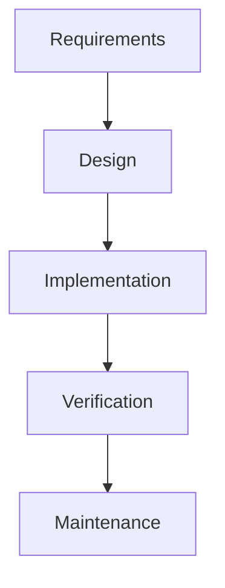
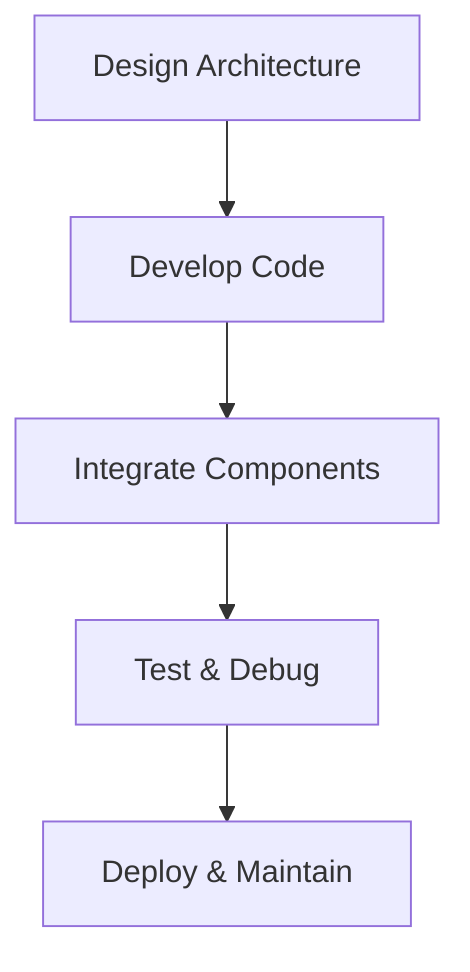

# Software Engineering Project

## Identifying and Defining

### Introduction

Accurately identifying and defining project requirements is the foundation of successful software engineering. Clear requirements ensure that the final product meets user needs, stays within budget, and is delivered on schedule. This process helps avoid costly rework, miscommunication, and scope creep, setting the stage for effective design, development, and deployment.

### Requirements Analysis

**Defining and Analysing Problem Requirements:**

* Demonstrate needs or opportunities through stakeholder interviews, surveys, and market research
* Assess scheduling and financial feasibility by estimating timelines, resources, and costs
* Generate functional specifications (what the system should do) and performance specifications (how well it should do it)

**Data Structures and Types:**

* Define appropriate data structures (arrays, lists, trees, etc.) and data types (integer, string, boolean, etc.) based on requirements
* Establish system boundaries to clarify what is inside and outside the scope of the project

### Idea Development Tools

* **Brainstorming:** Generate a wide range of ideas and solutions collaboratively
* **Mind-Mapping:** Visualize relationships between concepts and requirements
* **Storyboards:** Illustrate user interactions and workflows
* **Data Dictionaries:** Document data elements, types, and relationships; choose suitable data types for each field
* **Integration with SDLC:** These tools inform algorithm design, code generation, testing/debugging, installation, and maintenance planning

### Implementation Methodologies

**Direct Implementation:**

* Immediate switch to the new system
* **Pros:** Fast, simple
* **Cons:** High risk if issues arise

**Phased Implementation:**

* Gradual rollout in stages
* **Pros:** Lower risk, easier troubleshooting
* **Cons:** Longer transition period

**Parallel Implementation:**

* Run old and new systems simultaneously
* **Pros:** Safety net, easy comparison
* **Cons:** Resource-intensive

**Pilot Implementation:**

* Deploy to a small group before full rollout
* **Pros:** Early feedback, limited risk
* **Cons:** May not reveal all issues

## Research and Planning

### Introduction

Research and planning are critical to the success of any software engineering project. Careful investigation of requirements, technologies, and methodologies ensures that the project is feasible, meets user needs, and is delivered efficiently. The choice of development methodology—Waterfall, Agile, or hybrid—shapes the workflow, collaboration, and final outcomes. Effective planning also supports risk management, quality assurance, and stakeholder engagement throughout the project lifecycle.

### Waterfall Approach

**Stages:**

1. Requirements
2. Design
3. Implementation
4. Verification
5. Maintenance

**Advantages:**

* Clear structure and documentation
* Easy to manage for small, well-defined projects
* Progress is straightforward to track

**Disadvantages:**

* Inflexible to change
* Late discovery of issues
* Not ideal for complex or evolving requirements

**Best Fit:**

* Large-scale, predictable projects with stable requirements

<div class="diagram-container">
<button class="diagram-expand-btn">🔍 View Larger</button>
<div class="diagram-content">



</div>
</div>

**Waterfall Model Structure**

The Waterfall model follows a linear sequence where each phase must be completed before moving to the next. This creates clear milestones and documentation requirements, making it ideal for projects with well-defined, stable requirements.

### Agile Approach

* **Workflow:** Iterative cycles (sprints) with frequent feedback and adaptation
* **Method Tailoring:** Teams select practices (e.g., Scrum, Kanban) to fit project needs
* **Delivery Rate:** Faster, incremental releases
* **Best Fit:** Projects with changing requirements, small to medium teams needing flexibility

### WAgile Hybrid

- **Definition:** Combines Waterfall’s structure with Agile’s adaptability
- **Usage:** Inject Agile practices (e.g., sprints, stand-ups) into Waterfall stages for feedback and flexibility
- **Best Fit:**
    - Projects needing both predictability and adaptability
    - Organizations transitioning to Agile

### Project Management Planning

**Scheduling & Tracking:**

* Use Gantt charts for visual timelines
* Track progress with tools like Trello, Jira, or MS Project

**Collaboration:**

* Share updates and documents via platforms (e.g., Slack, Teams, Confluence)

### Social, Ethical & Communication Considerations

* **Individual vs Collaborative Work:** Balance autonomy and teamwork
* **Stakeholder Engagement:** Involve users, sponsors, and team members in decision-making
* **Empowerment:** Enable feedback, negotiate requirements, and foster open communication

### Quality Assurance

* **Defining Criteria:** Set measurable standards for functionality, performance, and security
* **Continual Checks:** Regularly review requirements and progress
* **Compliance:** Meet legal, ethical, and industry mandates

### Modelling & Back-End Contribution

**Modelling Tools:**

* Use UML diagrams (e.g., class, sequence, activity) for planning and communication

**Back-End Engineering:**

* Choose appropriate technologies
* Implement robust error handling
* Ensure secure front-end interfacing
* Integrate security engineering for data protection

## Producing and Implementing

### Introduction

The transition from planning to producing and implementing marks the point where ideas and designs become working software solutions. This phase integrates design specifications, resource management, and development tools to build, test, and deliver a product that meets user requirements. Effective implementation relies on clear workflows, thorough documentation, and strategic allocation of resources to ensure quality and timely delivery.

### Solution Construction

- **Workflow:**
    1. Design solution architecture
    2. Develop code modules
    3. Integrate components
    4. Test and debug
    5. Deploy and maintain

<div class="diagram-container">
<button class="diagram-expand-btn">🔍 View Larger</button>
<div class="diagram-content">



</div>
</div>

**Solution Construction Process**

This workflow represents the systematic approach to building software solutions, where each step builds upon the previous one while allowing for iteration and refinement throughout the development process.

### Presentation & Documentation

**Presenting Solutions:**

* Use slide decks, live demos, and walkthroughs to communicate features and benefits

**Algorithm Documentation:**

* Write clear pseudocode listings
* Annotate with comments and explanations
* Include diagrams for complex logic

### Resource Allocation & Tools

**Strategies:**

* Assign tasks based on expertise
* Schedule development time and milestones
* Allocate hardware/software resources as needed

**Tools:**

* Use backup scripts for data protection:
  ```bash
  # Simple backup script
  tar -czvf backup.tar.gz project_folder/
  ```

* Implement version control workflows (e.g., Git branching and merging):
  ```bash
  git checkout -b feature-branch
  git add .
  git commit -m "Add new feature"
  git checkout main
  git merge feature-branch
  ```

### Problem-Solving Strategies

**Tactics:**

* Research solutions online (forums, documentation)
* Collaborate with peers for brainstorming and troubleshooting
* Outsource components if needed for efficiency or expertise

### Innovation & Prototyping

* **Innovative Feature:** Propose an additional feature (e.g., AI-powered search, real-time analytics)
* **Prototyping:** Create wireframes or mockups of the UI/UX, gather user feedback through surveys or usability testing

## Testing and Evaluating

### Introduction

Systematic testing and evaluation are essential for ensuring code quality, reliability, and project success. By rigorously checking software against requirements and user expectations, developers can identify defects, optimize performance, and deliver robust solutions. Effective testing and evaluation also support continuous improvement and stakeholder satisfaction throughout the software lifecycle.

### Testing Methodologies

- **Unit Testing:** Test individual functions or modules in isolation.
- **Integration Testing:** Verify interactions between integrated components.
- **System Testing:** Assess the complete system’s behavior and performance.

**Example (Python):**
```python
# Unit test for a function
import unittest
class TestMath(unittest.TestCase):
    def test_add(self):
        self.assertEqual(add(2, 3), 5)

# Integration test
class TestIntegration(unittest.TestCase):
    def test_workflow(self):
        result = process_data(load_data())
        self.assertTrue(validate(result))
```

**Test Plan Guidance:**

Specify test cases, test data (including path and boundary values), and expected outcomes in a table:

| Test Case         | Input Data      | Expected Output | Notes                |
|-------------------|----------------|-----------------|----------------------|
| Add positive nums | 2, 3           | 5               | Path value           |
| Add zero          | 0, 5           | 5               | Boundary value       |
| Add negatives     | -2, -3         | -5              | Path value           |

### Code Optimisation

**Memoization Example (Python):**

**Before:**
```python
def fib(n):
    if n <= 1:
        return n
    return fib(n-1) + fib(n-2)
```

**After:**
```python
def fib(n, memo={}):
    if n in memo:
        return memo[n]
    if n <= 1:
        memo[n] = n
    else:
        memo[n] = fib(n-1, memo) + fib(n-2, memo)
    return memo[n]
```

### Feedback Analysis

* **Collecting Feedback:** Surveys, interviews, user testing sessions
* **Analysing Feedback:** Identify common issues, suggestions, and areas for improvement
* **Evaluation Report:** Summarize findings, proposed changes, and action items

### Solution Effectiveness

* **Comparing Outputs:** Match actual results against expected outcomes, interpret discrepancies, and iterate on the solution

**Final Evaluation Report Components:**

* Summary of testing and results
* Analysis of feedback
* Assessment of solution effectiveness
* Recommendations for future improvements
